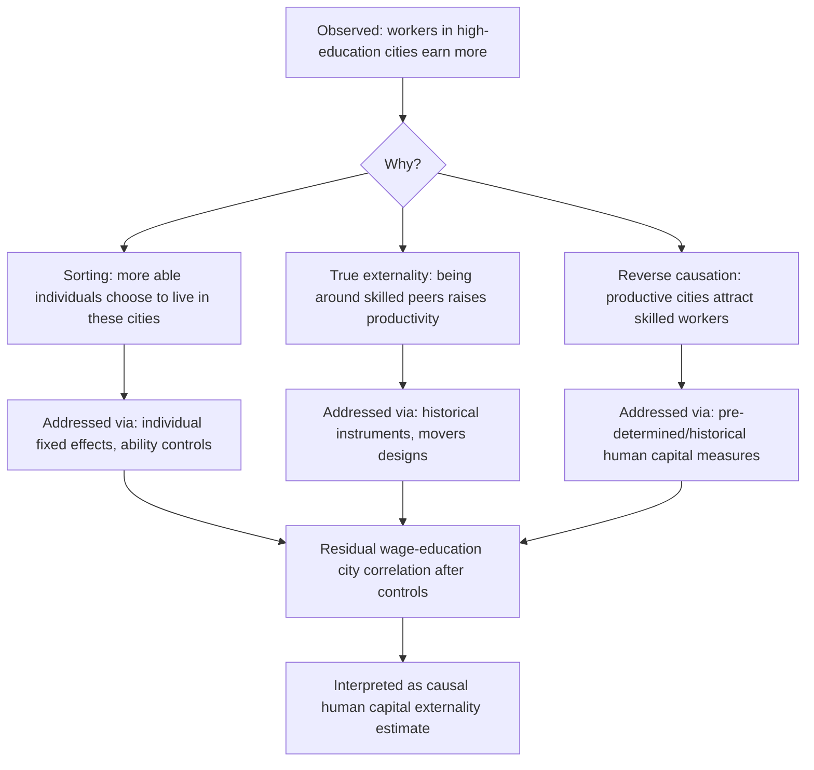

## Human Capital Externalities in Cities

### Overview

Human capital externalities refer to productivity and wage gains that accrue to individuals from being surrounded by other skilled/educated workers, above and beyond the private return to their own education. This concept is central to explaining why cities — and particularly cities with high average education levels — exhibit wage premiums that persist even after controlling for individual worker characteristics, and why the urban wage premium has grown over time even as the college wage premium has grown nationally. The literature spans theoretical foundations (why do externalities exist), empirical identification (how do we distinguish externalities from sorting), and implications for urban growth and inequality.

### Theoretical Foundations

**Why might human capital externalities exist?**

Several complementary mechanisms have been proposed:

1. **Knowledge spillovers / learning**: Workers learn from interacting with more skilled colleagues, neighbors, and local professional networks — tacit knowledge transfer that is easier face-to-face and therefore geographically bounded (Jacobs, 1969; Glaeser, 1999).
2. **Matching quality**: Thicker labor markets (more workers, more firms) improve the quality of worker-firm matches, and this matching benefit may scale with the skill composition of the local labor pool, not just its size.
3. **Complementarities in production**: If skilled and unskilled labor are complements in production, a higher local concentration of skilled workers raises the marginal product of unskilled workers in the same city (Moretti, 2004).
4. **Social capital and norms**: Higher average education may be associated with civic institutions, lower crime, and social norms that raise productivity for all residents, independent of direct workplace interaction.
5. **Consumer city / demand effects**: A more educated population increases local demand for varieties of goods and services, indirectly raising employment and wages even in sectors unrelated to the human-capital-intensive industries themselves.

**The production function view**

A standard formalization (following Moretti, 2004 and Rauch, 1993) augments a Mincerian wage equation with a city-level human capital aggregate:

$$\ln w_{ijt} = \beta_1 S_{ijt} + \beta_2 \bar{S}_{jt} + X_{ijt}'\gamma + \delta_j + \delta_t + \epsilon_{ijt}$$

where $S_{ijt}$ is individual $i$'s own schooling, $\bar{S}_{jt}$ is the average schooling level in city $j$ at time $t$, and $\delta_j$, $\delta_t$ are city and time fixed effects. The coefficient of central interest is $\beta_2$: if $\beta_2 > 0$ even after controlling for own schooling $S_{ijt}$ and fixed effects, this is interpreted as evidence of an externality — the local human capital stock raises wages for a given worker beyond what their own credentials would predict.

**Key Points**

- $\beta_1$ captures the standard private (Mincerian) return to own schooling.
- $\beta_2$ captures the human capital *externality* — the "social" or spillover return.
- Empirical estimates of $\beta_2$ in the literature typically fall in a range implying that a one-standard-deviation increase in city-average schooling raises wages by several percentage points, holding own schooling fixed — though magnitudes are sensitive to specification and identification strategy. **[Unverified]** Precise point estimates vary considerably across studies, samples, and time periods and should not be treated as a single settled parameter.

### The Central Identification Problem: Sorting vs. Externalities

The core empirical challenge is that **high-skill workers are not randomly distributed across cities** — they self-select into cities for reasons that may be correlated with unobserved productivity, local demand shocks, or amenities. A naive correlation between city-average schooling and individual wages conflates:

1. **True externalities**: the causal effect of being around more educated workers.
2. **Sorting on unobserved ability**: cities with high average education may also attract individually more able workers (even conditional on observed schooling), so the correlation reflects composition, not spillovers.
3. **Reverse causation / simultaneity**: productive cities attract skilled workers, rather than skilled workers making cities productive — the causal arrow may run the opposite direction, or both simultaneously.

**Identification strategies**

- **Individual fixed effects panel methods**: Following workers who move between cities of differing average education levels, and asking whether their wage changes when the local human capital stock changes, holding individual ability fixed (to the extent time-invariant ability is captured by the fixed effect).
- **Historical instruments for city-level education**: Using historical determinants of a city's schooling level (e.g., presence of land-grant colleges, historical settlement patterns) that plausibly affect current average schooling but are not directly correlated with current individual unobserved ability, following an instrumental variables logic (Moretti, 2004).
- **College openings / land-grant university natural experiments**: Exploiting the location of historical colleges as a source of variation in local human capital stock uncorrelated with contemporary local economic conditions (Shapiro, 2006, and related work uses this alongside amenity-based explanations).
- **Compensating differentials cross-check**: Testing whether rents/housing costs rise alongside wages in high-human-capital cities, consistent with an amenity/spillover story — since if externalities are real and firms benefit, land rents should also capitalize part of that value (Rosen-Roback logic applied to human capital externalities specifically).

**[Inference]** The weight of the identification-focused literature suggests that a meaningful, though not necessarily large, positive human capital externality survives after these various approaches to control for sorting — but the literature has not fully converged on a precise magnitude, and skepticism remains about whether all sorting channels can be fully purged with available instruments and panel methods.

### Diagram: Sorting vs. Externality Decomposition

### Human Capital Externalities and Urban Growth

**Skill-biased agglomeration and city growth**

Cities with higher initial shares of college-educated workers have grown faster in population, employment, and wages over recent decades (Glaeser and Saiz, 2004; Berry and Glaeser, 2005) — a pattern often attributed to human capital externalities operating dynamically: skilled cities are better able to adapt to economic shocks, attract new skilled residents, and generate self-reinforcing agglomeration of talent (sometimes termed "skill-biased agglomeration" or the tendency of divergent city growth paths, i.e., "the great divergence").

**The multiplier effect of high-skill jobs**

Moretti's (2010) "local multiplier" estimates suggest that each additional job in a city's tradable, high-skill sector (e.g., technology) is associated with the creation of multiple additional local non-tradable service-sector jobs, partly through local demand effects and partly (in some interpretations) through human capital spillovers raising local productivity and income more broadly. **[Inference]** The precise decomposition of this multiplier between pure demand effects (a mechanical Keynesian local multiplier) and genuine human-capital-driven productivity effects is empirically difficult to separate and remains debated.

### Diagram: Human Capital Externality Channels and Growth Feedback (svg_diagram)

<svg xmlns="http://www.w3.org/2000/svg" viewBox="0 0 640 400">
<text x="320" y="24" text-anchor="middle" font-size="16" font-weight="bold" fill="#1a1a1a">Human Capital Externality Feedback Loop (svg_diagram)</text>
<rect x="240" y="50" width="160" height="50" rx="8" fill="#dbe9f6" stroke="#2166ac" stroke-width="1.5" />
<text x="320" y="80" text-anchor="middle" font-size="12" fill="#1a1a1a">High initial share of</text>
<text x="320" y="94" text-anchor="middle" font-size="12" fill="#1a1a1a">educated workers</text>
<rect x="40" y="150" width="170" height="55" rx="8" fill="#e3f0df" stroke="#1a9850" stroke-width="1.5" />
<text x="125" y="175" text-anchor="middle" font-size="12" fill="#1a1a1a">Knowledge spillovers,</text>
<text x="125" y="190" text-anchor="middle" font-size="12" fill="#1a1a1a">matching, complementarities</text>
<rect x="440" y="150" width="170" height="55" rx="8" fill="#f6e8dc" stroke="#e08214" stroke-width="1.5" />
<text x="525" y="175" text-anchor="middle" font-size="12" fill="#1a1a1a">Local demand for</text>
<text x="525" y="190" text-anchor="middle" font-size="12" fill="#1a1a1a">goods/services rises</text>
<rect x="240" y="250" width="160" height="55" rx="8" fill="#f0dce8" stroke="#c51b7d" stroke-width="1.5" />
<text x="320" y="272" text-anchor="middle" font-size="12" fill="#1a1a1a">Higher wages &amp;</text>
<text x="320" y="286" text-anchor="middle" font-size="12" fill="#1a1a1a">productivity for all skill levels</text>
<rect x="240" y="340" width="160" height="45" rx="8" fill="#dbe9f6" stroke="#2166ac" stroke-width="1.5" />
<text x="320" y="367" text-anchor="middle" font-size="12" fill="#1a1a1a">Attracts more skilled in-migrants</text>
<line x1="280" y1="100" x2="150" y2="150" stroke="#333" stroke-width="1.5" marker-end="url(#arrow)" />
<line x1="360" y1="100" x2="500" y2="150" stroke="#333" stroke-width="1.5" marker-end="url(#arrow)" />
<line x1="150" y1="205" x2="290" y2="250" stroke="#333" stroke-width="1.5" marker-end="url(#arrow)" />
<line x1="500" y1="205" x2="360" y2="250" stroke="#333" stroke-width="1.5" marker-end="url(#arrow)" />
<line x1="320" y1="305" x2="320" y2="340" stroke="#333" stroke-width="1.5" marker-end="url(#arrow)" />
<path d="M 400 362 C 550 362, 580 120, 400 75" fill="none" stroke="#762a83" stroke-width="1.5" stroke-dasharray="5,3" marker-end="url(#arrow)" />
<text x="560" y="230" font-size="11" fill="#762a83">feedback: reinforces initial stock</text>
</svg>

### Distributional Implications: Who Captures the Externality?

**Complementarity between skill groups**

If skilled and unskilled labor are complements (Moretti, 2004), human capital externalities can raise wages for *less*-educated workers living in high-education cities — a less-educated worker in a high-human-capital city may earn more than an observationally identical worker in a low-human-capital city, even though the externality is generated by others' education, not their own. This has significant implications for the geography of inequality: it implies that place matters independently of individual skill for wage determination.

**Capitalization into housing costs**

Because human capital externalities raise both wages and (via the Rosen-Roback amenity/productivity capitalization logic) local housing demand, a substantial share of the *real* benefit of living in a high-human-capital city can be capitalized into higher rents, particularly in housing-supply-constrained cities. This means the **nominal wage premium overstates the welfare gain** to residents, especially renters, and raises questions about who ultimately benefits from agglomeration of skill — landowners may capture much of the surplus in supply-constrained markets.

**Example**

Suppose two otherwise identical high-school-only-educated workers live in City A (25% college-educated) and City B (45% college-educated). Using a stylized externality elasticity of 0.05 log points per 10-percentage-point increase in college share [**Unverified**, illustrative only, not drawn from a specific study], the worker in City B would be predicted to earn approximately $\exp(0.05 \times 2) - 1 \approx 10.5\%$ more than the observationally identical worker in City A, purely from the human capital externality — before accounting for the higher cost of living likely prevailing in City B, which would need to be netted out to assess the real welfare gain.

### Policy Implications

**Key Points**

- **Subsidizing higher education has a public-good rationale beyond the private return**: if externalities are real, private returns to education understate the *social* return, implying underinvestment in education relative to the social optimum absent correction (a standard public-goods argument for public subsidy of higher education).
- **Place-based vs. people-based skill policy**: Given that externalities are geographically bounded, policies that concentrate skilled workers in specific cities/regions (e.g., through university siting, R&D tax incentives) could generate larger aggregate output gains than dispersing the same investment evenly — though this raises equity concerns about regions left behind (see "Local Labor Market Adjustment Mechanisms").
- **Housing supply policy as a complement**: If human capital externalities are being substantially capitalized into land rents rather than passed through as broad welfare gains, loosening housing supply constraints in high-human-capital cities (allowing population growth to occur) could both increase the aggregate size of the externality (more people benefiting from spillovers) and reduce the share captured by incumbent landowners.

### Common Points of Confusion

- **Agglomeration economies vs. human capital externalities specifically**: Human capital externalities are one *type* of agglomeration economy (others include reduced input-sharing costs, thick labor markets for any skill type, and specialized supplier access) — the literature sometimes uses these terms loosely, but human capital externalities specifically emphasize the *educational/skill composition* channel, not agglomeration economies broadly.
- **City-average schooling as a proxy vs. direct measurement of spillovers**: Most empirical work uses average years of schooling or college-degree share as a proxy for the "human capital stock" generating externalities; this is a coarse measure that cannot distinguish which specific mechanism (learning, matching, complementarity) is operative — the reduced-form wage regression is agnostic about mechanism.
- **Static estimates vs. dynamic growth effects**: A cross-sectional wage regression estimates a *static* externality (how much more do you earn today from your city's current human capital stock), which is conceptually distinct from the *dynamic* claim that high-human-capital cities grow faster over time — both are part of the literature but require different data and identification approaches.

### Related Topics

- Agglomeration economies: taxonomy (Marshallian sharing, matching, learning)
- Moretti's local labor demand multiplier (tradable vs. non-tradable sectors)
- Rosen-Roback spatial equilibrium and amenity capitalization
- The "Great Divergence" in city skill composition and growth
- Housing supply elasticity and rent capitalization of productivity gains
- Skill-biased technical change and its urban geography
- Superstar cities and winner-take-all urban growth patterns
- Public investment in higher education and regional development
- Thick labor markets and matching efficiency
- Urban wage premium and its decomposition (sorting vs. causal city effects)