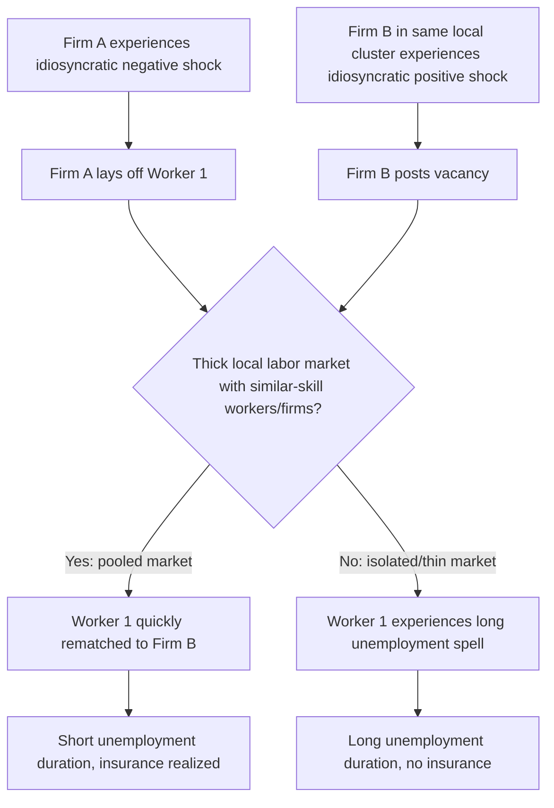

## Labor Market Pooling and Matching

### Overview

Labor market pooling is one of the three classical Marshallian sources of agglomeration economies (alongside input-output sharing and knowledge spillovers), first articulated by Alfred Marshall (1890) and formalized in modern urban economics. The core idea: a large, dense local labor market allows workers and firms to find better matches, and provides insurance against idiosyncratic (firm- or worker-specific) shocks that would otherwise force costly separations or leave workers unemployed and firms understaffed. This topic covers the theoretical microfoundations of pooling, its relationship to matching-function-based search models, empirical tests of the pooling hypothesis, and its implications for urban industry structure.

### Marshall's Original Insight

Marshall observed that concentrated industries benefit from a localized pool of workers with industry-specific skills, because:

1. Workers face lower risk of unemployment, since if one employer contracts, nearby employers in the same industry (drawn to the same location for the same reasons) may be expanding and can readily absorb displaced workers.
2. Firms face lower risk of being unable to fill vacancies, since a deep local pool of similarly-skilled workers reduces recruitment friction and time-to-hire.
3. This mutual insurance is a **local public good**: no individual firm internalizes the full value of locating near others, yet all firms in the cluster benefit from the resulting labor pool — a classic externality rationale for spatial clustering.

**Key Points**

- Pooling benefits scale with the size and specialization of the local industry cluster, not simply with overall city size.
- The mechanism is fundamentally about **risk-sharing under idiosyncratic shocks**, distinct from knowledge spillovers (which are about learning) and input sharing (which is about specialized supplier access).
- Pooling predicts that industries with more idiosyncratic (firm-specific, as opposed to industry-wide/aggregate) demand volatility should cluster more intensely, since the insurance value of pooling is largest when shocks are uncorrelated across firms within the cluster.

### Formal Microfoundation: A Search-Theoretic Model of Pooling

Modern treatments (e.g., Overman and Puga, 2009; the broader Diamond-Mortensen-Pissarides search tradition applied spatially) formalize pooling using matching functions. Consider a local labor market with $u$ unemployed/searching workers and $v$ vacancies. The number of matches formed is given by a matching function:

$$m = A \cdot u^{\alpha} v^{1-\alpha}, \quad 0 < \alpha < 1$$

where $A$ is matching efficiency. **Market thickness** — having many workers and firms in the same local labor market with the same skill/industry orientation — raises matching efficiency $A$ through several channels:

- Reduced search frictions per searcher (each unemployed worker faces a denser set of relevant vacancies nearby).
- Better realized match quality (more draws from the distribution of potential matches means a higher expected quality of the best available match).
- Faster re-matching after separation, since $\theta = v/u$ (market tightness) is less sensitive to any single firm's or worker's idiosyncratic shock when the pool is large.

**The insurance channel formally**

Consider two market structures:

- **Isolated market**: A single firm-worker pair. If the firm experiences a negative shock and must separate from the worker, the worker becomes unemployed until a new (potentially distant, in a spatial model) match is found — a long, costly spell.
- **Pooled market**: $N$ firms and $N$ workers in the same local industry cluster. If one firm's shock is idiosyncratic (uncorrelated with the others), the displaced worker can be quickly reabsorbed by an expanding firm in the same cluster, dramatically shortening expected unemployment duration.

This generates a straightforward comparative static: **the expected duration of unemployment falls with the size of the local, same-industry labor pool**, holding aggregate industry demand volatility fixed — provided the volatility across firms is not perfectly correlated (if it is perfectly correlated, e.g., a common industry-wide demand shock, pooling provides no insurance benefit, since all firms are hit simultaneously).

### Diagram: Pooling as Insurance Against Idiosyncratic Shocks

### The Condition for Pooling to Generate Agglomeration: Uncorrelated Shocks

A crucial theoretical refinement: pooling only generates agglomeration benefits when firm-level shocks are **imperfectly correlated**. If all firms in an industry cluster are exposed to a common (perfectly correlated) demand shock — e.g., a broad recession affecting the entire industry simultaneously — then clustering provides no risk-sharing benefit, since a downturn hits every firm in the pool at once and there is no expanding firm to absorb displaced workers.

This has led researchers to examine whether industries with **more idiosyncratic (firm-specific) volatility relative to industry-wide volatility** exhibit greater geographic concentration, as the pooling theory would predict.

**[Inference]** Empirical support for this specific correlation-structure prediction is mixed and harder to establish cleanly than for agglomeration in general, because firm-level shock correlation structures are difficult to measure directly and separate from other co-location motives (e.g., input sharing or knowledge spillovers occurring in the same industries).

### Empirical Tests of the Pooling Hypothesis

**Approach 1: Industry concentration and volatility**

Following the logic above, researchers test whether industries with higher idiosyncratic (establishment-level) volatility relative to aggregate industry volatility are more spatially concentrated, controlling for other agglomeration motives. Higher observed concentration among high-idiosyncratic-volatility industries is interpreted as consistent with the pooling channel specifically (as opposed to knowledge spillovers or input sharing, which would not have this particular volatility-based prediction).

**Approach 2: Direct labor flow analysis**

Using matched employer-employee administrative data, researchers examine whether workers separating from a firm in a given location and industry are more likely to be rapidly reabsorbed by another firm in the same local industry cluster (versus experiencing a longer unemployment spell or moving to a different industry/location) — directly testing the "quick rematching" mechanism.

**Approach 3: Natural experiments around large establishment closures**

Comparing displaced workers' subsequent labor market outcomes (unemployment duration, wage losses) in locations with thick versus thin local pools of same-industry/same-occupation employers, using mass layoff or plant closure events as a source of exogenous displacement. Thicker local same-industry labor markets are generally found to be associated with shorter unemployment duration and smaller wage losses upon re-employment following displacement — consistent with the pooling/matching-quality mechanism, though disentangling this from other city-size correlated advantages (e.g., general density of opportunities) requires care.

### Pooling and Occupational/Skill Specificity

An important nuance is that pooling benefits may operate more precisely at the **occupation** level than the **industry** level — a worker's transferable skill set determines the true relevant "pool" they can draw on. This matters because:

- Some occupations are used across many industries (e.g., accountants, software engineers), so the relevant pooling benefit derives from the size of the city-wide occupational labor market, not any single industry's local presence.
- Other occupations are highly industry-specific (e.g., certain specialized manufacturing trades), so the relevant pool is the local size of that specific industry cluster.

This distinction helps explain why some industries cluster tightly in specific cities (e.g., historically, industries with highly specific, non-transferable skill requirements) while others (e.g., professional/business services employing widely-transferable occupations) are more evenly distributed across large metro areas generally, drawing on broad occupational pools rather than narrow industry clusters.

### Diagram: Occupation-Based vs. Industry-Based Pooling (svg_diagram)

<svg xmlns="http://www.w3.org/2000/svg" viewBox="0 0 640 380">
<text x="320" y="24" text-anchor="middle" font-size="16" font-weight="bold" fill="#1a1a1a">Occupation-Based vs. Industry-Based Labor Pools (svg_diagram)</text>
<rect x="40" y="60" width="260" height="280" rx="10" fill="#f5f5f5" stroke="#666" stroke-width="1.5" />
<text x="170" y="85" text-anchor="middle" font-size="13" font-weight="bold" fill="#1a1a1a">Transferable Occupation</text>
<text x="170" y="100" text-anchor="middle" font-size="11" fill="#333">(e.g., software engineer)</text>
<rect x="60" y="120" width="90" height="50" rx="6" fill="#dbe9f6" stroke="#2166ac" />
<text x="105" y="150" text-anchor="middle" font-size="10">Tech firm A</text>
<rect x="190" y="120" width="90" height="50" rx="6" fill="#e3f0df" stroke="#1a9850" />
<text x="235" y="150" text-anchor="middle" font-size="10">Finance firm B</text>
<rect x="60" y="200" width="90" height="50" rx="6" fill="#f6e8dc" stroke="#e08214" />
<text x="105" y="230" text-anchor="middle" font-size="10">Retail firm C</text>
<rect x="190" y="200" width="90" height="50" rx="6" fill="#f0dce8" stroke="#c51b7d" />
<text x="235" y="230" text-anchor="middle" font-size="10">Healthcare firm D</text>
<text x="170" y="290" text-anchor="middle" font-size="11" fill="#333">Same worker pool draws</text>
<text x="170" y="304" text-anchor="middle" font-size="11" fill="#333">across ALL industries citywide</text>
<text x="170" y="322" text-anchor="middle" font-size="11" fill="#333">→ pooling scales with city size</text>
<rect x="340" y="60" width="260" height="280" rx="10" fill="#f5f5f5" stroke="#666" stroke-width="1.5" />
<text x="470" y="85" text-anchor="middle" font-size="13" font-weight="bold" fill="#1a1a1a">Industry-Specific Skill</text>
<text x="470" y="100" text-anchor="middle" font-size="11" fill="#333">(e.g., specialty textile trade)</text>
<rect x="380" y="140" width="90" height="50" rx="6" fill="#dbe9f6" stroke="#2166ac" />
<text x="425" y="170" text-anchor="middle" font-size="10">Textile firm A</text>
<rect x="490" y="140" width="90" height="50" rx="6" fill="#dbe9f6" stroke="#2166ac" />
<text x="535" y="170" text-anchor="middle" font-size="10">Textile firm B</text>
<rect x="380" y="210" width="90" height="50" rx="6" fill="#dbe9f6" stroke="#2166ac" />
<text x="425" y="240" text-anchor="middle" font-size="10">Textile firm C</text>
<rect x="490" y="210" width="90" height="50" rx="6" fill="#dbe9f6" stroke="#2166ac" />
<text x="535" y="240" text-anchor="middle" font-size="10">Textile firm D</text>
<text x="470" y="290" text-anchor="middle" font-size="11" fill="#333">Pool limited to firms</text>
<text x="470" y="304" text-anchor="middle" font-size="11" fill="#333">within same narrow cluster</text>
<text x="470" y="322" text-anchor="middle" font-size="11" fill="#333">→ requires tight geographic clustering</text>
</svg>

### Pooling, Firm Entry, and Industry Location Choice

Pooling has feedback implications for **where new firms choose to locate**. If a location already has a deep pool of relevantly-skilled workers, a new entrant faces lower expected recruitment costs and better expected match quality there than in a location without such a pool — generating a self-reinforcing agglomeration dynamic (a form of increasing returns to scale in location choice, related to broader "cumulative causation" models of city and industry formation).

**Key Points**

- This self-reinforcing dynamic implies potential **multiple equilibria** in industry location: history and initial conditions (e.g., which city happened to attract early entrants) can determine long-run industry geography, not just fundamental locational advantages (relative factor costs, natural resources, transport access).
- Pooling-driven clustering can therefore be inefficient from a broader social perspective if it locks an industry into a location that is no longer optimal on fundamentals, purely because of the self-reinforcing labor pool externality (a "history matters" / path-dependence prediction analogous to models of technology adoption with network effects).

### Example

Consider a metropolitan area with a concentrated cluster of 40 semiconductor design firms sharing a specialized local pool of ~5,000 electrical/computer engineers with chip-design expertise. If one firm loses a major contract and lays off 200 engineers:

- **In a thick, pooled local market**: Given 39 other firms in the same specialized cluster (some possibly expanding), a large share of these 200 engineers could realistically be reabsorbed locally within a few months, particularly if firm-level demand shocks in this industry are not highly correlated across firms.
- **In an isolated location with only that single firm**: The 200 engineers would need to either relocate to a different metro area with semiconductor design employment, retrain into an unrelated occupation, or accept substantially longer unemployment spells — since no local alternative employer exists with matching skill demand.

This stylized comparison illustrates the direct welfare implication of pooling: **the same underlying shock produces a materially different worker outcome depending purely on local labor market thickness**, holding the shock itself constant.

### Distinguishing Pooling from Other Agglomeration Sources

**Common Points of Confusion**

- **Pooling vs. knowledge spillovers**: Pooling is about matching efficiency and risk-sharing (a search-frictions story); knowledge spillovers are about learning and productivity growth from proximity to skilled peers (see "Human Capital Externalities in Cities"). The two mechanisms are often observationally similar (both predict industry clustering) but have different underlying comparative statics — pooling predicts effects tied to shock volatility and correlation structure, while spillovers predict effects tied to knowledge intensity and face-to-face interaction needs.
- **Pooling vs. input-output/supplier sharing**: Input sharing (the third Marshallian source) is about specialized intermediate goods and services being available locally, reducing transport/transaction costs for firms — a distinct externality from labor market matching, though the same underlying agglomeration (co-location of an industry) can generate both simultaneously, making it empirically difficult to cleanly isolate the pooling channel alone.
- **City size vs. industry cluster size**: A common conflation is treating "big city" and "thick industry-specific labor pool" as the same thing. A large, diversified city may still have a *thin* pool for a highly specialized occupation if that occupation's employers are not co-located there — pooling benefits are about the relevant skill-matched pool size, not overall city population.

### Related Topics

- Diamond-Mortensen-Pissarides search and matching framework
- Marshallian agglomeration economies (input sharing, knowledge spillovers, pooling)
- Human capital externalities in cities
- Commuting, job search, and search frictions
- Occupational licensing and skill transferability across industries
- Industry co-agglomeration patterns and input-output linkages
- Plant closures, mass layoffs, and displaced-worker outcomes
- Path dependence and multiple equilibria in economic geography
- Thick market externalities in venture capital and entrepreneurship clusters
- Matching function estimation and market tightness measurement