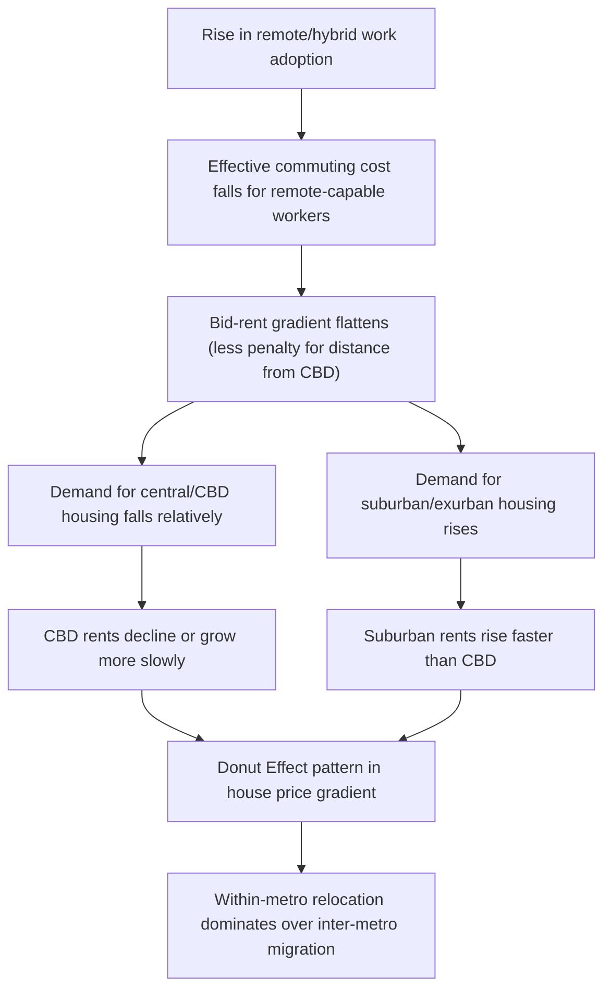
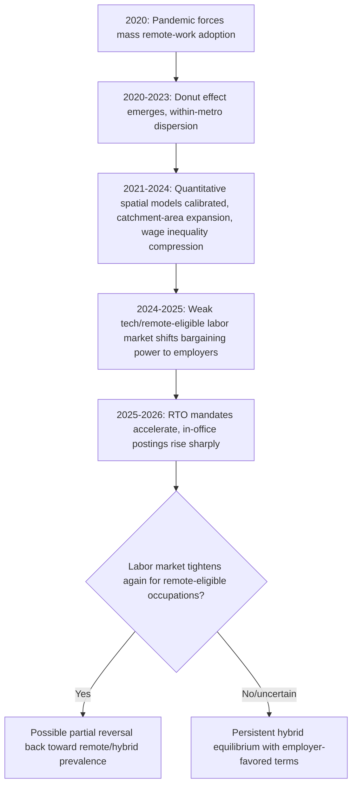

## Remote Work and the Spatial Reorganization of Labor Markets

### Overview

The rapid, pandemic-driven adoption of remote and hybrid work represents the largest exogenous shock to the tether between residence and workplace in modern economic history. This has forced a re-examination of core urban labor market models — the monocentric city, spatial equilibrium, and agglomeration frameworks — all of which historically assumed commuting to a fixed workplace as a near-universal constraint. This topic covers the theoretical channels through which remote work reorganizes urban space, the key empirical patterns observed since 2020 (the "donut effect," wage and inequality effects, and firm location choices), and the current, still-evolving state of the labor market as of 2026, which shows a notable **partial reversal** via return-to-office mandates.

### Theoretical Channel 1: Relaxing the Commuting Constraint

In the standard monocentric city / Alonso-Muth-Mills model, the bid-rent gradient is generated by workers trading off commuting cost against land rent — proximity to the CBD is valuable precisely because it minimizes commute cost. Remote and hybrid work directly weakens this mechanism by reducing the *effective* number of required commuting trips per week.

**Formalizing the effect on the bid-rent gradient**

If a worker commutes $n$ days per week instead of 5, their effective annualized commuting cost falls proportionally (holding per-trip cost fixed):

$$c_{eff}(x) = \frac{n}{5} \cdot \tau \cdot d(x)$$

where $\tau$ is the per-trip commuting cost per unit distance and $d(x)$ is distance to the workplace. As $n$ falls, the bid-rent gradient **flattens**: locations far from the CBD become relatively more attractive, since the commuting cost penalty for distance is scaled down. Fully remote workers ($n=0$) are in the limiting case where location choice becomes entirely divorced from workplace location, driven instead purely by amenities and housing costs.

**Key Points**

- A flatter bid-rent gradient implies **falling relative land rents near the CBD** and rising relative rents further out, as remote-capable workers bid up suburban/exurban housing while reducing demand for high-cost central locations.
- The effect is heterogeneous by occupation and industry, since telecommutability varies sharply (e.g., software and finance professionals versus retail and healthcare workers), meaning the gradient flattens more in cities/industries with a higher share of remote-capable jobs.
- This is a *direct* extension of the classical model rather than a wholesale replacement — the same optimization framework applies, but with a key parameter (effective commuting frequency) becoming worker/occupation-specific rather than a fixed institutional constant.

### The "Donut Effect": Empirical Pattern

The dominant empirical finding of the 2020-2024 period is the **donut effect** (coined by Ramani and Bloom, 2021): a hollowing-out of demand for housing and commercial space in dense city centers, with demand shifting to suburbs and exurbs within the same metropolitan area. Global evidence using high-frequency spending, commuting, migration, and housing data confirms that remote work has dispersed economic activity away from city centers, with this "Donut Effect" being much larger and more persistent in cities with high levels of remote work. [stanford](https://gsbpreserve.stanford.edu/view/34797)

Importantly, this reallocation has predominantly occurred **within** metro areas rather than across them: detailed household microdata from the United States shows that three-fifths of households that left city centers in big cities moved to the suburbs of the same city, likely explained by the rise of hybrid work in which employees still commute to the office a few days a week. This finding is consistent with the theoretical prediction above — hybrid workers face a *reduced* but non-zero commuting cost, so they relocate to flatten their own commute-rent tradeoff rather than abandoning proximity to the metro area's labor market entirely. [stanford](https://gsbpreserve.stanford.edu/view/34797)

**[Inference]** The persistence of the donut effect into the mid-2020s, alongside the continuing popularity of hybrid arrangements, suggests that the Donut Effect will persist while also leaving broader metropolitan areas intact — i.e., remote work has stretched rather than dissolved the metropolitan spatial structure, rather than triggering a wholesale exodus to genuinely rural or distant regions. [stanford](https://gsbpreserve.stanford.edu/view/34797)

### Diagram: The Donut Effect Mechanism

### Beyond the Simple Donut: Regional and Cross-Metro Effects

While within-metro dispersion (the donut) is the dominant pattern, cross-metro and cross-region effects are also documented, though with more nuance than an early "urban exodus" narrative suggested:

- **Housing demand beyond metro boundaries**: More granular analysis finds that changes in relative house prices have gone beyond metropolitan boundaries, consistent with longer but less frequent home-to-work commuting, though notably this does not represent a re-emerging preference for rural life as such, but rather a desire to move to places combining the benefits of rural and urban life — with housing demand increasing most in low-density, affordable settlements within commuting zones, and in high-density settlements beyond metro boundaries. [expanding the doughnut how the geography of housing demand has changed since the rise of remote work with covid 19 cf591216 en +2](https://www.oecd.org/en/publications/expanding-the-doughnut-how-the-geography-of-housing-demand-has-changed-since-the-rise-of-remote-work-with-covid-19_cf591216-en.html)
- **Cross-country evidence on distance expansion**: Administrative data from Germany shows working from home significantly increased work-home distances after 2021, particularly for workers in high home-office-potential occupations, though most of this expansion occurred within the functional reach of large metropolitan labour markets rather than through long-distance migration to remote regions. [arxiv](https://arxiv.org/pdf/2604.08252)
- **Residential immobility as an alternative response**: Some research suggests remote work promotes residential immobility, enabling people to stay in place despite longer home-to-work distances, or generates complex arrangements such as secondary homes near workplaces — an important qualifier against assuming remote work uniformly triggers relocation. [arxiv](https://arxiv.org/pdf/2604.08252)[arxiv](https://arxiv.org/pdf/2604.08252)
- **Country-specific nuance (Madrid, Belgium, Sweden)**: In Madrid, remote work increased moves from the core city toward suburban and peri-urban municipalities, particularly among young and middle-aged adults, without producing a large-scale exodus from the metropolitan system. In Belgium, telework alone does not substantially increase the likelihood of residential relocation; life stage, household composition, and housing conditions remain dominant predictors of mobility decisions. In Sweden, more frequent WFH is associated with stronger preferences for neighbourhood amenities and proximity to everyday services rather than with detachment from urban environments altogether. [From Core to Periphery? Assessing Remote Works Potential to Rebalance EU Regional Development +2](https://arxiv.org/pdf/2604.08252)

**[Inference]** Taken together, this cross-country evidence suggests the labor-market-and-space literature has moved past the early, simpler "mass urban exodus" narrative toward a more nuanced view: remote work primarily **stretches** existing metropolitan commuting geography and reshapes preferences within it, with genuine long-distance relocation to distant/rural regions being a secondary and more heterogeneous margin.

### Quantitative Spatial Models: The Delventhal-Parkhomenko Framework

A leading formal treatment (Delventhal and Parkhomenko, 2026) builds a full quantitative spatial equilibrium model calibrated to the U.S. It models some workers substituting on-site effort with work done from home, where ability and propensity to telecommute vary by education and industry, quantified to match the distribution of jobs and residents across 4,502 U.S. locations. [restud](https://www.restud.com/wp-content/uploads/2026/06/MS33386manuscript.pdf)[restud](https://www.restud.com/wp-content/uploads/2026/06/MS33386manuscript.pdf)

**Key theoretical result: catchment area expansion**

A central structural insight from this framework is that telework changes the underlying mathematical structure of the spatial equilibrium itself: because telework allows firms to hire workers from a broader "catchment area," the range of parameter values for which a unique equilibrium is guaranteed is narrower than in a conventional quantitative spatial model. This is a technically important result — it implies that **remote work can introduce multiplicity of equilibria** into urban spatial models that previously had clean uniqueness properties, since firms' effective labor market radius is no longer bounded by feasible daily commuting distance. [restud](https://www.restud.com/wp-content/uploads/2026/06/MS33386manuscript.pdf)

**Key simulation findings**

Simulating a permanent increase in the attractiveness and productivity of telework leading to greater adoption of hybrid and fully remote work, the model produces: [restud](https://www.restud.com/wp-content/uploads/2026/06/MS33386manuscript.pdf)

- A rich non-monotonic pattern of reallocations of residents and jobs within and across cities — i.e., the spatial reorganization is not simply "everyone moves outward," but varies by location type in ways sensitive to each location's existing amenity and productivity profile. [restud](https://www.restud.com/wp-content/uploads/2026/06/MS33386manuscript.pdf)
- Workers who can telecommute experience welfare gains, while those who cannot suffer losses — a direct distributional/inequality implication of differential telecommutability. [restud](https://www.restud.com/wp-content/uploads/2026/06/MS33386manuscript.pdf)
- Broader access to jobs reduces wage inequality across residential locations — because remote-capable workers in previously job-poor areas gain access to job opportunities (and associated wages) that would previously have required relocation or a long commute, compressing the geographic wage distribution. [restud](https://www.restud.com/wp-content/uploads/2026/06/MS33386manuscript.pdf)
- The model's predictions are validated against real-world data: results are positively correlated with local changes in residents, jobs, and housing costs observed between 2019 and 2021. [bts](https://rosap.ntl.bts.gov/view/dot/66389)

### Diagram: Catchment Area Expansion and Multiple Equilibria (svg_diagram)

<svg xmlns="http://www.w3.org/2000/svg" viewBox="0 0 640 380">
<text x="320" y="24" text-anchor="middle" font-size="16" font-weight="bold" fill="#1a1a1a">Firm Catchment Area: Commuting vs. Telework Regime (svg_diagram)</text>

<text x="160" y="55" text-anchor="middle" font-size="13" font-weight="bold" fill="`#1a1a1a`">Commuting-only regime</text>

<circle cx="160" cy="180" r="110" fill="`#dbe9f6`" stroke="`#2166ac`" stroke-width="1.5" opacity="0.6" />

<circle cx="160" cy="180" r="6" fill="`#2166ac`" />

<text x="160" y="180" text-anchor="middle" font-size="10" dy="-15">Firm</text>

<text x="160" y="310" text-anchor="middle" font-size="11" fill="#333">Catchment bounded by</text>

<text x="160" y="324" text-anchor="middle" font-size="11" fill="#333">feasible daily commute</text>

<text x="480" y="55" text-anchor="middle" font-size="13" font-weight="bold" fill="`#1a1a1a`">Telework-enabled regime</text>

<circle cx="480" cy="180" r="180" fill="`#f6e8dc`" stroke="`#e08214`" stroke-width="1.5" opacity="0.5" />

<circle cx="480" cy="180" r="6" fill="`#e08214`" />

<text x="480" y="180" text-anchor="middle" font-size="10" dy="-15">Firm</text>

<text x="480" y="310" text-anchor="middle" font-size="11" fill="#333">Catchment expands to</text>

<text x="480" y="324" text-anchor="middle" font-size="11" fill="#333">nationwide/hybrid-feasible pool</text>

<line x1="290" y1="180" x2="330" y2="180" stroke="#333" stroke-width="1.5" marker-end="url(#arrow2)" />
<text x="310" y="165" text-anchor="middle" font-size="20" fill="#333">→</text>
<text x="320" y="360" text-anchor="middle" font-size="11" fill="`#762a83`">Wider catchment → weaker uniqueness guarantees in spatial equilibrium models</text>

</svg>

### Job Matching and Wage Effects: Decoupling Location from Employment

Beyond residential relocation, remote work has a direct effect on **job search and matching frictions** (see also "Commuting, Job Search, and Search Frictions"), since it partially or fully decouples the employer's location from the worker's location.

**Persistent labor market effects**

Analysis of individual career trajectories finds that remote-work eligibility effects on wage growth and career mobility are not a transient pandemic artifact: the estimated effects on wage growth and the probability of upward seniority moves remain positive and statistically significant through 2024, and the impact on cross-metro job changes shows seasonal cycles likely mirroring broader hiring rhythms, but its baseline remains consistently above zero with no evidence of structural attenuation. This is interpreted as evidence that remote work has introduced a stable channel through which job matching becomes partially decoupled from physical location — a durable, not merely cyclical, change in labor market functioning. [Remote work expands pathways to upward career mobility +2](https://arxiv.org/pdf/2605.01268)

**Firm-level heterogeneity in remote job offering**

Even controlling for occupation and industry, substantial firm-level variation exists in remote work adoption: even when zooming in on employers in the same industry competing for talent in the same occupations, there are large differences in the share of job postings that explicitly offer remote work. This heterogeneity itself becomes a **compensating differential and matching-friction variable** — firms with more restrictive on-site policies must compete on other margins (wages, benefits) to attract workers who have an outside option of remote-friendly employers. [NBER](https://www.nber.org/papers/w31007)

### Firm Entry, Firm Value, and Real Estate Effects

Remote work affects not just workers' location choices but firms' cost structures, entry decisions, and asset values:

- **Firm profitability and entry/exit dynamics**: research indicates cheaper and more prevalent remote work increased profitability for firms of all sizes due to factors such as lower wage growth pressure, less employee turnover, and lower training costs, which in turn increased both firm entry (startup) and exit (closure) rates. New business formation was disproportionately concentrated in industry sectors that were more reliant on remote work such as professional, scientific, and technical services. [Congress.gov](https://www.congress.gov/crs-product/R48528)[Congress.gov](https://www.congress.gov/crs-product/R48528)
- **Commercial real estate and firm stock price effects**: A body of finance-oriented research examines how firm-level stock price reactions to the pandemic vary with the capacity of employees to work remotely, alongside separate work studying WFH effects on real estate values — both channels reflecting markets pricing in the durable shift in office space demand. [Wfhresearch](https://wfhresearch.com/wp-content/uploads/2026/01/New-Geography-of-Labor-Markets-15-November-2025.pdf)[Wfhresearch](https://wfhresearch.com/wp-content/uploads/2026/01/New-Geography-of-Labor-Markets-15-November-2025.pdf)
- **Consumer spending geography**: The shift to remote work also alters the geography of consumer spending, as workers redirect daily discretionary spending (lunch, coffee, retail) away from CBD-adjacent commercial districts toward their residential neighborhoods — a second-order local labor demand effect operating through retail and service-sector employment near both former commuting hubs and new residential concentrations. [Wfhresearch](https://wfhresearch.com/wp-content/uploads/2026/01/New-Geography-of-Labor-Markets-15-November-2025.pdf)

### Fiscal and Policy Dimension: Source- vs. Residence-Based Taxation

An emerging strand of the literature examines how remote work interacts with **state and local tax structures**, since decoupling residence from workplace location raises questions about which jurisdiction has a legitimate tax claim on labor income. Recent theoretical work analyzes the wage and employment effects of state taxes on labor income, stressing the distinction between source-based and residence-based taxation — a policy-relevant frontier given that many U.S. states historically taxed income at the source (workplace location) even for non-resident commuters, a rule whose economic logic and revenue implications are complicated when the "workplace" is a spare bedroom in a different state entirely. [Wfhresearch](https://wfhresearch.com/wp-content/uploads/2026/01/New-Geography-of-Labor-Markets-15-November-2025.pdf)

### The 2025-2026 Reversal: Return-to-Office Mandates

A critical and defining feature of the current (2026) state of this topic is that the spatial reorganization triggered by remote work is **not a monotonic, one-directional trend** — a significant partial reversal is underway, driven by shifting labor market power rather than a change in the underlying economics of telecommutability.

**The RTO wave and labor market slack**

Job posting data shows a sharp compositional shift back toward in-office work: the number of fully in-office roles rose from 65% in Q4 2025 to 87% in Q2 2026, with 36% of employers reporting an increase in required on-site days over the past year. This has coincided with, and is widely attributed to, a weaker labor market for remote-eligible (often white-collar/tech) roles: commentary from industry sources describes 2025 as having "the worst tech labor market in history," which shifted bargaining power toward employers. Major employers including Amazon, Dell, Apple, Google, IBM, Meta, and Salesforce doubled down on demands for employees to return to the office at least three days a week, if not all five during 2025. [Remote work statistics and trends for 2026 +3](https://www.roberthalf.com/us/en/insights/research/remote-work-statistics-and-trends)

**Key Points**

- This reversal is best interpreted through a **bargaining-power lens rather than a productivity-technology lens**: the underlying technical feasibility of remote work for a given occupation has not changed, but the relative scarcity of remote-friendly job openings versus applicants has shifted decisively toward employers, altering the *equilibrium* prevalence of remote arrangements without altering the *feasibility frontier*.
- **[Inference]** If labor market tightness for remote-eligible occupations recovers, the RTO mandate wave could partially reverse again, consistent with the observation that the same firms tightening their grip today may find themselves loosening it fast once retention becomes the pressing concern — implying the current spatial reorganization trajectory should be read as **cyclically contingent on relative labor market power**, not a settled long-run equilibrium. [Remotive](https://remotive.com/blog/state-of-remote-work-2026/)
- This has direct implications for the quantitative spatial models discussed above: models calibrated on 2019-2024 data implicitly assumed telework adoption rates and preferences that may not hold if the RTO trend persists or intensifies, meaning **model-based welfare and inequality predictions from that period may currently be overstating the degree of durable spatial reorganization**.

### Diagram: Timeline of Remote Work's Spatial Reorganization Cycle

### Distributional and Inequality Implications

**Winners and losers by telecommutability**

The clearest and most robust distributional finding across this literature is that remote work's spatial reorganization is **not distributionally neutral**:

- Workers in highly telecommutable occupations (typically higher-education, professional/managerial) have gained welfare through expanded location choice, reduced commuting costs, and (per the Delventhal-Parkhomenko results) welfare gains, while those who cannot telecommute suffer losses — likely reflecting both a relative decline in local service-sector demand tied to reduced downtown foot traffic and their continued exposure to the full, un-flattened commuting cost structure. [restud](https://www.restud.com/wp-content/uploads/2026/06/MS33386manuscript.pdf)[restud](https://www.restud.com/wp-content/uploads/2026/06/MS33386manuscript.pdf)
- The compression of wage inequality across residential *locations* documented in the quantitative model (broader job access reducing geographic wage dispersion) is a distinct claim from inequality *between* telecommutable and non-telecommutable workers, which appears to have widened — a distinction essential for accurately characterizing the net distributional effect.

**Generational and preference heterogeneity**

Survey evidence suggests generational preferences for in-person work do not follow the assumed "digital native" pattern: 74% of Gen Z workers prefer face-to-face colleague interactions, a higher share than Baby Boomers (68%) and Gen Xers (66%), complicating simple narratives that younger, more digitally fluent workers would drive continued remote-work demand. **[Unverified]** This is a single survey-based data point cited in industry (non-peer-reviewed) reporting and should be treated as suggestive rather than a settled empirical regularity across the broader research literature. [The Interview Guys](https://blog.theinterviewguys.com/state-of-remote-work-2025/)

### Example

Consider a software engineer earning $120,000/year who previously commuted 5 days/week to a downtown office (60-minute round trip, imposing a monetized time cost). Under a shift to hybrid (2 days/week in-office):

- Effective annualized commuting cost falls to 40% of the prior level (2/5 of trips).
- Following the bid-rent logic above, this worker's optimal residential location shifts outward — they can now afford a larger suburban home at a lower price-per-square-foot while incurring the same *total* monetized commute cost as previously incurred at a much closer, more expensive in-city location.
- Applying the Delventhal-Parkhomenko framework, if this worker's employer also expands its hiring catchment area (recruiting remote-eligible engineers regardless of metro), the worker now faces increased *wage competition* from a nationally dispersed labor pool for the same role — a countervailing force to their individual locational welfare gain, illustrating why the net effect of remote work on any single worker's welfare is genuinely ambiguous and depends on the relative strength of the cost-saving versus competition channels.
- If, as of 2026, this employer joins the RTO wave and mandates 4 days/week in-office, the worker's earlier relocation decision may now be poorly matched to their commuting reality — a form of "stranded" locational choice illustrating the welfare risk of committing to residential decisions based on remote-work policies that have proven less durable than initially assumed.

### Common Points of Confusion

- **"Urban exodus" vs. the donut effect**: Popular narratives in 2020-2021 often described a mass flight from cities to distant/rural areas; the more precise empirical finding, especially from more recent and granular data, is a **within-metro** reallocation toward suburbs, with cross-metro/rural migration being a real but secondary and much more heterogeneous phenomenon across countries.
- **Telecommutability as fixed vs. equilibrium-dependent**: It is important to distinguish the *technical feasibility* of remote work for an occupation (largely stable) from the *observed prevalence* of remote arrangements (highly cyclical and dependent on relative labor market bargaining power, as the 2025-2026 RTO wave demonstrates) — conflating the two leads to over-interpreting any single year's remote-work statistics as a structural technology-driven trend.
- **Model uniqueness assumptions**: Standard quantitative spatial models (pre-remote-work) typically guarantee a unique equilibrium under standard parameter restrictions; the finding that telework narrows this parameter range is a technically important caveat for anyone applying or extending these models — na"ively importing uniqueness assumptions from pre-2020 spatial equilibrium literature into a remote-work context is not automatically valid.

### Related Topics

- Monocentric city model and the Alonso-Muth-Mills bid-rent framework
- Commuting, job search, and search frictions
- Local labor market adjustment mechanisms
- Human capital externalities in cities (weakened agglomeration channel under WFH)
- Housing supply elasticity and the donut effect's price transmission
- State and local tax policy: source-based vs. residence-based taxation
- Quantitative spatial equilibrium modeling methods
- Commercial real estate valuation and office space obsolescence
- Return-to-office mandates and labor market bargaining power
- Wage inequality across geography vs. across occupation/skill group