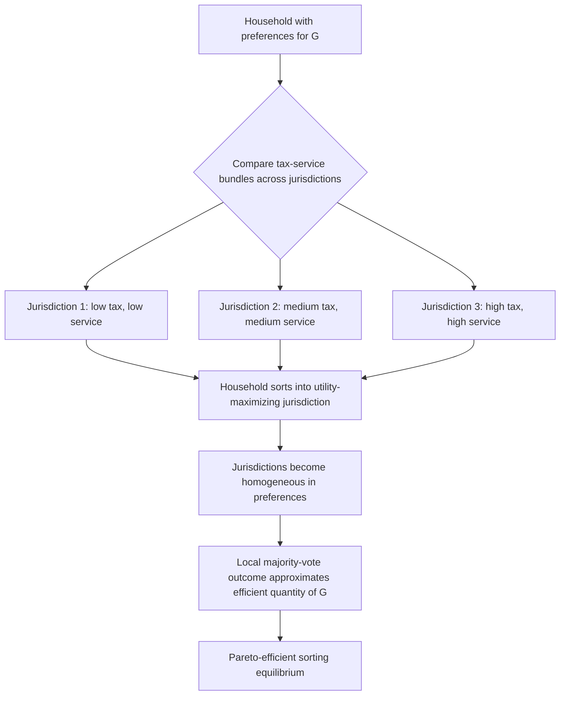

## Tiebout Model of Local Public Goods

### Overview

The Tiebout model, introduced by Charles Tiebout in his 1956 paper "A Pure Theory of Local Expenditures," is a foundational theory in local public finance that explains how the existence of many competing local jurisdictions can lead to efficient provision of local public goods, even though the standard theory of public goods predicts market failure due to free-riding. Tiebout's central insight was that residential mobility across jurisdictions functions analogously to consumer choice in a private market: households "vote with their feet" by selecting the jurisdiction whose bundle of local public goods and taxes best matches their preferences.

The model was developed partly as a response to Paul Samuelson's work on public goods, which suggested that no market mechanism could reveal true preferences for public goods, implying a persistent role for centralized government provision. Tiebout argued that at the local level, this pessimism was misplaced because mobility introduces a quasi-market mechanism for preference revelation.

### The Core Problem Tiebout Addresses

Samuelson's public goods framework assumes:

- A single, national level of government providing public goods
- Citizens cannot avoid the tax-and-benefit package by moving
- No incentive to truthfully reveal preferences, since consumption is non-excludable

Tiebout's insight is that these assumptions fail once there are **many local jurisdictions**, each offering a different mix of local public goods and local tax rates. Local public goods (unlike national defense) are typically characterized by geographically limited benefit areas, making exclusion by jurisdiction feasible.

### Key Assumptions of the Tiebout Model

The model rests on a set of stylized assumptions, several of which are quite restrictive:

1. **Perfect mobility** — Households can and do move costlessly to the jurisdiction that maximizes their utility.
2. **Full information** — Residents know the full range of tax and expenditure patterns across all jurisdictions.
3. **Large number of jurisdictions** — There are enough communities to offer a wide range of tax-service bundles.
4. **No interjurisdictional externalities** — Public goods provided in one jurisdiction generate no spillover benefits or costs to residents of other jurisdictions.
5. **Optimal city size and average cost pricing** — Each jurisdiction has an optimal population size that minimizes average cost of providing public goods; jurisdictions try to attract residents up to this size and no further.
6. **No employment-location constraints** — Individuals are not tied to a jurisdiction for employment reasons (they can live wherever, independent of where they work).
7. **Public goods financed by property tax (in extended versions)** — Local governments finance services primarily through taxes on land or property.
8. **Communities can restrict entry** — Jurisdictions can use zoning or other tools to keep population near optimal size.

These assumptions are essentially the local-public-finance analog of the assumptions behind perfect competition (many firms/jurisdictions, full information, free entry/exit via mobility, no externalities).

### The "Voting with Your Feet" Mechanism

**Key Points**

- Preference revelation occurs through **residential sorting** rather than through voting or willingness-to-pay declarations.
- Each household selects a jurisdiction $j$ that maximizes utility $U(g_j, x)$ subject to a budget constraint involving local tax price $t_j$, where $g_j$ is the local public good bundle and $x$ is a private consumption good.
- Jurisdictions compete for residents, which disciplines local governments to provide public goods efficiently — inefficient jurisdictions lose population (and tax base) to more efficient ones.
- The outcome is analogous to consumers "shopping" among differentiated products, except the product is a fixed bundle: {tax rate, public service level, local amenities}.

Formally, a household chooses among jurisdictions $j = 1, \dots, n$ to solve:

$$\max_{j} \; U(g_j, x_j) \quad \text{s.t.} \quad x_j + t_j = y$$

where $y$ is income, $t_j$ is the local tax payment in jurisdiction $j$, and $g_j$ is the quantity/quality of local public goods provided there. Since households cannot alter $g_j$ or $t_j$ once inside a jurisdiction (they are price-takers with respect to the bundle), the only margin of choice is *which* jurisdiction to join — hence "moving" substitutes for "voting" on the quantity of the public good.

### Efficiency Result: The Tiebout Hypothesis

**Key Points**

- Under the stated assumptions, the equilibrium allocation of households across jurisdictions is **Pareto efficient**.
- Each jurisdiction ends up populated by households with **relatively homogeneous preferences** for public goods (since people with similar demand for the local public good sort into the same community).
- This process solves the preference-revelation problem: a household's *choice of jurisdiction* reveals its willingness to pay for that bundle of public goods, similar to how a consumer's purchase reveals their valuation of a private good.
- Because same-preference households cluster together, the **free-rider problem is mitigated** — local political processes (e.g., majority voting on the local budget) more accurately reflect the true aggregate demand curve for the public good, since the population is more homogeneous.

This result is sometimes called the **Tiebout Hypothesis**: competition among local governments for mobile residents produces an efficient level and mix of local public goods, without the need for centralized provision or coercive taxation, because "exit" (mobility) plus "choice" perform the market-clearing function that is normally absent for public goods.

### Formal Diagrammatic Representation

### Optimal Community Size and the Role of Property Taxes

Tiebout's original model did not fully specify the financing mechanism, but subsequent work (particularly Bruce Hamilton's 1975 extension) incorporated the property tax and zoning explicitly:

- Each jurisdiction has an **average cost curve** for providing a given level of public good per capita; there exists a population size that minimizes the average cost per resident (analogous to the minimum efficient scale of a firm).
- If jurisdictions are below optimal size, admitting more residents lowers average tax cost per household (positive scale economies); if above, admitting more residents raises congestion costs.
- **Zoning ordinances** (e.g., minimum lot size requirements) can function as an entry-restriction device, preventing free-riding by lower-income households who might otherwise move in to consume public goods while paying less in property tax than the cost of servicing them.
- With property taxes and effective zoning, Hamilton showed that the property tax could behave like a **benefit tax** (a "user fee" for local services) rather than a distortionary tax, restoring Tiebout efficiency even without head taxes.

### Illustration: Sorting Equilibrium

(svg_diagram)

<svg xmlns="http://www.w3.org/2000/svg" viewBox="0 0 760 420">
<text x="380" y="30" text-anchor="middle" font-size="18" font-weight="bold" fill="#1a1a1a">Tiebout Sorting Equilibrium (svg_diagram)</text>

<line x1="80" y1="370" x2="700" y2="370" stroke="#333" stroke-width="2" />
<line x1="80" y1="370" x2="80" y2="60" stroke="#333" stroke-width="2" />
<text x="390" y="400" text-anchor="middle" font-size="14" fill="#333">Household Demand for Public Good (G)</text>
<text x="30" y="220" text-anchor="middle" font-size="14" fill="#333" transform="rotate(-90 30 220)">Local Tax Price (t)</text>

<rect x="120" y="290" width="140" height="80" fill="#cfe8ff" stroke="#2266aa" stroke-width="1.5" />
<text x="190" y="335" text-anchor="middle" font-size="13" fill="#123">Community A</text>
<text x="190" y="352" text-anchor="middle" font-size="11" fill="#345">Low tax / Low G</text>
<rect x="300" y="200" width="140" height="170" fill="#a9d6a9" stroke="#2a7a2a" stroke-width="1.5" />
<text x="370" y="285" text-anchor="middle" font-size="13" fill="#123">Community B</text>
<text x="370" y="302" text-anchor="middle" font-size="11" fill="#345">Medium tax / Medium G</text>
<rect x="480" y="100" width="140" height="270" fill="#f5c98a" stroke="#a5701a" stroke-width="1.5" />
<text x="550" y="200" text-anchor="middle" font-size="13" fill="#123">Community C</text>
<text x="550" y="217" text-anchor="middle" font-size="11" fill="#345">High tax / High G</text>

<circle cx="150" cy="350" r="5" fill="#1a4d8f" />
<circle cx="175" cy="345" r="5" fill="#1a4d8f" />
<circle cx="200" cy="355" r="5" fill="#1a4d8f" />
<circle cx="330" cy="260" r="5" fill="#1c5c1c" />
<circle cx="360" cy="240" r="5" fill="#1c5c1c" />
<circle cx="400" cy="270" r="5" fill="#1c5c1c" />
<circle cx="510" cy="160" r="5" fill="#8f4d10" />
<circle cx="550" cy="130" r="5" fill="#8f4d10" />
<circle cx="590" cy="180" r="5" fill="#8f4d10" />

<text x="380" y="60" text-anchor="middle" font-size="12" fill="#555">Households sort by matching demand for G to jurisdiction's tax-service bundle</text>

</svg>

### Numerical Example

**Example**

Suppose there are three jurisdictions offering different levels of a local public good (say, school quality index $G$) financed by a uniform per-household tax:

| Jurisdiction | Public Good Level ($G$) | Tax per Household ($t$) |
| --- | --- | --- |
| A | 2 | $1,000 |
| B | 5 | $2,500 |
| C | 9 | $5,000 |

A household's utility function is $U = \ln(x) + \theta \ln(G)$, where $x = y - t$ is private consumption, $y = \$50{,}000$ is income, and $\theta$ reflects the household's preference intensity for the public good.

- A household with **low $\theta$ (e.g., 0.3)** — perhaps a childless household valuing private consumption highly — will compute utility in each jurisdiction and typically find Jurisdiction A optimal, since the marginal utility gain from higher $G$ does not offset the tax cost.
- A household with **high $\theta$ (e.g., 1.2)** — perhaps a family with school-age children who values school quality intensely — will find Jurisdiction C optimal despite the higher tax.

Working through Jurisdiction A vs. C for the high-$\theta$ household:

$$U_A = \ln(49{,}000) + 1.2\ln(2) \approx 10.80 + 0.83 = 11.63$$

$$U_C = \ln(45{,}000) + 1.2\ln(9) \approx 10.71 + 2.64 = 13.35$$

Since $U_C > U_A$, this household sorts into Jurisdiction C. Repeating this comparison across the population produces a sorted equilibrium in which each jurisdiction's residents share similar $\theta$ values — the empirical signature of Tiebout sorting.

### Empirical Predictions and Tests

The Tiebout model generates several testable implications:

- **Capitalization of fiscal differences into property values**: Because a house's price reflects the discounted value of local tax burdens and public service quality, well-functioning Tiebout sorting should be observable through the "capitalization" of property taxes and school quality into housing prices (see the Oates 1969 capitalization study for one of the classic empirical tests).
- **Homogeneity within jurisdictions**: Communities should show less variance in preferences for public goods (e.g., in demand for school spending) than the population as a whole.
- **Housing market as the sorting mechanism**: Because moving requires purchasing/renting property in a jurisdiction, housing markets are the primary channel through which sorting occurs — this links the Tiebout model tightly to urban economics and housing market analysis.
- **Fragmentation and metro area efficiency**: Areas with a larger number of independent local jurisdictions (more fragmented metropolitan governance) should, according to the theory, exhibit outcomes closer to the efficient allocation, because more options improve the match between household preferences and jurisdiction bundles.

### Criticisms and Limitations

**Key Points**

1. **Mobility is not costless** — moving involves transaction costs, emotional costs, employment constraints, and information costs, all of which the base model assumes away. [Inference] The magnitude of these frictions likely varies substantially by household type (e.g., renters vs. homeowners, and by life stage), which can dampen the sorting mechanism's real-world efficiency.
2. **Imperfect information** — households rarely have complete knowledge of every jurisdiction's tax-service bundle; search costs limit the range of options actually considered.
3. **Employment location constraints** — Tiebout assumed residence choice is independent of employment location, which is unrealistic; commuting costs anchor many households to a metropolitan area regardless of fiscal preferences.
4. **Externalities across jurisdictions** — many local public goods (e.g., pollution control, regional transportation, policing) generate spillovers that violate the no-externality assumption, undermining the efficiency result.
5. **Exclusionary zoning as a double-edged sword** — while zoning may support Tiebout efficiency by preventing free-riding, it is also criticized as a mechanism for economic and (historically) racial exclusion, raising equity concerns that are outside the model's welfare criterion (Pareto efficiency does not address distributional fairness).
6. **Indivisibility and scale problems for some public goods** — not all local public goods have well-defined optimal population sizes or average-cost-minimizing scales (e.g., large infrastructure with strong economies of scale may not fit neatly into the model).
7. **Limited applicability to redistributive policy** — because low-income households would, in principle, want to move to jurisdictions with high-income residents (to free-ride on generous services financed by others' taxes), Tiebout equilibria can be undermined absent exclusionary devices, which itself signals tension between the model's efficiency claims and issues of income-based sorting and stratification.

### Relationship to Fiscal Federalism

The Tiebout model provides a **market-based efficiency rationale** for decentralized (as opposed to centralized) provision of public goods, complementing the more institutional/political arguments found in the theory of fiscal federalism (e.g., the Decentralization Theorem of Wallace Oates). Where Oates emphasizes that decentralized provision better matches heterogeneous local preferences via political processes, Tiebout emphasizes that decentralization plus mobility creates an implicit market that reveals and satisfies those preferences even without perfect local political mechanisms. Together, these form the core efficiency case for assigning public-good provision to the lowest feasible level of government—subject to the caveat that this logic breaks down when there are significant interjurisdictional externalities, in which case higher levels of government (regional or national) are theoretically better suited to internalize spillovers.

### Extensions in the Literature

- **Hamilton (1975)**: Formalized the role of the property tax and zoning as a mechanism restoring efficiency in the presence of income heterogeneity.
- **Epple and Zelenitz (1981), Epple, Filimon, and Romer (1984)**: Developed general equilibrium models of jurisdictional choice with endogenous housing prices and political voting, testing robustness of the Tiebout logic when local public good levels are set by majority vote rather than assumed fixed.
- **Fischel's "Homevoter Hypothesis" (2001)**: Extends Tiebout-style reasoning by arguing that homeowners (as opposed to renters) have particularly strong incentives to support efficient, capitalization-maximizing local policies because their wealth is tied up in home equity.
- **Empirical capitalization studies**: A large literature (from Oates 1969 onward) tests the extent to which property values capitalize local tax and school-quality differentials, serving as indirect evidence for or against Tiebout sorting. [Unverified] The precise magnitude of capitalization found varies considerably across studies, time periods, and metropolitan contexts, and remains sensitive to model specification and the measurement of school quality.

### Conclusion

The Tiebout model remains one of the most influential frameworks in local public finance because it offers a market-analogous solution to the public goods preference-revelation problem at the local level. While its assumptions are demanding and often unrealistic, the model's core insight — that residential mobility across many competing jurisdictions can substitute for a market mechanism in allocating public goods — has shaped both academic thinking on fiscal decentralization and practical debates over metropolitan governance fragmentation, zoning policy, and property tax design.

**Related Topics**

- Fiscal federalism and the Oates Decentralization Theorem
- Property tax capitalization and empirical tests (Oates 1969 and successors)
- Hamilton's zoning-property tax model of jurisdictional efficiency
- Median voter theorem in local public choice
- Exclusionary zoning and its equity implications
- Metropolitan fragmentation and local government competition
- Club goods theory and Buchanan's model of optimal club size
- Interjurisdictional externalities and the case for regional/higher-level provision
- Housing market sorting and residential location choice models
- The Homevoter Hypothesis (Fischel)