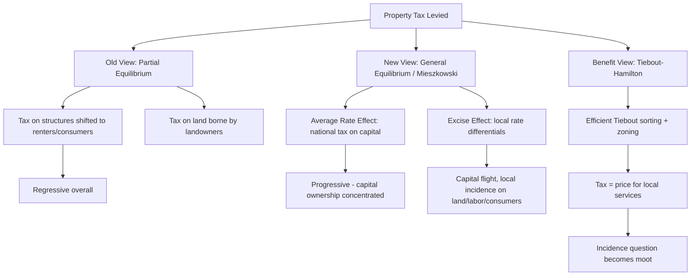

## Property Taxation and Local Revenue Systems

### Overview

Property taxation is the dominant own-source revenue instrument for local governments in most fiscal systems worldwide, and it occupies a central place in the theory of local public finance because of its close theoretical relationship to local public goods, capitalization, and the Tiebout sorting mechanism. Local revenue systems more broadly comprise the mix of instruments — property taxes, local income/sales taxes, user fees and charges, intergovernmental transfers, and borrowing — that subnational governments use to finance service provision. This topic covers the economic theory of the property tax (the "old view" vs. "new view" debates), the mechanics of assessment and administration, the broader local revenue portfolio, and the interaction between these instruments and fiscal federalism.

### The Property Tax: Base and Mechanics

**Key Points**

- The property tax is an **ad valorem tax** levied on the assessed value of real property (land and improvements/structures), and in some jurisdictions personal property (machinery, inventory).
- The basic tax liability is:

$$T = \tau \times AV$$

where $\tau$ is the statutory tax rate (often called the "mill rate," expressed in mills — thousandths of a dollar per dollar of assessed value) and $AV$ is the assessed value of the property.

- **Assessed value** is typically some fraction or approximation of **market value**, determined through a periodic assessment process (mass appraisal, sales-comparison approach, cost approach, or income approach depending on property type).
- The **effective tax rate** (ETR) — the tax paid as a share of true market value — often differs from the statutory rate due to assessment lags, exemptions, and assessment ratios less than 100%:

$$ETR = \tau \times \frac{AV}{MV}$$

where $MV$ is true market value and $AV/MV$ is the assessment ratio.

### Two Competing Theoretical Views of Property Tax Incidence

This is the central theoretical debate in the economics of property taxation, and it has direct implications for whether the tax is regressive, proportional, or capable of functioning as an efficient benefit tax.

#### The "Traditional/Old View"

- Treats the property tax as an **excise tax on housing and capital services** within a partial-equilibrium framework.
- Because the supply of housing/structures is viewed as relatively elastic in the long run (capital can be redirected to other uses) while land supply is fixed, the tax on **structures** is assumed to be shifted forward to consumers/renters in the form of higher rents, while the tax on **land** falls on landowners (since land supply is perfectly inelastic).
- Under this view, because lower-income households spend a larger share of income on housing, the property tax on the structure component is **regressive** with respect to income.

#### The "New View" (Capital Tax View)

Developed primarily by **Peter Mieszkowski (1972)** and extended by others, this view treats the property tax within a **general equilibrium framework** where capital is mobile across all jurisdictions in the national economy:

- The property tax is modeled as a tax on capital used in the residential and commercial sectors nationwide.
- It can be decomposed into two components:
  1. **The "average rate effect" (a national tax on all capital)**: Since capital is treated as being in fixed aggregate supply across the whole economy in the short-to-medium run, the average nationwide property tax rate falls on the return to capital broadly — and because capital ownership is concentrated among higher-income households, this component is actually **progressive**.
  2. **The "excise tax effect" (differentials from the national average rate)**: Jurisdictions with above-average tax rates experience capital flight to low-tax jurisdictions, creating a local excise-tax-like effect — capital that flees a high-tax area bids down returns elsewhere and can depress land values and wages locally, while consumers in the high-tax jurisdiction face a tax-like burden (partially on residents, partially on landowners, depending on relative elasticities).
- Under the new view, aggregate property tax incidence could be **progressive overall** (from the capital-return component) even though the local excise effect retains regressive features at the margin.

#### The "Benefit View" (Tiebout-Hamilton Synthesis)

- As introduced in the Tiebout discussion, if local public services are efficiently matched to residents' willingness to pay (via Tiebout sorting) and if zoning prevents free-riding, the property tax can function as a **benefit tax** — effectively a price paid for local services received, similar to a user fee.
- Under the benefit view, the property tax is **neither regressive nor progressive in a distortionary sense**; it is simply the price of local public services, and questions of incidence become moot because the tax buys something of equivalent value.
- [Inference] Real-world local property tax systems likely exhibit incidence patterns that are a blend of all three views, with the relative weight depending on the degree of local zoning stringency, capital mobility, and the extent of within-jurisdiction preference homogeneity.

### Diagrammatic Summary of Incidence Views

### Assessment, Administration, and Valuation Methods

**Key Points**

- **Mass appraisal systems**: Local assessors typically cannot appraise every parcel individually every year; statistical models (often multiple regression or comparable-sales models) are used to generate assessed values across large numbers of properties simultaneously.
- **Assessment cycles**: Jurisdictions vary widely — some reassess annually, others every several years — creating **assessment lag**, where assessed values diverge from current market values, especially during periods of rapid price appreciation or decline.
- **Assessment ratios and caps**: Some jurisdictions statutorily cap assessed value growth (e.g., California's Proposition 13 limits annual assessment increases to a small percentage regardless of market appreciation, tying assessed value to purchase price rather than current market value).
- **Regressivity in assessment**: Empirical research (e.g., work by Christopher Berry and others on assessment regressivity) has documented that mass appraisal systems can systematically **over-assess lower-valued properties relative to market value and under-assess higher-valued properties**, creating a regressive assessment bias independent of the theoretical incidence debates above. [Unverified] The magnitude of this bias varies substantially across jurisdictions and depends on the specific appraisal methodology and update frequency used, so it should not be assumed to be a universal or fixed-magnitude phenomenon.
- **Exemptions and preferential assessment**: Common features include homestead exemptions (reducing taxable value for owner-occupied primary residences), circuit breakers (property tax relief tied to income, capping tax burden as a share of income), agricultural use-value assessment, and exemptions for nonprofit/government property.

### Local Revenue Systems: The Broader Portfolio

Property taxes rarely stand alone; local governments typically draw on a portfolio of revenue instruments:

#### 1. Own-Source Tax Revenues

- **Property tax** (primary local tax base in most systems, particularly in the U.S., Canada, UK council tax, and many others)
- **Local sales taxes** (common as a supplement in U.S. states; more exportable to non-residents through tourism/shopping but volatile with the business cycle)
- **Local income taxes / payroll taxes** (used in some jurisdictions, e.g., some U.S. cities, Nordic municipalities)
- **Business taxes and license fees**

#### 2. User Charges and Fees

- Charges for services with excludable, rival characteristics (water, sewer, waste collection, parking, recreational facilities).
- Theoretically preferable to general taxation for such services because they align payment with benefit received (efficiency) and avoid subsidizing non-users.
- **Marginal-cost pricing principle**: efficient user fees set price equal to the marginal cost of service provision, though average-cost pricing is more common in practice due to fixed infrastructure costs.

#### 3. Intergovernmental Transfers

- **Unconditional/general-purpose grants**: Provide local governments with flexible revenue, often justified on fiscal equalization grounds (addressing disparities in local tax base per capita across jurisdictions).
- **Conditional/categorical grants**: Tied to specific spending purposes (e.g., education, transportation); may be matching (requiring local co-financing) or non-matching.
- **Matching grants and the price effect**: A matching grant reduces the effective local "tax price" of the subsidized service, which theoretically induces more spending than an equivalent lump-sum grant of the same nominal amount — an application of the standard price-vs-income-effect distinction from consumer theory. [Inference] This price effect is a standard prediction of the theory; however, its empirically estimated magnitude is subject to the well-documented "flypaper effect" discussed below, which the pure substitution/income framework does not fully explain on its own.
- **The Flypaper Effect**: A robust empirical finding across many studies that unconditional/lump-sum grants to local governments increase local public spending by substantially more than an equivalent increase in private (median voter) income would predict — "money sticks where it hits." This anomaly is not fully explained by standard median-voter theory and has generated a literature on bureaucratic behavior, fiscal illusion, and agenda-setting as alternative explanations.

#### 4. Debt and Capital Financing

- **General obligation (GO) bonds**: Backed by the full taxing power of the jurisdiction, typically used for general infrastructure.
- **Revenue bonds**: Backed by revenue from the specific project financed (e.g., toll roads, utility systems), not general tax revenue.
- **Tax Increment Financing (TIF)**: A mechanism where a local government captures the incremental property tax revenue generated by rising assessed values within a designated district (attributable to public investment or development) to finance the debt service on bonds issued for that investment.

### Formal Model: Local Government Budget Constraint

A local government's balanced budget can be represented as:

$$\tau \cdot AV + G_{transfer} + F_{user} + \Delta D = E$$

where $\tau \cdot AV$ is property tax revenue, $G_{transfer}$ is intergovernmental grant revenue, $F_{user}$ is user fee revenue, $\Delta D$ is net new borrowing, and $E$ is total local expenditure. The relative weight placed on each term is a matter of both economic efficiency (matching payment to benefit where feasible) and political economy (voter resistance to visible tax increases relative to less salient revenue sources).

### Efficiency Properties and Distortions

**Key Points**

- **Land value taxation (Georgist approach)**: Because the supply of raw land is perfectly inelastic, a tax purely on land value is **non-distortionary** — it does not discourage the supply of land (which cannot be increased) and is fully capitalized into lower land prices rather than being passed to renters. Split-rate taxation (taxing land at a higher rate than improvements) is proposed by some as a way to reduce the tax's disincentive on new construction/improvement while preserving revenue.
- **Distortion of improvements**: Taxing structures (improvements) at the same rate as land discourages investment in property improvements, since higher-value structures generate higher tax liability — an efficiency cost relative to pure land value taxation.
- **Capitalization**: As discussed under the Tiebout model, property tax differentials (and the quality of services they finance) become capitalized into property values — high taxes relative to service quality depress prices, while low taxes relative to service quality (or high-quality schools funded by moderate taxes) raise prices. This capitalization is central to empirical tests of local fiscal efficiency.
- **Tax exporting**: Local governments may attempt to shift tax burden onto non-residents (e.g., through taxes on commercial/industrial property disproportionately used by producers who sell to a national or international market, or lodging taxes aimed at tourists), which can distort efficient local decision-making since residents don't bear the full local cost of their spending choices.

### Numerical Example: Assessment and Effective Rate

**Example**

Consider two otherwise identical local governments needing to raise $10 million in property tax revenue.

- **Jurisdiction X** has a total assessed value (tax base) of $500 million.
- **Jurisdiction Y** has a total assessed value (tax base) of $1 billion (larger tax base per the same population, perhaps due to more commercial development).

Required mill rate:

$$\tau_X = \frac{10{,}000{,}000}{500{,}000{,}000} = 0.02 = 20 \text{ mills}$$

$$\tau_Y = \frac{10{,}000{,}000}{1{,}000{,}000{,}000} = 0.01 = 10 \text{ mills}$$

Jurisdiction Y can raise the same revenue at half the statutory rate because of its larger tax base — illustrating why **tax base disparities** across jurisdictions (not just spending differences) drive differences in local tax rates, and why equalization grants are often designed to offset differences in per-capita tax base rather than simply topping up low-spending jurisdictions.

### Political Economy Considerations

- **Salience and taxpayer resistance**: Property taxes are highly visible (often paid in a lump sum or via a separate bill rather than withheld incrementally like income tax), which some argue increases taxpayer resistance and contributes to tax revolts (e.g., California's Proposition 13 in 1978, Massachusetts's Proposition 2½).
- **Median voter theorem application**: In a Tiebout-sorted, relatively homogeneous jurisdiction, the level of local public spending approved through majority-rule voting is predicted to reflect the preferences of the median voter/median-value property owner.
- **Interjurisdictional tax competition**: Jurisdictions may engage in tax competition to attract mobile capital and high-value residential/commercial development, potentially leading to a **"race to the bottom"** in tax rates or business tax incentive competition, which is a live area of debate regarding whether such competition is efficiency-enhancing (Tiebout-style discipline) or welfare-reducing (a coordination failure analogous to a prisoner's dilemma).

### Equity and Assessment Fairness Issues

**Key Points**

- **Vertical equity**: Concerns whether the tax burden as a share of income/wealth is fair across income groups; central to the old-view-vs-new-view incidence debate.
- **Horizontal equity**: Concerns whether similarly situated properties (same market value) bear similar tax burdens; violated by inconsistent or infrequent reassessment (a phenomenon sometimes called "assessment inequity," e.g., long-time owners under-assessed relative to recent buyers under acquisition-value systems like Prop 13).
- **Circuit breaker programs**: Designed to address vertical equity concerns directly by capping property tax liability as a percentage of household income, particularly aimed at protecting fixed-income (e.g., retired) homeowners from being taxed out of homes whose value has appreciated.

### Conclusion

Property taxation sits at the intersection of public finance theory, urban economics, and local political economy. Its economic effects depend critically on which theoretical lens is applied — traditional partial-equilibrium incidence analysis, Mieszkowski's general-equilibrium capital tax view, or the Tiebout-Hamilton benefit view — and real-world outcomes likely reflect elements of all three depending on local institutional context (degree of zoning stringency, capital mobility, and assessment practices). As the centerpiece of most local revenue systems, understanding the property tax's mechanics, incidence, and interaction with intergovernmental transfers and user fees is essential to analyzing the fiscal capacity and behavior of subnational governments.

**Related Topics**

- Tiebout model of local public goods
- Fiscal federalism and the Decentralization Theorem
- Tax increment financing (TIF) and local infrastructure finance
- The flypaper effect and grant incidence
- Land value taxation and Georgist economics
- Assessment regressivity and mass appraisal methodology
- Fiscal equalization transfers across jurisdictions
- Median voter theorem in local public choice
- Exclusionary zoning as a fiscal instrument
- Municipal debt markets and general obligation vs. revenue bonds