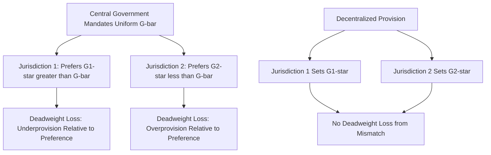
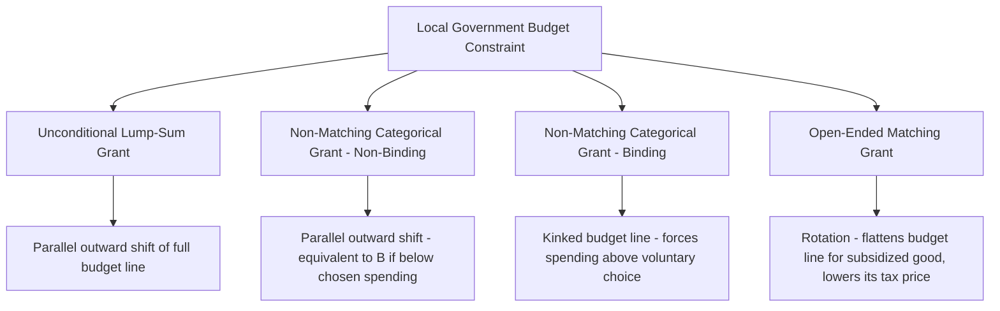

## Fiscal Federalism and Intergovernmental Transfers

### Overview

Fiscal federalism is the branch of public economics that studies how the responsibilities for taxation, expenditure, and regulation should be, and are, allocated across different levels of government (national, state/regional, and local), and how intergovernmental transfers correct for the imbalances and inefficiencies that arise from that allocation. The field draws on normative theory — what division of functions and financing would be efficient — and positive/political-economy analysis of how actual multi-tiered government systems behave. Its core theoretical contributions include Musgrave's assignment framework, Oates's Decentralization Theorem, the theory of vertical and horizontal fiscal imbalance, and the extensive empirical literature on grant design, including the well-documented "flypaper effect."

### Musgrave's Three Functions and the Assignment Problem

Richard Musgrave's classic framework divides government economic functions into three branches, which has direct implications for which level of government should perform which role:

1. **Allocation function** — providing public goods and correcting externalities/market failures. Best suited to **decentralized (local/regional)** provision when preferences are heterogeneous and there are no significant spillovers, per the Decentralization Theorem below.
2. **Distribution function** — redistributing income to achieve equity goals. Best suited to **centralized (national)** provision, because if redistribution were left to local governments, redistributive jurisdictions would attract low-income in-migrants and drive out high-income taxpayers (a "race to the bottom" or fiscal migration problem), undermining the sustainability of local redistribution.
3. **Stabilization function** — macroeconomic stabilization (monetary and fiscal policy for full employment, price stability). Best suited to **central government**, since subnational governments (a) typically cannot run independent monetary policy, (b) face balanced-budget constraints that are pro-cyclical, and (c) have highly open economies relative to the nation as a whole, so local fiscal stimulus "leaks" out via imports from other jurisdictions.

### The Decentralization Theorem (Oates, 1972)

**Key Points**

Wallace Oates formalized the case for decentralized provision of public goods with a canonical result now known as the **Decentralization Theorem**:

> For a public good whose consumption is defined over geographically limited subsets of the total population, and for which the costs of providing each level of output of the good in each jurisdiction are the same for the central or the respective local government, it will always be more efficient (or at least as efficient) for local governments to provide the Pareto-efficient levels of output for their respective jurisdictions than for the central government to provide any specified and uniform level of output across all jurisdictions.

Intuition:

- If preferences for a local public good differ across regions (heterogeneous demand), a single centrally-mandated uniform quantity necessarily creates a welfare loss for jurisdictions whose preferred quantity differs from the imposed uniform level.
- Decentralized provision allows each jurisdiction to tailor quantity to local preferences, generating a strict welfare gain whenever preferences are heterogeneous and there is no cost disadvantage to local provision (e.g., no lost economies of scale).
- The welfare loss from centralized uniform provision grows with the degree of preference heterogeneity across jurisdictions and the price-elasticity of demand for the public good.

**Formal illustration:**

Let two jurisdictions have demand for a local public good $G$ described by inverse demand curves $P_1(G)$ and $P_2(G)$, with jurisdiction 1 preferring $G_1^*$ and jurisdiction 2 preferring $G_2^*$ under decentralized provision (each set where marginal benefit equals marginal cost, $MC$). If the central government instead mandates a uniform quantity $\bar{G}$ (e.g., the population-weighted average), the deadweight loss in each jurisdiction is the triangle between the marginal benefit curve and $MC$ between $\bar{G}$ and $G_i^*$:

$$DWL_i = \frac{1}{2} \left| G_i^* - \bar{G} \right| \times \left| MB_i(\bar{G}) - MC \right|$$

Since $DWL_i > 0$ whenever $\bar{G} \neq G_i^*$, uniform central provision is weakly dominated by decentralized provision whenever preferences differ.

### Limits to Decentralization: Spillovers and Scale Economies

The efficiency case for decentralization weakens or reverses under several conditions:

- **Interjurisdictional externalities/spillovers**: If a public good provided by jurisdiction A generates benefits (or costs) for residents of jurisdiction B who don't bear A's cost of provision, jurisdiction A will systematically **underprovide** the good relative to the socially efficient level (classic public goods underprovision logic applied at the jurisdictional level). Examples: regional transportation networks, pollution control, communicable disease control.
- **Economies of scale in provision**: Some public goods/services exhibit substantial scale economies (e.g., specialized medical equipment, large infrastructure, administrative/regulatory capacity) such that centralized or regionally-coordinated provision achieves lower average cost.
- **Race-to-the-bottom concerns**: Beyond redistribution, some argue environmental or labor regulation is also vulnerable to a race to the bottom if left fully to subnational jurisdictions competing for mobile capital, though this claim is contested in the empirical literature. [Speculation] Whether real-world regulatory competition among subnational governments systematically produces a "race to the bottom" as opposed to a "race to the top" (via yardstick competition and policy innovation diffusion) remains a genuinely disputed empirical question without clear consensus.
- **Second-generation fiscal federalism** (Weingast and others) incorporates political-economy considerations, such as the risk that centralized systems create a **common pool problem** — subnational governments may over-request transfers/bailouts from the center if they do not internalize the full cost of their fiscal decisions, particularly under soft budget constraints.

### Vertical and Horizontal Fiscal Imbalance

**Key Points**

Two distinct types of mismatch motivate the existence of intergovernmental transfers:

1. **Vertical Fiscal Imbalance (VFI)**: A mismatch between the expenditure responsibilities assigned to a level of government and the revenue-raising capacity assigned to that same level. Subnational governments are frequently assigned significant service responsibilities (education, health, local infrastructure) but limited independent taxing authority (due to mobile tax bases, administrative capacity constraints, or constitutional/statutory limits), creating a **fiscal gap** that transfers from higher levels of government are designed to fill.
2. **Horizontal Fiscal Imbalance (HFI)**: Disparities in fiscal capacity (tax base per capita) and/or expenditure need across jurisdictions at the *same* level of government. Even if the vertical assignment of functions and revenues is balanced overall, some jurisdictions will have larger tax bases per capita (e.g., due to natural resource endowments, agglomeration effects, industrial composition) or greater expenditure needs (e.g., older population, higher poverty rates, sparser geography raising service delivery costs) than others.

**Equalization transfers** are the standard policy response to horizontal imbalance, designed to bring all jurisdictions' fiscal capacity (or, in some designs, fiscal capacity net of need) up to a common standard, so that residents of low-capacity jurisdictions are not forced to accept lower service levels or higher tax rates purely due to accident of location.

### Types of Intergovernmental Transfers

#### Unconditional (General Purpose) Grants

- No restriction on how funds are spent; recipient government has full discretion.
- Often justified on equalization grounds (addressing VFI/HFI) or on grounds of local budgetary autonomy/political accountability.
- Theoretically equivalent to a lump-sum increase in the local government's income, which — in the standard median-voter model — should be spent according to the same income elasticity of demand for public goods as any other increase in community income.

#### Conditional (Categorical) Grants

Divided into two subtypes based on financing structure:

- **Matching grants**: The higher-level government contributes a fraction of local spending on a specified service (e.g., $1 of state funding for every $1 of local spending on education — a 50% matching rate). This **lowers the effective local tax price** of the subsidized good, producing both a price (substitution) effect (inducing more spending on the subsidized good relative to other goods) and an income effect (since the same nominal local tax revenue now buys more of the subsidized good).
- **Non-matching (block) categorical grants**: A fixed sum given for a specified purpose, without a local matching requirement. This functions like a restricted lump-sum grant — as long as the mandated spending amount doesn't exceed what the jurisdiction would have chosen to spend on that category anyway (i.e., the grant is "non-binding"), it has a pure income effect, equivalent to an unconditional grant of the same size. If the grant exceeds what would have been chosen voluntarily (a "binding" categorical grant), it can force spending on the specified good above the community's preferred level, though this is typically less than what an equivalent matching grant would induce.

Grants can also be **open-ended** (no cap on the amount eligible for matching) or **closed-ended** (matching funds available only up to a specified ceiling).

### Diagrammatic Comparison of Grant Types (Budget Constraint Shifts)

### The Flypaper Effect

**Key Points**

- One of the most robust empirical findings in the public finance literature: **unconditional intergovernmental grants tend to increase local government spending by substantially more than an equivalent increase in private household/median-voter income would predict.** The colloquial description is that "money sticks where it hits" — grant revenue received by the government stays largely in the government sector rather than being passed through to taxpayers as tax relief (which the pure income-equivalence theory would predict, since a lump-sum grant should theoretically be treated the same as any other increase in community income by a rational median voter).
- **Standard theory prediction**: If a jurisdiction receives an unconditional grant of $G, and community income is $Y$, the grant should increase public spending by only the income elasticity of demand for public goods times $G$ — the same response predicted from a private income increase of $G$ distributed to residents. Empirically, public spending responses to grants are found to be several multiples of what an equivalent increase in private income would generate.
- **Leading explanations** in the literature:
  1. **Fiscal illusion**: Voters may underestimate the true cost of publicly-provided goods when financed via a grant rather than local taxes, since the grant obscures the tax-price signal, leading to systematically higher demand than under full information.
  2. **Bureaucratic/agenda-setter models** (e.g., Romer and Rosen; Filimon, Romer, and Rosen's agenda-setter model): Local officials or bureaucrats with agenda-setting power over the referendum/budget process may be able to capture some of the grant revenue for larger government budgets than the median voter would otherwise choose, exploiting the all-or-nothing structure of many local budget referenda.
  3. **Asymmetric treatment of grant reductions vs. increases**: Some empirical work finds that grant cuts are met with tax increases rather than spending cuts of matching size, suggesting a ratchet-like asymmetry that a pure income-effect model does not predict.
- [Unverified] The relative empirical support for fiscal illusion versus agenda-setter versus other institutional explanations for the flypaper effect continues to be debated in the literature, and the "correct" explanation likely varies by institutional context (e.g., whether local budgets are set by referendum, council vote, or another mechanism).

### Formal Model: Effect of a Matching Grant

Consider a local jurisdiction's median voter choosing spending on a local public good $G$ subject to budget constraint $Y = X + p_G \cdot G$, where $Y$ is income, $X$ is private consumption (numeraire, price 1), and $p_G$ is the local tax price per unit of $G$ (i.e., what the median voter must pay in local taxes per unit of public good provided).

With a matching grant covering fraction $m$ of the cost of $G$, the effective price faced by the local jurisdiction becomes:

$$p_G' = (1-m) \cdot p_G$$

This is a pure price change (a rotation of the budget line, not a parallel shift), so the community's response combines a **substitution effect** (more $G$ relative to $X$, since $G$ is now relatively cheaper) and an **income effect** (a matching grant provides more purchasing power at a given quantity of $G$, since the government can afford the previously-chosen $G^*$ at a lower total cost, freeing resources for more of both goods). Standard consumer theory predicts:

$$\frac{dG}{dm} > 0$$

with the exact magnitude depending on the price elasticity and income elasticity of demand for local public goods, and empirical estimates generally confirm this "stimulative" property of matching grants relative to equal-sized non-matching grants — a pattern consistent with (though distinct in mechanism from) the flypaper effect discussed above.

### Numerical Example

**Example**

Suppose a school district's median voter has the following demand relationship for education spending per pupil $G$: $G = 2{,}000 + 0.05 \cdot (\text{Income})$, where Income includes both private household income and any unconditional grant funds treated as community income.

- Local median household income: $60,000 → baseline $G = 2{,}000 + 0.05(60{,}000) = \$5{,}000$ per pupil.
- The state provides an **unconditional grant** equivalent to $4,000 in additional per-pupil community resources. Standard theory predicts: $G = 2{,}000 + 0.05(64{,}000) = \$5{,}200$ — an increase of only $200 in spending, with the remaining $3,800 theoretically flowing back to taxpayers as local tax relief.
- **Empirically observed flypaper-effect pattern**: Studies typically find that grant-induced spending increases are far closer to a dollar-for-dollar (or at least substantially higher fraction) increase than the $200 implied above — e.g., empirical estimates in the literature have frequently found that a dollar of grant money increases local spending by $0.25 to $1.00 or more, dramatically exceeding the theoretical income-effect prediction of a few cents on the dollar. [Unverified] The specific numeric range of flypaper-effect estimates varies substantially by study, time period, and grant type, so no single point estimate should be treated as a universal constant.

### Design Principles for Intergovernmental Transfer Systems

**Key Points**

- **Equalization transfers** should ideally be based on a jurisdiction's fiscal capacity (a measure of potential revenue-raising ability, such as an estimated representative tax base) rather than actual revenue collected, to avoid penalizing jurisdictions that make more tax effort and to avoid rewarding low tax effort.
- **Expenditure need adjustments**: Sophisticated equalization formulas may also adjust for cost differences in service delivery (e.g., higher costs of providing the same service in sparsely populated or high-cost-of-living areas) rather than equalizing only on the revenue side.
- **Matching grants for spillovers**: The theoretically appropriate instrument for correcting underprovision due to interjurisdictional spillovers is a matching grant, with the matching rate set (in the simplest Pigouvian-style logic) equal to the share of total benefits accruing to non-residents, since this internalizes the externality by making the local jurisdiction's effective cost reflect only its own share of total benefit.
- **Grant conditionality trade-offs**: More restrictive (conditional/matching) grants better achieve specific national policy objectives (e.g., minimum service standards, correcting spillovers) but reduce local budgetary autonomy and can distort local priorities relative to what full local discretion would produce; unconditional grants preserve local autonomy but provide no assurance that funds are directed toward any particular national priority.
- **Soft budget constraints and moral hazard**: If subnational governments anticipate that a fiscal shortfall will be bailed out by the central government (an expectation of a "soft budget constraint"), incentives for fiscal discipline weaken, a concern prominent in fiscal federalism debates in multi-tier systems including the EU and various federal states.

### Conclusion

Fiscal federalism provides the normative and positive framework for understanding why responsibilities for public service provision are divided across levels of government, and intergovernmental transfers are the primary instrument for reconciling the resulting vertical and horizontal fiscal imbalances. The Decentralization Theorem supplies the core efficiency rationale for local autonomy over public goods with heterogeneous local demand, while grant design theory — particularly the distinction between matching and non-matching, conditional and unconditional transfers — shapes how effectively national objectives (equity, externality correction) can be achieved without unduly compromising local fiscal autonomy. The persistent empirical anomaly of the flypaper effect remains an important caution against relying purely on standard consumer-theory predictions when designing or evaluating real-world transfer systems.

**Related Topics**

- Tiebout model of local public goods
- Property taxation and local revenue systems
- Median voter theorem and local public choice
- Equalization grant formula design
- Soft budget constraints in multi-tier government systems
- Agenda-setter models of local budget referenda
- Interjurisdictional externalities and Pigouvian correction at the local level
- Local government borrowing and fiscal rules
- Second-generation fiscal federalism and political economy of decentralization
- Regional economic disparities and place-based policy