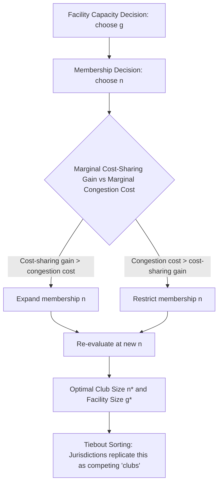

## Local Public Goods Provision and Congestion

### Definition and Core Concepts

A local public good is a good or service whose benefits are geographically bounded — nonrival (or partially rival) and nonexcludable (or costly to exclude) within a jurisdiction, but whose consumption value diminishes or vanishes outside the jurisdiction's spatial reach. Examples include local parks, municipal fire protection, local schools, street lighting, and neighborhood policing.

This differs from a pure public good (national defense, which is nonrival regardless of distance) in one essential way: **spatial decay of benefits**. Because benefits are place-specific, local public goods can be provided by decentralized (subnational) governments, and people can "vote with their feet" by choosing which jurisdiction to live in — this is the foundation of the Tiebout model.

A second key feature distinguishing local public goods from textbook pure public goods is **congestion** — the good is not perfectly nonrival. As more users (residents) share the good, the marginal utility each user derives falls, similar to a private good, at least beyond some threshold. This makes local public goods a distinct category: sometimes labeled "impure public goods" or "club goods" when combined with excludability.

### The Samuelson Condition and Its Local Modification

For a pure, non-congested public good, efficient provision requires the Samuelson condition: the sum of marginal rates of substitution (MRS) across all consumers equals the marginal rate of transformation (MRT):

$$\sum_{i=1}^{n} MRS_i = MRT$$

For a **congestible** local public good, this must be modified because utility depends not just on the quantity of the good $g$ but on quantity per capita, $g/n$, or more generally $g$ and population $n$ jointly. The efficiency condition becomes a two-part problem: optimal quantity of the good **and** optimal population (jurisdiction size) sharing it.

**Key Points**

- Pure public good: zero marginal congestion cost from an additional user
- Local public good with congestion: marginal cost of an additional user (in utility terms) is strictly positive and typically rising
- Optimal community size trades off cost-sharing gains (economies of scale in provision) against congestion losses

### The Buchanan Club Good Model

James Buchanan's 1965 "An Economic Theory of Clubs" formalizes the congestion problem. Consider a club good with fixed capacity, shared by membership $n$, financed by a per-member cost-sharing rule.

Let:

- $g$ = quantity/capacity of the facility
- $n$ = number of members (or users)
- $U(g, n)$ = utility of a representative member, with $U_g > 0$ and $U_n < 0$ (congestion: more members reduce utility, holding $g$ fixed)
- $C(g)$ = total cost of providing the facility

Each member's cost share (under equal division) is $C(g)/n$. The representative member's optimization problem is:

$$\max_{g,n} \; U\left(g, n\right) - \lambda \left[\frac{C(g)}{n}\right]$$

The two first-order conditions yield:

1. **Optimal facility size** (Samuelson-like condition, adjusted for a single "sharing" population):

   $$n \cdot \frac{\partial U/\partial g}{\partial U/\partial (\text{cost share})} = C'(g)$$

Intuitively: the sum of members' marginal benefits from added capacity equals marginal cost — same logic as Samuelson, but now bounded to a self-selected, finite membership.

2. **Optimal club size** (membership margin):

   $$\frac{\partial U/\partial n}{\partial U/\partial (\text{cost share})} = -\frac{\partial (C(g)/n)}{\partial n} = \frac{C(g)}{n^2}$$

This condition says: the club expands membership until the marginal congestion cost (in utility terms) borne by existing members from admitting one more member exactly equals the marginal reduction in each member's cost share from spreading fixed costs over more people.

**Key Points**

- Optimal club size balances **cost-sharing economies** (average cost falls as $n$ rises, since $C(g)$ is largely fixed) against **congestion diseconomies** (crowding falls utility as $n$ rises)
- This yields an interior optimum — the "optimal community size" — rather than either autarky (n=1) or universal membership ($n \to \infty$)
- The framework generalizes swimming pools, golf clubs, toll roads, and — crucially — entire municipalities as "clubs" over local public goods (Tiebout applies club theory to jurisdictions)

### Types of Congestion Functions

Congestion technology describes how utility or effective consumption changes with users, holding the good's quantity fixed. Three canonical cases:

**1. Pure Public Good (No Congestion)**

$$U = U(g)$$

Effective consumption is independent of $n$. Example: a lighthouse, national defense, broadcast television signal.

**2. Perfectly Congestible / Private-Good-Like**

$$U = U\left(\frac{g}{n}\right)$$

Effective consumption is $g$ divided equally among $n$ users — as if the good must be "shared out." Example: a fixed budget of teacher-hours divided among students (class size), water from a fixed-capacity reservoir.

**3. Partial (Impure) Congestion**

$$U = U\left(\frac{g}{n^{\gamma}}\right), \quad 0 < \gamma < 1$$

The parameter $\gamma$ (sometimes called the "congestion parameter" or "crowding parameter") measures the degree of rivalry:

- $\gamma \to 0$: approaches pure public good
- $\gamma \to 1$: approaches pure private good (equal division)
- Empirical work (e.g., on parks, roads, schools) generally estimates $\gamma$ between 0 and 1, varying by good

This formulation, associated with Edwards (1990) and others building on Buchanan, allows congestion intensity to be estimated empirically from cost or demand data — jurisdictions with higher $\gamma$ act more like private-good providers per capita; those with lower $\gamma$ enjoy larger scale economies from population growth.

### Road Congestion as a Special Case

Roads and highways are a paradigmatic local public good with congestion, central to urban economics. The relationship between traffic flow, speed, and density is captured by the **fundamental diagram of traffic flow**:

$$q = k \cdot v$$

where $q$ = flow (vehicles/hour), $k$ = density (vehicles/km), $v$ = speed (km/hour). As density rises, speed falls (due to driver interaction), producing an inverted-U flow-density relationship: flow rises with density up to a critical density $k_c$ (capacity), then falls as congestion sets in (stop-and-go conditions).

**Marginal external congestion cost**: each additional driver slows down all other drivers, imposing a cost that the individual driver does not internalize (a classic negative externality, distinct from club-good congestion but closely related mathematically). The private cost of a trip is:

$$c_p = c_p(q)$$

while the social marginal cost is:

$$c_s(q) = c_p(q) + q \cdot c_p'(q)$$

The second term, $q \cdot c_p'(q)$, is the externality — the increase in travel cost imposed on all other users by one additional traveler. Efficient congestion pricing (Pigouvian toll) sets the toll equal to this marginal external cost:

$$\tau^* = q^* \cdot c_p'(q^*)$$

**Example**

If average travel cost per driver is $c_p(q) = 10 + 0.002q$ (minutes, where $q$ is vehicles/hour), then:

- Total cost to all drivers: $TC(q) = q \cdot c_p(q) = 10q + 0.002q^2$
- Marginal social cost: $MSC(q) = 10 + 0.004q$
- Marginal external cost (toll): $\tau^*= 0.002q^*$ — exactly the gap between $MSC$ and $c_p$ at the efficient flow $q^*$, found where $MSC$ intersects the demand curve.

### Diagrammatic Representation: Congestible Public Good Equilibrium

### Optimal Jurisdiction Size and the Tiebout Connection

Charles Tiebout (1956) proposed that if consumers are mobile and jurisdictions offer differentiated bundles of local public goods and taxes, households will sort themselves ("vote with their feet") into jurisdictions matching their preferences — producing an efficient, market-like outcome for local public goods despite the standard free-rider problem in pure public good theory.

Congestion plays a critical stabilizing role in the Tiebout model:

- Without congestion, there is no natural limit to jurisdiction size, and a single large jurisdiction (or none, due to free-riding) could dominate
- With congestion, marginal cost of admitting new residents rises, providing a natural equilibrium jurisdiction size where marginal benefit (from spreading fixed costs, e.g., school infrastructure) equals marginal congestion cost (e.g., overcrowded classrooms)
- This produces a "head tax" or exclusionary mechanism, often implemented in practice through zoning (minimum lot sizes, building codes) that limits population inflow to preserve per-capita service quality

**Key Points**

- Tiebout equilibrium requires: (1) full mobility, (2) full information, (3) many jurisdictions, (4) no interjurisdictional externalities (spillovers), (5) an optimal-size mechanism (often zoning) constraining membership
- Congestion is the economic force that makes "optimal community size" a coherent, finite concept rather than an unbounded one
- [Inference] In practice, exclusionary zoning is frequently used as an imperfect substitute for a Buchanan-style optimal admission fee, since municipalities cannot easily charge new residents a Pigouvian entry toll

### Public Goods, Congestion, and Local Government Size — Formal Cost-Sharing Model

Consider $n$ identical households sharing a local public good costing $C(g)$, with per-capita tax share $t = C(g)/n$. Suppose utility is:

$$U = X + \alpha \ln(g) - \beta \left(\frac{n}{A}\right)$$

where $X$ is a private numeraire good, $\alpha$ captures marginal benefit from the public good, $\beta$ captures the marginal disutility of congestion, and $A$ is a scale parameter (e.g., land area, capacity).

- The household's indirect utility is maximized over $g$ and community membership choice, taking $n$, $A$ as constraints
- As $n$ rises, average cost per household $C(g)/n$ falls (cost-sharing benefit), but congestion disutility $\beta(n/A)$ rises
- Setting the derivative of net utility with respect to $n$ to zero yields the optimal population $n^*$

This is the formal skeleton behind decisions such as optimal school district size, optimal police precinct size, or optimal park catchment area — all recurring empirical applications in local public finance.

### Empirical Measurement of Congestion

Researchers estimate the congestion parameter $\gamma$ (or equivalent) using cost function or demand-based approaches:

**1. Cost Function Approach**

Estimate a cost function of the form:

$$C = f(g, n, z)$$

where $z$ are other cost shifters (wages, land prices). The elasticity of cost with respect to population, holding service quality constant, reveals the degree of congestion: an elasticity near 1 implies strong congestion (near-private-good behavior); an elasticity near 0 implies near-pure-public-good behavior.

**2. Demand/Hedonic Approach**

Using housing price capitalization (see Tiebout-Oates capitalization hypothesis): if local public goods are congestible, house prices in "less congested" jurisdictions (lower pupil-teacher ratios, more park space per capita) should be systematically higher, controlling for other amenities, since scarcity of the shared good is capitalized into property values.

**[Unverified]** Specific numerical congestion elasticities vary considerably by study, service type (education vs. parks vs. roads), and country context; there is no single universally-cited parameter value, so any specific number should be sourced to the particular study being cited.

### Illustration: Congestion Cost Curve (SVG)

<svg xmlns="http://www.w3.org/2000/svg" viewBox="0 0 620 380">
<text x="310" y="24" text-anchor="middle" font-size="16" font-weight="bold" fill="#1a1a1a">Congestion and Optimal Jurisdiction Size (svg_diagram)</text>

<line x1="70" y1="330" x2="580" y2="330" stroke="#333" stroke-width="2" />
<line x1="70" y1="330" x2="70" y2="50" stroke="#333" stroke-width="2" />
<text x="325" y="365" text-anchor="middle" font-size="13" fill="#333">Population / Membership (n)</text>
<text x="30" y="190" text-anchor="middle" font-size="13" fill="#333" transform="rotate(-90 30 190)">Cost / Benefit per capita</text>

<path d="M 100 70 C 200 150, 300 260, 560 310" stroke="#2166ac" stroke-width="2.5" fill="none" />
<text x="420" y="235" font-size="12" fill="#2166ac">Avg. cost per capita (falling)</text>

<path d="M 100 320 C 250 300, 400 180, 560 70" stroke="#b2182b" stroke-width="2.5" fill="none" />
<text x="400" y="130" font-size="12" fill="#b2182b">Marginal congestion cost (rising)</text>

<circle cx="345" cy="222" r="5" fill="#1a1a1a" />
<line x1="345" y1="222" x2="345" y2="330" stroke="#666" stroke-width="1.2" stroke-dasharray="4,3" />
<text x="345" y="345" text-anchor="middle" font-size="12" fill="#1a1a1a">n*</text>
<text x="360" y="215" font-size="12" font-weight="bold" fill="#1a1a1a">Optimal club/jurisdiction size</text>
</svg>

### Policy Instruments Addressing Congestion Externalities

**Key Points**

- **Congestion pricing / tolls**: internalize the marginal external cost of road use (e.g., London Congestion Charge, Singapore's Electronic Road Pricing, Stockholm congestion tax)
- **Zoning and land-use regulation**: indirectly manage local public good congestion (school crowding, park usage) by controlling population density and new development
- **User fees**: for club-like local goods (municipal pools, golf courses, toll roads) — direct pricing that approximates the Buchanan optimum
- **Impact fees / development exactions**: charge new development for the marginal cost it imposes on existing infrastructure capacity — an attempt to implement the Buchanan admission-fee logic at the municipal level
- **Capacity expansion**: increasing $g$ (school building expansion, road widening) rather than restricting $n$ — efficient only when the marginal cost of capacity is below the marginal congestion cost avoided; note the "induced demand" phenomenon in transportation, where added road capacity can increase $n$ (traffic volume) enough to offset congestion relief [Inference: this offset is well-documented empirically but its magnitude is context-dependent]

### Interaction with Fiscal Federalism

Local public goods and congestion connect directly to fiscal federalism through the **decentralization theorem** (Oates, 1972): decentralized provision of local public goods is efficient when (a) preferences are heterogeneous across jurisdictions, (b) there are no significant interjurisdictional spillovers, and (c) local governments can tailor quantity/quality to local congestion conditions and preferences, avoiding the welfare loss of uniform national provision.

Congestion reinforces the case for decentralization: if congestion costs vary by jurisdiction size and local governments can adjust both $g$ and effective admission (via zoning or local tax-benefit packages), decentralized provision better approximates the local Samuelson-Buchanan optimum than a centralized, one-size-fits-all provision level.

However, when congestion effects **spill over** jurisdictional boundaries (e.g., regional highway congestion, metro-area school choice, regional parks drawing non-resident users), this creates a rationale for regional or higher-tier government coordination, cost-sharing agreements, or Pigouvian corrective transfers between jurisdictions.

### Common Pitfalls and Misconceptions

**Key Points**

- Congestion is not the same as a negative externality in the strict Pigouvian sense when membership is voluntary and priced (club good) — it becomes an externality problem primarily when access is open/unpriced (e.g., open-access roads, unpriced parks)
- "Optimal community size" is not a single universal number — it depends on the specific good's cost function, congestion technology ($\gamma$), and population's willingness to pay
- Congestion does not imply the good should be privatized; even congestible goods can be efficiently provided publicly if properly priced or membership is properly managed (e.g., a public swimming pool with entry fees)
- Pure nonexcludability (cannot charge admission) combined with congestion (rivalry in use) produces the classic **"tragedy of the commons"** dynamic — distinct from the club good case where exclusion is feasible

**Next Steps**

- Tiebout model and its formal assumptions/critiques
- Median voter model in local public good provision
- Property tax capitalization and the Oates capitalization hypothesis
- Fiscal federalism and the decentralization theorem
- Intergovernmental grants and matching grant design
- Urban transportation economics and congestion pricing schemes
- Zoning as a fiscal instrument (exclusionary zoning, fiscal zoning)
- Optimal jurisdiction size and municipal consolidation/fragmentation debates
- Spillover effects and regional public goods coordination