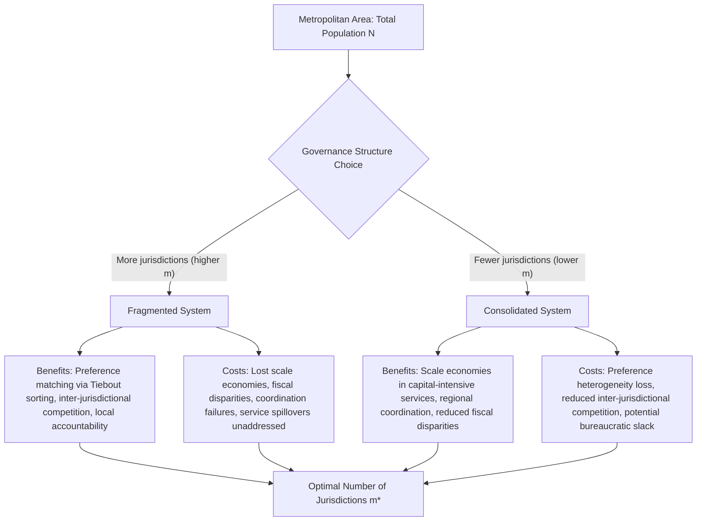

## Municipal Fragmentation and Consolidation

### Definition and Core Concepts

**Municipal fragmentation** refers to the division of a metropolitan area into multiple, independent local government units — municipalities, school districts, special districts — each with its own taxing and service-provision authority. **Municipal consolidation** (or amalgamation) refers to the merger of two or more such units into a single, larger jurisdiction.

The number of independent general-purpose and special-purpose governments within a metropolitan statistical area (MSA) is a standard fragmentation measure. High fragmentation is characteristic of many U.S. metro areas (e.g., Chicago, Pittsburgh); low fragmentation is more typical of consolidated city-county systems (e.g., Jacksonville-Duval, Nashville-Davidson, Louisville-Jefferson) and of many countries with fewer, larger local government tiers.

**Key Points**

- Fragmentation is measured using indices such as the number of governments per capita, the Herfindahl-Hirschman Index (HHI) of population shares across jurisdictions within an MSA, or metropolitan power diffusion indices
- Fragmentation is distinct from but related to *jurisdictional overlap* (e.g., overlapping school districts, water districts, and municipalities covering the same land area)
- The debate over fragmentation versus consolidation is the applied, real-world counterpart to the theoretical Tiebout-versus-scale-economies tradeoff

### Theoretical Foundations: Two Competing Traditions

**1. The Public Choice / Tiebout Tradition (Pro-Fragmentation)**

Building on Tiebout (1956) and extended by public choice scholars (Tiebout, Ostrom, Tiebout & Warren, Bish), fragmentation is viewed as beneficial because:

- It allows households to sort into jurisdictions matching heterogeneous preferences for local public goods and tax burdens ("voting with feet")
- Competition among many small jurisdictions disciplines local government (Leviathan-constraining hypothesis, formalized by Brennan and Buchanan, 1980) — fragmented systems have lower "exit costs," disciplining bureaucratic budget-maximization
- The polycentric governance view (Elinor Ostrom, Vincent Ostrom, Robert Warren, 1961) holds that overlapping, competing service providers within a metro area can be efficient, akin to a competitive market rather than requiring one monopoly provider

**2. The Reform / Consolidation Tradition (Pro-Consolidation)**

Building on early-20th-century municipal reform movements and formalized in public finance via economies of scale and externality arguments, consolidation is favored because:

- **Economies of scale** in service provision (e.g., fire, water, administration) reduce average costs as jurisdiction size grows, up to some optimal scale
- **Fiscal disparities and spillovers**: fragmentation permits wealthy areas to secede fiscally from poorer areas (via municipal incorporation or annexation avoidance), producing unequal access to local public goods — often analyzed through the "fiscal mercantilism" or exclusionary zoning literature
- **Coordination failures**: fragmented governance struggles to address regional public goods and externalities (transportation networks, environmental spillovers, regional economic development) requiring metro-wide coordination
- **Metropolitan government / regionalism** movements (e.g., Toronto's amalgamation in 1998, Louisville-Jefferson County merger in 2003) aim to capture these gains

### Formal Framework: Optimal Jurisdiction Number

Consider a metropolitan area with total population $N$ divided among $m$ jurisdictions of equal size $n = N/m$. Let per-capita cost of providing a local public good be:

$$AC(n) = \frac{F}{n} + c$$

where $F$ is a fixed cost component (economies of scale) and $c$ is constant marginal cost. Simultaneously, let heterogeneity costs — the welfare loss from pooling dissimilar preferences into one jurisdiction — rise with $m$ falling (fewer, larger, more heterogeneous jurisdictions):

$$HC(m) = h \cdot \left(\frac{N}{m}\right)^{\delta}, \quad \delta > 0$$

reflecting the idea that as jurisdictions grow (m falls, n rises), they must average across more heterogeneous preferences, generating a welfare loss analogous to a spatial "matching" cost (formally related to Alesina and Spolaore's 2003 theory of the size of nations).

Total social cost:

$$TC(m) = m \cdot AC(N/m) + HC(m)$$

The optimal number of jurisdictions $m^*$ minimizes $TC(m)$, trading off:

- **Scale economies** (favoring fewer, larger jurisdictions — lower $m$)
- **Preference-matching / heterogeneity costs** (favoring more, smaller jurisdictions — higher $m$)

This is structurally the same tradeoff as the Buchanan club-good congestion model, applied at the level of the entire local government rather than a single facility.

**Key Points**

- This framework is the theoretical backbone of the **"size of nations"** literature (Alesina and Spolaore) applied to local government
- Optimal $m^*$ shifts with technology: e.g., regional service-sharing agreements or special districts can partially capture scale economies without full consolidation, altering the tradeoff
- [Inference] In practice, most consolidation reform proposals implicitly claim heterogeneity costs are low relative to scale economies for the specific services being consolidated (e.g., water/sewer, transit), while proponents of fragmentation make the opposite claim for locally-sensitive services (e.g., schools, zoning)

### Empirical Evidence on Consolidation Outcomes

**1. Cost Savings**

Empirical findings on whether consolidation reduces per-capita spending are mixed and service-dependent:

- Services with substantial fixed infrastructure costs (water, sewer, waste treatment) tend to show clearer scale economies from consolidation
- General administrative/governance services show more modest or ambiguous savings; some studies find minimal or even negative effects on total spending post-consolidation, sometimes attributed to "leveling up" of wages and service standards to the higher pre-merger jurisdiction's level (an "harmonization" or "ratchet" effect)
- Police and fire services show U-shaped or inconclusive scale economy evidence depending on study and context

**[Unverified]** Specific percentage cost-savings figures cited for particular mergers (e.g., Louisville, Toronto, Indianapolis-Unigov) vary substantially by study methodology, time horizon, and which cost categories are included; general claims of "X% savings" from any specific merger should be sourced to the specific study being referenced rather than treated as a general law.

**2. Fragmentation and Regional Growth**

A separate empirical literature examines whether fragmentation affects metropolitan economic performance:

- Some studies find fragmentation associated with faster regional employment or population growth, consistent with the competitive-Tiebout view (competition constrains taxation, encourages efficiency)
- Other studies find fragmentation associated with greater income segregation, disparities in local public service quality (especially school funding, given reliance on local property taxes), and weaker regional coordination on infrastructure/transportation

**3. Racial and Economic Segregation**

A substantial literature (e.g., work by William Fischel, Myron Orfield, and others) documents that municipal fragmentation, especially combined with exclusionary zoning, facilitates income and racial sorting across jurisdictional lines, reinforcing disparities in local tax base and therefore local public good quality — a core critique of the pro-fragmentation view from an equity standpoint.

### Diagrammatic Representation: The Fragmentation-Consolidation Tradeoff

### Mechanisms and Institutional Forms Short of Full Consolidation

Because full consolidation is politically difficult, several intermediate institutional arrangements aim to capture scale-economy benefits while preserving some local autonomy:

**Key Points**

- **Special districts**: single-purpose governments (water, transit, fire protection districts) that span multiple municipal boundaries, capturing scale economies for specific services without full political merger
- **Councils of governments (COGs) / regional planning organizations**: voluntary coordination bodies for regional planning, especially transportation, without taxing authority
- **Interlocal service agreements / contracting**: municipalities contract with neighboring jurisdictions or counties for specific services (e.g., a small city contracting police services from the county) — sometimes called the "Lakewood Plan" model, originating in Los Angeles County
- **Tax-base sharing**: metro areas (e.g., the Twin Cities Fiscal Disparities Program in Minnesota, established 1971) pool a share of commercial/industrial tax base growth across municipalities to reduce fiscal disparities without consolidating governments
- **City-county consolidation**: merging city and county governments (partial or full) — the most common form of actual U.S. consolidation, distinct from merging multiple municipalities

### Political Economy of Consolidation Referenda

Consolidation typically requires voter approval via referendum, and empirical/theoretical work on why most consolidation proposals fail (historically, most U.S. city-county consolidation votes have failed) identifies key factors:

- **Distributional concerns**: residents of the (usually wealthier, lower-tax) suburban jurisdiction fear subsidizing the (usually higher-cost, higher-tax) central city post-merger — a median voter/redistribution concern
- **Loss of local control and identity**: smaller jurisdictions value autonomy over zoning, schools, and local service levels independent of cost considerations
- **Status quo bias and public employee opposition**: municipal employees and elected officials in jurisdictions slated for elimination may oppose consolidation for job-security and political-career reasons
- **Racial and political dynamics**: in the U.S., some consolidation proposals have historically been analyzed (and opposed) through the lens of diluting the political power of minority-majority central cities when merged into more racially heterogeneous or majority-white county populations

**Example**

The Louisville-Jefferson County, Kentucky merger (approved 2000, effective 2003) succeeded after a prior failed attempt, partly due to structural changes in the referendum design and a period of extensive prior functional consolidation of services (schools, health department) that reduced the perceived scope of change.

### Relationship to Fiscal Federalism and the Decentralization Theorem

The fragmentation-consolidation debate is the applied battleground for Oates' decentralization theorem: decentralization (fragmentation) is efficient when preference heterogeneity is high and spillovers are low; centralization (consolidation, or higher-tier coordination) is efficient when spillovers are significant and heterogeneity is low relative to scale-economy losses.

This connects directly to:

- **Congestion and club-good theory**: fragmentation is, in effect, an equilibrium outcome of many households and developers independently solving the Buchanan optimal-club-size problem via jurisdiction formation and secession (new incorporation of suburbs)
- **Property tax capitalization**: fragmented, high-amenity/low-tax jurisdictions capitalize their advantages into higher property values, reinforcing incentives for continued fragmentation ("fiscal zoning" equilibrium)
- **Intergovernmental grants**: as a policy alternative to consolidation, higher-tier governments (state, regional, or federal) can use matching or equalization grants to address spillovers and fiscal disparities without requiring jurisdictional merger — a common substitute where political consolidation is infeasible

### Common Pitfalls and Misconceptions

**Key Points**

- Consolidation does not automatically produce cost savings; outcomes depend heavily on which specific services are affected and pre-existing scale relative to the efficient scale for that service
- Fragmentation is not synonymous with inefficiency — under the Tiebout/public-choice view it can be allocatively efficient even though it may be inequitable
- "Number of governments" as a fragmentation metric conflates general-purpose governments (cities, counties) with special-purpose districts (school, water, fire) that serve very different functions and have different efficient scales — comprehensive fragmentation indices should ideally disaggregate by government type
- Full city-county consolidation is only one form of addressing fragmentation; partial/functional consolidation (shared services, tax-base sharing) may capture many benefits with fewer political costs

**Next Steps**

- Tiebout model and voting-with-feet mechanics
- Local public goods provision and congestion (club good theory)
- Property tax capitalization and the Oates hypothesis
- Fiscal federalism and the decentralization theorem
- Exclusionary zoning and fiscal zoning
- Intergovernmental grants: matching, block, and equalization grants
- Metropolitan governance models and regionalism
- Special district proliferation and service-specific scale economies
- Optimal jurisdiction size formal models (Alesina-Spolaore "size of nations" framework)