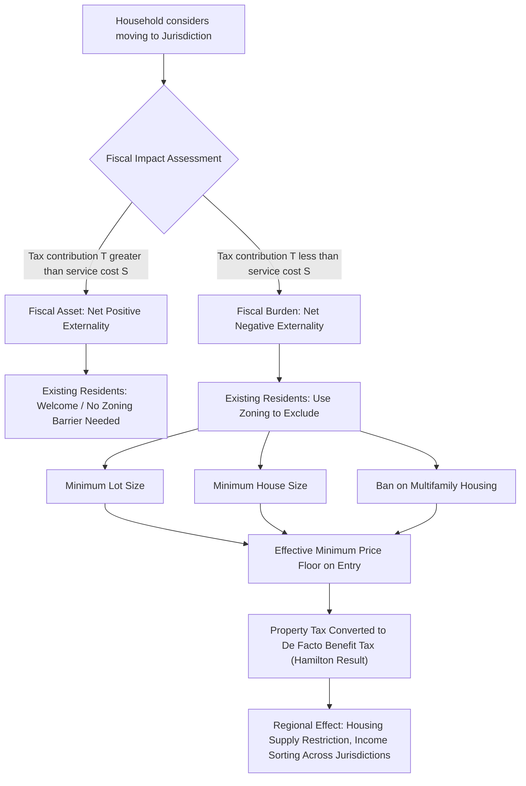

## Fiscal Zoning and Exclusionary Practices

### Definition and Core Concepts

**Fiscal zoning** refers to the use of land-use regulation by local governments to shape the composition of residents and property within a jurisdiction so as to maximize local fiscal benefits — i.e., to attract residents and development whose tax contributions exceed the cost of services they consume, while excluding those whose fiscal impact would be negative. **Exclusionary zoning** is the closely related practice of using land-use controls (minimum lot sizes, minimum floor areas, prohibitions on multifamily housing) to exclude lower-income households, often correlated with — but analytically distinct from — fiscal motivations, since exclusion can also stem from non-fiscal preferences (e.g., preserving neighborhood character, minimizing congestion, or discriminatory intent).

**Key Points**

- Fiscal zoning is a *rational municipal strategy* under a decentralized, property-tax-financed local government system with land-use control powers
- Exclusionary zoning is the *land-use instrument* through which fiscal zoning (and other exclusionary motives) is typically implemented
- Both concepts sit at the intersection of local public finance, urban economics, and land-use law

### Theoretical Origins: The Fiscal Externality Problem

In a system of many competing jurisdictions financed by local property taxes and providing local public goods (per the Tiebout framework), each new resident or housing unit generates a **fiscal externality**:

$$FE_i = T_i - S_i$$

where $T_i$ is the tax revenue contributed by household/unit $i$ and $S_i$ is the marginal cost of local public services (schools, infrastructure, public safety) consumed by that household. If $FE_i > 0$, the household is a **fiscal asset** (net contributor); if $FE_i < 0$, the household is a **fiscal burden** (net drain on existing residents).

Because property tax is typically levied on assessed value rather than actual service consumption, and because service costs (especially K-12 education) are strongly correlated with household size and income (not property value alone), lower-value housing units systematically tend to generate negative fiscal externalities, while high-value housing on modest land tends to generate positive ones.

Existing residents, acting as a **fiscal cartel**, have an incentive to use zoning powers to restrict new development to only fiscally-positive types — an application of Buchanan's club-good logic (see local public goods provision and congestion) where zoning functions as the *admission fee mechanism* a jurisdiction cannot otherwise charge directly.

**Key Points**

- This is formalized in the seminal Hamilton (1975) model, which shows that **with sufficiently strict and well-enforced fiscal zoning, a system of property-tax-financed jurisdictions can replicate the efficiency properties of a Tiebout equilibrium with head taxes** — because zoning effectively converts the property tax into a de facto benefit tax (a "head tax" tied to a minimum required housing consumption)
- Without such zoning, property taxation alone creates a "small-house" free-rider incentive: households want to consume the jurisdiction's public goods while minimizing their own assessed value contribution, undermining the Tiebout efficiency result

### The Hamilton Model (Formal Sketch)

Bruce Hamilton's 1975 model extends Tiebout by explicitly introducing property taxation and zoning. Let:

- $V$ = house value (proxy for both consumption of housing and tax base)
- $t$ = local property tax rate
- $g$ = local public good level, financed by $t \cdot \sum V_i$

Without zoning, a household's tax bill is $tV$, but its service consumption may be relatively fixed (e.g., roughly equal school costs per pupil regardless of house value) — creating an incentive to under-consume housing (build a smaller/cheaper house) while free-riding on services financed by neighbors' higher tax payments.

**With zoning** that imposes a minimum lot size or minimum house value $\bar{V}$, the local government effectively converts the property tax into a benefit tax:

$$tV \geq t\bar{V} = \text{minimum required contribution} \approx \text{cost of services provided}$$

This restores the Tiebout-efficiency property: each household's tax payment approximates the marginal cost of the local public goods it consumes, because zoning prevents "cheap-riding" by mandating a minimum fiscal contribution as the price of entry.

**[Inference]** The Hamilton result is a theoretical benchmark demonstrating *how* zoning can restore efficiency under property tax finance; it does not by itself establish that real-world zoning practice achieves this efficiency benchmark, since real zoning is also shaped by non-fiscal motives, political economy distortions, and exclusionary intent unrelated to efficient cost-recovery.

### Mechanisms of Exclusionary Zoning

**Key Points**

- **Minimum lot size requirements**: mandate large parcels (e.g., 1+ acre zoning), raising the effective minimum cost of a housing unit and excluding buyers below that price point
- **Minimum floor area / house size requirements**: mandate a minimum square footage, similarly raising minimum unit cost
- **Prohibition or restriction of multifamily housing**: single-family-only zoning excludes apartments, duplexes, and other higher-density, typically lower-cost housing types
- **Impact fees and exactions**: charge new development for infrastructure costs, which — while sometimes efficient cost-internalization (see local public goods provision and congestion) — can also function as an exclusionary barrier when set above marginal cost
- **Building codes and design standards**: minimum architectural or construction standards that raise costs beyond safety/quality justifications
- **Growth controls and urban growth boundaries**: caps on the rate or location of new development, restricting supply and raising prices

### Efficiency vs. Equity: Two Interpretations of Fiscal Zoning

**1. The Efficiency View (Hamilton/Fischel Tradition)**

William Fischel's extensive body of work (e.g., *The Homevoter Hypothesis*, 2001) argues that zoning is best understood as a rational response by "homevoters" — homeowners whose largest asset is their house — to protect and enhance property values, which serve as a proxy for the capitalized value of local public goods and amenities. Under this view:

- Zoning that limits negative fiscal externalities is welfare-enhancing for the community internalizing costs that would otherwise be borne by existing residents
- The property tax capitalization mechanism (see property tax capitalization) gives residents strong incentives to monitor and control land use for collective fiscal benefit
- This is efficient from the *jurisdiction's* perspective but can be inefficient from a *regional or societal* perspective if it merely displaces low-income households to other jurisdictions rather than reducing regional housing costs

**2. The Equity/Exclusion Critique**

A substantial literature critiques exclusionary zoning as generating regionally and socially inefficient and inequitable outcomes:

- **Housing affordability**: aggregate restriction of housing supply across many jurisdictions in a metro area raises regional housing prices and constrains overall housing supply elasticity — directly connecting to the "housing supply constraints" literature (Glaeser, Gyourko, and others)
- **Economic segregation**: fiscal zoning sorts households by income across jurisdictions, concentrating low-income households (and often, correlated with income, racial minorities) in jurisdictions with weaker tax bases and lower-quality local public goods, particularly schools
- **Reduced labor mobility and agglomeration losses**: [Inference] restrictive zoning in high-productivity metro areas may reduce migration toward high-wage labor markets, imposing aggregate output losses — this is a growing area of urban/macro research (e.g., work by Hsieh and Moretti estimating GDP losses from housing constraints in high-productivity cities), though magnitude estimates vary across studies and specifications and should be treated as actively debated empirical estimates rather than settled figures

### Diagrammatic Representation: Fiscal Zoning Mechanism

### Empirical Evidence

- Studies using zoning stringency indices (e.g., the Wharton Residential Land Use Regulatory Index, WRLURI) generally find a positive association between zoning restrictiveness and both housing prices/rents and income segregation across jurisdictions within metro areas
- Historical analyses document exclusionary zoning's institutional lineage from earlier explicitly race-based zoning ordinances (ruled unconstitutional in *Buchanan v. Warley*, 1917) and racially restrictive covenants (ruled unenforceable in *Shelley v. Kraemer*, 1948), with later facially race-neutral fiscal/exclusionary zoning sometimes documented as serving similar exclusionary functions in practice
- **[Unverified]** The precise quantitative contribution of zoning restrictiveness to any specific metro area's housing price growth or segregation level depends heavily on the empirical methodology, control variables, and time period of a given study, and estimates should be attributed to their specific source rather than cited as universal figures

### Legal and Policy Context

**Key Points**

- U.S. constitutional treatment: *Village of Euclid v. Ambler Realty Co.* (1926) established the general constitutionality of zoning as a valid exercise of police power; subsequent case law (e.g., New Jersey's *Mount Laurel* doctrine, beginning 1975) has, in some states, required municipalities to provide a "fair share" of regional affordable housing, directly targeting exclusionary zoning's regional effects
- State-level zoning reform efforts (e.g., statewide upzoning laws, accessory dwelling unit legalization, elimination of single-family-only zoning in some California and Oregon jurisdictions in the late 2010s–2020s) represent policy responses aimed at reducing exclusionary zoning's regional housing-supply effects
- Inclusionary zoning (mandating or incentivizing affordable unit set-asides in new development) is a distinct, opposite-direction policy tool sometimes used to counteract exclusionary outcomes, though its own efficiency and supply effects are separately debated in the literature

### Relationship to Other Local Public Finance Topics

- **Local public goods and congestion**: fiscal/exclusionary zoning is the real-world mechanism by which jurisdictions implement the Buchanan optimal-club-size admission constraint when a direct price/tax on membership is not feasible
- **Municipal fragmentation**: exclusionary zoning is both a cause and consequence of fragmentation — more jurisdictions allow more fine-grained fiscal sorting, and fiscal sorting incentives encourage new municipal incorporation to avoid diluting an existing tax base with lower-value development
- **Property tax capitalization**: the value of exclusionary zoning to existing residents operates precisely through capitalization — restricted supply and controlled fiscal composition raise the price of existing housing stock
- **Fiscal federalism / decentralization theorem**: exclusionary zoning represents a potential failure mode of decentralization when local optimization (protecting local tax base) generates negative externalities on the broader region (housing affordability, segregation) not internalized by the zoning jurisdiction

### Common Pitfalls and Misconceptions

**Key Points**

- Fiscal zoning and racial/discriminatory exclusionary zoning are analytically distinct but empirically and historically intertwined; a rigorous treatment should not conflate the two, though it should acknowledge their documented historical relationship
- Zoning that internalizes genuine marginal cost differences (e.g., impact fees calibrated to actual infrastructure cost) is not necessarily inefficient — the efficiency question is whether restrictions are calibrated to true marginal costs or set well above them for exclusionary rent-extraction purposes
- "Local efficiency" (from the perspective of the zoning jurisdiction and its current homeowners) and "regional/social efficiency" (from the perspective of the metro area or society) can diverge sharply — a jurisdiction-level welfare gain from restrictive zoning can coexist with a net regional welfare loss
- Not all zoning restrictiveness is fiscally motivated; environmental, congestion, and aesthetic/preference-based motives for land-use regulation exist independently and should not automatically be attributed to fiscal exclusion

**Next Steps**

- Property tax capitalization and the Oates hypothesis
- Local public goods provision and congestion (Buchanan club good model)
- Municipal fragmentation and consolidation
- The Tiebout model and its assumptions/critiques
- Housing supply elasticity and land-use regulation (Glaeser-Gyourko framework)
- Fiscal federalism and the decentralization theorem
- Inclusionary zoning and affordable housing mandates
- Agglomeration economies and spatial misallocation of labor (Hsieh-Moretti framework)