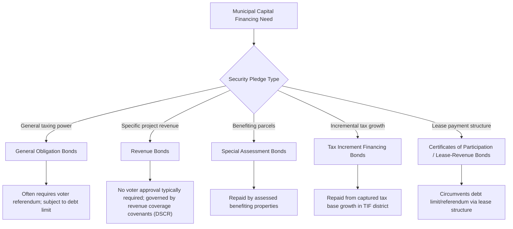

## Municipal Debt and Infrastructure Finance

### Definition and Core Concepts

Municipal debt (or subnational/local government debt) refers to borrowing by local governments — cities, counties, school districts, and special districts — to finance capital investments, primarily infrastructure with long useful lives (roads, water/sewer systems, schools, public buildings, transit). The economic rationale for debt finance rests on **intergenerational equity** and **benefit-cost matching**: capital projects generate benefits over many years, so financing them through long-term debt spreads the repayment burden across the generations of residents who benefit, rather than requiring current taxpayers to bear the full upfront cost via pay-as-you-go (PAYGO) financing.

**Key Points**

- Municipal debt is distinct from national government debt in key respects: most U.S. states impose constitutional or statutory debt limits and balanced-budget requirements on local governments (unlike the federal government); municipalities generally cannot monetize debt via central bank financing; and local governments face harder market discipline since they lack currency-issuing authority
- The "golden rule" of public finance — borrow only to finance capital investment, not current operating expenditure — is the normative benchmark against which municipal debt practices are typically evaluated
- Municipal debt finance is a core application of decentralization theory: it enables local governments to smooth large, lumpy capital costs matched to a benefit stream extending over time, analogous to how local public goods provision matches costs to a spatially-bounded beneficiary population

### The Benefit-Cost Matching (Intergenerational Equity) Rationale

The theoretical case for debt-financing infrastructure rests on matching the **timing of costs to the timing of benefits**. Consider a capital project with cost $K$ providing a constant flow of benefits $b$ per period for $T$ years. Under PAYGO, current residents pay the full cost $K$ even though future residents (who move in over subsequent years) receive benefits without having contributed to construction — a violation of the benefit principle.

Debt financing with an annual debt service payment $D$ solves this via an amortization schedule:

$$K = \sum_{t=1}^{T} \frac{D_t}{(1+r)^t}$$

where $r$ is the interest rate on the debt. If debt service $D_t$ is roughly constant over the life of the asset and financed by property or other local taxes on residents in each period $t$, then residents in each period pay roughly in proportion to the benefits they receive — approximating a benefit tax across generations, matching the same benefit-tax logic that underlies Tiebout efficiency and property tax capitalization models.

**Key Points**

- This logic implies debt maturity should roughly match the useful life of the financed asset (e.g., 20-30 year bonds for schools/buildings, shorter maturities for equipment)
- Financing operating expenditures with debt (rather than capital) violates the matching principle since operating costs benefit only current residents, and is generally prohibited or discouraged by state balanced-budget rules and rating agency practice
- [Inference] In practice, the degree to which municipal debt structuring actually achieves precise intergenerational cost-benefit matching depends heavily on specific amortization schedules and local political incentives, which can deviate from the theoretical benchmark (e.g., "back-loading" debt service to defer costs to future officials/taxpayers)

### Types of Municipal Bonds

**1. General Obligation (GO) Bonds**

Backed by the full faith, credit, and taxing power of the issuing government — typically secured by a pledge to levy property taxes as needed to meet debt service. GO bonds generally carry the lowest interest rates among municipal debt instruments because of this broad security pledge, though this default assumption should be checked against the specific issuer's credit profile.

- Usually require voter approval (bond referendum) in many U.S. states, reflecting the direct claim on general tax revenue
- Subject to state and local constitutional/statutory debt limits (often expressed as a percentage of assessed property value)

**2. Revenue Bonds**

Secured solely by revenue generated by the specific project financed (e.g., water/sewer utility revenues, toll road revenues, airport landing fees) rather than general tax power.

- Do not typically require voter approval and are often exempt from general debt limit calculations, since they are not backed by the general taxing power
- Carry higher risk (and thus generally higher yields) than GO bonds, since repayment depends on project-specific revenue performance rather than the government's full taxing authority
- Governed by a **bond indenture** or "flow of funds" structure requiring project revenues to cover operating expenses, debt service, and reserve requirements in a specified priority order — commonly analyzed via the debt service coverage ratio (DSCR):

$$DSCR = \frac{\text{Net operating revenue}}{\text{Annual debt service}}$$

Rating agencies and bond covenants typically require a minimum DSCR (often in the range of 1.2x–1.5x, though specific covenant thresholds vary by issuer and bond series) to ensure a margin of safety.

**3. Special Assessment / Tax Increment Financing (TIF) Bonds**

- **Special assessment bonds**: repaid via assessments levied on properties that directly benefit from the improvement (e.g., a new sidewalk or local drainage project), a direct application of the benefit principle at the parcel level
- **Tax increment financing bonds**: repaid from the incremental increase in property tax revenue generated within a designated TIF district after redevelopment, betting that the project itself will generate the tax base growth needed to repay the debt — a mechanism connecting directly to property tax capitalization theory, since it relies on the assumption that public investment capitalizes into higher assessed values

**4. Certificates of Participation (COPs) and Lease-Revenue Bonds**

Used to finance projects (often buildings or equipment) via a lease structure, where investors receive a share of lease payments made by the government for use of the asset — often employed specifically to circumvent constitutional debt limits or voter-approval requirements applicable to GO debt, since technically the government is not "borrowing" but "leasing."

**Key Points**

- **[Inference]** The proliferation of lease-revenue and COP structures is generally interpreted in the public finance literature as a response to binding debt limits and voter-approval requirements — a form of fiscal "workaround" — though the degree to which this reflects legitimate financing innovation versus circumvention of voter accountability is a normatively contested question in the literature

### Diagrammatic Representation: Municipal Bond Types and Security Structure

### Municipal Debt Limits and Fiscal Rules

Most U.S. states impose constraints on local government borrowing, reflecting concerns about moral hazard, intergenerational cost-shifting, and the absence of federal-style monetary backstops for subnational governments:

- **Constitutional/statutory debt limits**: often expressed as a maximum ratio of outstanding debt to assessed property value (e.g., commonly in the low single-digit percentages, though the specific ceiling varies by state and should be checked against the jurisdiction in question)
- **Voter referendum requirements**: for GO bond issuance in many states, requiring public approval (sometimes supermajority) before incurring general obligation debt
- **Balanced budget requirements**: nearly universal among U.S. states for local government *operating* budgets (capital budgets financed by debt are typically treated separately)
- **State oversight/approval mechanisms**: some states require state-level review or approval of local debt issuance above certain thresholds, or impose fiscal monitoring/receivership regimes for financially distressed localities

These rules exist because local governments, unlike national governments, cannot issue debt in a currency they control and cannot resort to monetary financing — making credible fiscal rules and market discipline the primary safeguards against unsustainable borrowing.

### Tax-Exempt Status and the Municipal Bond Market (U.S. Context)

A defining institutional feature of the U.S. municipal bond market is the federal income tax exemption on interest earned from most municipal bonds (under Internal Revenue Code provisions), which:

- Lowers the borrowing cost for state/local governments relative to taxable debt, since investors accept a lower nominal yield in exchange for tax-exempt income
- Creates an implicit federal subsidy to local infrastructure investment, the value of which depends on the marginal tax rates of bond purchasers and market segmentation between tax-exempt and taxable investors
- The equilibrium tax-exempt yield $y_{te}$ relative to a comparable taxable yield $y_t$ for an investor facing marginal tax rate $\tau$ satisfies (in a simple arbitrage-free benchmark):

$$y_{te} = y_t (1 - \tau)$$

though actual tax-exempt/taxable yield ratios in practice diverge from this simple formula due to differences in credit risk, liquidity, market segmentation, and the marginal investor's tax rate — so this should be treated as a theoretical benchmark rather than a precise empirical prediction.

**[Unverified]** Specific current-market tax-exempt/taxable yield spreads and any particular numerical ratio should be verified against current market data rather than assumed constant, since they fluctuate with monetary policy, tax law changes, and credit market conditions.

### Credit Ratings and Market Discipline

Municipal bonds are rated by credit rating agencies (Moody's, S&P, Fitch) based on factors including:

- Debt burden relative to tax base and revenue
- Economic and demographic trends of the issuer (population growth/decline, income levels, employment diversification)
- Fiscal management practices (reserve fund levels, pension/OPEB liability funding status, budget balance history)
- Legal security structure of the specific bond (GO vs. revenue, covenant strength)

Higher-rated (lower risk) issuers borrow at lower interest rates, providing an ex-ante market-based fiscal discipline mechanism, complementing formal debt limits. Historical municipal bankruptcy and default cases (e.g., Detroit's 2013 Chapter 9 bankruptcy, Puerto Rico's debt restructuring under PROMESA beginning 2016, Orange County California's 1994 bankruptcy from investment losses) illustrate both the real risk of municipal fiscal distress and the specific legal/institutional mechanisms (Chapter 9 municipal bankruptcy under U.S. federal law, state receivership regimes) available for resolving it.

### Pension and OPEB Liabilities as Implicit Debt

**Key Points**

- Unfunded pension liabilities and other post-employment benefits (OPEB, primarily retiree healthcare) represent a major and often less transparent form of long-term local government financial obligation, economically similar to debt though structured differently
- The appropriate discount rate for valuing these liabilities is a significant, actively debated methodological question: using an expected-return-on-assets discount rate (common in actuarial practice, often higher) produces smaller reported liabilities than using a risk-free/low-risk discount rate (favored by financial economists, who argue that guaranteed pension benefits should be discounted at a rate reflecting their low risk, not the risk of the assets backing them) — this is a genuinely contested methodological debate in the public finance literature, not a settled question
- Underfunded pension obligations can crowd out capital investment and constrain a municipality's genuine debt capacity even when formal debt limits appear unconstrained, since rating agencies and markets increasingly price in total fixed-cost burden (debt service plus required pension/OPEB contributions)

### Infrastructure Finance Alternatives to Traditional Debt

**1. Public-Private Partnerships (P3s)**

Private entities finance, build, and sometimes operate infrastructure in exchange for a revenue stream (tolls, availability payments from government, or both) over a concession period — shifting some construction and demand risk to the private partner in exchange for a return, and moving the financing off the government's traditional debt ledger (though economically, long-term availability-payment obligations function similarly to debt).

**2. Impact Fees and Development Exactions**

Charge new development for the marginal infrastructure capacity it requires (see also fiscal zoning and exclusionary practices, and local public goods provision and congestion) — a pay-as-you-grow alternative that shifts infrastructure cost onto new residents/development rather than existing taxpayers or general debt.

**3. Grants-in-Aid from Higher-Tier Governments**

State and federal capital grants (e.g., federal transportation formula/discretionary grants, state infrastructure revolving funds) supplement or substitute for local debt issuance, particularly for infrastructure with regional or national spillover benefits — connecting to the fiscal federalism literature on matching grants correcting for interjurisdictional externalities.

### Relationship to Other Local Public Finance Topics

- **Local public goods and congestion**: debt-financed capacity expansion is one of the two primary margins (along with membership/zoning restriction) for addressing congestion in club-good models
- **Property tax capitalization**: infrastructure investment (financed by debt but repaid via future property taxes) capitalizes into property values, in principle allowing current residents to partially recoup costs at time of sale even under long-maturity debt structures
- **Municipal fragmentation**: numerous small, fragmented jurisdictions each independently accessing debt markets may forgo economies of scale in both infrastructure provision and debt issuance costs (larger, pooled issuances typically achieve lower per-unit issuance costs) — a further scale-economy argument in the consolidation debate
- **Fiscal federalism**: debt limits and market discipline on subnational borrowing are a core feature distinguishing decentralized fiscal systems from centralized ones, and are central to the broader "soft budget constraint" literature examining whether local governments expect bailouts from higher-tier governments (which, if expected, undermines market discipline)

### Common Pitfalls and Misconceptions

**Key Points**

- Municipal debt is not inherently fiscally irresponsible; used to finance genuine long-lived capital assets, it is the theoretically efficient financing mechanism under the benefit-cost matching principle
- Debt limits expressed relative to assessed property value can create incentives for financing structures (leases, COPs, TIF) specifically designed to fall outside the statutory definition of "debt," which may reduce transparency without necessarily reducing the government's true long-term fiscal obligations
- Revenue bonds are not risk-free simply because they are not backed by general tax power; project-specific revenue risk (e.g., toll road traffic below projections) is a well-documented source of municipal revenue bond distress
- Tax increment financing's effectiveness depends on the "but-for" assumption that redevelopment would not have occurred without the subsidy — a frequently contested empirical claim in specific TIF district evaluations, not a given

**Next Steps**

- Property tax capitalization and the Oates hypothesis
- Local public goods provision and congestion
- Fiscal federalism and the decentralization theorem
- Intergovernmental grants: matching, block, and equalization grants
- Municipal fragmentation and consolidation
- Tax increment financing district evaluation methodology
- Public-private partnerships in infrastructure delivery
- Pension and OPEB liability valuation methodology debates
- Municipal bankruptcy and fiscal distress resolution mechanisms (Chapter 9, state receivership)