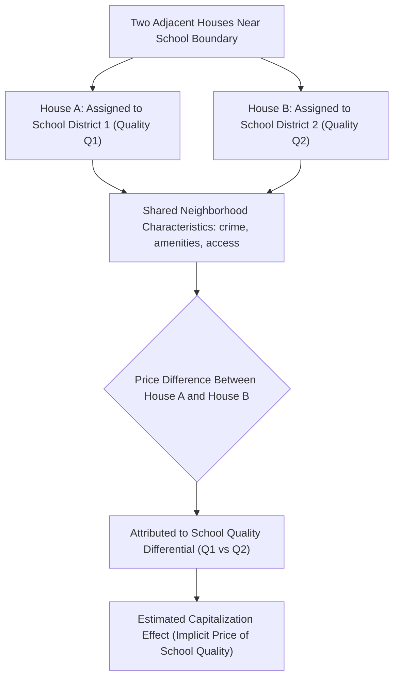

## School Quality Capitalization and Tiebout Sorting

### Definition and Core Concepts

**School quality capitalization** refers to the incorporation of expected local public school quality into residential property values — households pay a price premium to live within the attendance boundary of higher-quality schools, holding other housing and neighborhood characteristics constant. **Tiebout sorting** in this context refers to the mechanism by which households with different preferences and willingness to pay for school quality self-select into different school districts or attendance zones, generating (and being reinforced by) the capitalization effect.

**Key Points**

- School quality capitalization is the most extensively studied empirical application of the broader property tax capitalization and Tiebout sorting literatures, because school district/attendance boundaries provide unusually sharp, measurable discontinuities in a key local public good
- The phenomenon connects three theoretical strands: Tiebout's voting-with-feet model, hedonic pricing theory (Rosen, 1974), and property tax/public good capitalization theory (Oates, 1969)
- Because school funding in many countries (especially the U.S.) relies heavily on local property taxes, capitalization and sorting interact with fiscal zoning to produce self-reinforcing dynamics between school quality, property values, and tax base

### Theoretical Framework: Hedonic Pricing and Capitalization

Under the hedonic pricing framework, a house's price $P$ is a function of its bundle of characteristics:

$$P = f(\text{structural characteristics}, \text{neighborhood characteristics}, Q, t)$$

where $Q$ represents school quality and $t$ represents the local property tax rate. The **implicit price** (or marginal willingness to pay) for school quality is:

$$\frac{\partial P}{\partial Q} = MWTP_Q$$

Oates' original 1969 capitalization hypothesis specifically models this as the joint capitalization of both public good benefits and tax costs: a jurisdiction offering higher $Q$ at a given $t$ (or the same $Q$ at lower $t$) should command a house price premium, since a home buyer is implicitly purchasing a bundled claim on both the tax liability stream and the local public good benefit stream.

**Key Points**

- If the housing market and Tiebout sorting operate efficiently, the capitalized value of the school quality premium should approximate the present value of the WTP for the quality differential across the expected duration of consuming that school system's services
- Renters do not directly capture capitalization gains, meaning school capitalization primarily benefits property owners — a wealth-distributional consequence distinct from any first-order allocative efficiency question
- [Inference] The degree of capitalization observed empirically is often interpreted as a joint test of both the value households place on school quality *and* the extent to which local land/housing markets and zoning constraints allow this value to be reflected in prices rather than absorbed through other margins (e.g., school choice programs, private school substitution)

### Identification Challenges and the Boundary Discontinuity Design

A central empirical challenge is that school quality is correlated with numerous other neighborhood characteristics (crime rates, housing stock age, amenities, socioeconomic composition) that independently affect house prices, making simple cross-sectional regressions of price on school quality subject to substantial omitted variable bias.

The dominant modern empirical strategy is the **boundary discontinuity design**, pioneered in this context by Black (1999) and extended by numerous subsequent studies:

- Identify houses located on opposite sides of a school attendance zone boundary but otherwise in close physical proximity
- Compare prices of houses just inside versus just outside the boundary, on the logic that neighborhood amenities, access to employment centers, and most locational characteristics vary smoothly across space, while school assignment changes discretely at the boundary
- The estimated capitalization effect is the price differential attributable to the discrete change in assigned school, net of smoothly-varying locational characteristics

$$P_i = \alpha + \beta \cdot Q_{\text{assigned school}} + \gamma X_i + \delta \cdot \text{Boundary FE} + \epsilon_i$$

where $X_i$ are house-specific structural controls and boundary fixed effects absorb neighborhood-level unobservables shared by houses near the same boundary segment.

**Key Points**

- Black's original design used standardized test scores as the school quality measure and found statistically significant capitalization, with an implicit price for school quality that was smaller in magnitude than naive cross-sectional (non-boundary) estimates — indicating substantial omitted variable bias in simpler specifications
- **[Unverified]** Specific numerical capitalization magnitudes (e.g., "$X per standard deviation increase in test scores" or "X% higher price") vary considerably across studies, time periods, metro areas, and choice of school quality measure, and any specific figure cited should be attributed to its source study rather than treated as a universal parameter
- The boundary discontinuity approach has since been extended using variation from school district boundary redrawing, school closures, and information shocks (e.g., publication of school ratings/report cards) as complementary identification strategies

### Diagrammatic Representation: Boundary Discontinuity Design Logic

### Interaction with Tiebout Sorting

Capitalization and sorting are mutually reinforcing in equilibrium:

1. **Sorting drives capitalization**: households with high WTP for school quality bid up prices in high-quality districts, sorting themselves by income/preference into those districts (a direct application of the Tiebout mechanism, with school quality as a primary sorting dimension)
2. **Capitalization reinforces sorting**: once high school quality is capitalized into higher home prices, entry into that district requires a higher minimum housing expenditure, functioning as an implicit fiscal zoning mechanism (see fiscal zoning and exclusionary practices) that further sorts by income even absent explicit exclusionary regulation
3. **Feedback to school quality itself**: since school quality is often correlated with the socioeconomic composition and funding base of enrolled students (through peer effects and local tax base), income sorting driven by capitalization can further widen quality differentials across districts, creating a self-reinforcing cycle sometimes described in the literature as "opportunity hoarding" or a "sorting equilibrium trap"

**Key Points**

- This dynamic is central to debates over school finance equalization: state-level school finance reforms (equalizing per-pupil funding across districts) are partly motivated by concerns that local-tax-based funding combined with capitalization/sorting perpetuates unequal educational opportunity along income and, correlated with it historically, racial lines
- [Inference] Empirical evaluations of school finance equalization reforms (e.g., following state supreme court funding-equity rulings in various U.S. states) generally examine effects on both student achievement gaps and property value convergence/divergence across previously unequal districts, though findings on magnitude and persistence vary by state, reform design, and study

### School Finance Equalization and Its Effect on Capitalization

When a state shifts from local-property-tax-based school funding toward state-level equalized funding (reducing the link between local tax base and local school spending), the theoretical prediction is a **reduction in the school-quality-driven component of house price variation across districts within the state**, since the fiscal advantage of living in a high-tax-base district for school funding purposes is diminished.

Empirical work examining equalization reforms (e.g., following California's Serrano v. Priest-driven reforms, and subsequent studies of other state reforms) generally tests this prediction by comparing capitalization magnitudes before and after equalization, or comparing capitalization patterns in equalized versus non-equalized states.

**[Unverified]** Whether equalization fully eliminates capitalization differentials (versus non-fiscal channels of school quality difference, such as peer composition or district management quality persisting independent of funding) is an empirically contested question that varies by study and reform context; general claims about the magnitude of this effect should reference specific studies.

### Related Empirical Extensions

**Key Points**

- **School choice and capitalization**: expansion of public school choice programs, charter schools, or voucher systems can weaken the link between residential location and school assignment, theoretically reducing the incentive for location-based sorting and capitalization — an active area of ongoing empirical research
- **Information shocks**: studies exploiting the introduction or change of publicly available school quality metrics (e.g., standardized test score reporting systems, school "report cards") find capitalization effects respond to changes in *information* about quality, separate from changes in actual quality — evidence that capitalization partly reflects information frictions and salience, not just underlying school performance
- **Racial composition and capitalization**: a distinct but related empirical literature examines capitalization of school/neighborhood racial composition independent of measured academic quality, connecting to broader housing discrimination and segregation literatures — a sensitive and extensively studied area where care is needed to distinguish quality-based sorting from discriminatory preferences in interpretation

### Relationship to Other Local Public Finance Topics

- **Property tax capitalization (Oates hypothesis)**: school quality capitalization is the leading empirical application and test case of the general Oates capitalization framework
- **Fiscal zoning and exclusionary practices**: minimum lot/house size zoning in high-quality school districts is a direct mechanism reinforcing income-based sorting into those districts, compounding the capitalization effect
- **Municipal fragmentation**: the number and boundary configuration of independent school districts within a metro area directly shapes the scope for school-quality-based Tiebout sorting — more, smaller districts allow finer-grained sorting
- **Local public goods and congestion**: school capacity/class size is itself a congestible local public good (see local public goods provision and congestion), meaning capitalization reflects not just measured quality outputs (test scores) but underlying capacity/congestion conditions

### Common Pitfalls and Misconceptions

**Key Points**

- Naive (non-boundary, non-quasi-experimental) cross-sectional correlations between school test scores and house prices substantially overstate the causal capitalization effect due to omitted neighborhood-quality variables — this is a well-established methodological point, not merely a theoretical caveat
- Capitalization of school quality does not, by itself, imply causal impact of schools on student outcomes; it reflects household beliefs and willingness to pay, which may be based on peer composition, perceived safety, or reputation rather than a school's actual value-added contribution to learning
- Full capitalization is not automatic or guaranteed; the extent of capitalization depends on housing supply elasticity, information availability to buyers, and the binding nature of attendance-zone boundaries (e.g., open enrollment or extensive private school options can weaken the link between residential location and school access)
- School quality capitalization interacts with, but is analytically distinct from, general local public good capitalization (parks, public safety, etc.) — school effects are typically the largest and most extensively documented component of local public good capitalization in the empirical literature, but not the only one

**Next Steps**

- Property tax capitalization and the Oates hypothesis
- Fiscal zoning and exclusionary practices
- Local public goods provision and congestion
- Municipal fragmentation and consolidation
- School finance equalization reforms and their effects
- Hedonic pricing methodology in urban economics
- Boundary discontinuity design as an empirical identification strategy
- Racial and income segregation in metropolitan housing markets