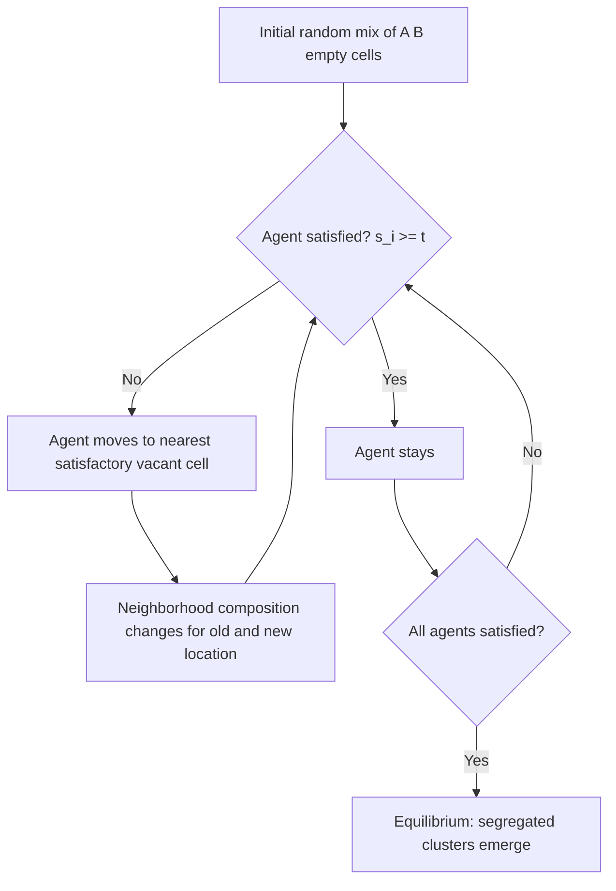

## Residential Segregation Models

### Overview

Residential segregation models formalize how households sort across urban space by race, ethnicity, income, or other characteristics, producing spatially uneven settlement patterns even when explicit discrimination is absent. This body of theory spans agent-based simulation (Schelling's model), general equilibrium sorting frameworks (Tiebout-style and discrete choice models), and empirical measurement (segregation indices). The models matter for urban economics because segregation interacts with neighborhood effects, local public goods provision, school quality, labor market access, and the persistence of poverty concentration.

### Schelling's Model of Segregation

#### Core Setup

Thomas Schelling's (1971) model is the foundational agent-based framework. Consider a grid (checkerboard) representing a city, populated by two types of agents (e.g., Type A and Type B) with some empty cells. Each agent has a **tolerance threshold** $t$: the minimum fraction of same-type neighbors required to be "satisfied" with its current location.

An agent at a location with neighborhood composition $s_i$ (share of same-type neighbors among occupied adjacent cells) is satisfied if:

$$s_i \geq t$$

Unsatisfied agents relocate to the nearest (or a random) vacant cell where the threshold is met.

#### Key Points

- **Mild individual preferences produce extreme aggregate segregation.** Even when $t$ is as low as 0.3 (agents only want 30% same-type neighbors), the equilibrium outcome is often near-complete segregation, because individual relocation decisions generate positive feedback loops.
- **Tipping points**: Once a neighborhood's minority share crosses a critical threshold, it can rapidly "tip" toward homogeneity as satisfied agents become dissatisfied and leave, triggering further departures.
- **Emergence**: Aggregate segregation is an *emergent property* not directly intended by any individual agent — no one in the model has a preference for total segregation, yet that is the typical outcome.
- **Path dependence**: The specific segregation pattern (which neighborhoods end up which type) depends on the random initial configuration and the order of moves, not just on parameters.

#### Simplified Simulation Logic

```plaintext
1. Initialize grid with agents of Type A, Type B, and empty cells (random placement)
2. For each occupied cell, compute same-type neighbor share s_i
3. If s_i < t (dissatisfied):
     - Add agent to a "move" list
4. For each agent in the move list:
     - Relocate to a random vacant cell satisfying s_i >= t (or nearest satisfactory cell)
5. Repeat steps 2-4 until no agent wishes to move (equilibrium) or max iterations reached
```

#### Example

Suppose a $10 \times 10$ grid has 40 Type A agents, 40 Type B agents, and 20 vacant cells, with $t = 0.375$ (each agent wants at least 3 of 8 neighbors to be same-type). Simulations of this class typically converge within 20–30 iterations to large monochromatic clusters, with segregation indices far exceeding what the 37.5% threshold alone would suggest — illustrating the non-linear, self-reinforcing dynamic.

#### Diagram: Schelling Dynamics



### Formal Extensions of Schelling's Model

#### Bounded-Neighborhood vs. Global Models

- **Local (Moore/von Neumann neighborhood) models**: Satisfaction depends only on immediate adjacent cells (the classic version).
- **Global/spatial-proximity models**: Satisfaction depends on a weighted function of the entire city, with influence decaying with distance, often modeled as:

$$s_i = \frac{\sum_{j \neq i} w_{ij} \, \mathbb{1}[\text{type}_j = \text{type}_i]}{\sum_{j \neq i} w_{ij} \, \mathbb{1}[j \text{ occupied}]}$$

where $w_{ij}$ is a distance-decay weight (e.g., $w_{ij} = 1/d_{ij}$).

#### Asymmetric Preferences

Real-world calibrations (e.g., using General Social Survey or American National Election Studies data) often find asymmetric thresholds — majority and minority groups report different tolerance levels for out-group neighbors. Introducing group-specific thresholds $t_A \neq t_B$ changes tipping-point dynamics and can generate segregation even when one group is fully tolerant, if the other group has a high threshold.

#### Stochastic and Search-Cost Variants

- **Stochastic satisficing**: Agents move with probability increasing in dissatisfaction rather than deterministically, smoothing dynamics and avoiding artificial lock-in from grid artifacts.
- **Search frictions**: Limiting the set of vacant cells an agent can observe/consider (bounded search radius) slows convergence and can produce more heterogeneous, less starkly segregated long-run states — connecting agent-based segregation models to search-theoretic housing market models.

### Discrete Choice and Sorting Models

#### Tiebout Sorting

Charles Tiebout's (1956) "voting with your feet" framework treats residential choice as driven by local public goods and tax bundles. Households sort into jurisdictions offering their preferred combination of local taxes $\tau_j$ and public good provision $G_j$. While not explicitly about racial/ethnic segregation, Tiebout sorting generates **income segregation** when public goods are funded by property taxes and are normal goods, since higher-income households sort into jurisdictions with higher $G_j$ and correspondingly higher $\tau_j$.

#### Random Utility / Discrete Choice Models

Modern empirical segregation models (following Bayer, Ferreira, and McMillan, and related work) specify household $i$'s utility from neighborhood $j$ as:

$$U_{ij} = X_j \beta + \alpha \cdot (\text{demographic composition}_j) + \delta_j + \epsilon_{ij}$$

where:

- $X_j$: observable neighborhood attributes (schools, housing stock, amenities)
- demographic composition term: captures preferences for own-group share (Schelling-type sorting motive, but now estimated rather than assumed)
- $\delta_j$: neighborhood fixed effect capturing unobserved quality (e.g., housing prices net of composition)
- $\epsilon_{ij}$: idiosyncratic taste shock, typically Type I Extreme Value (yielding a multinomial/nested logit choice probability)

The choice probability under a logit specification:

$$P_{ij} = \frac{\exp(X_j\beta + \alpha \cdot \text{comp}_j + \delta_j)}{\sum_{k} \exp(X_k\beta + \alpha \cdot \text{comp}_k + \delta_k)}$$

**[Inference]** Estimating $\alpha$ separately from housing price capitalization requires an instrumental variable strategy (e.g., using historical settlement patterns or exogenous shocks to composition), since neighborhood composition is endogenous to unobserved neighborhood quality — a key empirical challenge distinguishing these models from simpler descriptive Schelling simulations.

### Measuring Segregation: Indices

#### Dissimilarity Index (D)

The most widely used measure, capturing evenness of distribution across sub-city units:

$$D = \frac{1}{2} \sum_{i=1}^{N} \left| \frac{a_i}{A} - \frac{b_i}{B} \right|$$

where $a_i$, $b_i$ are populations of groups A and B in tract $i$, and $A$, $B$ are citywide totals. $D$ ranges from 0 (perfect integration) to 1 (complete segregation) and represents the share of one group that would need to relocate to achieve an even distribution.

#### Isolation Index

Measures the probability that a member of group A shares a tract with another member of group A, capturing exposure rather than evenness:

$$_xP_x^* = \sum_{i=1}^{N} \left( \frac{a_i}{A} \right) \left( \frac{a_i}{t_i} \right)$$

where $t_i$ is total tract population.

#### Other Measures

- **Interaction index**: Analogous to isolation but measures exposure of group A to group B.
- **Entropy/Theil's H index**: Decomposable across geographic scales (e.g., between-tract vs. between-city), useful for multi-group (not just binary) segregation.
- **Spatial proximity/clustering indices** (e.g., White's index): Account for the *spatial arrangement* of tracts, not just their population shares — two cities with identical $D$ can differ if segregated tracts are contiguous (forming large ghettos) versus scattered.

#### Key Points

- **Checkerboard problem**: Classic aspatial indices like $D$ treat administrative units as unrelated points in space, missing whether segregated units are adjacent, which biases comparisons across cities with different tract geographies.
- **Modifiable Areal Unit Problem (MAUP)**: Index values are sensitive to the choice of geographic aggregation (tract vs. block vs. block group), so cross-study comparisons require consistent geographic units.

### Discrimination-Based Models

#### Statistical Discrimination in Housing/Neighborhood Choice

Distinct from taste-based (Schelling) sorting, some models incorporate **statistical discrimination**, where landlords, real estate agents, or lenders use race/ethnicity as a proxy for unobserved risk (e.g., creditworthiness), generating segregation through supply-side channels independent of household preferences.

#### Institutional and Historical Mechanisms

**[Unverified — historically documented but effect sizes vary by study]** Empirical urban economics also emphasizes historically embedded institutional mechanisms that shaped and locked in segregation patterns:

- **Redlining**: 1930s Home Owners' Loan Corporation (HOLC) risk maps that graded neighborhoods partly on racial composition, influencing decades of subsequent mortgage lending and property values.
- **Racial covenants**: Legally enforceable (until *Shelley v. Kraemer*, 1948) deed restrictions preventing sale to specified racial groups.
- **Exclusionary zoning**: Minimum lot sizes, single-family-only zoning, and density restrictions that indirectly segregate by income (and correlated race/ethnicity) by pricing out lower-income households from certain jurisdictions.

These mechanisms interact with Schelling-style dynamics: initial segregation imposed by institutional forces can become self-sustaining even after formal barriers are removed, because the tipping-point dynamic locks in existing patterns.

### Neighborhood Effects and Feedback Loops

Segregation models connect to the broader poverty/inequality literature through feedback mechanisms:

$$\text{Segregation} \rightarrow \text{Concentrated poverty} \rightarrow \text{Reduced local public good quality (schools, safety)} \rightarrow \text{Reduced economic mobility} \rightarrow \text{Reinforced sorting}$$

This is closely tied to Chetty and Hendren-style intergenerational mobility research, where neighborhood of childhood residence is found to have causal effects on adult outcomes, providing an empirical rationale for why segregation modeling matters beyond static allocative concerns.

### Diagram: Segregation Model Taxonomy (svg_diagram)

<svg xmlns="http://www.w3.org/2000/svg" viewBox="0 0 900 480" font-family="Arial, sans-serif">
<text x="450" y="30" font-size="18" font-weight="bold" text-anchor="middle">Residential Segregation Models (svg_diagram)</text>
<rect x="30" y="60" width="380" height="160" rx="10" fill="#e8f0fe" stroke="#3b5bdb" stroke-width="1.5" />
<text x="220" y="85" font-size="15" font-weight="bold" text-anchor="middle">Preference-Based (Demand Side)</text>
<text x="50" y="115" font-size="13">• Schelling agent-based model</text>
<text x="50" y="140" font-size="13">• Tolerance thresholds &amp; tipping points</text>
<text x="50" y="165" font-size="13">• Discrete choice / random utility sorting</text>
<text x="50" y="190" font-size="13">• Tiebout local public goods sorting</text>
<rect x="490" y="60" width="380" height="160" rx="10" fill="#fdeee8" stroke="#c9481f" stroke-width="1.5" />
<text x="680" y="85" font-size="15" font-weight="bold" text-anchor="middle">Supply/Institution-Based</text>
<text x="510" y="115" font-size="13">• Statistical discrimination (lending, leasing)</text>
<text x="510" y="140" font-size="13">• Redlining &amp; historical mortgage policy</text>
<text x="510" y="165" font-size="13">• Racial covenants (pre-1948)</text>
<text x="510" y="190" font-size="13">• Exclusionary zoning</text>
<rect x="255" y="260" width="390" height="120" rx="10" fill="#eafaf1" stroke="#2f9e44" stroke-width="1.5" />
<text x="450" y="285" font-size="15" font-weight="bold" text-anchor="middle">Measurement</text>
<text x="280" y="315" font-size="13">• Dissimilarity index (D) — evenness</text>
<text x="280" y="340" font-size="13">• Isolation / interaction index — exposure</text>
<text x="280" y="365" font-size="13">• Entropy (Theil's H), spatial proximity indices</text>
<line x1="220" y1="220" x2="380" y2="260" stroke="#555" stroke-width="1.5" marker-end="url(#arrow)" />
<line x1="680" y1="220" x2="520" y2="260" stroke="#555" stroke-width="1.5" marker-end="url(#arrow)" />
<rect x="255" y="410" width="390" height="55" rx="10" fill="#fff3bf" stroke="#e67700" stroke-width="1.5" />
<text x="450" y="443" font-size="13.5" text-anchor="middle">Outcome: Neighborhood effects on mobility, schooling, poverty concentration</text>
<line x1="450" y1="380" x2="450" y2="410" stroke="#555" stroke-width="1.5" marker-end="url(#arrow)" />
</svg>

### Policy Implications

- **Mobility vouchers** (e.g., Moving to Opportunity experiments): Directly counteract segregation-driven poverty concentration by subsidizing moves to lower-poverty neighborhoods, though take-up and destination choice are themselves shaped by search frictions and information constraints similar to those in discrete choice sorting models.
- **Inclusionary zoning**: Mandates or incentivizes mixed-income development, directly targeting the supply-side mechanisms of segregation.
- **Fair housing enforcement**: Targets statistical/taste-based discrimination in the rental and sales markets, addressing supply-side segregation.
- **[Inference]** Because Schelling dynamics show that segregation can re-emerge from mild individual preferences even after policy intervention removes institutional barriers, purely one-time interventions (e.g., a single wave of vouchers) are less likely to produce durable integration than sustained, structural changes to housing supply and information frictions — though the persistence of any given intervention's effects is an empirical question specific to context.

### Related Topics

- Neighborhood effects and intergenerational mobility (Chetty-Hendren research designs)
- Housing discrimination and fair lending (HMDA data, audit studies)
- Exclusionary zoning and land-use regulation
- Spatial mismatch hypothesis (jobs-housing spatial disconnect)
- Gentrification and neighborhood change models
- School choice and residential sorting interactions
- Moving to Opportunity and housing mobility programs
- Multi-group segregation and entropy-based decomposition methods