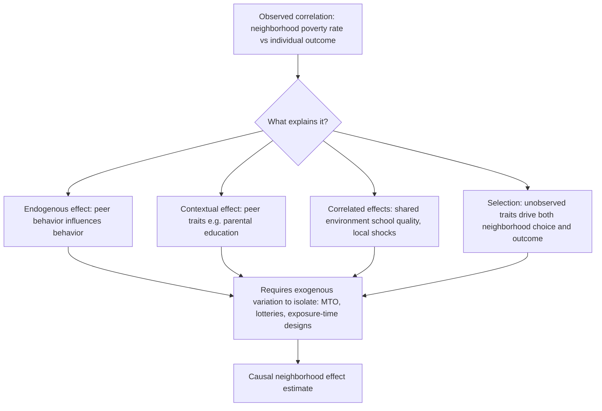

## Neighborhood Effects and Social Interactions

### Overview

Neighborhood effects models study how the characteristics of a residential area — its poverty rate, racial composition, peer behaviors, institutional quality — causally affect individual outcomes such as educational attainment, earnings, health, and criminal behavior, over and above an individual's own characteristics. This literature sits at the intersection of urban economics, labor economics, and social interactions theory, and is central to understanding why segregation and poverty concentration matter, not merely how they arise. The core empirical challenge throughout is causal identification: individuals sort into neighborhoods based on unobserved traits correlated with outcomes, so naive correlations between neighborhood characteristics and individual outcomes conflate causal effects with selection.

### The Reflection Problem

#### Manski's Formalization

Charles Manski (1993) identified the **reflection problem**: in observational data, it is generally impossible to separately identify whether an individual's behavior is influenced by group behavior (endogenous effect), by group *characteristics* (contextual/exogenous effect), or by shared environmental factors (correlated effects).

Manski's linear-in-means framework specifies individual $i$'s outcome in group $g$ as:

$$y_i = \alpha + \beta \, \bar{y}_{-i,g} + \gamma \, \bar{x}_{-i,g} + \delta \, x_i + \epsilon_i$$

where:

- $\bar{y}_{-i,g}$: mean outcome of group $g$ excluding $i$ (endogenous social effect, coefficient $\beta$)
- $\bar{x}_{-i,g}$: mean characteristics of group $g$ excluding $i$ (contextual/exogenous effect, coefficient $\gamma$)
- $x_i$: individual's own characteristics
- $\epsilon_i$: individual error, potentially correlated within group (correlated effects, e.g., shared local shocks)

#### Key Points

- **The reflection problem**: Because $\bar{y}_{-i,g}$ is itself a function of $\bar{x}_{-i,g}$ in equilibrium (everyone's outcome depends on everyone else's), $\beta$ and $\gamma$ are not separately identified without additional structure or instruments — the group mean outcome "reflects" the group mean characteristics like a mirror.
- **Three distinct mechanisms often confounded**:
  - *Endogenous effects*: "My behavior changes because my peers' behavior changed" (e.g., peer contagion in delinquency)
  - *Contextual effects*: "My behavior changes because of my peers' fixed traits" (e.g., peer parental education)
  - *Correlated effects*: "We behave similarly because we face the same environment" (e.g., same school quality, same local labor market shocks) — not a genuine social interaction at all
- **[Inference]** Policy relevance differs sharply by mechanism: if effects are purely endogenous (multiplier-style), small interventions targeting a few individuals can have amplified aggregate effects via social multipliers; if effects are purely correlated, individual-level relocation does nothing and only changing the shared environment matters.

### Identification Strategies

#### Instrumental Variables and Nonlinear Restrictions

Manski showed that if the relationship is genuinely nonlinear (e.g., group composition enters through a nonlinear function distinct from how individual outcomes aggregate), separate identification becomes possible in principle, though this requires strong functional-form assumptions that are themselves hard to justify a priori.

#### Randomized and Quasi-Experimental Designs

Because observational sorting confounds neighborhood effects with selection, the literature has increasingly relied on exogenous variation in neighborhood exposure:

- **Moving to Opportunity (MTO)**: A large-scale randomized housing mobility experiment (mid-1990s, five U.S. cities) that randomly assigned housing vouchers (some restricted to low-poverty areas, some unrestricted, plus a control group), directly randomizing neighborhood exposure and breaking the sorting-selection link.
- **Public housing demolition and lottery-based assignment**: Natural experiments from waitlist lotteries for public/subsidized housing, or from housing demolitions forcing relocation, used as instruments for neighborhood exposure.
- **Sibling and twin fixed-effects designs**: Comparing siblings who grow up in the same family but experience different neighborhood exposure durations (e.g., due to family moves), differencing out family-level unobservables.
- **Boundary discontinuity designs**: Comparing households on either side of a school district or jurisdiction boundary, holding broader regional factors roughly constant while composition/policy discretely changes.

#### The Chetty-Hendren Research Design

Raj Chetty and Nathaniel Hendren's work (using linked tax and Census data) exploits variation in the **age at which children move** to different-quality commuting zones, alongside comparisons of siblings who move at different ages, to estimate childhood exposure effects. Their key finding: each additional year spent in a better neighborhood during childhood improves adult outcomes roughly linearly, consistent with an **exposure-time model**:

$$E[y_i \mid \text{moved at age } a] \approx \alpha + \beta_{cz} \cdot (18 - a)$$

where $\beta_{cz}$ is a commuting-zone-specific "causal effect per year of exposure," and $(18-a)$ is remaining childhood years in the destination neighborhood.

#### Key Points

- This **exposure-time / dosage model** distinguishes neighborhood effects research from cross-sectional correlational studies by using *within-family, within-child* variation in *how long* a child is exposed rather than simply *whether* a family lives in a given area.
- Findings using this design show substantial **heterogeneity by neighborhood characteristics** — factors robustly correlated with better children's outcomes include lower poverty rates, greater racial integration, better school quality proxies, higher two-parent family shares, and (per some studies) greater social capital/civic engagement — but correlation with any single simple mechanism remains actively debated.

### The Moving to Opportunity (MTO) Findings

#### Short-Run vs. Long-Run Effects

Initial MTO evaluations (roughly 4–7 years post-move) found limited effects on adult economic outcomes (earnings, employment) for those who had already reached working age, but meaningful improvements in mental health, safety perceptions, and some outcomes for young girls.

Later long-term follow-up (Chetty, Hendren, and Katz, 2016), using tax records into adulthood, found that children who moved to lower-poverty neighborhoods **before age 13** had significantly higher earnings, higher college attendance rates, and lower rates of single parenthood as adults, compared to children in the control group — while those who moved as teenagers saw little or even negative effects (partly attributed to disruption costs of moving during adolescence).

#### Key Points

- **Critical age/sensitive period effect**: The MTO long-run results are interpreted as evidence for a sensitive developmental window during which neighborhood environment has outsized long-run effects — a finding that reframes how policymakers think about the *timing*, not just the *existence*, of mobility interventions.
- **Compliance and take-up**: MTO experienced substantial non-compliance (many voucher recipients didn't move, or moved but didn't stay), requiring instrumental-variables (Local Average Treatment Effect) approaches using randomized assignment as an instrument for actual neighborhood exposure.

### Social Interaction Mechanisms

#### Peer Effects in Education and Crime

Social interaction models identify specific channels through which neighborhoods transmit effects:

- **Role model / aspiration effects**: Exposure to successful adults (in employment, education) shapes children's own aspirations and perceived returns to effort — often modeled as shifting a child's subjective probability of success from a given action.
- **Social network / job information effects**: Neighborhoods function as information networks; access to employed neighbors can improve job-finding rates, distinct from direct human capital effects — closely tied to the "spatial mismatch" and social capital literatures.
- **Peer contagion in risky behavior**: Delinquency, substance use, and teen pregnancy show peer-effect patterns consistent with local social multipliers, where an individual's likelihood of engaging in a behavior rises with the local prevalence of that behavior among similarly-aged peers.
- **Collective efficacy and informal social control**: Sampson, Raudenbush, and Earls's (1997) concept describing a neighborhood's capacity for mutual trust and willingness to intervene for the common good, empirically linked to lower rates of violence independent of poverty and residential instability.

#### Social Multiplier Effects

When endogenous effects ($\beta$ in the linear-in-means model) are positive, an individual-level policy intervention (e.g., a program raising one person's educational investment) generates a **social multiplier**: the aggregate effect across the group exceeds the sum of individual direct effects, because each person's increase further raises the group mean, feeding back to further increases. Formally, if $\beta$ is the endogenous peer effect coefficient, the social multiplier for a shock $\Delta x$ affecting all members equally is approximately:

$$\text{Multiplier} = \frac{1}{1 - \beta}$$

**[Inference]** This implies that even modest estimated peer effects can generate substantial aggregate impacts of group-level policies (e.g., neighborhood-wide interventions) relative to individually-targeted programs of similar per-capita cost, though the magnitude depends critically on accurately estimating $\beta$ net of the reflection problem's confounds.

### Diagram: Identification Challenge in Neighborhood Effects

### Empirical Measurement Approaches

#### Linked Administrative Data

Modern neighborhood effects research (notably the Opportunity Insights group led by Chetty) leverages large linked administrative datasets — IRS tax records matched to Census geography — enabling outcome tracking (adult earnings, college attendance, incarceration) at fine geographic resolution (Census tract) across nearly the full population, a major advance over survey-based studies limited by small samples and self-reported outcomes.

#### The "Opportunity Atlas" Approach

Constructs tract-level estimates of causal upward mobility effects by regressing children's adult outcomes on the set of tracts they lived in during childhood, weighted by exposure duration, netting out family-level fixed effects — operationalizing the exposure-time model at national scale.

#### Key Points

- **[Unverified — precise magnitudes vary by cohort and specification]** Neighborhood-level causal mobility estimates from this literature suggest substantial variation even *within* metro areas and even across neighborhoods with similar poverty rates, implying poverty rate alone is an incomplete proxy for "opportunity."
- **Assumption of exogenous mobility timing conditional on family/tract fixed effects**: This research design's validity rests on the assumption that, conditional on fixed effects, the specific age at which a family happens to move is not driven by anticipated changes in the child's trajectory — a identifying assumption examined via robustness checks (e.g., testing for pre-trends).

### Distinguishing Neighborhood Effects from Individual/Family Effects

#### Key Points

- **Family fixed effects**: The dominant strategy for netting out unobserved parental characteristics (motivation, wealth, genetics) that could independently explain both residential sorting and child outcomes.
- **Placebo/falsification tests**: Common robustness checks include testing whether neighborhood quality predicts outcomes for children who never actually lived there (should show no effect) or whether effects appear only for exposure occurring *before* the outcome-relevant age (should show no anticipatory effect).
- **Behavioral variation across studies**: [Behavior may vary] The magnitude and even sign of estimated neighborhood effects differ across studies depending on outcome measured (earnings vs. test scores vs. health), age range studied, and time period/labor market context, so results should not be treated as a single universal parameter.

### Policy and Theoretical Implications

- **Mixed-income housing development**: Policy rationale draws directly from neighborhood-effects research suggesting that reducing concentrated poverty (rather than merely providing housing subsidies) improves outcomes — though the exposure-time and age-sensitivity findings imply that policy timing (targeting families with young children) may matter as much as neighborhood choice itself.
- **Place-based vs. people-based policy debate**: A long-standing question in urban economics is whether policy should improve *neighborhoods* (place-based: infrastructure, schools, policing) or help *people move* (people-based: vouchers, mobility counseling) — the neighborhood-effects literature informs but does not fully resolve this debate, since both approaches show effects contingent on design and implementation details.
- **School assignment and residential effects interaction**: Because school quality is often bundled with neighborhood residence (through attendance zones), disentangling "neighborhood effects" from "school effects" remains an active research frontier, with boundary discontinuity designs used to separate the two.

### Next Steps

- Manski's linear-in-means model and formal identification conditions
- Moving to Opportunity experimental design and long-run tax-record follow-up studies
- Opportunity Insights / Chetty-Hendren commuting zone mobility estimates
- Collective efficacy theory (Sampson, Raudenbush, Earls)
- Social capital and neighborhood job-information networks
- Peer effects in education (classroom vs. neighborhood peer groups)
- Place-based policy design (Empowerment Zones, Promise Zones)
- Spatial mismatch hypothesis and its relationship to neighborhood effects