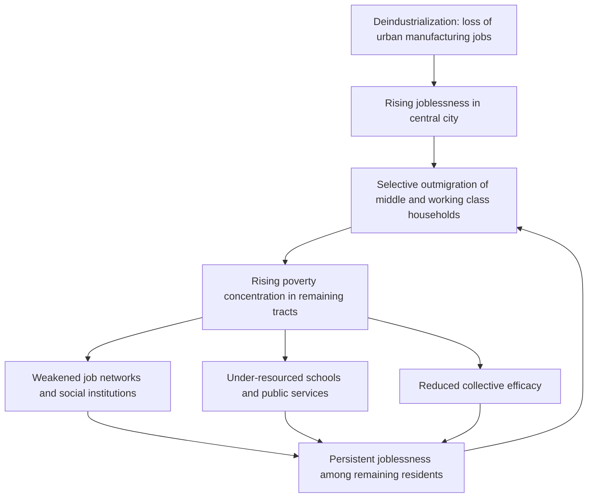

## Concentrated Urban Poverty

### Overview

Concentrated urban poverty refers to the geographic clustering of poor households into high-poverty neighborhoods, typically defined as census tracts where 40% or more of residents live below the federal poverty line ("extreme poverty" tracts), distinct from the *aggregate* poverty rate of a city or region. The distinction matters because two cities can have identical overall poverty rates while differing dramatically in how spatially concentrated that poverty is — and concentration itself is theorized and empirically shown to generate additional harms beyond individual-level poverty, through the neighborhood-effects and social-interaction mechanisms it interacts with.

### Defining and Measuring Concentration

#### Standard Thresholds

- **High-poverty tract**: 20% or more of residents below the poverty line (used in some studies as a lower-bound threshold)
- **Extreme-poverty / concentrated-poverty tract**: 40% or more of residents below the poverty line (the threshold popularized by William Julius Wilson and used in most concentrated-poverty literature)
- **Concentration of poverty index**: The share of a metro area's or city's *poor population* (not total population) living in high-poverty tracts, distinguishing "how many poor people are there" from "how clustered are they":

$$\text{CP} = \frac{\text{Poor population in tracts with poverty rate} \geq 40\%}{\text{Total poor population in metro area}}$$

#### Key Points

- **CP can rise even when the poverty rate falls**, and vice versa — concentration and level are analytically and empirically distinct dimensions of urban poverty.
- **Racial disparity in concentration**: Across decades of U.S. Census and American Community Survey data, Black and Hispanic poor populations have consistently exhibited substantially higher concentration-of-poverty rates than white poor populations, a pattern linked directly to residential segregation dynamics (see Residential Segregation Models) rather than to differences in poverty rates alone.
- **Non-linearity**: A tract that moves from 35% to 41% poverty is treated categorically differently under the 40% threshold, even though the underlying change may be continuous — a measurement artifact researchers address using continuous poverty-rate specifications alongside threshold-based ones.

### Historical Trajectory (United States)

#### Key Points

- **1970s–1990s rise**: Concentrated poverty rose sharply in U.S. central cities from the 1970s through the early 1990s, driven by a combination of deindustrialization, suburbanization of jobs and middle-class households (including middle-class Black flight following fair housing legislation), and declining low-skill urban labor demand.
- **1990s decline**: Concentrated poverty fell substantially during the strong labor market of the late 1990s, a pattern widely interpreted as evidence that macroeconomic/labor-demand conditions are a first-order driver of concentration, not merely a background factor.
- **2000s–2010s resurgence**: [Unverified — figures vary by data vintage and metro definition] Following the early-2000s recession and especially the 2008 financial crisis, the population living in extreme-poverty tracts rose again, with research (e.g., from the Brookings Institution and Urban Institute) documenting substantial increases in the number of high-poverty tracts and notably an expansion of concentrated poverty into **suburban** areas, not just central cities — a departure from the mid-20th-century inner-city-poverty paradigm.

### Wilson's Structural Framework

#### The Truly Disadvantaged (1987)

William Julius Wilson's foundational account attributes concentrated urban poverty to the interaction of:

1. **Deindustrialization**: Loss of manufacturing employment in central cities, eliminating stable, moderate-skill jobs historically accessible to urban Black workers.
2. **Selective outmigration**: Following the end of legally enforced segregation, middle- and working-class Black families gained the ability to move to better neighborhoods, leaving behind increasingly poor, jobless, and socially isolated inner-city populations — a mechanism termed **selective outmigration** or "skimming."
3. **Social isolation**: The resulting neighborhoods lack the social buffers (employed role models, mainstream job networks, institutional resources) that previously existed even in poor but economically mixed Black communities.
4. **Concentration effects**: The interaction of joblessness, family structure change, and weakened institutions in a spatially concentrated setting produces effects that exceed the sum of individual disadvantages — closely paralleling the "endogenous" and "contextual" social-interaction channels discussed in neighborhood-effects models.

#### Key Points

- Wilson's framework was influential precisely because it combined a **structural economic explanation** (deindustrialization, spatial mismatch) with a **compositional/sorting explanation** (selective outmigration), avoiding purely culturalist or purely individualist accounts of urban poverty.
- **Spatial mismatch hypothesis** (Kain, 1968) is a closely related and often-paired framework: it holds that suburbanization of low-skill jobs, combined with housing discrimination and inadequate transit connecting central-city residents to suburban job centers, independently depresses employment outcomes for inner-city minority residents.

### Mechanisms Linking Concentration to Outcomes

#### Labor Market Channels

- **Weak employment networks**: In neighborhoods with low employment rates, job information transmitted through informal social networks (a primary job-finding channel for lower-skill workers) is correspondingly scarce.
- **Employer statistical discrimination by address**: [Inference] Employers may use neighborhood of residence as a signal correlated with (perceived) productivity or reliability, a channel sometimes termed "geographic" or "zip code" discrimination, though isolating this effect from other confounds (e.g., school quality, criminal justice contact) in observational data is methodologically difficult.
- **Reduced access to job growth areas**: Consistent with the spatial mismatch hypothesis, concentrated-poverty tracts are often located far (in travel time) from regions of employment growth, particularly in metro areas with weak public transit.

#### Social and Institutional Channels

- **Under-resourced public schools**: Property-tax-dependent school finance systems (in many U.S. states) mean concentrated-poverty neighborhoods often correspond to lower per-pupil funding or, even where funding is equalized, to schools facing more concentrated need with fewer complementary community resources.
- **Reduced collective efficacy**: As in the neighborhood-effects literature, concentrated poverty is associated with weaker informal social control and higher exposure to violence, independent of any individual's own poverty status.
- **Health and stress exposure**: Concentrated poverty correlates with worse environmental conditions (pollution exposure, food deserts, housing quality) and higher chronic stress exposure, both linked in the public-health literature to worse long-run health and cognitive outcomes.

#### Diagram: Concentrated Poverty Feedback Cycle

### Empirical Estimation Approaches

#### Difference-in-Differences Using Policy Shocks

Researchers have exploited policy discontinuities — e.g., public housing demolitions under HOPE VI, which dispersed residents of extremely poor housing projects into lower-poverty areas — as quasi-experiments to estimate concentration effects, comparing outcomes for relocated residents against otherwise similar households not subject to demolition.

#### Threshold Regression / Regression Discontinuity in Poverty Rate

Some studies test for a nonlinear "concentration effect" by checking whether outcomes change discontinuously near the 40% poverty threshold, beyond what a smooth (linear) relationship between tract poverty rate and outcomes would predict — testing Wilson's claim that concentration effects are qualitatively, not just quantitatively, different at high poverty levels.

#### Key Points

- **[Behavior may vary]** Evidence on whether a genuine nonlinear "concentration effect" (as opposed to a smooth, continuous dose-response relationship with local poverty rate) exists is mixed across studies and outcome measures — some research finds effects are approximately linear in the local poverty rate with no special discontinuity at 40%, which would suggest that threshold-based tract classifications, while useful for description and target of policy funding, may not reflect the true causal functional form.

### Suburbanization of Concentrated Poverty

#### Key Points

- Since roughly the 2000s, a substantial and growing share of the U.S. poor population resides in suburbs rather than central cities, and a corresponding rise in *suburban* extreme-poverty tracts has been documented by researchers including Elizabeth Kneebone and Alan Berube.
- **[Inference]** This shift complicates place-based policy design historically built around central-city redevelopment (e.g., Empowerment Zones), since it implies poverty concentration is increasingly emerging in jurisdictions with weaker safety-net infrastructure, less transit access, and less institutional capacity (nonprofits, social services) historically built up in central cities — though the magnitude of this institutional mismatch varies substantially by metro area.

### Policy Responses

#### Place-Based Interventions

- **HOPE VI and Choice Neighborhoods**: Federal programs demolishing distressed public housing and replacing it with mixed-income developments, directly targeting de-concentration of poverty at the project level.
- **Empowerment Zones / Promise Zones**: Tax incentives and targeted federal resources aimed at high-poverty areas to attract investment and employment in place, rather than dispersing residents.
- **Community Development Financial Institutions (CDFIs) and Low-Income Housing Tax Credit (LIHTC) siting rules**: Some LIHTC allocation criteria award scoring preferences for development in higher-opportunity (non-high-poverty) areas, explicitly using tax-credit siting as a de-concentration lever.

#### People-Based Interventions

- **Housing Choice Vouchers (Section 8) with mobility counseling**: Building on MTO findings, several jurisdictions have implemented "Small Area Fair Market Rent" rules and active mobility counseling to help voucher holders access lower-poverty neighborhoods, since vouchers alone (without counseling/search assistance) often result in continued residence in high-poverty areas due to information and discrimination barriers.
- **Earned Income Tax Credit (EITC) and other income-support policy**: While not spatially targeted, broad anti-poverty transfers reduce the underlying poverty rate feeding into concentration dynamics.

#### Key Points

- **Place-based vs. people-based tension**: This is the same core debate present in the neighborhood-effects literature — investing in poor places (risk: subsidizing continued concentration) versus helping people leave poor places (risk: undermining place-based communities and social networks that some residents value, and limited scalability given regional housing supply constraints).
- **[Inference]** Given evidence that childhood-exposure timing matters substantially (per Chetty-Hendren-style findings), policies effective at reducing *harm from* concentrated poverty for children may differ from policies most effective at *reducing the concentration itself*, implying a portfolio approach (both place investment and mobility support) is more likely to be robust to uncertainty about the dominant mechanism than either approach alone.

### Related Topics

- Residential segregation models and the sorting mechanisms that generate concentration
- Neighborhood effects and social interactions (mechanism-level detail)
- Spatial mismatch hypothesis and job accessibility
- Public housing policy and HOPE VI/Choice Neighborhoods program design
- School finance and property-tax-based education funding
- Housing Choice Voucher program design and mobility counseling
- Deindustrialization and urban labor market transformation
- Suburban poverty and metropolitan spatial restructuring