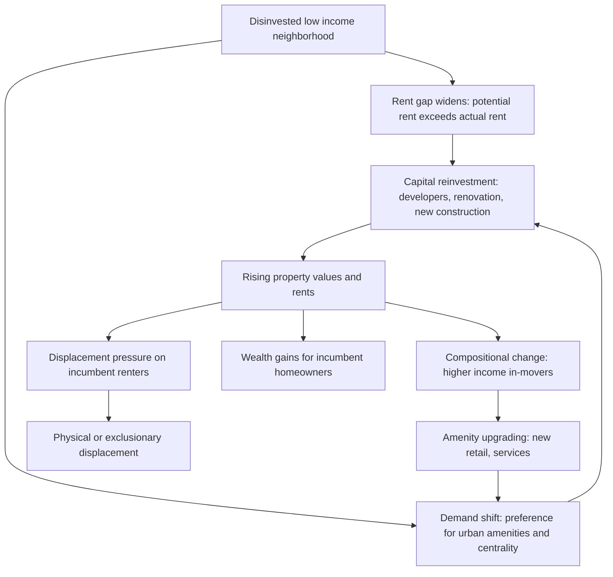

## Gentrification and Neighborhood Change

### Overview

Gentrification describes the process by which previously lower-income, often disinvested urban neighborhoods experience an influx of higher-income residents, rising property values and rents, and changes in the composition of local businesses and amenities. It is one of the most theoretically and politically contested topics in urban economics: models disagree on root causes (supply-side capital reinvestment vs. demand-side consumer preference shifts), and empirical work is divided on the magnitude and even direction of displacement effects on incumbent low-income residents.

### Defining Gentrification

#### Core Components

Most operational definitions require a neighborhood to exhibit, relative to its metro area or a comparable baseline period:

1. **Below-median household income or home values at baseline** (establishing the neighborhood was disinvested/lower-income to begin with)
2. **Above-average subsequent increase** in income, home values, rents, and/or educational attainment of in-movers
3. **Demographic compositional change**, often (though not universally) including racial/ethnic composition shifts alongside income shifts

#### Key Points

- **No single agreed-upon quantitative threshold** exists across studies; researchers commonly use tract-level Census/ACS data with varying cutoffs (e.g., tracts starting below the 40th percentile of metro median income that subsequently see income or home-value growth exceeding some multiple of the metro average).
- **Gentrification vs. general neighborhood change**: Not all neighborhood improvement is gentrification in the economically loaded sense — the term specifically implies displacement risk or population turnover tied to rising costs, distinguishing it from, e.g., broad-based income growth in a stable-population neighborhood.
- **[Inference]** The absence of a standardized definition across studies is a significant source of disagreement in the empirical displacement literature, since studies using different tract-selection criteria can identify substantially different sets of "gentrifying" neighborhoods from the same underlying data.

### Theoretical Models of Gentrification

#### Rent Gap Theory (Neil Smith, 1979)

The classic supply-side/production-based explanation. Smith defines the **rent gap** as the difference between the actual capitalized ground rent of a property under its current use and the potential ground rent that could be captured under its "highest and best use" given proximity to the urban core:

$$\text{Rent Gap} = R_{\text{potential}} - R_{\text{actual}}$$

As central urban land is progressively disinvested (following historical patterns of suburbanization and capital flight described by Smith as building on Marxist urban land theory), $R_{\text{actual}}$ falls relative to $R_{\text{potential}}$, which is anchored by centrality and infrastructure. Once the gap becomes large enough, it becomes profitable for developers/investors to reinvest, triggering redevelopment and gentrification — the theory frames gentrification as driven by the capital investment cycle, not by consumer preference shifts.

#### Consumer/Demand-Side Theories

- **Stage models / "Pioneer" theory**: Emphasizes demand-side preference shifts — young, often college-educated households (sometimes termed the "creative class," following Richard Florida) with a preference for urban amenities, shorter commutes, and historic/dense housing stock drive demand into previously disinvested neighborhoods, subsequently followed by capital reinvestment responding to that demand.
- **Amenity-based sorting models**: Building on standard urban discrete-choice/hedonic frameworks (see Residential Segregation Models), gentrification can be modeled as households sorting toward neighborhoods with rising *endogenous* amenities (restaurants, retail, safety) that themselves respond to the arrival of higher-income residents, generating a self-reinforcing tipping dynamic structurally similar to Schelling-type segregation models but along an income/preference dimension rather than a pure composition-preference dimension.

#### Key Points

- **Supply vs. demand debate is largely resolved as complementary, not competing** in modern urban economics: contemporary work generally treats rent-gap dynamics and amenity/preference shifts as jointly necessary — capital will not flow without some demand signal, and demand alone does not generate redevelopment without capital access (financing, zoning permission, construction costs).
- **Third-wave gentrification / state-led gentrification**: Later scholarship (e.g., Hackworth and Smith) emphasizes the increasing role of municipal and state policy — public investment, favorable zoning changes, business improvement districts, and public-private redevelopment partnerships — as an active driver, complicating purely market-based (supply or demand) accounts.

### Formal/Reduced-Form Empirical Approaches

#### Hedonic Price Models

Standard approach for measuring amenity capitalization into housing prices, with a gentrification-relevant specification:

$$\ln(P_{it}) = \alpha + \beta_1 \, \text{Structural}_i + \beta_2 \, \text{Neighborhood}_{it} + \beta_3 \, \text{Amenity}_{it} + \gamma_t + \epsilon_{it}$$

where amenity variables (new retail openings, transit access changes, crime rates) are tracked over time to isolate the marginal contribution of neighborhood-level change to price appreciation, distinct from structural housing characteristics.

#### Difference-in-Differences Around Discrete Shocks

Common identification strategy exploits plausibly exogenous shocks to neighborhood desirability:

- **New transit station openings**: Comparing price/rent trajectories in areas near new stations versus otherwise similar areas without new transit access.
- **Historic district designation**: Comparing tracts just inside vs. just outside newly designated historic preservation district boundaries (a regression discontinuity variant).
- **Anchor institution investment**: University or hospital expansion projects used as quasi-exogenous shocks to adjacent neighborhood demand.

#### Key Points

- **Endogeneity of "shocks"**: Even seemingly exogenous investments (transit lines, historic designations) are often sited based on anticipated or ongoing neighborhood change, so researchers must justify why the specific timing/location of the shock is uncorrelated with pre-existing trends (tested via pre-trend/parallel-trends checks).

### Displacement: Theory and Measurement

#### Types of Displacement (following Marcuse, 1985)

1. **Direct/physical displacement**: Households forced to move due to eviction, rent increases beyond ability to pay, or building conversion/demolition.
2. **Exclusionary displacement**: Potential in-movers of the original demographic/income profile are priced out of moving into the neighborhood, even without displacing current residents — a subtler, harder-to-measure form.
3. **Displacement pressure**: Psychological/social pressure from neighborhood change (cultural displacement, loss of social networks, rising cost-of-living pressure) that precedes or substitutes for physical displacement.

#### Empirical Displacement Estimates

**[Unverified — findings are actively contested and vary substantially by data source and method]** A significant body of quantitative research using panel/longitudinal data (e.g., tracking individuals via the Panel Study of Income Dynamics, the National Longitudinal Survey, or administrative credit-bureau records) has found that **mobility rates out of gentrifying neighborhoods are often not substantially higher than out of comparable non-gentrifying low-income neighborhoods** — a finding sometimes summarized as "gentrification without displacement" — while other studies using different data (e.g., eviction court records) or focusing on renters specifically find measurable elevated displacement risk, particularly for renters (as opposed to homeowners, who benefit from price appreciation) and for households without long-term leases.

#### Key Points

- **Renters vs. homeowners face opposite incentives**: Rising property values benefit incumbent homeowners (increased equity, option to sell) while creating displacement pressure for renters (rising rents without a corresponding asset gain) — meaning the tenure composition of a neighborhood strongly shapes aggregate welfare effects of gentrification.
- **Survivorship/selection bias risk**: Studies measuring outcomes only for residents who remain in a gentrifying neighborhood systematically miss those already displaced, understating displacement if not carefully designed with baseline cohort tracking.
- **Successor vs. incumbent household distinction**: Even absent high displacement rates among current residents, gentrification changes the population *composition of future in-movers*, which can alter neighborhood political voice, business mix, and public service allocation independent of direct displacement.

### Diagram: Gentrification Process and Divergent Mechanisms

### Policy Responses

#### Anti-Displacement Tools

- **Rent stabilization/control**: Directly caps rent growth for existing tenants, though standard urban economics models (see Housing Market Dynamics/Rent Control topics) predict long-run supply-side distortions and potential quality deterioration under strict rent control regimes.
- **Community land trusts (CLTs)**: Nonprofit ownership of land with long-term ground leases to homeowners, removing land appreciation from market pricing and preserving long-run affordability.
- **Right-to-counsel and just-cause eviction ordinances**: Legal protections reducing the rate of non-renewal or eviction-driven displacement independent of rent-level changes.
- **Inclusionary zoning and affordable housing set-asides**: Requiring new development to include below-market-rate units, aiming to preserve income mixing as redevelopment proceeds.

#### Growth/Supply-Oriented Responses

- **Upzoning and increased housing supply**: An alternative policy view, grounded in standard supply-and-demand housing models, holds that restrictive zoning limiting new construction is itself a major driver of gentrification-associated price increases, since inelastic housing supply forces demand growth to be absorbed entirely through price appreciation and compositional turnover rather than new unit construction — implying supply expansion (even market-rate) can dampen displacement pressure regionally, though effects at the hyper-local neighborhood level are debated.

#### Key Points

- **Tension between anti-displacement and supply-side tools**: Anti-displacement advocates sometimes oppose new market-rate development in gentrifying areas (viewing it as accelerating change), while supply-side economists argue blocking new supply exacerbates regional price pressure — a genuinely contested empirical and normative question in current urban policy debate, not one with clear consensus resolution.

### Measurement and Data Sources

- **Urban Displacement Project (UC Berkeley)**: Widely used typology classifying tracts into categories (e.g., "at risk of gentrification," "actively gentrifying," "advanced gentrification," "not losing low-income households") based on longitudinal Census/ACS tract data.
- **Zillow/CoreLogic and other proprietary price indices**: Used for higher-frequency tracking of neighborhood-level price appreciation than decennial Census or annual ACS estimates allow.
- **Eviction Lab (Princeton)**: County/city-level eviction filing and judgment data used to directly measure displacement-relevant outcomes rather than relying solely on mobility/migration proxies.

### Related Topics

- Residential segregation models (structural parallel to amenity-driven sorting dynamics)
- Rent gap theory and urban land economics
- Housing supply elasticity and zoning regulation
- Rent control and tenant protection policy design
- Hedonic pricing models in urban housing markets
- Concentrated urban poverty and neighborhood change trajectories
- Community land trusts and alternative housing tenure models
- Transit-oriented development and its effect on land values