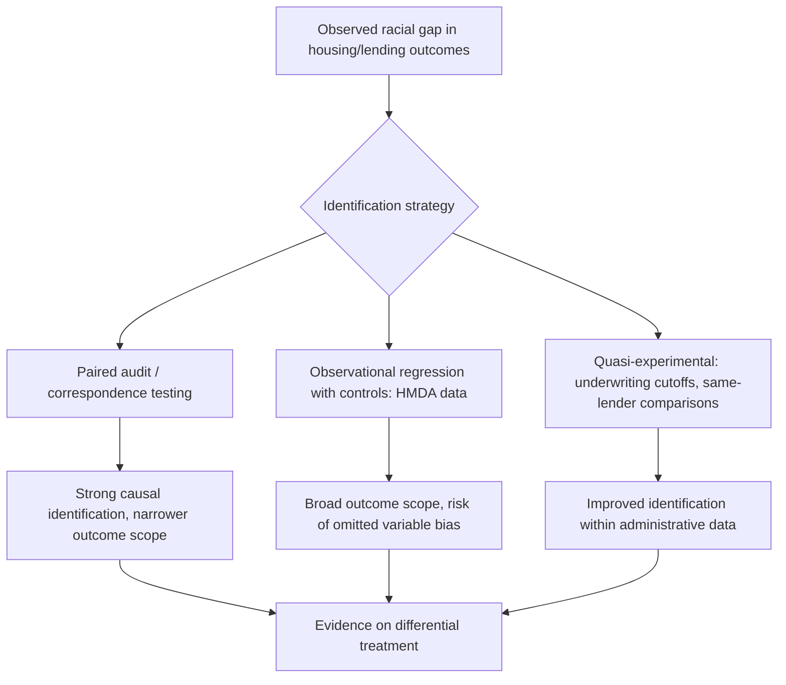

## Housing Discrimination

### Overview

Housing discrimination refers to the unequal treatment of individuals in housing transactions — rental, sale, mortgage lending, insurance, and appraisal — on the basis of protected characteristics such as race, ethnicity, national origin, religion, sex, familial status, or disability. In urban economics, housing discrimination is analyzed both as a market failure with efficiency and welfare consequences, and as a key causal mechanism generating and sustaining residential segregation (see Residential Segregation Models) and concentrated urban poverty. The field distinguishes carefully between theoretical models of discriminatory behavior (taste-based vs. statistical) and empirical methods for detecting and measuring discrimination in real markets.

### Legal and Institutional Framework

#### Key U.S. Legislation

- **Fair Housing Act (1968, Title VIII of the Civil Rights Act)**: Prohibits discrimination in the sale, rental, and financing of housing based on race, color, religion, national origin, and (via 1974 and 1988 amendments) sex, disability, and familial status.
- **Equal Credit Opportunity Act (1974)**: Prohibits discrimination in credit transactions, including mortgage lending, extending anti-discrimination protection specifically to lending decisions.
- **Home Mortgage Disclosure Act (1975, HMDA)**: Requires most mortgage lenders to publicly report loan-level data (applicant race, income, loan outcome, and since 2018 additional fields under Dodd-Frank amendments), creating the primary dataset used in empirical lending-discrimination research.
- **Community Reinvestment Act (1977)**: Requires federally insured banks to meet the credit needs of the communities they serve, including low- and moderate-income neighborhoods, enacted partly in response to documented redlining practices.

#### Historical Institutional Mechanisms

**[Unverified — historically documented, though precise causal magnitudes are debated across studies]**

- **Redlining**: The Home Owners' Loan Corporation (HOLC), created in 1933, produced residential security maps grading neighborhoods (A through D) for mortgage risk, with grading criteria including racial and immigrant composition; the lowest grade ("D," colored red on maps, hence "redlining") was disproportionately assigned to Black and immigrant neighborhoods, and evidence links these historical grades to subsequent decades of reduced lending, disinvestment, and depressed property values in graded areas, with some studies finding effects persisting into the present.
- **Racially restrictive covenants**: Private deed restrictions barring sale or occupancy by specified racial or ethnic groups, legally enforceable until the Supreme Court's *Shelley v. Kraemer* (1948) ruling that judicial enforcement of such covenants constituted unconstitutional state action; the covenants themselves remained written into some deeds long afterward, though unenforceable.
- **Blockbusting**: A predatory real estate practice in which agents encouraged white homeowners to sell quickly (often at reduced prices) by suggesting an imminent influx of Black residents would depress values, then resold the properties to Black buyers at inflated prices — directly monetizing racial anxiety and accelerating neighborhood racial turnover.
- **Racial steering**: Real estate agents directing prospective buyers/renters toward or away from neighborhoods based on race, a practice that persists as a documented finding in modern paired-testing audit studies despite being illegal since 1968.

### Theoretical Models

#### Taste-Based Discrimination (Becker, 1957)

Gary Becker's foundational model treats discrimination as a "taste" or preference — a landlord, seller, or lender who discriminates behaves as though incurring a utility cost (or acts as if the "price" of transacting with a member of the disfavored group is higher) purely from personal prejudice, independent of any informational or economic rationale. Formally, a discriminating landlord's effective cost of renting to a minority tenant is modeled as:

$$C_{\text{effective}} = C_{\text{actual}} + d$$

where $d > 0$ is the discrimination coefficient representing the disutility of transacting with the disfavored group.

#### Key Points

- **Competitive market prediction**: Becker's model predicts that in a fully competitive market with some non-discriminating landlords/lenders, discrimination should be *competed away* over time, since non-discriminating firms can capture the disfavored group's business at standard rates and earn normal profits, while discriminating firms either lose business or accept lower profits — implying persistent discrimination requires either non-competitive market structure, or search/information frictions preventing minority renters/buyers from finding non-discriminating counterparties.
- **[Inference]** The persistence of measurable discrimination in modern audit studies (see below) despite decades of Becker-style competitive pressure suggests either substantial search frictions in housing markets (geographically fragmented, low-transaction-frequency, information-asymmetric) or that at least some discrimination in practice is more consistent with a statistical rather than pure taste-based model.

#### Statistical Discrimination

Statistical discrimination models (building on Arrow, Phelps) posit that landlords, sellers, or lenders use race/ethnicity as a **proxy signal** for unobserved risk-relevant characteristics (creditworthiness, income stability, property-maintenance behavior) when direct information is costly or imperfectly observed, rather than acting on pure prejudice. Formally, if a decision-maker observes a noisy signal $s$ of true risk-relevant type $\theta$, and the correlation between $s$ and $\theta$ differs by group (or the decision-maker believes it does, even if beliefs are inaccurate), group membership becomes informative *conditional on the available signal*, leading to differential treatment even absent animus.

#### Key Points

- **Efficiency implications differ sharply from taste-based discrimination**: If beliefs about group-conditional risk distributions are accurate, statistical discrimination can be a rational profit-maximizing (if still normatively objectionable and often illegal) response to costly information; if beliefs are inaccurate (a **self-fulfilling prophecy** or biased-belief equilibrium), the discrimination is both inefficient and unjustified even in a narrowly economic sense.
- **Legally, U.S. fair housing and lending law generally does not exempt statistical discrimination**: disparate treatment based on race, even if putatively "rational" from a risk-assessment standpoint, is prohibited under the Fair Housing Act and Equal Credit Opportunity Act; a separate "disparate impact" doctrine also allows challenges to facially neutral policies that produce discriminatory effects without proof of intent, though the scope of disparate-impact liability has been subject to ongoing legal and judicial refinement.

### Empirical Detection Methods

#### Paired Audit / Correspondence Studies

The primary experimental method for detecting discrimination directly. Design:

1. Create matched pairs (or larger groups) of fictitious renters/buyers/loan applicants with identical qualifications (income, credit profile, household composition) but differing only in a signal of race/ethnicity (name, dialect, in-person audit tester appearance).
2. Have testers or correspondence (emails/calls) contact the same set of landlords, agents, or lenders.
3. Compare outcomes: response rates, information provided, units shown, rent quoted, loan terms offered.

The U.S. Department of Housing and Urban Development has periodically funded large-scale versions of this design (the **Housing Discrimination Studies**, conducted in 1977, 1989, 2000, and most recently a 2012 nationwide study), consistently finding statistically significant, though generally declining over the decades studied, differential treatment of racial and ethnic minority testers relative to matched white testers across rental and sales markets.

#### Key Points

- **Internal validity strength**: Because testers are matched on observable qualifications and randomly assigned which units/lenders they contact, paired-testing designs offer strong causal identification of differential treatment attributable to the signaled characteristic, addressing the confounding that plagues purely observational discrimination studies.
- **External validity limitations**: Audit studies typically measure *access-stage* discrimination (being shown units, getting callbacks, quoted terms) rather than final transaction outcomes, and results may not generalize across all market segments (e.g., luxury vs. affordable housing, different metro areas) or capture more subtle forms of differential treatment not observable in a single interaction.
- **Correspondence audits (email/phone, no in-person tester)**: A lower-cost variant increasingly used in modern research (including studies of Airbnb and other online rental platforms), trading some realism for scalability and reduced tester-effect confounds.

#### Observational/Administrative Data Methods

- **HMDA-based lending discrimination studies**: Regress loan approval/denial or pricing (interest rate, fees) on applicant race/ethnicity, controlling for observable creditworthiness variables (income, loan-to-value ratio, credit score where available), with residual racial gaps interpreted as suggestive of discrimination — subject to the important caveat that **omitted variable bias** (unobserved creditworthiness factors correlated with race) can generate spurious "discrimination" coefficients, motivating quasi-experimental refinements.
- **Matched-lender or same-underwriter comparisons**: Some studies exploit variation in loan officer/underwriter identity or algorithmic underwriting cutoffs to isolate discretionary discrimination from formula-based risk assessment.
- **Bunching/discontinuity around automated underwriting thresholds**: Comparing denial rates for applicants just above vs. just below algorithmic approval cutoffs by race, testing whether discretion exercised near the margin is racially patterned.

### Diagram: Discrimination Detection Framework

### Algorithmic and Platform-Based Discrimination

#### Emerging Research Areas

- **Automated underwriting and credit scoring algorithms**: Research increasingly examines whether machine-learning-based mortgage underwriting models, even without explicit race variables, can reproduce or amplify historical discriminatory patterns through correlated proxy variables (e.g., zip code, alternative credit data), an area sometimes termed "algorithmic redlining" or "digital redlining."
- **Short-term rental platforms (e.g., Airbnb)**: Correspondence-style studies have found evidence of host discrimination based on guest name/perceived race in booking acceptance rates, extending classical housing-discrimination findings to the platform economy.
- **[Inference]** Because algorithmic systems can encode historical training data reflecting past discriminatory lending or appraisal patterns, disparate-impact analysis of automated decision systems is a growing regulatory and research priority, though the technical and legal standards for auditing such systems (e.g., what counts as a legally cognizable "less discriminatory alternative" model) remain actively developing areas of both computer science and law.

### Appraisal Bias

#### Key Points

- A distinct strand of research examines racial disparities in **property appraisal values**, separate from lending or rental discrimination — studies using paired or matched-sale comparisons have found homes in majority-Black neighborhoods, and homes owned by Black homeowners specifically, appraised at lower values than comparable homes in majority-white contexts, even after controlling for observable structural and neighborhood characteristics.
- **Mechanisms proposed** include appraiser reliance on comparable sales ("comps") drawn from historically segregated and disinvested markets (embedding historical redlining effects into current valuations), and potential appraiser bias in exercising valuation discretion — an active area of ongoing empirical and policy work (including federal task force reviews of appraisal industry practices).

### Economic Consequences

- **Wealth accumulation gaps**: Because homeownership is the primary wealth-building vehicle for most U.S. households, discriminatory barriers to homeownership access, favorable mortgage terms, and full property appraisal value are directly implicated in the persistent racial wealth gap, compounding across generations through reduced ability to pass on home equity.
- **Segregation reinforcement**: Discriminatory steering and differential treatment in rental/sales markets directly restrict the choice sets available to minority households, mechanically contributing to the residential segregation patterns modeled in Schelling-type and discrete-choice sorting frameworks, independent of any household preference for own-group neighbors.
- **Interaction with concentrated poverty**: To the extent discrimination limits minority household mobility to lower-poverty neighborhoods, it directly feeds into the concentrated-poverty dynamics and neighborhood-effects channels covered elsewhere in this chapter.

### Policy and Enforcement Tools

- **HUD Fair Housing Initiatives Program (FHIP)**: Funds fair housing testing organizations that conduct audit studies and refer discrimination complaints for enforcement.
- **Disparate impact litigation**: Allows challenges to facially neutral policies (e.g., blanket criminal-background-check policies, certain algorithmic underwriting criteria) shown to produce statistically significant discriminatory effects, without requiring proof of discriminatory intent.
- **Affirmatively Furthering Fair Housing (AFFH) requirements**: Regulatory requirements (with a complex history of federal implementation and rollback/reinstatement across administrations) intended to require jurisdictions receiving federal housing funds to proactively assess and address segregation and disparate access patterns, rather than merely avoiding overt discrimination.

### Related Topics

- Residential segregation models and the sorting/tipping dynamics discrimination reinforces
- Concentrated urban poverty and neighborhood effects
- Mortgage market economics and credit risk pricing
- Racial wealth gap and intergenerational wealth transmission
- Algorithmic fairness and disparate impact in machine learning systems
- Community Reinvestment Act and bank lending obligations
- Property appraisal methodology and valuation bias
- Fair housing law and disparate treatment vs. disparate impact doctrine