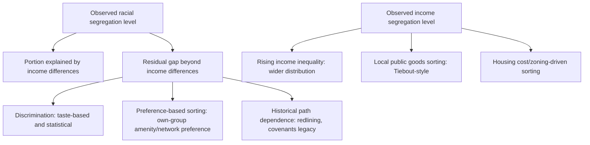

## Racial and Economic Segregation Patterns

### Overview

This topic examines the *empirical patterns* of racial and economic segregation across U.S. metropolitan areas — trends over time, geographic variation across cities, the relationship (and distinction) between racial and income segregation, and multi-group segregation dynamics — complementing the theoretical modeling frameworks covered under Residential Segregation Models. Understanding actual patterns is essential for evaluating theoretical predictions and designing evidence-based policy: segregation is not monolithic across the U.S., and racial and economic segregation, while correlated, are analytically and empirically distinct phenomena that have diverged in important ways over recent decades.

### Racial Segregation: Long-Run Trends

#### Black-White Segregation

Using the dissimilarity index ($D$, see Residential Segregation Models) computed from decennial Census data, Black-white residential segregation in the U.S. rose sharply during the Great Migration era (roughly 1910s–1970s) as Black populations moved to Northern and Midwestern industrial cities and were confined to specific neighborhoods through the discriminatory mechanisms covered under Housing Discrimination (redlining, restrictive covenants, blockbusting).

#### Key Points

- **Peak and gradual decline**: Black-white metropolitan dissimilarity indices generally peaked around 1970 (with many large metros exceeding $D = 0.80$, indicating that 80% of one group would need to relocate to achieve even distribution) and have declined gradually but unevenly since, particularly following the Fair Housing Act (1968) and subsequent enforcement efforts.
- **Persistent high levels**: **[Unverified — precise current figures require up-to-date Census/ACS data]** Despite the multi-decade decline, Black-white segregation remains substantially higher than segregation levels for most other racial/ethnic group pairs in the U.S., and several large, historically industrial metro areas (frequently cited examples include Detroit, Milwaukee, Chicago, and Cleveland) continue to exhibit very high dissimilarity index values relative to the national metro average.
- **Regional variation**: Segregation levels differ substantially by region and metro history — older Northeastern and Midwestern "Rust Belt" metros with large 20th-century Black in-migration and industrial decline tend to show higher persistent segregation than many Southern and Western Sun Belt metros with different settlement histories, though Sun Belt metros are not uniformly less segregated and show their own distinct patterns.

#### Hispanic-White and Asian-White Segregation

- **Hispanic-white segregation**: Generally lower than Black-white segregation on average across U.S. metros, but has shown a *rising* trend in some metro areas since the late 20th century, associated with continued immigration and the formation of new ethnic enclaves, particularly in gateway cities and newer immigrant destinations.
- **Asian-white segregation**: Typically the lowest of the major racial/ethnic dissimilarity measures in most U.S. metros, though this varies by specific national-origin group and by metro area, and enclave formation (e.g., specific neighborhoods with high concentrations of particular Asian ethnic subgroups) can coexist with relatively low aggregate dissimilarity index values if the enclaves are small relative to the metro area.

#### Key Points

- **Segregation is not a single number for a "minority" category**: National discourse sometimes treats "segregation" as a single racial phenomenon, but empirically distinct groups exhibit distinct trends, levels, and drivers, and multi-group entropy-based measures (Theil's H) are increasingly used specifically because pairwise dissimilarity indices cannot capture the full multi-group structure of increasingly diverse metro areas.

### Income Segregation: Trends and the "Great Divergence"

#### Reardon and Bischoff's Findings

Sean Reardon and Kendra Bischoff's influential research (using Census tract data spanning multiple decades) documented that **income segregation** — the degree to which high-income and low-income households live in separate neighborhoods — rose substantially in U.S. metropolitan areas from 1970 to the 2000s, a trend distinct from and, notably, occurring *even as* Black-white racial segregation was declining over much of the same period.

#### Key Points

- **Decoupling of racial and income segregation trends**: This divergence is a central empirical finding motivating the distinction between racial and economic segregation as separate (though correlated and interacting) phenomena — racial segregation's gradual post-1968 decline did not translate into a corresponding decline in income segregation, which instead rose.
- **Rising income inequality as a driver**: Reardon and Bischoff's work links the rise in income segregation substantially to the broader rise in U.S. income inequality since the 1970s — as the income distribution has stretched, the *opportunity* for income-based sorting into distinct neighborhoods has mechanically increased even holding preferences for income-homogeneous neighborhoods constant, since a wider income distribution allows finer sorting.
- **Segregation of affluence vs. segregation of poverty**: Research distinguishes segregation *of the poor* (concentration of low-income households) from segregation *of the affluent* (concentration of high-income households), finding that both have risen, but that increases in the isolation of affluent households from the rest of the income distribution have been a particularly notable feature of the recent trend — sometimes summarized as "the rich increasingly live only among the rich."

#### Measuring Income Segregation

Common measures adapt the entropy/Theil's H framework (rather than a simple two-group dissimilarity index) to a continuous income distribution divided into quantile bins, since income is inherently continuous rather than a binary/categorical group variable:

$$H = 1 - \frac{\sum_i n_i E_i}{N E}$$

where $E_i$ is local (within-tract) income entropy, $E$ is metro-wide income entropy, $n_i$ is tract population, and $N$ is total metro population — an index of 0 indicates no segregation (every tract has the same income distribution as the metro overall) and 1 indicates complete segregation (each tract is homogeneous in income category).

### Interaction Between Racial and Income Segregation

#### Key Points

- **Racial segregation is not fully explained by income differences**: A well-established empirical finding (dating to early dissimilarity-index research and reaffirmed repeatedly) is that Black-white residential segregation substantially exceeds what would be predicted purely from income differences between Black and white households — i.e., even Black and white households of comparable income levels tend to live in more racially segregated patterns than income sorting alone would generate, implying racial segregation involves mechanisms (discrimination, preference for own-group neighbors, social network effects) beyond pure economic sorting.
- **Middle- and upper-income Black households and segregation**: Research (including work following on from Wilson's framework) has found that middle- and upper-income Black households, despite greater purchasing power/choice, often live in neighborhoods with higher poverty rates and lower average neighborhood quality than white households of *equivalent* or even *lower* income — a pattern inconsistent with a purely income-based sorting model and consistent with the residual role of discrimination and preference-based segregation covered under Housing Discrimination and Residential Segregation Models.
- **[Inference]** This gap between predicted (income-based) and observed (actual) racial segregation levels is often used in the literature as an indirect empirical signature of the combined effects of discrimination and racial preference-based sorting, though isolating the precise contribution of each specific mechanism (statistical discrimination, taste-based discrimination, network effects, historical path dependence) from this residual gap alone is not possible without additional identifying variation.

#### Diagram: Decomposing Segregation Patterns

### Multi-Group and Metro-Level Variation

#### Increasing Diversity and Multi-Group Segregation

As U.S. metro areas have become more demographically diverse (rising Hispanic, Asian, and multiracial populations, alongside continued Black and white populations), researchers increasingly rely on multi-group segregation measures (Theil's H decomposed across more than two groups) rather than pairwise dissimilarity indices, since a metro area can show declining Black-white dissimilarity while overall multi-group segregation remains stable or even rises due to new patterns of segregation involving newer immigrant groups.

#### Metro-Level Variation and City Rankings

**[Unverified — specific city rankings shift across data releases and measurement years]** Empirical segregation rankings of U.S. metro areas (commonly reported using Census Bureau or Brown University's American Communities Project / US2010 data) consistently identify a set of Midwestern and Northeastern metros as among the most racially segregated by conventional dissimilarity measures, while identifying many Southern and Western Sun Belt metros, along with some smaller or more recently developed metro areas, as comparatively less segregated — though "less segregated" does not necessarily mean fully integrated, and Sun Belt metros can show high segregation by other measures (e.g., income segregation or segregation involving specific immigrant enclaves).

#### Key Points

- **Historical settlement pattern as a structural determinant**: A recurring finding is that metro areas that experienced the bulk of their population growth *after* the Fair Housing Act (1968) — largely Sun Belt metros — tend to show lower racial dissimilarity than metros whose housing stock and neighborhood boundaries were substantially established *before* fair housing law took effect, consistent with the path-dependence emphasis of Schelling-style tipping models (initial conditions matter for long-run equilibria).

### School Segregation as a Related but Distinct Pattern

#### Key Points

- **School segregation can exceed or diverge from residential segregation**: Because school attendance zone boundaries, school choice/charter policies, and private school enrollment decisions all mediate the relationship between residential location and school assignment, school-level segregation patterns do not mechanically mirror neighborhood residential segregation patterns, and some research finds school segregation has resurged in certain districts even where residential segregation has modestly declined — an active and evolving area of empirical education-economics research connecting to, but distinct from, the neighborhood-effects framework.

### Data Sources and Methodological Notes

- **Decennial Census and American Community Survey (ACS) tract-level data**: The primary source for long-run segregation trend analysis; the shift from the Census "long form" to the continuously-administered ACS (beginning 2005) changed sampling methodology and margin-of-error characteristics relevant to year-to-year segregation estimate comparisons.
- **Brown University's Diversity and Disparities / US2010 Project**: A widely cited academic data compilation providing consistent segregation index calculations across Census years for U.S. metro areas.
- **Modifiable Areal Unit Problem (MAUP) and geographic scale sensitivity**: As noted under Residential Segregation Models, segregation index values are sensitive to the choice of geographic unit (tract vs. block group vs. block); researchers increasingly use block-level or even finer-grained data where available to reduce this sensitivity, since tract boundaries themselves are administrative constructs that do not necessarily correspond to socially meaningful neighborhood boundaries.

### Related Topics

- Residential segregation models (Schelling, discrete choice, discrimination-based theory)
- Housing discrimination and its role in sustaining segregation patterns
- Concentrated urban poverty and its interaction with segregation
- Neighborhood effects and social interactions
- School segregation and education finance
- Income inequality trends and their spatial manifestations
- Immigrant enclave formation and ethnic succession models
- Multi-group entropy and Theil's H decomposition methods