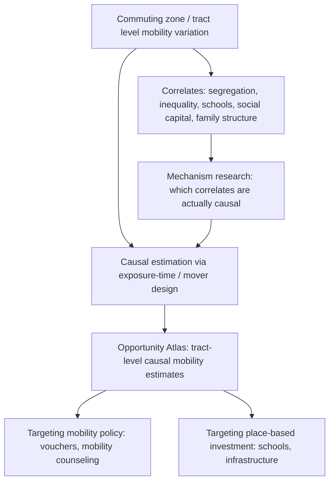

## Spatial Inequality and Access to Opportunity

### Overview

Spatial inequality and access to opportunity examines how geographic location systematically shapes an individual's economic prospects — labor market access, human capital accumulation, health, and intergenerational mobility — independent of, and often through mechanisms distinct from, an individual's own characteristics. This topic synthesizes and extends the neighborhood-effects, segregation, and concentrated-poverty frameworks covered earlier in this chapter into a unifying "opportunity geography" lens, most closely associated with the large-scale empirical mobility research led by Raj Chetty and collaborators, and connects urban economics directly to the intergenerational mobility literature in labor and public economics.

### Defining Access to Opportunity

#### Core Concept

"Access to opportunity" refers to the causal effect that a given geographic location (commuting zone, county, or Census tract) has on an individual's expected long-run outcomes (adult income rank, educational attainment, employment, health, incarceration), holding constant the individual's and family's own characteristics. This reframes location from a passive *correlate* of outcomes (as in cross-sectional segregation/poverty measures) to an *active causal input*, following the exposure-time identification logic introduced under Neighborhood Effects and Social Interactions.

#### Key Points

- **Absolute vs. relative mobility**: The literature distinguishes **absolute mobility** (the probability that a child born to low-income parents reaches a given absolute income level or rank as an adult) from **relative mobility** (how strongly a child's economic rank is predicted by parental rank) — a location can offer high relative mobility (weak parent-child income correlation) while still having low absolute mobility (low average outcomes for children of poor parents) if overall outcomes in that location are low across the board.
- **Intergenerational elasticity and rank-rank correlation**: The standard summary statistic for relative mobility is the slope from regressing a child's income rank (or log income) on parental income rank (or log income):

$$\text{Rank}_{child} = \alpha + \beta \cdot \text{Rank}_{parent} + \epsilon$$

where $\beta$ (the **rank-rank slope**) captures the degree of intergenerational persistence — a higher $\beta$ indicates lower relative mobility (child outcomes more tightly tied to parental outcomes).

### The Equality of Opportunity Project / Opportunity Insights

#### Methodology

Raj Chetty, Nathaniel Hendren, Patrick Kline, and Emmanuel Saez's foundational work (beginning with "Where is the Land of Opportunity?", 2014) used de-identified linked federal income tax records covering nearly the entire U.S. population to estimate commuting-zone-level intergenerational mobility statistics at unprecedented geographic granularity and sample size, superseding earlier survey-based mobility estimates (e.g., from the Panel Study of Income Dynamics) that lacked sufficient sample size for reliable sub-national geographic breakdowns.

#### Key Findings on Geographic Variation

**[Unverified — specific point estimates should be checked against current Opportunity Insights data releases]** This body of research documented substantial variation in intergenerational mobility across U.S. commuting zones — children raised in the bottom household income quintile in some metro areas had probabilities of reaching the top income quintile as adults several times higher than children from the bottom quintile in other metro areas, despite both areas having comparable national income distributions — establishing that *where* a child grows up is a first-order, quantitatively large determinant of economic mobility, not a second-order factor.

#### Key Points

- **Correlates of high-opportunity areas**: Areas with higher estimated upward mobility are found to be associated with (though not necessarily all independently causal): lower residential segregation (racial and income), lower income inequality, better-performing K-12 schools, higher social capital/civic engagement measures, and greater family stability (higher two-parent household shares) — mirroring and reinforcing the mechanisms identified in the neighborhood-effects and segregation literatures.
- **Causal vs. correlational status of area characteristics**: The commuting-zone correlational findings alone do not establish which of these correlated factors are causally responsible for mobility differences; the exposure-time/mover research design (see Neighborhood Effects and Social Interactions) was developed specifically to establish the *causal* contribution of place itself, separate from the population currently residing there.

### The Opportunity Atlas

#### Tract-Level Granularity

Chetty and collaborators' "Opportunity Atlas" (2018) extends the commuting-zone analysis to the Census tract level, using the exposure-time/mover design to estimate the causal effect of *growing up in* each of the roughly 70,000 Census tracts in the U.S. on children's adult outcomes, netting out family-level fixed effects via comparisons of siblings and children who moved at different ages.

#### Key Points

- **Fine-grained variation within metro areas**: A central finding is that opportunity varies substantially even *within* the same metro area and even between adjacent tracts, implying that broad metro-level or even county-level opportunity rankings mask important local heterogeneity relevant to residential mobility policy design (e.g., housing voucher destination targeting).
- **Divergence between poverty rate and mobility outcomes**: As noted under Concentrated Urban Poverty, tract-level poverty rate is an incomplete predictor of causal opportunity — some high-poverty tracts show relatively favorable causal upward-mobility estimates for children who grow up there, while some lower-poverty tracts show less favorable estimates, complicating simple poverty-rate-based targeting of mobility interventions.
- **Racial gaps within same tracts**: The Atlas data also reveal that Black and white children raised in *the same* Census tract, and even often in families with similar income, show diverging adult outcomes, particularly for Black boys, a finding that has generated substantial follow-up research (e.g., Chetty et al.'s subsequent work on racial disparities in economic mobility) examining mechanisms including differential exposure to father presence, discrimination, and social network access even within nominally shared neighborhood environments.

### Diagram: Opportunity Geography Framework

### Spatial Mismatch and Access to Labor Market Opportunity

#### Job Accessibility Measures

Building on the spatial mismatch hypothesis (Kain, 1968; see Concentrated Urban Poverty), researchers construct **job accessibility indices** measuring the number of jobs reachable from a given residential location within a specified commute time, often via public transit specifically, given that low-income households are more likely to be transit-dependent:

$$A_i = \sum_{j} E_j \cdot f(t_{ij})$$

where $E_j$ is employment at destination zone $j$, $t_{ij}$ is travel time from residential zone $i$ to $j$, and $f(\cdot)$ is a distance-decay function (e.g., negative exponential).

#### Key Points

- **Transit infrastructure as an opportunity-access lever**: Studies of transit expansions (new rail lines, bus rapid transit) as quasi-experiments have examined effects on employment outcomes for residents of newly connected low-income neighborhoods, with findings **[behavior may vary]** that differ depending on whether the transit expansion also improves connection specifically to job-dense destination zones (as opposed to merely improving general mobility without meaningfully expanding job access).
- **Interaction with housing costs**: Areas with strong job accessibility often also have higher housing costs (a capitalization effect, following standard urban land-use/hedonic theory), meaning improved job access alone does not guarantee affordability for lower-income households — motivating combined transit-access-plus-affordable-housing policy approaches (e.g., transit-oriented affordable housing requirements).

### Human Capital and Educational Opportunity Geography

#### School Quality Capitalization and Access

Because school quality is often bundled with residential location through attendance zones (as discussed under Gentrification and Neighborhood Change and Racial and Economic Segregation Patterns), spatial inequality in school quality functions as a distinct but overlapping channel of opportunity geography. Boundary discontinuity studies comparing near-identical housing on either side of school attendance boundaries are used to isolate the pure school-quality capitalization effect from other neighborhood characteristics.

#### Key Points

- **School choice and charter policy as a partial de-linking mechanism**: Public school choice programs, charter schools, and inter-district transfer policies are sometimes framed as policy tools to partially de-link educational opportunity from residential location, though evidence on the degree to which such programs actually equalize access to opportunity (versus reproducing sorting through information and transportation access barriers) is mixed and context-dependent.

### Policy Implications and Design

#### Mobility-Based Interventions

- **Creating Moves to Opportunity (CMTO)**: A behavioral-economics-informed extension of the Moving to Opportunity design, providing housing search assistance, landlord engagement, and short-term financial assistance to help voucher holders access high-opportunity tracts identified via Opportunity Atlas-style data — early evaluations found substantially higher rates of moves to high-opportunity areas relative to standard voucher administration without such assistance, suggesting information and search-cost frictions (not just cost or discrimination) are a meaningful barrier to opportunity access.
- **Small Area Fair Market Rents (SAFMR)**: A U.S. Department of Housing and Urban Development policy setting voucher payment standards at the ZIP-code level rather than the broader metro-area level, intended to make higher-opportunity (higher-rent) neighborhoods more financially accessible to voucher holders without requiring proportionally larger vouchers metro-wide.

#### Place-Based Interventions

- **Targeted infrastructure and school investment in low-opportunity tracts**: An alternative or complementary strategy to mobility-based approaches, directly improving the causal opportunity value of a given location rather than relocating families — facing the same place-based-vs-people-based tradeoffs discussed under Concentrated Urban Poverty.
- **[Inference]** Because Opportunity Atlas-style estimates suggest opportunity varies at very fine geographic resolution, effective policy design increasingly requires granular, tract-level (rather than metro- or county-level) targeting, which raises both data-infrastructure requirements (access to and interpretation of fine-grained causal mobility estimates) and equity questions (e.g., risk of concentrating investment in tracts already showing improvement, versus tracts most in need but with less favorable current trajectory).

### Data Infrastructure and Methodological Notes

- **Opportunity Insights (Harvard)**: The primary public research hub hosting Opportunity Atlas data, replication code, and related tract- and commuting-zone-level mobility statistics for public and policy use.
- **Linked administrative tax data as a research infrastructure innovation**: The shift from survey-based to full-population administrative tax-record-based mobility research is itself a significant methodological development in applied economics, enabling statistical power and geographic granularity not achievable with prior survey instruments, though raising its own data-access, privacy, and replication considerations (data used under restricted-access agreements at secure Census facilities).

### Related Topics

- Neighborhood effects and social interactions (causal mechanisms underlying opportunity geography)
- Concentrated urban poverty (poverty rate vs. causal opportunity divergence)
- Racial and economic segregation patterns (structural correlates of opportunity variation)
- Spatial mismatch hypothesis and job accessibility modeling
- Intergenerational income mobility and rank-rank regression methods
- School attendance boundaries and education finance
- Housing voucher program design and mobility counseling (Creating Moves to Opportunity)
- Transit-oriented development and employment accessibility