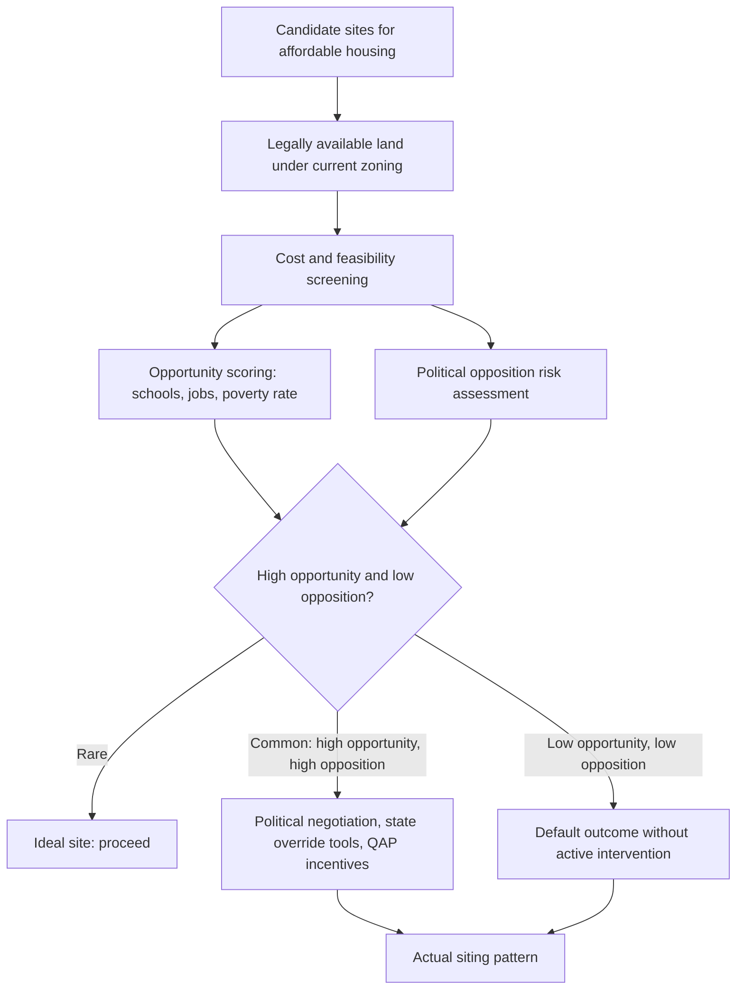

## Siting Decisions for Affordable Housing Development

### Overview

Siting decisions determine where affordable housing developments are physically located, a choice with major consequences for residents' access to opportunity, developer costs, political feasibility, and long-run neighborhood composition. Siting sits at the intersection of the place-based-vs-people-based policy debate (see Concentrated Urban Poverty and Spatial Inequality and Access to Opportunity), local land-use regulation, and the political economy of concentrated local opposition — making it one of the most institutionally and politically constrained decisions in affordable housing policy, distinct from and often more binding than pure economic optimization.

### The Core Siting Trade-off

#### Opportunity vs. Cost vs. Feasibility

Siting decisions face a persistent three-way tension:

1. **High-opportunity locations** (per Opportunity Atlas-style tract-level mobility estimates) tend to have higher land costs, more restrictive zoning, and stronger local political resistance to affordable/multifamily development.
2. **Low-cost, politically feasible locations** are disproportionately concentrated in already-high-poverty, lower-opportunity tracts, risking reinforcement of the concentrated-poverty dynamics covered earlier in this chapter.
3. **Political and regulatory feasibility** (zoning approval, environmental review, community opposition) is often the binding constraint in practice, sometimes overriding both cost and opportunity considerations in determining where developments are actually built.

#### Key Points

- **[Inference]** Because political feasibility frequently dominates the siting decision in practice, actual affordable housing siting patterns often diverge substantially from what a pure cost-minimization or opportunity-maximization model would predict, meaning empirical siting outcomes are best understood as an equilibrium of political economy constraints layered on top of, rather than a direct implementation of, economic siting theory.
- **Path dependence from existing zoning maps**: Because multifamily and affordable housing development is disproportionately restricted (via minimum lot sizes, density caps, and use restrictions) in higher-income, higher-opportunity residential zones in most U.S. jurisdictions, the *legally available* land for affordable development is itself non-randomly distributed toward lower-opportunity areas before any siting decision is even made — a structural, zoning-driven constraint distinct from developer or agency choice.

### "NIMBY" Dynamics and Political Economy

#### Concentrated Costs, Diffuse Benefits

The standard political-economy framework for understanding local opposition to affordable housing siting ("Not In My Backyard," NIMBY) follows the classic Olson (1965) logic of concentrated costs and diffuse benefits: existing homeowners near a proposed site bear salient, localized, and immediate perceived costs (property value concerns, neighborhood change, service burden), while the benefits of the development (housing for lower-income households, regional supply expansion) are diffuse across a broader and often less politically organized population.

#### Key Points

- **Homeowner asset-protection motive**: Because housing is typically a homeowner's largest asset, and much empirical work on housing price effects of nearby affordable development finds effects that are small or statistically insignificant in most contexts, the persistence of strong opposition despite limited empirical price effects suggests opposition is driven substantially by other factors (fiscal concerns about local service costs, compositional/social preferences, and information gaps about actual impacts) alongside genuine asset-value concerns.
- **Public hearing and review process bias**: Land-use approval processes requiring public hearings and discretionary review (as opposed to by-right development meeting objective zoning standards) systematically amplify the voice of vocal, motivated, and often unrepresentative local opposition relative to the broader (and more diffuse) population that would benefit from the development, a documented pattern in local political participation research.
- **Fiscal zoning motive**: Following Tiebout-style local public goods sorting logic (see Residential Segregation Models), municipalities funding services via local property taxes have a fiscal incentive to exclude housing types (multifamily, affordable, larger households with more school-age children relative to tax contribution) perceived as net fiscal costs — a mechanism distinct from, but often reinforcing, discriminatory or exclusionary motives.

### Regulatory Tools Affecting Siting

#### Exclusionary Zoning and Legal Challenges

- **Minimum lot size and single-family-only zoning**: The primary mechanism by which higher-income jurisdictions restrict the supply of land legally available for affordable/multifamily development, indirectly shaping siting patterns by constraining the feasible choice set before any specific project is proposed.
- **Mount Laurel doctrine (New Jersey)**: Following the New Jersey Supreme Court's *Southern Burlington County NAACP v. Township of Mount Laurel* decisions (1975, 1983), New Jersey municipalities are required to provide their "fair share" of regional affordable housing need, a legal framework requiring proactive affordable housing zoning allowances rather than merely refraining from explicit discrimination — one of the most far-reaching state-level legal interventions directly targeting exclusionary siting patterns in the U.S.
- **Anti-snob zoning statutes (e.g., Massachusetts Chapter 40B)**: State-level statutes allowing developers to override certain local zoning restrictions in municipalities that fall below a specified affordable housing stock threshold, functioning as a direct legal tool to force siting opportunities in otherwise exclusionary jurisdictions.

#### Site Selection Criteria in Federal/State Programs

Low-Income Housing Tax Credit (LIHTC) allocation — the dominant U.S. federal affordable housing production program — is administered through state-level Qualified Allocation Plans (QAPs), which assign scoring points to proposed development sites based on criteria that directly shape aggregate siting patterns:

- **Opportunity-area scoring incentives**: Many state QAPs award competitive scoring points for siting in "high-opportunity" areas (defined variously by school quality, poverty rate, job access, or composite opportunity indices), a policy response to research (including Chetty-Hendren-style causal mobility findings) showing outcome benefits from higher-opportunity locations, particularly for children.
- **Concentration/de-concentration caps**: Some QAPs impose caps limiting additional LIHTC development in tracts already above a specified poverty threshold, directly operationalizing de-concentration goals at the program-design level.
- **[Behavior may vary]** The actual effectiveness of QAP opportunity-scoring incentives in shifting real-world siting patterns varies substantially across states depending on the scoring weight assigned relative to other criteria (cost feasibility, local government support letters, readiness-to-proceed factors) and on the elasticity of developer responses to scoring incentives.

### Formal Siting Optimization Framework

#### Multi-Criteria Site Selection Model

A stylized representation of how public housing agencies or LIHTC allocators might formally evaluate candidate sites, combining cost and opportunity dimensions into a composite score:

$$S_k = w_1 \cdot O_k - w_2 \cdot C_k - w_3 \cdot P_k + w_4 \cdot F_k$$

where for candidate site $k$:

- $O_k$: opportunity score (composite of school quality, job access, poverty rate, and related tract-level indicators)
- $C_k$: land/construction cost
- $P_k$: political opposition/feasibility risk score (often the most consequential real-world weight in practice)
- $F_k$: fiscal/infrastructure readiness (existing sewer, transit, utility capacity)
- $w_1, w_2, w_3, w_4$: policy-determined weights reflecting the jurisdiction's or program's priorities

#### Key Points

- **Weight-setting is itself a policy and political choice**: There is no economically "correct" set of weights $w_1$ through $w_4$ — the relative priority placed on opportunity access versus cost-efficiency versus de-concentration versus political feasibility reflects value judgments and political constraints specific to each jurisdiction and program, not a technical optimization that economics alone can resolve.
- **Endogeneity of $P_k$ to $O_k$**: Political opposition risk ($P_k$) is often *positively* correlated with opportunity score ($O_k$) precisely because higher-opportunity areas tend to have more politically organized and resourced homeowner constituencies — meaning the very locations most valuable from an opportunity-access standpoint are frequently also the most difficult to site in practice, a structural tension rather than a solvable optimization.

### Diagram: Siting Decision Framework

### Empirical Evidence on Siting Outcomes

#### Key Points

- **[Unverified — findings vary by program, era, and metro area]** Studies of historical public housing siting (particularly mid-20th-century high-rise public housing projects) and subsequent LIHTC development have generally found that, absent strong opportunity-scoring incentives or legal override mechanisms, affordable housing has disproportionately been sited in already lower-income, higher-minority-share tracts relative to the metro area average — consistent with the political-economy prediction that politically weaker jurisdictions and neighborhoods bear a disproportionate share of siting, though the magnitude of this disproportionality and its trend over time (whether QAP opportunity incentives have measurably shifted the pattern in recent years) is an active area of ongoing empirical research.
- **HOPE VI and mixed-income redevelopment siting**: The shift from concentrated high-rise public housing toward HOPE VI-style mixed-income, scattered-site, and lower-density redevelopment models (see Concentrated Urban Poverty) represents a direct policy response to siting-pattern critiques of earlier public housing generations, aiming to avoid recreating concentrated-poverty conditions even within a single redevelopment project's internal site plan.

### Site Design Considerations Beyond Location Choice

#### Key Points

- **Scattered-site vs. project-based siting**: Beyond *which neighborhood* to site in, agencies also choose between concentrating units in a single large development versus dispersing smaller developments (or vouchers usable at scattered private-market units) across multiple sites/neighborhoods — a design choice with its own trade-offs between economies of scale in construction/management and de-concentration goals.
- **Transit and amenity proximity within a chosen neighborhood**: Even within a selected high-opportunity tract, specific parcel-level siting relative to transit access, school proximity, and grocery/retail access affects realized resident outcomes, meaning within-tract siting granularity matters in addition to tract-level opportunity scoring.

### Related Topics

- Concentrated urban poverty and place-based vs. people-based policy debates
- Spatial inequality and access to opportunity (Opportunity Atlas-based siting criteria)
- Exclusionary zoning and land-use regulation
- Low-Income Housing Tax Credit program design and Qualified Allocation Plans
- Political economy of local land-use approval processes
- HOPE VI and mixed-income public housing redevelopment
- Mount Laurel doctrine and state-level fair-share housing mandates
- Housing voucher mobility and Small Area Fair Market Rents