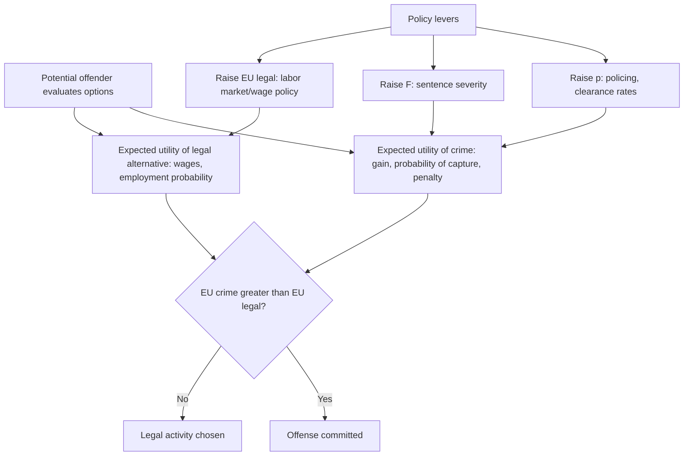

## Economic Models of Criminal Behavior in Cities

### Overview

Economic models of criminal behavior treat crime as the outcome of rational (or boundedly rational) individual decision-making under constraints, rather than purely as a pathological or sociological phenomenon. Gary Becker's foundational 1968 framework recast criminal behavior as a standard economic choice problem — comparing expected costs and benefits — enabling the tools of price theory, expected utility, and equilibrium analysis to be applied to crime, deterrence, and law enforcement policy. In an urban context, this framework connects directly to the spatial and neighborhood-based mechanisms covered earlier in this chapter: concentrated poverty, segregation, and limited access to opportunity systematically alter the expected returns to both legal and illegal activity across urban space.

### Becker's Rational Offender Model

#### Core Framework

Becker's (1968) model treats a potential offender as choosing whether to commit a crime by comparing the expected utility of criminal activity against the expected utility of legal alternatives. The expected utility of committing an offense is:

$$EU_{\text{crime}} = (1-p) \cdot U(Y + G) + p \cdot U(Y + G - F)$$

where:

- $G$: gain from the criminal act
- $p$: probability of apprehension and conviction
- $F$: cost/penalty imposed if caught (fine, incarceration disutility, stigma)
- $Y$: baseline (legal) income/wealth
- $U(\cdot)$: the individual's utility function

An individual commits the offense if $EU_{\text{crime}} > EU_{\text{legal}}$, where $EU_{\text{legal}}$ is the utility from the best available legal alternative (e.g., legitimate wage income).

#### Key Points

- **Deterrence has two levers**: The model implies that crime can be deterred either by raising $p$ (probability of detection/conviction — more policing, better investigative technology) or by raising $F$ (severity of punishment — longer sentences, harsher fines), and Becker's analysis showed these are not equivalent from a social cost-minimization standpoint, because increasing $p$ is resource-costly (more police, courts) while increasing $F$ is comparatively cheap on the margin (a longer sentence costs little extra to *impose*, though it has real social costs in incarceration and reduced future earnings).
- **Risk aversion and the certainty-severity trade-off**: If offenders are risk-averse, a given expected penalty ($p \times F$) achieved through high certainty/low severity deters more than the same expected penalty achieved through low certainty/high severity, because risk-averse individuals weight the certain component more heavily — a key theoretical prediction with direct policy implications for the "certainty vs. severity" debate in criminal justice policy.
- **Opportunity cost of legal income as a deterrent**: The model implies that raising legal labor market opportunities (wages, employment probability) for populations with elevated crime propensity reduces crime by raising $EU_{\text{legal}}$, providing the economic rationale for the empirical link between local labor markets and urban crime rates.

### Empirical Estimation Strategies

#### Deterrence Elasticities

Empirical work estimates the responsiveness of crime rates to changes in $p$ (clearance/arrest rates, police staffing) and $F$ (sentence length, incarceration rates), typically specified as elasticities:

$$\varepsilon_{\text{crime}, p} = \frac{\% \Delta \text{Crime Rate}}{\% \Delta p}$$

#### Key Points

- **Simultaneity/reverse causality problem**: A central identification challenge is that police staffing and crime rates are jointly determined — cities experiencing rising crime often *respond* by hiring more police, generating a spurious positive correlation between police presence and crime that masks the true negative deterrent effect, requiring instrumental variables or quasi-experimental designs to isolate causal effects.
- **Instrumental variable strategies**: Notable approaches include using electoral cycles (mayoral/gubernatorial election timing affecting police hiring, following Levitt's work), federal grant program timing (e.g., COPS grants), and terrorism-alert-level-driven police redeployment (e.g., studies of Washington D.C. police surges during heightened alert periods) as sources of plausibly exogenous variation in police presence.
- **[Unverified — magnitudes vary across studies and time periods]** The empirical consensus from this quasi-experimental literature generally finds a negative and economically meaningful elasticity of crime with respect to police presence, though estimated elasticity magnitudes vary across studies, crime types (violent vs. property), and cities studied.

### Spatial and Urban-Specific Extensions

#### Crime as a Function of Local Labor Market Conditions

Urban crime economics extends Becker's individual-level model to the neighborhood/city level by modeling aggregate crime rates as responsive to local labor market conditions:

$$\text{Crime Rate}_{it} = \alpha + \beta_1 \, \text{UnemploymentRate}_{it} + \beta_2 \, \text{WageLevel}_{it} + \beta_3 \, \text{Inequality}_{it} + X_{it}\gamma + \delta_i + \tau_t + \epsilon_{it}$$

with tract/city fixed effects $\delta_i$ and time fixed effects $\tau_t$ to net out unobserved persistent local factors and national trends.

#### Key Points

- **Property crime vs. violent crime differ in labor-market sensitivity**: Empirical work generally finds property crime is more consistently and robustly linked to local economic conditions (unemployment, wages) than violent crime, consistent with Becker's rational-calculus framework applying more cleanly to instrumentally motivated property offenses than to violent crime, which involves a larger role for non-pecuniary, situational, and interpersonal factors less well captured by the pure economic model.
- **Local income inequality as a distinct crime correlate**: Some studies find income inequality (not just the poverty rate or unemployment rate per se) is independently correlated with crime rates, sometimes interpreted through a relative deprivation or strain-theory lens that extends beyond Becker's pure absolute-cost-benefit calculus, though disentangling inequality's effect from correlated poverty and segregation effects (see Concentrated Urban Poverty) is methodologically challenging.

#### Spatial Concentration of Crime

Urban crime is highly spatially concentrated, a finding distinct from but complementary to the rational-choice framework:

- **"Hot spots" and micro-place criminology**: Research (notably Weisburd and colleagues) finds that a small share of street segments or specific addresses account for a disproportionate share of a city's total crime, with these "hot spots" often stable over long time periods — suggesting place-specific factors (situational crime opportunity, guardianship, built environment) matter alongside individual offender characteristics.
- **Broken windows / disorder theory**: The hypothesis (Wilson and Kelling, 1982) that visible signs of physical and social disorder (vandalism, loitering) signal reduced informal social control and guardianship, thereby increasing the perceived (and possibly actual) probability of successful offending — connecting to Becker's $p$ term via a signaling/information channel rather than direct enforcement resources. **[Unverified — empirical support for broken-windows-based policing specifically, as opposed to the underlying disorder-signaling theory, is contested across studies.]**

### Diagram: Economic Decision Framework for Crime

### General Equilibrium and Displacement Effects

#### Crime Displacement vs. Diffusion of Benefits

A key policy-relevant question is whether crime-reduction interventions in one location merely **displace** crime to nearby untargeted areas (spatial displacement) or generate a **diffusion of benefits** (crime reduction spilling over to adjacent areas, e.g., through reduced overall offender activity or improved general deterrence perception).

#### Key Points

- **[Behavior may vary]** Empirical evidence on hot-spot policing interventions generally finds that displacement, where it occurs, is typically smaller in magnitude than the direct crime reduction achieved at the targeted location, and diffusion-of-benefit effects are documented in a substantial share of studies — but the balance between displacement and diffusion varies by crime type, intervention design, and geographic context, so blanket claims that "crime never displaces" or "always displaces" are not supported by the full body of evidence.

### Repeat Offending, Human Capital, and Incarceration Effects

#### Incapacitation vs. Deterrence vs. Criminogenic Effects of Incarceration

Becker's framework primarily models deterrence (the effect of expected punishment on the decision to offend), but the broader economics-of-crime literature also models:

- **Incapacitation effect**: Crime reduction purely from physically removing offenders from the community during incarceration, independent of any deterrent effect on others.
- **Criminogenic/scarring effects**: The possibility that incarceration itself *reduces* subsequent legal labor market opportunities (via reduced human capital accumulation, employer discrimination against those with criminal records, and social network disruption), potentially *raising* $EU_{\text{crime}}$ relative to $EU_{\text{legal}}$ post-release and increasing recidivism — a mechanism in direct tension with the simple deterrence story, since sufficiently large scarring effects can make aggregate crime *higher* in the long run than a policy counterfactual with less incarceration.
- **[Inference]** Because incapacitation, deterrence, and criminogenic effects operate in different directions and over different time horizons (incapacitation is immediate and mechanical; criminogenic effects accumulate post-release), the net effect of increased incarceration on long-run aggregate crime is a quantitative empirical question rather than one resolved by theory alone, and estimates in the literature vary depending on which margin (marginal sentence length increase vs. marginal decision to incarcerate at all) and which population is studied.

### Urban Design and Situational Crime Prevention

#### Crime Prevention Through Environmental Design (CPTED)

A complementary, non-Becker-centric urban planning approach emphasizing how the built environment shapes crime opportunity independent of individual cost-benefit calculus: natural surveillance (sightlines, lighting), territorial reinforcement (clear public/private space boundaries), and access control (street layout, defensible space design following Oscar Newman's work).

#### Key Points

- **Complementarity with economic models**: CPTED and situational crime prevention can be understood within Becker's framework as interventions that raise the *effective* probability of detection/intervention ($p$) or reduce the *ease* of committing an offense (raising the effective "cost" of the criminal act itself, e.g., time and effort required), rather than as a wholly separate theoretical paradigm — connecting urban design directly back to the core rational-choice deterrence logic.

### Related Topics

- Concentrated urban poverty and its interaction with local crime rates
- Neighborhood effects and social interactions (peer effects in criminal behavior)
- Police resource allocation and hot-spot policing strategy
- Incarceration economics and labor market scarring effects
- Broken windows theory and disorder-based policing
- Spatial mismatch hypothesis and youth employment/crime linkages
- Crime prevention through environmental design (CPTED)
- Cost-benefit analysis of criminal justice policy interventions