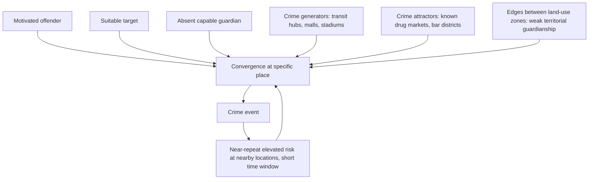

## Spatial Distribution of Crime

### Overview

The spatial distribution of crime examines *where* crime occurs within cities at fine geographic resolution, and why criminal activity concentrates so heavily in specific places rather than distributing evenly across urban space. This complements the individual-decision framework of economic models of criminal behavior by shifting the unit of analysis from the offender's choice to the geography of criminal opportunity — asking not only "who commits crime and why" but "why here, and not there." The field draws on environmental criminology, urban economics, and spatial statistics, and has become increasingly central to policing strategy and urban policy design.

### The Law of Crime Concentration

#### Weisburd's Empirical Finding

David Weisburd's research (building on earlier work by Sherman, Gartin, and Buerger) documents what Weisburd terms the **"law of crime concentration at places"**: across numerous cities and time periods studied, a remarkably small proportion of street segments or micro-places — commonly cited as roughly 4–6% of street segments in studied cities — account for approximately 50% of all crime incidents, a pattern found to be robust across very different cities and historical periods.

#### Key Points

- **Stability over time**: A striking feature of this concentration is its temporal persistence — the same specific street segments tend to remain high-crime "hot spots" across multi-year periods even as citywide crime rates rise and fall substantially, suggesting stable place-based causal factors rather than purely random fluctuation.
- **Distinct from neighborhood-level concentration**: Crime concentration at the *micro-place* (street segment, address) level is a finer-grained phenomenon than neighborhood- or tract-level crime rate variation (discussed under Concentrated Urban Poverty) — even within a single high-crime neighborhood, crime is itself highly concentrated on specific blocks, while most blocks in that same neighborhood experience little to no crime, a finding with direct implications for the geographic precision required in policing resource allocation.
- **[Inference]** Because concentration is so extreme and stable, place-based interventions targeted at a small number of specific high-crime locations can in principle address a disproportionately large share of total crime relative to their resource cost — the empirical foundation for hot-spot policing strategy — though realizing this potential depends on accurately identifying genuinely stable hot spots rather than locations experiencing temporary random fluctuation (regression to the mean risk).

### Theoretical Explanations for Spatial Concentration

#### Routine Activity Theory (Cohen and Felson, 1979)

Crime requires the convergence in time and space of three elements: a **motivated offender**, a **suitable target**, and the **absence of a capable guardian**. Spatial concentration arises because these three elements co-occur non-randomly across urban geography — certain locations (e.g., transit hubs, bars, certain retail corridors) systematically bring together offenders and unguarded targets at higher rates than others.

#### Crime Pattern Theory (Brantingham and Brantingham)

Extends routine activity theory by modeling offenders as having **activity spaces** (home, work, recreation locations) and **awareness spaces** (areas known to the offender through routine movement), with crime concentrated along the **paths** connecting these nodes and particularly at **edges** — boundaries between different land-use zones (e.g., where a residential area meets a commercial strip) where guardianship and social control are often weaker due to ambiguous territorial responsibility.

#### Key Points

- **Crime generators vs. crime attractors**: Brantingham and Brantingham distinguish **crime generators** (locations that draw large numbers of people for non-criminal purposes, incidentally creating opportunity — e.g., shopping malls, transit stations, stadiums during events) from **crime attractors** (locations that specifically draw motivated offenders because of known, exploitable criminal opportunity — e.g., open-air drug markets, bar districts known for late-night violence), a distinction relevant for tailoring place-based interventions differently depending on which mechanism dominates at a given hot spot.

#### Social Disorganization Theory

An older sociological framework (Shaw and McKay, 1942), predating the economic and situational approaches, attributing neighborhood-level crime variation to weakened informal social control resulting from residential instability, ethnic heterogeneity, and poverty — a precursor to the "collective efficacy" concept discussed under Neighborhood Effects and Social Interactions, and complementary to (rather than competing with) situational/routine-activity explanations of *micro*-place concentration.

### Spatial Statistical Methods

#### Kernel Density Estimation and Hot Spot Mapping

The standard technique for visualizing crime concentration from point-pattern data (individual incident locations), smoothing discrete crime events into a continuous density surface:

$$\hat{f}(x) = \frac{1}{nh^2} \sum_{i=1}^{n} K\left(\frac{x - x_i}{h}\right)$$

where $x_i$ are observed crime incident locations, $h$ is the bandwidth (smoothing parameter), and $K(\cdot)$ is a kernel function (commonly Gaussian or quartic).

#### Key Points

- **Bandwidth sensitivity**: The choice of bandwidth $h$ substantially affects the visual and statistical characterization of hot spots — too small a bandwidth produces noisy, unstable estimates driven by individual incidents; too large a bandwidth over-smooths and can mask genuinely distinct micro-place concentrations, requiring careful cross-validation or domain-informed bandwidth selection.

#### Spatial Autocorrelation Measures

- **Moran's I**: A global measure of spatial autocorrelation testing whether crime rates in nearby areal units (e.g., grid cells, block groups) are more similar than would be expected under spatial randomness:

$$I = \frac{n}{\sum_i \sum_j w_{ij}} \cdot \frac{\sum_i \sum_j w_{ij}(x_i - \bar{x})(x_j - \bar{x})}{\sum_i (x_i - \bar{x})^2}$$

where $w_{ij}$ is a spatial weight matrix (e.g., contiguity- or distance-based) and $x_i$ is the crime rate in unit $i$.

- **Local Indicators of Spatial Association (LISA)**: Decomposes global Moran's I into location-specific statistics, identifying statistically significant local clusters ("hot spots" of high-high spatial autocorrelation and "cold spots" of low-low autocorrelation) rather than a single citywide summary statistic.

#### Near-Repeat Analysis

A method examining whether crimes (particularly burglary and, in some studies, gun violence) cluster not only in space but in **space-time** — finding that a crime at a given location elevates the risk of subsequent crime at nearby locations within a limited time window (days to weeks), a pattern attributed to repeat/near-repeat victimization mechanisms (e.g., a burglar returning to a profitable area, or retaliatory violence following an initial incident).

### Diagram: Mechanisms of Spatial Crime Concentration

### Policing and Policy Applications

#### Hot Spot Policing

The dominant place-based policing strategy derived directly from the crime-concentration literature: rather than distributing patrol resources uniformly or reactively, police allocate concentrated, often randomized or systematically rotated patrol presence specifically to identified high-crime micro-places.

#### Key Points

- **Randomized controlled trial evidence**: Hot spot policing has been subject to more randomized controlled trials than most policing strategies (a notable methodological strength in criminal justice research generally), with the accumulated evidence (including systematic reviews and meta-analyses) generally finding modest but statistically significant crime reductions at treated hot spots, with limited average displacement to surrounding areas (see Economic Models of Criminal Behavior in Cities for the displacement/diffusion discussion).
- **Predictive policing and algorithmic hot-spot identification**: Modern extensions use statistical/machine-learning models trained on historical crime data to forecast near-term hot-spot locations for proactive patrol allocation; **[Unverified — contested in current research and policy debate]** this approach has drawn substantial scrutiny over concerns that historical crime data used for training can embed and perpetuate patterns of biased or disproportionate historical enforcement, an active area of ongoing algorithmic-fairness and criminal-justice-policy research and litigation.

#### Situational Crime Prevention at Micro-Places

Building on the crime-pattern-theory framework, place-specific interventions (improved lighting, altered street layout, third-party accountable ownership of problem properties, business-improvement-district-funded private security) target the *opportunity structure* at specific hot spots rather than the broader population of potential offenders — closely related to the CPTED approach discussed under Economic Models of Criminal Behavior in Cities.

### Urban Design and the Built Environment

#### Key Points

- **Street network configuration**: Research using space syntax and street-network analysis has examined whether more permeable, highly connected street grids (versus cul-de-sac/dead-end-heavy suburban layouts) are associated with different crime patterns, with findings **[behavior may vary]** differing by crime type — some studies find higher-connectivity streets see more property crime (easier offender access/egress) while others emphasize that well-used, highly connected streets can also generate more natural surveillance ("eyes on the street," following Jane Jacobs), meaning the net relationship between street connectivity and crime is not uniformly signed across contexts.
- **Vacant and abandoned property effects**: Quasi-experimental studies (including some using city-level vacant lot greening/remediation programs as natural experiments) have found reductions in nearby crime following the remediation of vacant lots and abandoned buildings, interpreted as evidence for reduced crime-attractor/reduced-guardianship mechanisms tied to physical disorder and vacancy.

### Data Sources and Measurement Considerations

- **Incident-level police recorded crime data (CAD/RMS systems)**: The primary data source for spatial crime analysis, geocoded to address or block level; subject to important measurement caveats including reporting/recording practices that vary by jurisdiction, era, and crime type (e.g., low reporting rates for certain offenses like sexual assault relative to their true incidence).
- **National Incident-Based Reporting System (NIBS/NIBRS)**: The U.S. FBI's incident-level crime reporting standard (increasingly replacing the older Uniform Crime Reports summary-based system), providing richer incident detail relevant to spatial and situational analysis, though jurisdictional transition to full NIBRS reporting has been gradual and uneven across the U.S.
- **Victimization surveys as a complement**: The National Crime Victimization Survey (NCVS) captures crime incidents regardless of police reporting, useful for benchmarking the "dark figure" of unreported crime, though it lacks the fine geographic precision needed for micro-place spatial analysis.

### Related Topics

- Economic models of criminal behavior in cities (individual decision framework underlying spatial patterns)
- Concentrated urban poverty and neighborhood-level (vs. micro-place) crime variation
- Neighborhood effects and social interactions (collective efficacy and informal social control)
- Hot spot policing evaluation methodology and randomized controlled trials
- Predictive policing and algorithmic fairness in criminal justice
- Crime prevention through environmental design (CPTED)
- Vacant property remediation and urban blight policy
- Broken windows theory and disorder-focused policing strategy