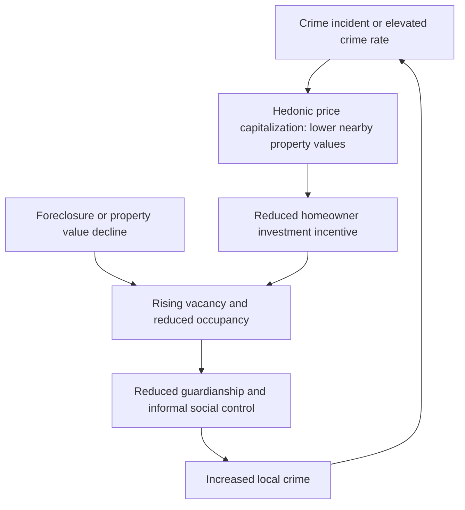

## Crime, Property Values, and Neighborhood Effects

### Overview

This topic examines the bidirectional relationship between crime and residential property values, and how this relationship interacts with the neighborhood-effects mechanisms covered earlier in this chapter. Crime affects property values through capitalization into housing prices (a hedonic pricing application), while property values and neighborhood economic conditions in turn affect crime through the channels discussed under Economic Models of Criminal Behavior in Cities — creating a potential feedback loop with implications for neighborhood decline, gentrification dynamics, and the persistence of concentrated disadvantage.

### Hedonic Pricing Framework for Crime Capitalization

#### Core Model

Following standard hedonic price theory (Rosen, 1974), a home's price is modeled as a function of its bundle of characteristics, including local crime exposure:

$$\ln(P_i) = \alpha + \beta_1 \, \text{Structural}_i + \beta_2 \, \text{Neighborhood}_i + \beta_3 \, \text{Crime}_i + \epsilon_i$$

where $\text{Crime}_i$ is a measure of local crime exposure (e.g., crime rate within a specified radius or the same Census block group), and $\beta_3$ (expected to be negative) captures the implicit price households pay to avoid crime exposure, revealed through their willingness to pay more for otherwise identical homes in lower-crime areas.

#### Marginal Willingness to Pay for Crime Reduction

The hedonic coefficient $\beta_3$ can be used to back out an implicit valuation of crime reduction:

$$\text{MWTP for crime reduction} = -\beta_3 \times P_i$$

This valuation approach is widely used in cost-benefit analysis of crime-reduction policies, translating crime-rate changes into a dollar-denominated welfare measure comparable to policy costs.

#### Key Points

- **Crime type heterogeneity in capitalization**: Empirical hedonic studies generally find violent crime (particularly homicide) is capitalized into property values more strongly than property crime, and some studies find highly salient but rare/random crime types (e.g., publicized homicides) generate disproportionately large price effects relative to their contribution to overall expected victimization risk — consistent with behavioral research on availability bias and salience effects in risk perception, an extension beyond the standard rational-expectations hedonic framework.
- **Spatial decay of crime price effects**: Price effects of a given crime incident typically decay with distance from the incident location and over time following the event, with most studies finding effects concentrated within a few blocks and dissipating within roughly a year, though precise decay parameters vary by study design and crime type.
- **Endogeneity challenge**: As with most hedonic applications, crime rates are not randomly assigned across neighborhoods — unobserved neighborhood quality (school quality, aesthetics, social capital) is likely correlated with both crime rates and prices independent of any causal crime effect, biasing naive OLS estimates of $\beta_3$ if unaddressed.

### Identification Strategies for Causal Crime Effects on Prices

#### Quasi-Experimental Designs

- **Sex offender registry/proximity studies**: A widely used quasi-experimental design examines property value effects of a registered sex offender moving into a neighborhood, using the specific, dateable, and often plausibly idiosyncratic timing/location of an offender's move as a source of exogenous-ish variation, compared via difference-in-differences against nearby unaffected properties.
- **Crime-rate shocks from exogenous policy changes**: Some studies exploit large, plausibly exogenous shifts in local crime rates (e.g., following the opening or closing of a specific facility such as a halfway house or a change in a nearby jurisdiction's policing intensity) as a natural experiment for estimating price capitalization.
- **Boundary discontinuity designs**: Comparing home prices on either side of a school district or municipal boundary where crime rates discretely differ (often because of differential jurisdictional policing or reporting practices) while other neighborhood amenities vary smoothly across the boundary.
- **High-frequency event-study designs around specific incidents**: Using precise timing and geocoding of individual crime incidents (particularly homicides) to estimate price effects via event-study or difference-in-differences designs comparing very nearby properties sold shortly before versus after an incident.

#### Key Points

- **[Unverified — magnitudes vary substantially across study designs and cities]** The quasi-experimental literature generally confirms a negative causal effect of local crime, and particularly violent crime, on nearby property values, but estimated magnitudes (dollar value per crime, or percentage price effect per unit crime-rate change) vary considerably depending on city, crime type, time period, and specific identification strategy used, making a single universal "price of crime" figure inappropriate to apply across contexts.

### Reverse Causality: Property Values and Neighborhood Conditions Affecting Crime

#### Foreclosure and Vacancy Effects

A substantial body of research, particularly following the 2008 U.S. foreclosure crisis, examines whether property value declines and resulting vacancy/foreclosure themselves *cause* increased local crime, reversing the more commonly studied crime-to-price direction:

- **Foreclosure-crime studies**: Using the plausibly exogenous timing of individual foreclosure filings (driven substantially by macro-financial shocks rather than neighborhood-specific crime trends) as an instrument, several studies found measurable increases in nearby crime (particularly property crime and, in some studies, violent crime) associated with nearby foreclosures and resulting vacancy — attributed to reduced guardianship (following routine activity theory, see Spatial Distribution of Crime) and reduced informal social control in increasingly vacant blocks.
- **Vacant lot and abandoned building studies**: As discussed under Spatial Distribution of Crime, vacant property remediation (lot greening, boarding/securing abandoned structures) quasi-experiments generally find crime *reductions* following remediation, supporting the reverse-causal (property-condition-to-crime) channel as a genuine, not merely correlational, mechanism.

#### Diagram: Bidirectional Crime-Property Value Relationship

### Feedback Loops and Neighborhood Decline

#### The Crime-Disinvestment Spiral

Combining the two causal directions above yields a potential self-reinforcing cycle: crime reduces property values, which reduces homeowner equity and investment incentive (and can trigger increased foreclosure/vacancy in a downturn), which in turn increases vacancy and reduces guardianship, further increasing crime — a dynamic structurally analogous to the concentrated-poverty and disinvestment feedback loops discussed under Concentrated Urban Poverty and the rent-gap dynamics under Gentrification and Neighborhood Change.

#### Key Points

- **Tipping-point dynamics**: **[Inference]** Similar to Schelling-style segregation tipping (see Residential Segregation Models), the crime-property value-vacancy feedback loop plausibly exhibits tipping-point behavior — below some threshold of crime/vacancy, informal social control and homeowner investment are self-sustaining, but above a critical threshold, the feedback becomes self-reinforcing in the negative direction — though direct empirical estimation of a specific tipping threshold analogous to Schelling's tolerance parameter is less developed in the crime-property literature than in the segregation literature.
- **Interruption points for policy**: Because the cycle is self-reinforcing in both directions, policy interventions can in principle enter at multiple points — direct crime reduction (policing, situational prevention), property-condition remediation (vacant lot/building programs), or housing-market stabilization (foreclosure prevention, mortgage assistance) — with the choice of intervention point a matter of relative cost-effectiveness and political feasibility rather than a single theoretically "correct" entry point.

### Interaction with Gentrification

#### Crime Reduction as a Gentrification Precursor

Falling crime rates are commonly identified in the gentrification literature (see Gentrification and Neighborhood Change) as one of several factors that can widen the "rent gap" or shift demand-side preferences toward a previously disinvested neighborhood, since reduced crime directly raises the potential capitalized rent achievable in redevelopment. Notably, the substantial nationwide U.S. crime decline from the early 1990s through the 2000s coincided with, and is frequently cited as a contributing factor to, the acceleration of urban gentrification and downtown/inner-city revitalization observed over the same period in many U.S. cities.

#### Key Points

- **[Inference]** Because crime reduction both directly raises property values (via hedonic capitalization) and indirectly enables broader neighborhood reinvestment and demand-side preference shifts (gentrification precursors), effective crime-reduction policy in disinvested neighborhoods carries an inherent tension: it improves welfare and safety for existing residents in the near term, but by raising property values, it can also accelerate the displacement-pressure dynamics discussed under Gentrification and Neighborhood Change, particularly for renter households — a distributional consideration relevant to how crime-reduction success is evaluated from an equity standpoint, separate from its clear net safety benefits.

### Measurement and Data Considerations

- **Repeat-sales and hedonic price index construction**: Because crime effects are typically small relative to overall price variation driven by structural and broader-market factors, precise estimation typically requires either large transaction datasets (assessor/deed records) or repeat-sales methodologies that difference out fixed, unobserved property characteristics.
- **Crime data geocoding precision**: The reliability of hedonic crime-capitalization estimates depends heavily on the geographic precision of underlying crime data (address-level vs. block-group-level vs. reporting-district-level), with coarser geographic crime data likely to attenuate (bias toward zero) estimated capitalization effects due to measurement error in exposure.
- **Perceived vs. actual crime risk**: Some research finds property price effects correlate more closely with *perceived* neighborhood safety (e.g., survey-based perception measures, or media coverage intensity) than with objectively measured crime statistics, suggesting information/salience frictions are relevant to how crime risk is actually priced into housing markets, beyond the pure rational-expectations hedonic model.

### Related Topics

- Economic models of criminal behavior in cities (individual decision framework)
- Spatial distribution of crime (micro-place concentration and vacant property effects)
- Gentrification and neighborhood change (crime reduction as a redevelopment precursor)
- Concentrated urban poverty (disinvestment feedback loops)
- Hedonic pricing models and willingness-to-pay estimation
- Foreclosure crisis effects on neighborhood stability
- Residential segregation models (tipping-point dynamics analogy)
- Vacant property remediation and urban blight policy