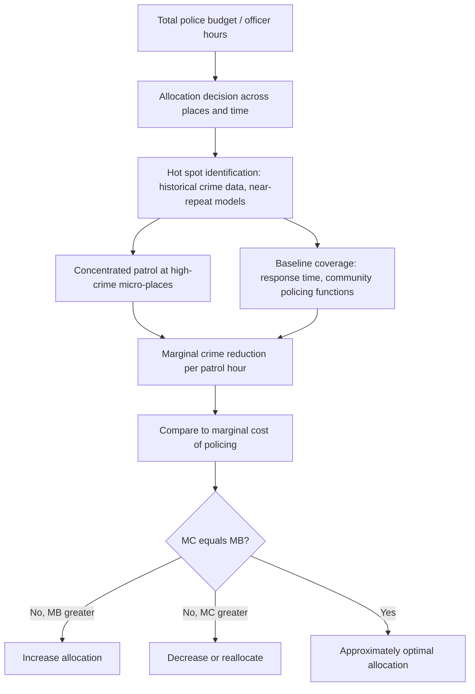

## Policing Economics and Law Enforcement Allocation

### Overview

Policing economics applies public-sector resource allocation theory, production-function analysis, and cost-benefit methodology to law enforcement, addressing how police budgets, staffing, and deployment strategies should be determined to maximize social welfare given scarce resources. This topic operationalizes the deterrence framework from Economic Models of Criminal Behavior in Cities and the spatial-concentration findings from Spatial Distribution of Crime into concrete resource-allocation questions: how many officers a jurisdiction should employ, how they should be deployed spatially and temporally, and how to value crime-reduction outcomes against fiscal and social costs.

### The Police Production Function

#### Formal Specification

Police services are modeled as an input into a **crime production function**, where crime reduction is an output of police resources combined with other inputs:

$$\text{Crime Rate}_{it} = f(\text{Police}_{it}, \text{SocioeconomicFactors}_{it}, \text{Deterrence Technology}_{it})$$

with the key policy-relevant parameter being the marginal product of police resources — the crime reduction achieved from an additional unit of police input (officers, patrol hours, or technology investment).

#### Key Points

- **Diminishing returns**: Standard production-function logic implies diminishing marginal returns to police staffing beyond some point — the crime-reduction value of the 500th officer in a jurisdiction is generally expected to be lower than the 50th, though the specific shape of this curve (and where diminishing returns become binding) is jurisdiction-specific and depends on baseline staffing levels and deployment efficiency.
- **Input substitutability**: The production function treats officer staffing, patrol technology (surveillance cameras, license plate readers, predictive analytics), and deployment strategy (hot-spot targeting vs. uniform patrol) as potentially substitutable or complementary inputs, meaning the same crime-reduction output can in principle be achieved through different input combinations with different cost structures — a key consideration for jurisdictions facing budget constraints.
- **Measurement of "police input"**: Empirical studies vary in whether they measure police input as sworn officer headcount, total police expenditure, or officer-hours actually deployed on patrol (net of administrative, court, and training time) — these measures can diverge substantially, and studies using cruder proxies (e.g., total spending, which includes non-patrol costs) may understate the true marginal product of deployable patrol capacity.

### Optimal Staffing and the Marginal Cost of Crime Reduction

#### Cost-Benefit Framework

The economically optimal police staffing level equates the marginal cost of an additional unit of policing with the marginal social benefit (value of crime averted):

$$MC(\text{Police}) = MB(\text{Crime Reduction}) = -\frac{\partial \text{Crime Rate}}{\partial \text{Police}} \times V(\text{Crime})$$

where $V(\text{Crime})$ is the social value (cost) of a marginal crime, drawing on cost-of-crime estimates (victim costs, criminal justice system costs, and — per the hedonic literature discussed under Crime, Property Values, and Neighborhood Effects — capitalized property value effects).

#### Key Points

- **Cost-of-crime estimation challenges**: Constructing $V(\text{Crime})$ requires aggregating direct victim costs (medical, property loss, lost productivity), criminal justice system processing costs, and harder-to-quantify costs (fear of crime, avoidance behavior, quality-of-life effects) — estimates vary substantially across studies and crime type, with violent crime (particularly homicide, using value-of-statistical-life methodology) generating much higher $V(\text{Crime})$ estimates than property crime.
- **[Unverified — a matter of ongoing academic and policy debate]** Several studies using the quasi-experimental police-staffing elasticities discussed under Economic Models of Criminal Behavior in Cities have argued that observed marginal returns to additional police staffing, evaluated against standard cost-of-crime estimates, suggest many U.S. cities were under-policed relative to the social-welfare-maximizing level in the studied periods — a conclusion that remains contested given uncertainty in both the deterrence-elasticity estimates and the cost-of-crime valuations underlying the comparison, and given that the analysis abstracts from non-crime-reduction costs of policing (community relations, civil liberties, disparate enforcement impacts) not captured in a narrow cost-benefit frame.

### Spatial and Temporal Deployment Strategies

#### Hot Spot Policing (Resource Allocation Application)

Building directly on the crime-concentration findings under Spatial Distribution of Crime, the police resource-allocation problem can be framed as a constrained optimization: given a fixed patrol budget (officer-hours), allocate patrol presence across geographic micro-places to maximize aggregate crime reduction, subject to the empirical finding that a small share of places generates a large share of crime.

$$\max_{\{h_k\}} \sum_k \Delta \text{Crime}_k(h_k) \quad \text{s.t.} \quad \sum_k h_k \leq H$$

where $h_k$ is patrol hours allocated to place $k$, $\Delta \text{Crime}_k(h_k)$ is the (typically concave) crime-reduction response function at place $k$, and $H$ is total available patrol-hour budget.

#### Key Points

- **Concentration implies allocation should also be concentrated, but not infinitely**: Because crime concentration is extreme (Weisburd's "law of crime concentration," see Spatial Distribution of Crime) but the crime-reduction response to patrol presence is generally concave (diminishing returns to additional hours at any single hot spot), optimal allocation under this framework calls for *disproportionate* but not *exclusive* concentration of resources — some baseline coverage of lower-crime areas remains optimal both for crime-reduction and for other policing functions (community relations, response-time requirements for non-hot-spot emergencies) not captured in a pure crime-minimization objective.
- **Randomization vs. fixed deployment**: Some hot-spot policing implementations use randomized or unpredictable patrol scheduling at identified hot spots (rather than fixed, predictable schedules) on the theory that unpredictability raises offenders' *perceived* probability of encountering guardianship at any given time even without proportionally increasing total patrol hours — an application of the deterrence-via-perceived-$p$ mechanism from Becker's framework (see Economic Models of Criminal Behavior in Cities).

#### Predictive Policing and Algorithmic Allocation

Modern deployment increasingly uses statistical/machine-learning forecasting models (e.g., near-repeat pattern models, risk-terrain modeling) to predict short-term hot-spot locations for proactive allocation, discussed in more technical measurement detail under Spatial Distribution of Crime. From a resource-allocation standpoint, these tools are best understood as attempts to improve the accuracy of the $\Delta \text{Crime}_k(h_k)$ forecast used in the deployment optimization, rather than as a fundamentally distinct allocation theory.

### Diagram: Police Resource Allocation Framework

### Policing Technology and Capital Investment

#### Surveillance and Detection Technology

- **Closed-circuit television (CCTV) and license plate readers**: Function economically as a substitute or complement for officer-hours in raising the effective probability of detection/apprehension ($p$ in Becker's framework), with cost-effectiveness evaluations comparing technology capital and maintenance costs against equivalent officer-hour deployment costs for a given crime-reduction outcome.
- **[Behavior may vary]** Empirical evaluations of CCTV crime-reduction effectiveness show substantial heterogeneity across studies and contexts, with some meta-analyses finding modest effects concentrated particularly in parking facilities and other confined, well-monitored spaces, and smaller or non-significant effects in open public spaces — implying technology effectiveness is highly context- and implementation-specific rather than uniformly generalizable.

#### Body-Worn Cameras

Distinct from crime-detection technology, body-worn cameras are primarily evaluated in the economics literature for their effects on officer behavior (use-of-force incidents, civilian complaints) and on prosecutorial/evidentiary outcomes, representing a different margin of policing economics — oversight and accountability cost-effectiveness — rather than direct crime-deterrence resource allocation.

### Non-Crime-Reduction Costs and Constraints on Optimization

#### Key Points

- **Disparate impact and enforcement equity**: A pure crime-minimization resource-allocation framework, if applied without additional constraints, could in principle recommend allocation patterns that disproportionately concentrate enforcement contact (stops, arrests, use of force) in specific demographic or geographic populations, raising equity, civil liberties, and community-trust considerations that a narrow cost-benefit optimization does not automatically internalize — an active area of research and policy debate regarding how to incorporate such constraints formally into police resource-allocation models (e.g., through explicit equity constraints or broader social welfare functions beyond crime-count minimization).
- **Legitimacy and community trust as a production input**: Some research (procedural justice literature) argues that community trust in police is itself an input into effective crime control (through willingness to report crime, cooperate with investigations, and comply voluntarily with law), implying that allocation strategies perceived as unfair or overly aggressive can be self-undermining even on pure crime-reduction grounds, not only on equity grounds — an argument for incorporating legitimacy effects into the production function itself rather than treating them as an external constraint.
- **Fiscal federalism and local funding constraints**: Because U.S. policing is overwhelmingly locally funded (primarily via municipal property and sales tax revenue), jurisdictions with lower fiscal capacity (often correlated with concentrated poverty, see Concentrated Urban Poverty) may be constrained well below the social-welfare-maximizing staffing level identified by cost-benefit analysis, independent of the technical crime-production relationship — a structural, non-technical constraint on achieving allocative efficiency.

### Empirical Identification Recap

As discussed under Economic Models of Criminal Behavior in Cities, credible estimation of the police production function's key parameters (marginal product of officers, deterrence elasticities) requires addressing the simultaneity between crime rates and police staffing, typically via instrumental variables (election-cycle hiring patterns, federal grant timing, terrorism-alert-driven surge deployments) or natural experiments in deployment strategy (randomized hot-spot patrol trials).

### Related Topics

- Economic models of criminal behavior in cities (deterrence theory underlying allocation)
- Spatial distribution of crime (hot-spot identification and concentration statistics)
- Crime, property values, and neighborhood effects (cost-of-crime valuation via hedonic methods)
- Predictive policing and algorithmic fairness in law enforcement
- Procedural justice and police legitimacy research
- Municipal fiscal federalism and local public safety budgeting
- Cost-benefit analysis methodology in public economics
- Value of statistical life and non-market valuation techniques