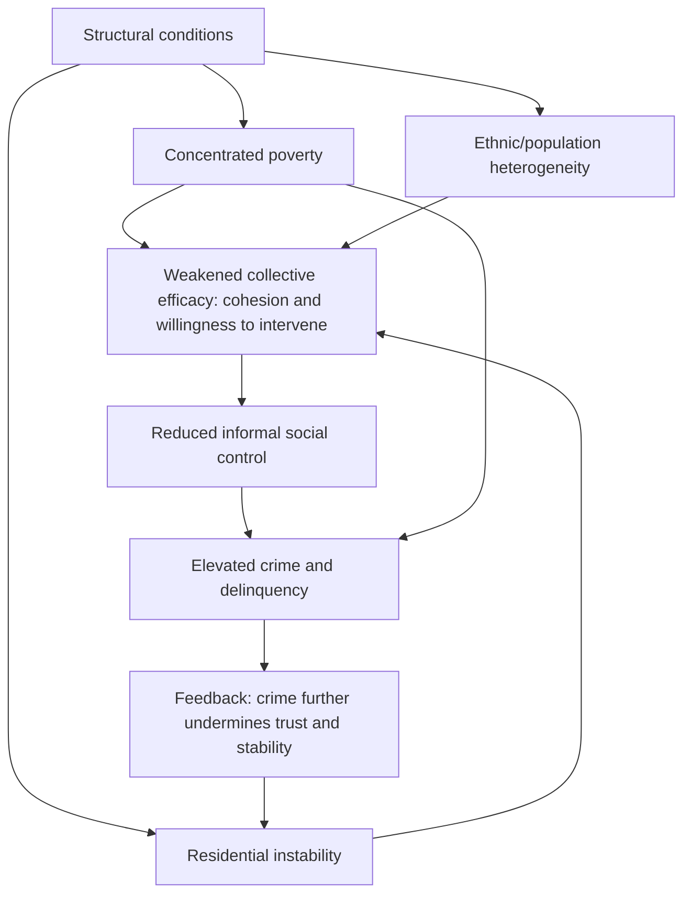

## Social Disorganization and Urban Crime

### Overview

Social disorganization theory explains variation in urban crime rates through the lens of neighborhood structural characteristics that weaken a community's capacity for collective informal social control, rather than through individual offender rational-choice calculus (Economic Models of Criminal Behavior in Cities) or purely situational opportunity structures (Spatial Distribution of Crime). Originating in early-20th-century Chicago School sociology, the theory has been substantially reformulated and empirically extended by urban economists and criminologists, and today functions as a key bridge connecting the neighborhood-effects and segregation literatures (earlier in this chapter) directly to crime outcomes.

### Origins: The Chicago School Framework

#### Shaw and McKay's Ecological Model (1942)

Clifford Shaw and Henry McKay, studying Chicago juvenile delinquency records across multiple decades, found that delinquency rates remained persistently high in the same geographic zones of the city — despite substantial turnover in the racial and ethnic composition of residents in those zones over time. This finding was foundational: it implied that something about the *place* itself, rather than the specific population occupying it, sustained elevated crime and delinquency.

#### Key Points

- **Zonal/concentric-zone model**: Shaw and McKay's Chicago was analyzed via Ernest Burgess's concentric-zone urban model, with the "zone in transition" (adjacent to the central business district, characterized by mixed industrial/residential land use, deteriorating housing, and high population turnover) consistently showing the highest delinquency rates across successive waves of different immigrant and migrant groups.
- **Structural, not cultural or individual, explanation**: The persistence of high delinquency in the same zones despite complete population turnover was interpreted as strong evidence against purely individual-pathology or ethnic-group-specific cultural explanations popular at the time, and in favor of a structural/ecological explanation tied to the neighborhood's stable characteristics (land use, poverty, residential instability) rather than to who specifically lived there.

#### Three Structural Predictors

Shaw and McKay identified three neighborhood-level structural conditions consistently associated with elevated delinquency:

1. **Low socioeconomic status**: Concentrated poverty reduces resources available for informal social control and formal community institutions.
2. **Ethnic/racial heterogeneity**: Diverse populations face communication and trust barriers that can impede the formation of shared normative consensus and collective action, independent of any single group's characteristics.
3. **Residential instability/mobility**: High population turnover disrupts the formation of long-term social ties, local institutions, and mutual accountability networks needed to sustain informal social control.

### Reformulation: Systemic Model and Collective Efficacy

#### The Systemic Model (Kasarda and Janowitz, 1974)

A key reformulation reframed social disorganization not as an absence of organization per se, but as a **systemic** failure of a community's local social network structure — the density and strength of local friendship, kinship, and associational ties — to translate into effective collective action and mutual supervision of public space and youth behavior.

#### Collective Efficacy Theory (Sampson, Raudenbush, and Earls, 1997)

The most influential modern reformulation, introduced under Neighborhood Effects and Social Interactions but detailed further here for its crime-specific application. **Collective efficacy** is defined as the combination of (a) social cohesion/mutual trust among neighbors and (b) shared willingness to intervene for the common good (e.g., to stop children from truancy or vandalism, to confront disorder).

$$\text{Collective Efficacy} = \text{Social Cohesion} \times \text{Willingness to Intervene}$$

Sampson, Raudenbush, and Earls's Chicago-based study found collective efficacy was a strong independent predictor of lower neighborhood violence rates, and that it substantially (though not entirely) mediated the relationship between neighborhood structural disadvantage (poverty, residential instability, concentrated disadvantage) and violent crime.

#### Key Points

- **Mediation, not full substitution**: Collective efficacy research generally finds that structural disadvantage still has some direct effect on crime beyond what is explained through reduced collective efficacy, meaning the theory refines rather than fully replaces the structural social-disorganization account — poverty and instability appear to operate both through weakened collective efficacy and through other channels (e.g., reduced institutional resources, economic-motive crime as in Becker's framework).
- **Distinguishing collective efficacy from mere social ties**: An important theoretical refinement is that dense social networks alone do not guarantee collective efficacy — networks characterized by strong ties but weak shared normative expectations, or networks embedded in gang or criminal organization structures, do not produce the same crime-reducing effect as networks combining trust with willingness to actively intervene against disorder and delinquency.

### Formal Empirical Specification

#### Multilevel Modeling Approach

Because social disorganization theory makes predictions at the neighborhood level while data on individuals (survey responses on collective efficacy, victimization) and crime incidents are nested within neighborhoods, the standard empirical approach uses **hierarchical/multilevel models**:

$$\text{Crime Rate}_{j} = \gamma_0 + \gamma_1 \, \text{Poverty}_j + \gamma_2 \, \text{Heterogeneity}_j + \gamma_3 \, \text{Instability}_j + \gamma_4 \, \text{CollectiveEfficacy}_j + u_j$$

where $j$ indexes neighborhoods (typically Census tracts or custom-defined "neighborhood clusters" combining several tracts, as in the Chicago study's design), and collective efficacy $\text{CollectiveEfficacy}_j$ is itself typically constructed from aggregated resident survey responses at the neighborhood level.

#### Key Points

- **Ecometrics**: Sampson and colleagues developed specific methodological approaches ("ecometrics," by analogy to psychometrics) for validly measuring neighborhood-level constructs like collective efficacy from aggregated individual survey responses, addressing measurement reliability concerns distinct from those in individual-level survey research.
- **Endogeneity of collective efficacy itself**: A persistent identification challenge is that collective efficacy is plausibly both a cause and a consequence of local crime and disorder (low crime may itself foster the trust and engagement that constitutes collective efficacy, in addition to the reverse), and observational cross-sectional designs (including the original Sampson et al. study) cannot fully rule out this reverse-causality/simultaneity concern without longitudinal or quasi-experimental variation.

### Diagram: Social Disorganization to Crime Pathway

### Relationship to Concentrated Poverty and Segregation

#### Key Points

- **Direct linkage to Wilson's structural framework**: Social disorganization/collective efficacy theory provides the micro-social mechanism underlying William Julius Wilson's structural account of concentrated urban poverty (see Concentrated Urban Poverty) — Wilson's emphasis on the loss of social buffers and weakened institutions following selective outmigration is, in social-disorganization terms, a description of declining collective efficacy resulting from the compositional and structural changes he documents.
- **Segregation as a structural antecedent**: Because residential segregation (see Residential Segregation Models) concentrates disadvantage and, in some contexts, contributes to the racial/ethnic heterogeneity dimension originally identified by Shaw and McKay (though this specific pathway is debated, since collective efficacy research finds racial heterogeneity's effect is often substantially weaker or non-significant once concentrated poverty and residential instability are controlled for), segregation functions as one of several structural inputs into the social-disorganization/collective-efficacy causal chain rather than a wholly separate crime-causal pathway.
- **[Inference]** Because social disorganization theory identifies residential instability as a core structural driver of weakened collective efficacy, policies that increase housing instability (e.g., poorly designed housing voucher programs causing frequent forced moves, or aggressive eviction practices) could plausibly undermine collective efficacy and increase local crime risk even if those same policies have other beneficial goals (e.g., de-concentrating poverty), representing a potential unintended trade-off warranting empirical evaluation specific to each policy design rather than an assumption in either direction.

### Empirical Evidence and Critiques

#### Supporting Evidence

**[Unverified — findings and effect sizes vary across replications and cities]** Following the original Chicago study, replications and extensions in other U.S. cities and internationally have generally found collective efficacy negatively associated with violence, though effect magnitudes and the degree of mediation of structural disadvantage effects vary across study contexts, urban forms, and measurement approaches.

#### Key Critiques

- **Reverse causality and omitted variable concerns**: As noted, cross-sectional designs cannot definitively separate collective efficacy's causal effect on crime from crime's effect on collective efficacy, or from unobserved third factors (e.g., unmeasured aspects of local governance or historical disinvestment) driving both.
- **Applicability beyond the original urban U.S. context**: Because the theory and its primary empirical tests were developed in the specific context of early-to-mid 20th-century and late-20th-century U.S. cities (particularly Chicago), questions remain about generalizability to different urban forms, welfare-state contexts, and non-U.S. settings, an active area of comparative international criminology research.
- **Structural vs. agency balance**: Some critics argue social disorganization theory, even in its collective-efficacy form, risks understating the role of external structural forces (labor market conditions, criminal justice policy, drug market economics) relative to internal neighborhood social dynamics, suggesting the theory is best understood as one important explanatory layer among several (including the economic and situational models covered elsewhere in this chapter) rather than a complete standalone account of urban crime variation.

### Policy Implications

- **Community-based crime prevention programs**: Programs explicitly aiming to build local social ties, resident organization capacity, and community-police collaboration (e.g., community policing models, resident association support) draw directly on collective-efficacy theory's crime-reduction mechanism, distinct from either pure deterrence-based (more policing/harsher sentencing) or purely situational (target-hardening) approaches.
- **Housing stability policy as crime policy**: Given the residential-instability component of the theory, policies that reduce involuntary displacement and housing instability (eviction prevention, housing subsidy design minimizing forced moves) can be understood as having a plausible, if not fully quantified, crime-prevention rationale in addition to their direct housing-welfare rationale.
- **Complementarity, not substitution, with economic and situational crime models**: **[Inference]** Because social disorganization/collective-efficacy mechanisms and the individual rational-choice (Becker) and situational/routine-activity mechanisms operate through different causal channels, comprehensive urban crime-reduction strategy plausibly benefits from combining approaches (community-building alongside targeted policing and situational prevention) rather than treating them as competing theoretical paradigms requiring a single "correct" policy response.

### Related Topics

- Neighborhood effects and social interactions (collective efficacy detailed treatment)
- Concentrated urban poverty (Wilson's structural framework linkage)
- Residential segregation models (heterogeneity and structural antecedents)
- Economic models of criminal behavior in cities (complementary rational-choice framework)
- Spatial distribution of crime (situational/routine-activity complementary framework)
- Ecometrics and multilevel modeling methodology
- Community policing and community-based crime prevention program design
- Housing instability, eviction, and neighborhood stability policy