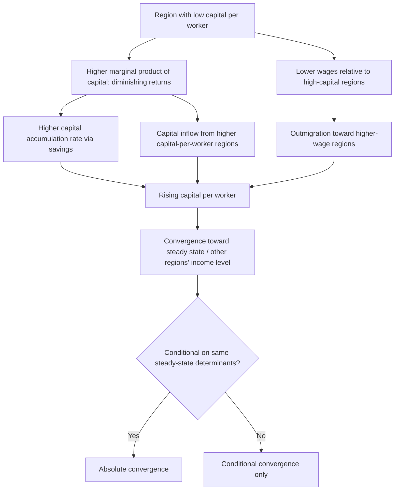

## Neoclassical Regional Growth Models

### Overview

Neoclassical regional growth models extend the Solow-Swan aggregate growth framework to the sub-national/regional level, analyzing how regions grow, whether their per-capita incomes converge or diverge over time, and what role factor mobility (capital and labor movement across regions) plays in that process. Unlike national growth models, which typically treat capital and labor as internationally immobile, regional models must explicitly account for high factor mobility across regions within a country — a defining feature that shapes both the theoretical predictions and empirical testing strategy distinct from cross-country growth economics.

### The Solow-Swan Foundation Applied to Regions

#### Basic Regional Production Function

Each region $i$ produces output using a constant-returns-to-scale, diminishing-marginal-product production function, typically Cobb-Douglas:

$$Y_i = A_i K_i^{\alpha} L_i^{1-\alpha}$$

where $Y_i$ is regional output, $K_i$ is capital, $L_i$ is labor, $A_i$ is total factor productivity (technology level, assumed common across regions in the baseline model or exogenously region-specific in extensions), and $\alpha$ is capital's output elasticity.

#### The Regional Solow Growth Equation

In per-worker terms ($y_i = Y_i/L_i$, $k_i = K_i/L_i$), capital accumulation follows:

$$\dot{k}_i = s \, f(k_i) - (n_i + \delta) k_i$$

where $s$ is the savings rate, $f(k_i)$ is output per worker, $n_i$ is the regional population/labor force growth rate, and $\delta$ is the depreciation rate.

#### Key Points

- **Diminishing returns drive the convergence prediction**: Because $f(k_i)$ exhibits diminishing marginal returns to capital, regions with lower initial capital-per-worker ($k_i$) have a higher marginal product of capital and thus a higher growth rate of $k_i$ for a given savings rate, generating the model's central prediction: poorer regions (in capital-per-worker terms) should grow faster and converge toward richer regions' income levels, all else equal.
- **Steady state determined by $s$, $n$, $\delta$, and $A$**: Each region converges to its own steady-state capital-per-worker level $k_i^*$ determined by its savings rate, population growth rate, depreciation rate, and technology level — if these parameters differ systematically across regions, regions converge to *different* steady states rather than to a common income level, a distinction central to the conditional vs. absolute convergence debate below.

### Absolute vs. Conditional Convergence

#### Absolute (Unconditional) Beta Convergence

Tests whether poorer regions grow faster than richer regions unconditionally, typically estimated via:

$$\frac{1}{T} \ln\left(\frac{y_{i,t+T}}{y_{i,t}}\right) = a - b \ln(y_{i,t}) + \epsilon_{i,t}$$

where a negative and statistically significant $b$ (the "beta convergence" coefficient) indicates poorer regions (lower initial $y_{i,t}$) grow faster on average.

#### Conditional Beta Convergence

Because the basic Solow model implies convergence only to a *region-specific* steady state (not a common one), conditional convergence tests control for factors determining each region's steady state ($s_i$, $n_i$, human capital, and other structural characteristics):

$$\frac{1}{T} \ln\left(\frac{y_{i,t+T}}{y_{i,t}}\right) = a - b \ln(y_{i,t}) + X_i \gamma + \epsilon_{i,t}$$

where $X_i$ includes proxies for savings/investment rates, population growth, human capital, and other steady-state determinants.

#### Key Points

- **Within-country convergence evidence**: A large body of empirical work (notably Barro and Sala-i-Martin's studies of U.S. states and European regions) has found *absolute* convergence within countries/currency areas at rates commonly cited around 2% per year — a notably robust finding across different country and regional samples, in contrast to cross-country growth data, which typically show convergence only *conditionally* (after controlling for steady-state determinants), if at all.
- **[Inference]** The finding that absolute (not merely conditional) convergence holds more robustly at the regional/within-country level than at the cross-country level is consistent with the theoretical expectation that regions within a country share more similar institutions, technology access, and policy environments (closer to a common steady state) than do different countries, making the pure diminishing-returns mechanism more empirically visible without needing to control away structural heterogeneity.
- **"Iron law" of 2% convergence — a contested empirical regularity**: The remarkably similar ~2% annual convergence rate found across many different countries' regional samples (U.S. states, Japanese prefectures, European regions) has been noted as a striking empirical regularity, though **[Unverified — actively debated]** subsequent research has questioned whether this represents a genuine structural constant or is partly an artifact of a common estimation bias (e.g., Galton's fallacy/regression-to-the-mean effects in the beta-convergence specification), motivating alternative distributional (sigma-convergence) approaches.

### Sigma Convergence

#### Definition

Distinct from beta convergence (which tests the relationship between initial income and subsequent growth), **sigma convergence** directly examines whether the cross-sectional *dispersion* of regional incomes narrows over time:

$$\sigma_t = \sqrt{\frac{1}{N}\sum_{i=1}^{N}(\ln y_{i,t} - \overline{\ln y_t})^2}$$

Sigma convergence occurs if $\sigma_t$ declines over time.

#### Key Points

- **Beta convergence is necessary but not sufficient for sigma convergence**: A negative beta coefficient (poorer regions growing faster on average) does not guarantee declining dispersion if there is substantial variance in growth rates unrelated to initial income (idiosyncratic regional shocks) — beta convergence is a statement about the conditional mean relationship, while sigma convergence is a statement about the full distribution, and the two can in principle diverge (a phenomenon sometimes called "Galton's fallacy" in the growth literature, following Danny Quah's critique).
- **U.S. regional income dispersion trends**: **[Unverified — sensitive to time period and geographic unit studied]** Empirical work tracking U.S. state or regional per-capita income dispersion generally found substantial sigma convergence through much of the mid-20th century, but several studies document a slowing or stalling of this convergence process (and in some studies and time periods, a reversal toward divergence) beginning around the 1980s — a finding that has motivated significant research interest in whether the neoclassical convergence mechanism has weakened, and if so, why.

### The Role of Factor Mobility

#### Capital and Labor Mobility as a Regional-Specific Feature

Unlike cross-country growth models, regional growth models must explicitly incorporate high interregional factor mobility:

- **Capital mobility**: If capital flows freely to regions offering the highest return (consistent with diminishing returns implying higher returns in capital-scarce regions), capital mobility should *accelerate* convergence beyond what pure domestic capital accumulation alone would predict, since capital-scarce regions attract inflows directly rather than relying solely on local savings.
- **Labor mobility**: Migration from lower-wage to higher-wage regions, in a simple model, reduces labor supply (and thus raises capital-per-worker and wages) in sending regions while doing the reverse in receiving regions — also predicted to *accelerate* convergence in per-capita income terms, distinct from convergence in aggregate regional output.

#### Key Points

- **Migration's convergence effect operates on people, not necessarily on places**: A crucial nuance is that labor mobility can generate convergence in average *individual* welfare (since low-income individuals move to higher-wage regions) even while doing little to raise *the origin region's* per-capita income directly, and in some models can even slow *place-based* convergence if outmigration is selective (higher-skilled or higher-productivity workers leaving disproportionately) — a distinction with direct relevance to regional policy debates over whether to support "people" (mobility assistance) or "places" (regional development), paralleling the analogous debate in the urban poverty literature (see Concentrated Urban Poverty).
- **Selective migration and brain drain**: If migration is skill-selective (higher-human-capital workers more likely to migrate toward opportunity, consistent with standard Roy-model migration selection theory), sending regions can experience a compositional decline in average human capital even as some workers benefit individually — complicating the simple convergence prediction and connecting regional growth theory to the human-capital-based endogenous growth extensions discussed below.

### Diagram: Neoclassical Regional Convergence Mechanism

### Extensions and Critiques

#### Human Capital Augmented Models

Following Mankiw, Romer, and Weil's (1992) augmented Solow model, incorporating human capital as a third accumulable factor alongside physical capital improves the model's empirical fit substantially, and is commonly applied at the regional level using proxies such as educational attainment rates.

$$Y_i = K_i^{\alpha} H_i^{\beta} (A_i L_i)^{1-\alpha-\beta}$$

#### Endogenous Growth Critique

New (endogenous) growth theory (Romer, Lucas) challenges the neoclassical convergence prediction by allowing for constant or increasing returns to accumulable factors (via knowledge spillovers, human capital externalities, or increasing-returns production technology), which can generate persistent income divergence rather than convergence — providing the theoretical foundation for the New Economic Geography and agglomeration-based regional growth models covered as a distinct, complementary framework in this chapter's later topics.

#### Key Points

- **Neoclassical and endogenous growth are complementary rather than strictly competing at the regional level**: **[Inference]** Because empirical convergence evidence shows both genuine convergence tendencies (consistent with neoclassical diminishing returns) and persistent regional income gaps and agglomeration effects in specific high-productivity regions (consistent with increasing-returns/endogenous growth mechanisms), most current regional growth research treats these as complementary forces operating simultaneously — diminishing returns and factor mobility pulling toward convergence, agglomeration economies and knowledge spillovers pulling toward divergence or persistent concentration — with the net empirical outcome in any given period and region-set an empirical question rather than one settled by theory alone.

### Empirical Methodology Notes

- **Choice of regional unit**: Convergence estimates are sensitive to the geographic unit of analysis (states/provinces vs. metropolitan areas vs. finer sub-regional units), with some studies finding different convergence rates depending on aggregation level — a manifestation of the Modifiable Areal Unit Problem also relevant in the segregation-measurement literature (see Residential Segregation Models).
- **Spatial autocorrelation and spillovers**: Because neighboring regions influence each other's growth (through trade, migration, and knowledge spillovers), standard convergence regressions assuming independent observations across regions can be misspecified; spatial econometric extensions (spatial lag and spatial error models) are increasingly used to address cross-regional dependence explicitly.
- **Panel data and fixed-effects approaches**: Modern convergence studies increasingly use panel data methods (rather than single cross-section "initial year vs. final year" comparisons) to exploit within-region variation over time and control for time-invariant unobserved regional characteristics via fixed effects, improving on the methodological limitations of earlier cross-sectional convergence studies.

### Related Topics

- New Economic Geography and agglomeration-based regional growth models
- Endogenous growth theory (Romer, Lucas) and knowledge spillovers
- Regional labor migration and selective migration/brain drain models
- Human capital accumulation and augmented Solow models
- Spatial econometrics and cross-regional spillover estimation
- Sigma vs. beta convergence methodology and Galton's fallacy critique
- Regional policy: place-based vs. people-based development strategy
- Agglomeration economies and regional productivity divergence