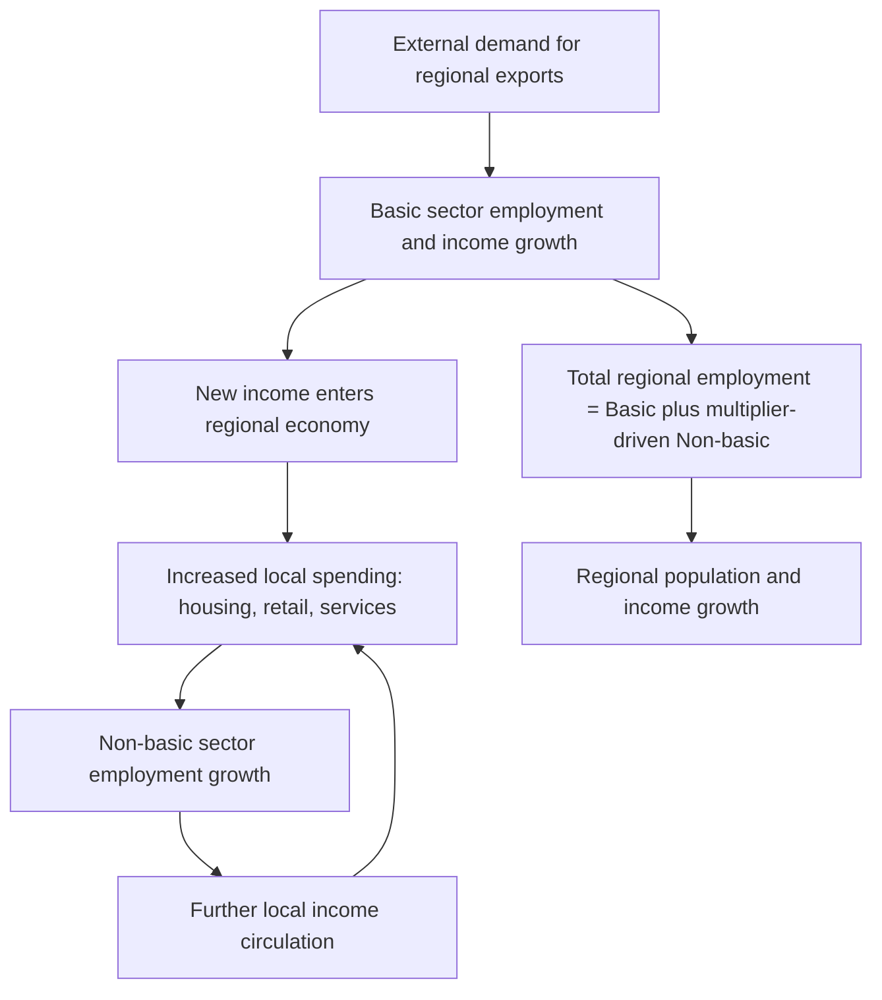

## Export Base Theory

### Overview

Export base theory (also called economic base theory) explains regional economic growth as driven fundamentally by a region's ability to sell goods and services to markets outside its own boundaries. It divides a regional economy into "basic" (export) and "non-basic" (local-serving) sectors, and posits that growth in the basic sector is the primary engine generating regional income and employment growth overall, with the non-basic sector expanding in a derived, multiplied response. Developed primarily by Douglass North and others in the 1950s as an alternative or complement to the neoclassical supply-side growth framework, export base theory remains a foundational, widely applied tool in regional economic impact analysis despite significant theoretical critiques.

### Core Concepts: Basic vs. Non-Basic Activity

#### Definitions

- **Basic (export) sector**: Economic activities producing goods or services sold to customers *outside* the region, bringing new income into the regional economy from external sources (analogous to exports in international trade theory, but applied to sub-national regions).
- **Non-basic (local/residentiary) sector**: Economic activities serving *local* regional demand — retail, personal services, local government, and other activities whose customer base is primarily within the region itself.

#### Key Points

- **Directionality of causation is the theory's central claim**: Export base theory asserts that basic-sector growth *causes* non-basic sector growth (via income and employment multiplier effects), not the reverse — a region's ability to grow depends fundamentally on the external demand for its exports, since non-basic activity is viewed as fundamentally derivative, recirculating income already brought into the region rather than generating genuinely new regional income.
- **Not the same as manufacturing vs. services**: A common misconception is equating "basic" with manufacturing and "non-basic" with services; in practice, a region's basic sector can include service exports (e.g., a city with a major tourism industry, or a college town exporting educational services to non-resident students, or a headquarters city exporting corporate/financial services to clients located elsewhere) — the basic/non-basic distinction is about the geographic location of the *customer*, not the sector or industry classification of the *activity*.

### The Export Base Multiplier

#### Formal Derivation

Total regional employment (or income) $T$ is the sum of basic employment $B$ and non-basic employment $N$:

$$T = B + N$$

Assuming non-basic employment is proportional to total employment (since local-serving activity scales with the size of the total population/economy it serves):

$$N = n \cdot T$$

where $n$ is the non-basic share of total employment. Substituting:

$$T = B + nT \implies T = \frac{B}{1-n}$$

The **export base multiplier** is therefore:

$$k = \frac{T}{B} = \frac{1}{1-n}$$

A change in basic employment $\Delta B$ generates a total employment change of:

$$\Delta T = k \cdot \Delta B = \frac{\Delta B}{1-n}$$

#### Key Points

- **Multiplier magnitude depends on the non-basic share**: A region with a higher non-basic share $n$ (more local-serving activity relative to exports) has a *larger* multiplier $k$, because each unit of basic employment supports proportionally more local-serving activity — meaning smaller, more export-dependent regional economies with a smaller non-basic sector paradoxically have *smaller* export base multipliers under this formula, a counterintuitive implication that has drawn methodological scrutiny (see critiques below).
- **Analogy to Keynesian income multiplier**: The mathematical structure directly parallels the Keynesian fiscal multiplier ($1/(1-\text{MPC})$) and export multipliers in open-economy macroeconomics, reflecting export base theory's roots in Keynesian income-expenditure analysis applied at the regional scale rather than the national scale.

### Measuring the Basic/Non-Basic Split

#### Location Quotient Method

The most widely used practical technique for empirically estimating which industries constitute a region's basic sector, comparing a region's industry employment share to the same industry's share nationally:

$$LQ_i = \frac{(E_{i,r}/E_r)}{(E_{i,n}/E_n)}$$

where $E_{i,r}$ is regional employment in industry $i$, $E_r$ is total regional employment, $E_{i,n}$ is national employment in industry $i$, and $E_n$ is total national employment.

An $LQ_i > 1$ indicates the region has a disproportionately large share of employment in industry $i$ relative to the national average, interpreted as evidence that the region exports that industry's output (produces more than local demand alone would require, implying the surplus is sold externally).

#### Estimating Basic Employment from Location Quotients

For industries with $LQ_i > 1$, basic employment is estimated as the excess employment above what the national average industry share would imply for local demand alone:

$$B_i = E_{i,r} - \left(\frac{E_{i,n}}{E_n}\right) \times E_r$$

Total regional basic employment is then $B = \sum_i B_i$ (summing only over industries with $LQ_i > 1$; industries with $LQ_i \leq 1$ are typically classified as entirely non-basic, or in some refinements as net importers rather than exporters).

#### Key Points

- **Key assumptions underlying the location quotient method**: (1) national average consumption/production patterns represent the region's local-demand benchmark — problematic if the region's demographic or income profile differs substantially from the national average; (2) uniform labor productivity across regions for each industry; (3) each region has similar local demand patterns for a given industry's output as the nation as a whole — assumptions that are commonly violated to varying degrees in practice, making the location quotient method a useful approximation rather than a precise measurement technique.
- **Alternative empirical methods**: Because of location quotient method limitations, other estimation approaches include direct survey methods (asking firms what share of sales go to out-of-region customers), input-output/interindustry accounting methods, and minimum-requirements techniques (comparing a region's industry employment share to the *minimum* observed share across a set of comparable regions, rather than to the national average) — each with distinct data requirements and bias characteristics.

### Diagram: Export Base Growth Mechanism

### Theoretical Critiques

#### The Non-Basic Sector as a Growth Driver

A central critique, developed extensively by Charles Tiebout (1956) among others, questions the theory's core directional assumption: **non-basic (local-serving) activities can themselves be a source of genuine regional growth**, not merely a passive multiplier response to basic-sector changes — for example, improvements in local retail variety, local public goods, or local amenities can independently attract in-migration and investment, generating growth that does not originate from the export base at all.

#### Key Points

- **Amenity-driven growth as a counter-example**: Regions attracting residents primarily for quality-of-life amenities (climate, recreation, low cost of living) rather than for job opportunities in a specific export industry represent a growth pattern not well captured by the export base framework's emphasis on export demand as the primary causal driver — connecting to the amenity-based urban growth models and "consumer city" frameworks in broader urban economics.
- **Short-run vs. long-run applicability**: **[Inference]** Export base theory's multiplier mechanism is most plausible as a *short-run* or *impact-analysis* tool (e.g., estimating the immediate regional employment effect of a new factory opening or an existing plant closing) rather than as a *long-run* growth theory, since long-run growth involves additional dynamics (capital accumulation, human capital, agglomeration economies, endogenous innovation) that the simple basic/non-basic accounting framework does not model — a view broadly consistent with treating export base theory and neoclassical/endogenous regional growth theory (see Neoclassical Regional Growth Models) as addressing different time horizons and questions rather than as directly competing theories of the same phenomenon.
- **Static multiplier vs. dynamic feedback**: The basic export base multiplier formula is inherently static/comparative — it does not model dynamic feedback effects such as basic-sector firms benefiting from a larger local labor pool or local supplier base as the region grows (an agglomeration-economy effect), which could cause actual growth responses to a basic-sector shock to differ substantially from the simple multiplier prediction in either direction.

#### Empirical Critiques

- **Multiplier estimates vary widely and are sensitive to specification**: Empirical export base multiplier estimates for the same region can vary substantially depending on the geographic boundary drawn (larger regions mechanically have larger $n$ and thus higher multipliers, since less activity "leaks" outside a larger boundary), the industry classification detail used, and the specific method (location quotient vs. survey-based vs. input-output-based) used to estimate the basic/non-basic split.
- **Leakage and import substitution**: The simple multiplier formula does not explicitly separate *local* non-basic spending from spending that "leaks" to imports from other regions (e.g., new basic-sector income spent on goods imported from elsewhere rather than on local non-basic services) — input-output-based regional models (see below) provide a more granular treatment of this leakage.

### Relationship to Input-Output Analysis

#### Key Points

- **Input-output models as a refinement**: Regional input-output (I-O) models, which explicitly track interindustry purchases and sales within and across regional boundaries, are widely viewed as a more granular and theoretically grounded successor to simple export base multiplier analysis, since I-O models can separately estimate direct, indirect (supply-chain), and induced (household-spending) multiplier effects rather than collapsing all local-serving activity into a single aggregate non-basic multiplier.
- **Continued practical use of export base theory**: Despite the availability of more sophisticated I-O and computable general equilibrium regional models, export base theory (and the location quotient technique specifically) remains widely used in applied regional economic development practice due to its computational simplicity, low data requirements (standard industry employment data suffices), and intuitive communicability to non-technical policy audiences — a practical trade-off between theoretical rigor and applied usability that explains its continued prevalence in regional economic impact studies and development planning documents.

### Applications in Regional Economic Development Policy

- **Industrial recruitment and targeting**: Export base theory provides the conceptual justification for regional economic development strategies focused on attracting or retaining export-oriented ("basic") employers (e.g., manufacturing plants, corporate headquarters, distribution centers), on the theory that such employers generate proportionally larger total regional economic impact via the multiplier mechanism than equivalent investment in local-serving businesses.
- **Economic impact studies**: The basic/non-basic multiplier framework (or its input-output refinement) is the standard methodology underlying "economic impact" studies commonly commissioned to estimate the regional employment and income effects of proposed developments (stadiums, factories, universities, military base changes), though such studies are also subject to well-documented critiques regarding potential upward bias from optimistic multiplier assumptions, particularly in studies commissioned by parties with a direct interest in a favorable projected outcome.

### Related Topics

- Neoclassical regional growth models (complementary long-run growth framework)
- New Economic Geography and agglomeration economies
- Regional input-output analysis and interindustry accounting
- Location quotient methodology and industry cluster analysis
- Amenity-driven regional growth and the "consumer city" framework
- Regional economic impact analysis methodology
- Industrial recruitment and place-based economic development policy
- Keynesian income-expenditure multiplier theory (national analogy)