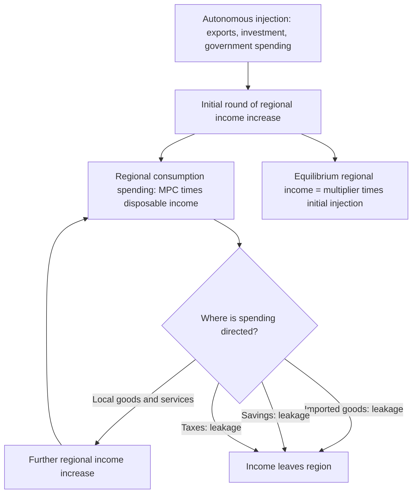

## Regional Income Determination and the Keynesian Regional Multiplier

### Overview

This topic extends Keynesian income-expenditure analysis to the regional scale, modeling how regional income is determined in equilibrium and how injections (exports, investment, government spending) generate multiplied effects on total regional income through successive rounds of local spending. Unlike the export base theory's employment-focused basic/non-basic multiplier, the Keynesian regional multiplier framework works directly with the income-expenditure identity and explicitly incorporates the region's marginal propensities to consume, save, tax, and import — providing a more general and economically complete treatment of demand-driven regional income determination, of which export base theory can be understood as a special case.

### The Regional Income-Expenditure Framework

#### Regional Income Identity

Regional income (or output) $Y_r$ in equilibrium equals total regional expenditure, decomposed analogously to the standard national income identity but with an explicit interregional trade term:

$$Y_r = C_r + I_r + G_r + X_r - M_r$$

where $C_r$ is regional consumption, $I_r$ is regional investment, $G_r$ is regional government spending, $X_r$ is exports (sales to other regions and abroad), and $M_r$ is imports (purchases from other regions and abroad).

#### Key Points

- **The interregional trade term is proportionally much larger than the international trade term in most national economies**: Because internal regions within a country typically trade far more intensively with each other (no tariffs, common currency, shared regulatory environment, often lower transport costs) than the nation trades internationally, the $X_r - M_r$ term is generally a much larger share of regional income than net exports are of national income, making regional economies substantially more "open" in the trade sense than national economies — a structural feature that has significant implications for the size and interpretation of regional multipliers.
- **Regional government spending and taxation as a distinct injection/leakage**: Unlike a national economy, most regional (sub-national) governments do not have full fiscal or monetary policy autonomy — $G_r$ often includes federal/national transfers and locally-financed spending, and regional tax leakages ($T_r$) may flow partly to a national treasury rather than being fully recycled within the region, an important distinction from the closed national Keynesian model.

### Deriving the Regional Multiplier

#### Marginal Propensities and Leakages

Regional consumption is modeled as a function of regional disposable income:

$$C_r = c(1-t) Y_r$$

where $c$ is the marginal propensity to consume (MPC) and $t$ is the effective regional tax rate. Imports are modeled as a function of regional income:

$$M_r = m \, Y_r$$

where $m$ is the marginal propensity to import (into the region, from elsewhere).

#### The Regional Multiplier Formula

Substituting into the income identity and solving for equilibrium $Y_r$ in response to a change in autonomous expenditure (exogenous investment, government spending, or exports) $\Delta A_r$:

$$\Delta Y_r = \frac{1}{1 - c(1-t) + m} \cdot \Delta A_r$$

The **regional multiplier** is therefore:

$$k_r = \frac{1}{1 - c(1-t) + m}$$

#### Key Points

- **Leakages determine multiplier size, and regional leakages are typically large**: The multiplier is smaller (closer to 1) the larger the combined leakage from savings ($1-c$), taxation ($t$), and imports ($m$) — because regional import propensities $m$ tend to be substantially higher than national import propensities (regions trade heavily with other regions within the same country), regional multipliers are typically smaller than analogous national multipliers computed with the same underlying consumption and tax parameters, a key structural difference from national-level Keynesian analysis.
- **Smaller, more open regional economies have smaller multipliers**: This is the opposite implication from the simple export base multiplier formula (where a *larger* non-basic share $n$ implies a *larger* multiplier) — the two frameworks can appear to conflict because they parameterize "openness" differently (export base theory's $n$ measures the share of activity that is non-basic/local, while the Keynesian regional multiplier's $m$ measures the propensity to import from *outside* the region), and reconciling the two requires care in mapping between the frameworks' respective definitions of what counts as "local" versus "leaked" spending.

### Diagram: Regional Income Determination Circuit

### Interregional Feedback Effects

#### Multiplier Effects Across Linked Regions

Because one region's imports are another region's exports, a spending injection in Region A generates not only a direct multiplier effect within Region A, but also a secondary "feedback" effect: Region A's increased imports raise Region B's exports and income, some of which (via Region B's own import propensity) flows back to Region A as increased exports from A to B, generating an interregional feedback loop.

#### Key Points

- **Formal interregional multiplier models**: Extending the single-region multiplier to an explicit multi-region (or region-and-rest-of-nation) framework requires a system of simultaneous equations (or matrix formulation) capturing each region's import propensities from every other linked region — a natural extension toward interregional input-output modeling (see Export Base Theory for the related input-output discussion), which provides a more granular treatment of these interregional linkages than the simple two-region algebraic feedback story.
- **[Inference]** Because feedback effects are generally smaller than the initial direct effect (each round of interregional recirculation loses additional leakage to savings, taxes, and imports to yet other regions), the feedback multiplier component is typically modest relative to the direct regional multiplier, though its magnitude depends on the closeness of trade linkages between the specific regions involved — feedback effects are likely larger for economically integrated regions (e.g., neighboring metro areas within a shared commuting/trade zone) than for distant or weakly linked regions.

### Distinguishing Short-Run Demand Effects from Long-Run Supply-Side Growth

#### Key Points

- **Complementary time horizon to neoclassical and export base frameworks**: The Keynesian regional multiplier model is fundamentally a **demand-side, short-to-medium-run** framework, explaining how a given injection of spending translates into regional income and employment changes assuming underlying productive capacity (labor supply, capital stock, technology) is roughly fixed — this makes it a natural complement to, rather than substitute for, the long-run supply-side neoclassical regional growth model (see Neoclassical Regional Growth Models), which instead explains the evolution of a region's productive capacity itself over time via capital accumulation and factor mobility.
- **Capacity constraints and long-run multiplier attenuation**: If a regional economy is operating near full employment/capacity, a sustained spending injection modeled via the simple Keynesian multiplier will, in practice, generate more price/wage inflation and less real output/employment expansion than the multiplier formula (which assumes elastic supply response) predicts — meaning multiplier-based regional impact estimates are most reliable in the presence of regional slack (unemployment, underutilized capacity) and less reliable for regions already near full capacity utilization.
- **Relationship to export base theory**: Export base theory's basic/non-basic multiplier (see Export Base Theory) can be understood as a special, simplified case of the more general Keynesian regional income multiplier, focused specifically on employment (rather than income) and typically abstracting from explicit treatment of savings and taxation leakages in favor of a single aggregated "non-basic share" parameter — the Keynesian framework presented here is the more general and economically complete underlying model.

### Empirical Estimation Approaches

#### Estimating Regional Marginal Propensities

- **Regional consumption function estimation**: Using regional income and expenditure survey or administrative data (where available) to estimate region-specific $c$ and $t$ parameters, though sub-national consumption and savings data are typically much less complete than national accounts data, often requiring proxy measures (regional retail sales, regional GDP components) rather than direct survey-based consumption measurement.
- **Regional import propensity estimation via trade flow data**: Estimating $m$ ideally requires interregional trade flow data (tracking goods and services moving between specific regions), which is considerably less available than national international trade data; common proxies include commodity flow surveys (where conducted), input-output-derived trade coefficient estimates, or gravity-model-based estimates of interregional trade flows using distance and economic size as predictors.

#### Fiscal Multiplier Studies at the Regional Level

A substantial modern empirical literature (distinct from, but building on, the classical Keynesian regional multiplier framework) estimates regional fiscal multipliers using quasi-experimental variation in federal/national government spending allocation across regions (e.g., military spending allocation formulas, federal stimulus fund distribution rules) as a source of plausibly exogenous regional spending shocks, allowing more credible causal estimation of $k_r$ than the simple accounting-identity-based derivation above.

#### Key Points

- **[Unverified — magnitudes vary substantially across studies, time periods, and monetary policy regimes]** This quasi-experimental regional fiscal multiplier literature (including notable studies by Nakamura and Steinsson using U.S. military spending variation) generally finds regional multiplier estimates that are informative about *relative* regional multiplier effects, but translating these regional estimates into *national*-level fiscal multiplier conclusions requires additional assumptions about monetary policy response and interregional spillovers that are not automatically satisfied — a regional multiplier estimated while national monetary policy is held effectively fixed (as when studying variation across regions within a single currency area and monetary policy regime) is conceptually different from, and not directly interchangeable with, a national aggregate fiscal multiplier estimate.

### Applications in Regional Policy

- **Regional stabilization policy design**: Understanding the regional multiplier informs the design of place-targeted fiscal interventions (federal infrastructure spending allocation, disaster relief spending, regional development grants), since regions with different estimated multiplier sizes (driven by differing import propensities, tax structures, and slack capacity) will generate different total income and employment effects from the same nominal dollar injection.
- **Evaluating regional economic shocks**: The framework provides the standard tool for assessing the total regional income impact of both positive shocks (a new major employer, a natural resource boom) and negative shocks (a major plant closure, a natural disaster, a military base closure), extending beyond the pure employment-multiplier focus of export base theory to a more complete income-and-expenditure accounting of the shock's regional propagation.

### Related Topics

- Export base theory and the basic/non-basic employment multiplier (special case relationship)
- Neoclassical regional growth models (complementary long-run supply-side framework)
- Regional input-output analysis and interregional trade flow estimation
- Fiscal multiplier estimation and quasi-experimental identification strategies
- Interregional and international trade theory (gravity models)
- Regional economic impact analysis methodology
- Monetary policy transmission and regional heterogeneity
- Regional stabilization policy and federal spending allocation