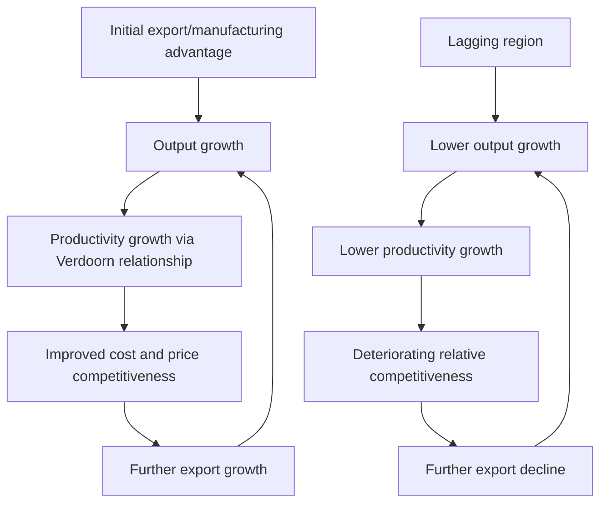

## Cumulative Causation in Myrdal and Kaldor

### Overview

Cumulative causation theory directly challenges the neoclassical convergence prediction (see Neoclassical Regional Growth Models) by arguing that regional economic advantages and disadvantages are self-reinforcing rather than self-correcting — an initial regional advantage generates further advantage, and an initial disadvantage generates further disadvantage, producing persistent or widening regional income divergence rather than convergence. Developed independently and in complementary form by Gunnar Myrdal and Nicholas Kaldor, the theory provided the intellectual foundation for later increasing-returns-based growth theory and New Economic Geography, and remains central to debates over whether market forces alone can be relied upon to reduce regional inequality.

### Myrdal's Theory of Circular and Cumulative Causation

#### Core Framework (1957)

Gunnar Myrdal's "Economic Theory and Underdeveloped Regions" (1957) proposed that economic and social systems do not tend toward equilibrium as neoclassical theory assumes, but instead exhibit **circular and cumulative causation**: a change in one economic variable triggers changes in other variables that feed back to reinforce, rather than dampen, the original change.

#### Backwash and Spread Effects

Myrdal's central analytical device distinguishes two opposing forces operating between a growing "core" region and a lagging "periphery":

- **Backwash effects**: Forces by which growth in the core region *drains* resources from the periphery, reinforcing core-periphery divergence — including selective outmigration of the periphery's most skilled and entrepreneurial workers (analogous to the "brain drain" mechanism discussed under Neoclassical Regional Growth Models, but here framed as reinforcing divergence rather than promoting convergence), capital flight toward higher-return core investments, and trade effects in which the periphery's less competitive nascent industries are undercut by established core producers.
- **Spread effects**: Forces by which core-region growth *benefits* the periphery — increased demand for periphery raw materials and agricultural products, potential technology and knowledge diffusion, and possible relocation of some core activity to the periphery as core costs (land, congestion, wages) rise.

#### Key Points

- **Myrdal's central claim: backwash effects typically dominate spread effects**, particularly in the absence of deliberate policy intervention, meaning market forces left alone tend to produce widening rather than narrowing regional disparities — a direct and explicit challenge to the neoclassical convergence prediction, and to the broader laissez-faire policy inference sometimes drawn from equilibrium-based trade and growth theory.
- **Explicit motivation from developing-country and lagging-region contexts**: Myrdal developed the framework partly in the context of explaining persistent underdevelopment in specific regions (both within and across countries), arguing that standard equilibrium trade and growth theory's optimistic convergence predictions failed to explain observed persistent regional and international disparities.
- **Role of government intervention**: Because Myrdal viewed unmanaged market forces as prone to divergence, his framework provided direct theoretical support for active regional development policy (infrastructure investment, targeted industrial policy) as a necessary counterweight to backwash effects, rather than policy being merely a second-best response to market failure in an otherwise self-correcting system.

### Kaldor's Cumulative Causation and Increasing Returns

#### Kaldor's Growth Framework (1970)

Nicholas Kaldor developed a complementary but analytically distinct version of cumulative causation theory, grounded explicitly in **increasing returns to scale** (dynamic economies of scale) in manufacturing, formalized through what is often called **Kaldor's growth laws** and the **Verdoorn relationship**.

#### The Verdoorn Law

Kaldor's framework rests on an empirical regularity (originally identified by Petrus Verdoorn) linking output growth to productivity growth in manufacturing:

$$\dot{p} = a + b \, \dot{q}$$

where $\dot{p}$ is the growth rate of labor productivity, $\dot{q}$ is the growth rate of output, and $b$ (the **Verdoorn coefficient**, empirically often estimated around 0.5) captures the degree of increasing returns — as output grows, productivity rises more than proportionally with employment growth, due to learning-by-doing, economies of scale, and induced technical change.

#### The Cumulative Causation Mechanism

Combining the Verdoorn relationship with export-led growth logic (see Export Base Theory) produces Kaldor's cumulative causation chain:

$$\text{Export growth} \rightarrow \text{Output growth} \rightarrow \text{Productivity growth (Verdoorn)} \rightarrow \text{Cost/price competitiveness} \rightarrow \text{Further export growth}$$

#### Key Points

- **Self-reinforcing competitive advantage**: Because faster output growth (driven by export success) generates faster productivity growth via the Verdoorn relationship, and faster productivity growth improves cost competitiveness (for a given wage growth rate), regions that start with an initial export/manufacturing advantage experience compounding competitiveness gains over time — directly generating divergence rather than the neoclassical convergence prediction, since the mechanism operates through increasing (not diminishing) returns.
- **Contrast with neoclassical diminishing returns**: This is the direct theoretical opposite of the neoclassical mechanism (see Neoclassical Regional Growth Models), where diminishing returns to capital drive convergence — Kaldor's framework instead relies on dynamic increasing returns in manufacturing specifically, making the theory's predictions and policy implications sharply different depending on which mechanism is assumed to dominate in a given empirical context.
- **Manufacturing-centric framework and its limitations**: Kaldor's framework was developed with particular emphasis on manufacturing as the sector exhibiting the strongest increasing-returns/Verdoorn effects (relative to agriculture or many services, viewed as more subject to diminishing returns or fixed-technology constraints in his original formulation) — a sectoral assumption subject to reconsideration as many advanced economies have deindustrialized and shifted toward service-sector employment, raising questions about whether analogous increasing-returns dynamics operate as strongly in modern knowledge-intensive service sectors (a question connecting to New Economic Geography's more general treatment of increasing returns and agglomeration).

### Diagram: Kaldorian Cumulative Causation Cycle

### Comparing Myrdal and Kaldor

#### Key Points

- **Complementary mechanisms, shared conclusion**: Myrdal's framework emphasizes factor mobility and demand-linkage effects (migration, capital flows, trade patterns between core and periphery) as the channel of cumulative causation, while Kaldor's framework emphasizes a more specific supply-side mechanism (increasing returns and productivity growth in manufacturing via the Verdoorn relationship) — both arrive at the shared conclusion that market-driven regional development is prone to self-reinforcing divergence rather than automatic convergence, but through analytically distinct causal chains that are not mutually exclusive and can operate simultaneously.
- **Empirical Verdoorn coefficient estimates**: **[Unverified — sensitive to specification, time period, and country/region sample]** Empirical estimates of the Verdoorn coefficient $b$ across different countries, regions, and time periods have generally found values in a range broadly consistent with meaningful increasing returns (typically cited estimates cluster around 0.4–0.6), though the precise interpretation (whether the relationship reflects genuine technologically-driven increasing returns, or partly reflects reverse causation/demand-driven capacity utilization effects during output growth) remains a subject of methodological debate in the empirical growth literature.

### Empirical Evidence and Applications

#### Regional Divergence Episodes

Cumulative causation theory has been invoked to explain persistent or widening regional disparities in various contexts, including within-country divergence (e.g., long-standing North-South regional disparities within Italy, and similar core-periphery patterns identified within other European countries) and broader international development patterns — contexts where the neoclassical convergence prediction has been notably weak or absent empirically.

#### Reconciling with Neoclassical Convergence Evidence

**[Inference]** Because substantial empirical evidence exists for *both* regional convergence (particularly within relatively homogeneous, well-integrated regions of developed countries, as discussed under Neoclassical Regional Growth Models) and regional divergence/persistence (particularly in contexts with strong sector-specific increasing returns or where backwash effects are not offset by policy intervention), a reasonable synthesis view treats convergence and cumulative-causation/divergence as two competing tendencies whose relative strength depends on context-specific factors — the degree of increasing returns present in the region's dominant industries, the strength of policy counterweights to backwash effects, and the openness and integration of factor and goods markets between the regions in question — rather than treating either theory as universally correct.

### Policy Implications

#### Regional Development Policy Rationale

- **Justification for active regional policy**: Because cumulative causation implies market forces alone can produce widening regional disparities, both Myrdal and Kaldor's frameworks provide explicit theoretical justification for deliberate regional development policy — infrastructure investment in lagging regions, industrial policy targeting manufacturing capacity in the periphery, and transport/communication investment designed to strengthen spread effects and counteract backwash effects — a markedly different policy stance from the more market-reliant implications often drawn from pure neoclassical convergence theory.
- **Growth pole strategy**: Building directly on cumulative causation logic, François Perroux's related concept of **growth poles** — deliberately fostering concentrated industrial development in selected lagging-region locations to generate self-sustaining Kaldorian increasing-returns dynamics locally, rather than relying on spontaneous market-driven development — became an influential (though empirically mixed in outcomes) regional development policy strategy in numerous countries during the mid-to-late 20th century.

#### Key Points

- **[Behavior may vary]** The empirical track record of growth-pole and similar cumulative-causation-motivated regional policy interventions has been decidedly mixed across different countries and specific programs, with some documented successes and numerous documented failures or limited effects — a pattern consistent with the theoretical difficulty of reliably engineering genuine increasing-returns/agglomeration dynamics through top-down policy intervention, a challenge explored further in the New Economic Geography literature's treatment of self-organizing agglomeration processes.

### Relationship to Later Regional Growth Theory

#### Key Points

- **Precursor to New Economic Geography**: Myrdal and Kaldor's emphasis on increasing returns, self-reinforcing spatial concentration, and the possibility of multiple stable spatial equilibria directly anticipated core themes later formalized with more rigorous general-equilibrium microfoundations in Paul Krugman's New Economic Geography models, which provide a more complete (though also more mathematically demanding) treatment of how increasing returns, transport costs, and factor mobility jointly determine the degree of spatial concentration versus dispersion of economic activity.
- **Enduring relevance to the convergence vs. divergence debate**: The Myrdal-Kaldor cumulative causation tradition remains the primary theoretical counterpoint invoked whenever empirical regional convergence evidence (see Neoclassical Regional Growth Models) appears to stall, reverse, or fail to materialize in a given context, providing the conceptual vocabulary (backwash/spread effects, increasing returns, self-reinforcing advantage) still used in contemporary regional economics and economic geography research and policy debate.

### Related Topics

- Neoclassical regional growth models (the convergence prediction cumulative causation challenges)
- New Economic Geography and Krugman's core-periphery models
- Export base theory and export-led growth mechanisms
- Verdoorn's Law and increasing returns in manufacturing
- Growth pole strategy and industrial policy for lagging regions
- Agglomeration economies and self-reinforcing spatial concentration
- Regional income determination and the Keynesian regional multiplier
- Core-periphery patterns in international development economics