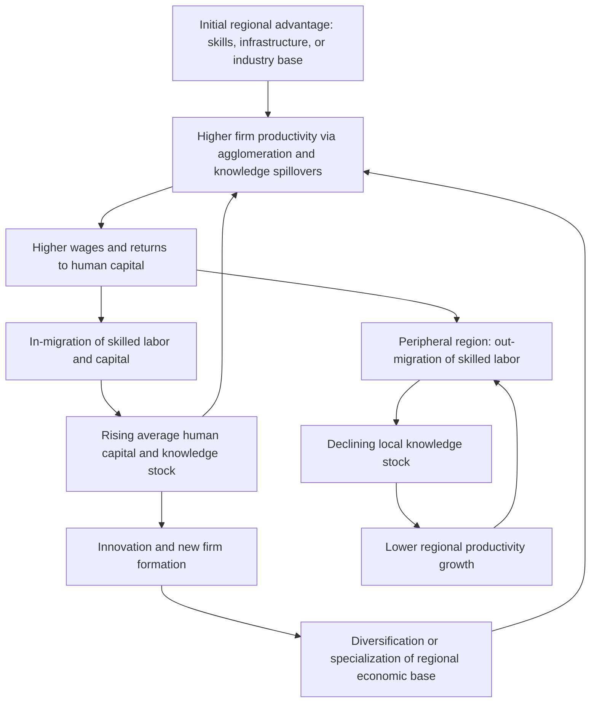

## Endogenous Growth Theory in a Regional Context

### Overview

Endogenous growth theory explains long-run economic growth as a product of internal factors within an economic system—knowledge accumulation, human capital, innovation, and increasing returns—rather than treating technological progress as an unexplained external ("exogenous") force. When applied to regional economics, this framework asks why growth rates diverge persistently across regions within the same country, even though they share the same national institutions, currency, and often similar access to capital markets. It replaces the neoclassical prediction of automatic regional convergence with a theory that can explain persistent divergence, agglomeration, and self-reinforcing spatial inequality.

### From Exogenous to Endogenous Growth

**Key Points**

- The Solow-Swan neoclassical growth model treats technology ($A$) as exogenous and assumes diminishing returns to capital, which mechanically predicts convergence: poorer regions with lower capital-to-labor ratios should grow faster and catch up to richer ones.
- Endogenous growth models (Romer, Lucas, Aghion-Howitt) internalize technology and knowledge as outputs of purposive investment (R&D, education, learning-by-doing), and they permit constant or increasing returns to broad capital (including human and knowledge capital).
- In a regional setting, this reframing matters because it allows a model to explain why capital and skilled labor often flow *toward* already-rich regions rather than away from them—the opposite of the neoclassical prediction.

The canonical neoclassical production function:

$$Y = A K^{\alpha} L^{1-\alpha}$$

assumes diminishing marginal returns to capital $K$ ($\alpha < 1$) and exogenous $A$. Endogenous models instead specify $A$ as a function of accumulated knowledge or human capital, e.g., Romer's formulation where knowledge itself is non-rival and only partially excludable, generating aggregate increasing returns even when individual firms face constant or diminishing returns.

### Core Theoretical Mechanisms in a Spatial Setting

#### 1. Human Capital Externalities (Lucas, 1988)

Lucas's model posits that human capital generates external effects on the productivity of everyone nearby, not just the individual acquiring it. In a regional context this is often called a "Lucas externality" or knowledge spillover:

$$Y_i = A K_i^{\alpha} (h_i L_i)^{1-\alpha} \bar{h}_i^{\gamma}$$

where $h_i$ is average human capital of workers in region $i$, and $\bar{h}_i^{\gamma}$ captures the external productivity boost from the *regional average* human capital stock. Because $\bar{h}_i$ rises with in-migration of skilled workers, regions with an initial skill advantage attract more skilled workers, raising $\bar{h}_i$ further—a self-reinforcing loop rather than a converging one.

#### 2. Learning-by-Doing and Localized Spillovers (Arrow, Romer)

Knowledge spillovers in Marshall-Arrow-Romer (MAR) models are assumed to be strongest within an industry and geographically localized—firms learn from nearby firms in the same sector. This underlies industrial specialization/clustering as a growth driver at the regional scale (e.g., Silicon Valley in semiconductors/software, Detroit historically in autos).

#### 3. Jacobs Externalities (Diversity-Driven Growth)

Jane Jacobs's alternative hypothesis holds that growth-relevant knowledge spillovers come from *diversity* across industries within a city, not specialization within one. Cross-fertilization of ideas between unrelated sectors generates innovation. This is empirically contrasted with MAR externalities in urban growth regressions (Glaeser et al., 1992).

#### 4. Increasing Returns and New Economic Geography (Krugman)

Paul Krugman's core-periphery model combines endogenous growth logic with spatial economics: increasing returns to scale at the firm level, transport costs, and demand-linked "backward and forward linkages" jointly determine whether economic activity concentrates in a "core" or disperses to a "periphery." A key parameter is the strength of agglomeration versus dispersion forces:

$$\text{Agglomeration} \iff \text{scale economies} + \text{low transport costs} > \text{dispersion forces (land rents, congestion)}$$

#### 5. Schumpeterian Creative Destruction Regionally (Aghion-Howitt)

Growth is driven by a sequence of quality-improving innovations that displace old technologies. Regionally, this explains why some places continually reinvent their economic base (innovation hubs) while others experience "lock-in" to a declining technological trajectory (e.g., legacy manufacturing regions failing to transition), a phenomenon closely related to path dependence in economic geography.

### Regional Growth Divergence vs. Neoclassical Convergence

**Key Points**

- Neoclassical (Solow-based) regional models predict unconditional convergence: poor regions grow faster per capita due to diminishing returns to capital.
- Endogenous growth models predict conditional or absent convergence: growth rate differences can persist or widen because knowledge/human capital accumulation is subject to increasing returns and self-reinforcing agglomeration.
- Empirical convergence tests commonly estimate:

$$\frac{1}{T}\ln\left(\frac{y_{i,t+T}}{y_{i,t}}\right) = \alpha + \beta \ln(y_{i,t}) + \epsilon_{i,t}$$

A negative and significant $\beta$ supports (conditional) convergence; a non-negative or insignificant $\beta$, especially after controlling for structural characteristics, is more consistent with endogenous-growth-style divergence forces dominating.

- Empirical work on U.S. states and EU regions has found convergence rates historically near 2% per year (Barro & Sala-i-Martin)—slower than simple neoclassical models predict—which is often interpreted as evidence that endogenous factors (human capital stocks, innovation capacity, institutional quality) are also at work alongside neoclassical capital-deepening.

### Formal Regional Model Sketch

A simplified regional endogenous growth model with human capital spillovers and interregional migration:

**Production in region $i$:**

$$Y_i = A_i K_i^{\alpha} H_i^{\beta} L_i^{1-\alpha-\beta}, \quad \alpha+\beta \le 1$$

**Knowledge/technology accumulation (region-specific, spillover-augmented):**

$$\dot{A}_i = \delta H_i^{\theta} \sum_{j \ne i} w_{ij} A_j^{\phi}$$

where $w_{ij}$ is an inverse-distance or trade-weighted spatial weight capturing interregional knowledge diffusion, $\theta$ governs the elasticity of local human capital to knowledge creation, and $\phi$ captures how much of region $j$'s existing stock diffuses into region $i$ (proximity-decaying spillovers, consistent with empirical patent-citation gravity models).

**Migration response (skilled labor mobility):**

$$\frac{dL_i}{dt} = \mu \left(w_i - \bar{w}\right)$$

Skilled workers migrate toward regions with above-average wages $w_i$, which in an endogenous growth framework are driven by $A_i$ and $H_i$—creating the feedback loop that can generate persistent core-periphery divergence rather than convergence.

### Diagram: Circular and Cumulative Causation in Regional Growth

### Empirical Evidence and Measurement Approaches

**Key Points**

- **Patent citation and R&D data**: Used to trace the geographic decay of knowledge spillovers (Jaffe, Trajtenberg & Henderson, 1993, found that patent citations disproportionately occur within the same metropolitan area as the cited patent, evidencing localized knowledge diffusion).
- **Human capital externality estimates**: Rauch (1993), Moretti (2004) find that a one-percentage-point increase in a city's share of college graduates raises the wages of all workers (including non-college workers) in that city, consistent with Lucas-type externalities.
- **Urban growth regressions**: Glaeser et al. (1992) test MAR vs. Jacobs vs. Porter externalities using U.S. city-industry employment growth from 1956–1987, generally favoring diversity (Jacobs) and local competition over specialization (MAR) for employment growth, though results are sensitive to specification and industry.
- **Regional total factor productivity (TFP) growth accounting**: Decomposes regional output growth into capital deepening, labor force growth, and a residual (TFP growth) attributed to endogenous innovation/knowledge effects.

[Inference] The relative empirical support for MAR versus Jacobs externalities remains contested across studies and time periods; findings are sensitive to industry classification granularity, time horizon, and the choice of growth versus productivity-level outcome variables.

### Policy Implications for Regional Development

**Example**

A regional government observes that its manufacturing-heavy economy has stagnated while a neighboring region with a university and diversified tech sector has grown rapidly. An endogenous growth diagnosis would examine:

1. Human capital stock and its rate of accumulation (education attainment, in/out-migration of skilled workers)
2. R&D intensity and innovation infrastructure (universities, labs, patent output)
3. Industrial diversity versus specialization (exposure to MAR vs. Jacobs externality regimes)
4. Agglomeration economies already present (labor market pooling, input-sharing, knowledge spillovers) versus congestion costs (land rents, commuting costs)

**Policy levers commonly derived from the theory:**

- Investment in higher education and vocational training to raise the regional human capital stock directly and via externalities
- Public R&D subsidies and innovation clusters/science parks to internalize knowledge spillovers that private firms underinvest in (since knowledge is non-rival and partially non-excludable)
- Infrastructure investment to reduce effective transport/communication costs, altering the agglomeration-dispersion balance in Krugman-style models
- Place-based policies (enterprise zones, targeted tax incentives) intended to overcome path-dependent lock-in, though these face well-documented risks of subsidizing low-productivity relocation rather than net new innovation [Inference: effectiveness varies substantially by program design and is a subject of ongoing empirical debate]

### Illustration: Core-Periphery Divergence (SVG)

<svg xmlns="http://www.w3.org/2000/svg" viewBox="0 0 720 380">
<text x="360" y="28" text-anchor="middle" font-size="18" font-weight="bold" fill="#1a1a1a">Core-Periphery Divergence Under Increasing Returns (svg_diagram)</text>
<line x1="70" y1="330" x2="670" y2="330" stroke="#333" stroke-width="2" />
<line x1="70" y1="330" x2="70" y2="60" stroke="#333" stroke-width="2" />
<text x="370" y="365" text-anchor="middle" font-size="13" fill="#333">Time</text>
<text x="30" y="200" text-anchor="middle" font-size="13" fill="#333" transform="rotate(-90 30 200)">Regional Income per Capita</text>
<path d="M100,300 C 250,220 400,120 650,80" stroke="#2563eb" stroke-width="3" fill="none" />
<text x="580" y="70" font-size="13" fill="#2563eb" font-weight="bold">Core region (increasing returns)</text>
<path d="M100,300 C 250,300 400,300 650,285" stroke="#dc2626" stroke-width="3" fill="none" stroke-dasharray="6,4" />
<text x="480" y="305" font-size="13" fill="#dc2626" font-weight="bold">Peripheral region (stagnation)</text>
<path d="M100,300 C 250,270 400,220 650,180" stroke="#16a34a" stroke-width="2" fill="none" stroke-dasharray="2,3" />
<text x="500" y="200" font-size="12" fill="#16a34a">Neoclassical convergence path (counterfactual)</text>
<circle cx="100" cy="300" r="5" fill="#1a1a1a" />
<text x="60" y="315" font-size="12" fill="#1a1a1a">t₀ (similar starting incomes)</text>
</svg>

### Critiques and Limitations

**Key Points**

- **Empirical identification challenges**: Distinguishing genuine knowledge spillovers from spurious correlation due to unobserved regional characteristics (e.g., amenities, historical industry mix) is methodologically difficult; instrumental variable and natural experiment approaches (e.g., historical settlement patterns, WWII-era plant location) are commonly used to address this.
- **Multiple equilibria and path dependence**: Krugman-style models often generate multiple stable equilibria, meaning the model has strong predictive power about *that* divergence can occur but limited ability to predict *which* region becomes the core without reference to historical accident or initial conditions ("history matters").
- **Policy endogeneity**: Regions with strong endogenous growth trajectories often also have stronger local governance and institutions, making it hard to isolate the causal contribution of the "endogenous growth" mechanism from broader institutional quality (related to the institutional economics critique associated with Acemoglu and others).
- [Inference] Some scholars argue the framework understates the role of geography and natural resource endowments (a critique associated with the "first nature vs. second nature geography" distinction), suggesting a fully endogenous account is incomplete without exogenous geographic anchors.

### Related Topics

- New Economic Geography and the Krugman core-periphery model
- Agglomeration economies: localization vs. urbanization economies
- Human capital externalities and the Moretti wage spillover literature
- Regional convergence/divergence econometrics ($\beta$- and $\sigma$-convergence)
- Innovation systems and regional knowledge production functions
- Path dependence and lock-in in regional economic development
- Spatial econometrics: modeling interregional spillovers with spatial weight matrices
- Cluster theory and Porter's competitive advantage of regions