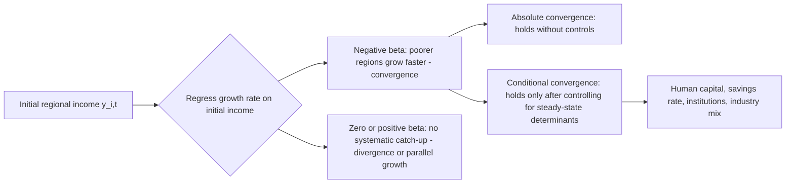

## Regional Convergence and Divergence

### Overview

Regional convergence and divergence theory examines whether per-capita income, productivity, or output gaps between regions within a country (or between countries) shrink over time (convergence) or persist and widen (divergence). This is one of the most heavily tested empirical questions in regional and growth economics, drawing on neoclassical growth theory, endogenous growth theory, and new economic geography to generate competing predictions—then testing them against decades of regional income data.

### Theoretical Foundations

**Key Points**

- **Neoclassical prediction (Solow, 1956)**: Diminishing returns to capital imply that capital-poor regions earn a higher marginal return on capital, attracting investment and growing faster until per-capita incomes converge to a common steady state (absolute convergence) or to region-specific steady states determined by savings rates, population growth, and technology (conditional convergence).
- **Endogenous growth prediction**: Human capital externalities, innovation spillovers, and increasing returns can generate persistent or widening gaps—rich regions get richer through self-reinforcing agglomeration (see Regional Endogenous Growth Theory).
- **New Economic Geography prediction (Krugman)**: Outcomes depend on the balance between agglomeration forces (increasing returns, demand linkages) and dispersion forces (transport costs, congestion, land rents); multiple stable spatial equilibria are possible, so convergence is not guaranteed even in the long run.

### Types of Convergence: Formal Definitions

#### 1. $\sigma$-Convergence

Measures whether the *dispersion* of income across regions falls over time. Typically measured as the cross-sectional standard deviation (or coefficient of variation) of log per-capita income:

$$\sigma_t = \sqrt{\frac{1}{N}\sum_{i=1}^{N}\left(\ln y_{i,t} - \overline{\ln y_t}\right)^2}$$

$\sigma$-convergence holds if $\sigma_{t+T} < \sigma_t$. This is a purely descriptive, non-causal measure of whether the *distribution* of regional incomes is compressing.

#### 2. Absolute (Unconditional) $\beta$-Convergence

Tests whether poorer regions grow faster than richer regions, regardless of other structural differences:

$$\frac{1}{T}\ln\left(\frac{y_{i,t+T}}{y_{i,t}}\right) = \alpha + \beta \ln(y_{i,t}) + \epsilon_{i,t}$$

A negative and statistically significant $\hat{\beta}$ supports absolute convergence. The implied speed of convergence is derived from:

$$\hat{\beta} = -\frac{1 - e^{-\lambda T}}{T}$$

where $\lambda$ is the convergence rate. Barro and Sala-i-Martin's cross-country and cross-U.S.-state studies famously found $\lambda \approx 0.02$ (2% per year)—implying it takes about 35 years to close half the initial gap ($\ln 2 / 0.02 \approx 35$).

#### 3. Conditional $\beta$-Convergence

Adds controls for region-specific steady-state determinants (savings/investment rates, human capital, population growth, institutional quality):

$$\frac{1}{T}\ln\left(\frac{y_{i,t+T}}{y_{i,t}}\right) = \alpha + \beta \ln(y_{i,t}) + \gamma' X_{i,t} + \epsilon_{i,t}$$

Conditional convergence is far more robustly found in the data than absolute convergence—regions converge to *their own* steady states, not to a single common one, meaning income gaps between structurally different regions can persist indefinitely even as each region converges to its own trajectory.

#### 4. Club Convergence

Regions converge only within subgroups ("clubs") sharing similar initial conditions, institutions, or technology access, rather than economy-wide. This reconciles observed persistent multi-modal regional income distributions (e.g., "twin peaks," Quah 1996) with localized convergence within each peak.

### Distributional Dynamics: Quah's Critique

**Key Points**

- Danny Quah (1993, 1996) argued that $\beta$-convergence regressions can be misleading because a negative $\beta$ is consistent with a shrinking cross-sectional variance *or* with a stable/widening distribution that merely exhibits mean reversion (Galton's fallacy).
- Quah proposed studying the entire cross-sectional distribution of regional incomes over time using Markov transition matrices, tracking the probability a region moves from one part of the income distribution to another.
- Evidence for "twin peaks" or polarization—regional incomes clustering at high and low ends rather than converging to a single mode—has been found in several country and cross-country studies, though the strength and persistence of these peaks vary by dataset, period, and sample composition. [Inference] The twin-peaks pattern is more robust in some studies (e.g., certain cross-country income distributions) than in others (e.g., some intranational regional datasets), so it should not be treated as a universal finding.

### Diagram: Convergence Regression Concept

### Empirical Evidence by Context

**Key Points**

- **U.S. states (Barro & Sala-i-Martin, 1991, 1992)**: Found strong evidence of absolute convergence among U.S. states from 1880–1988, with $\lambda \approx 2\%$ per year—one of the strongest documented convergence results, partly attributed to a common national institutional and technological environment.
- **European Union regions**: Convergence evidence is mixed and highly sensitive to the sample period; strong convergence was documented for EU regions in the 1980s–1990s (partly attributed to Structural and Cohesion Funds), but evidence weakens or reverses in some studies after the 2008 financial crisis, with some peripheral regions diverging from core regions. [Inference] Post-2008 EU regional divergence findings are sensitive to which member states and time windows are included, so caution is warranted before generalizing across the whole EU.
- **Cross-country convergence**: Much weaker and less consistent than within-country regional convergence—supporting the view that shared institutions, currency, labor mobility, and technology diffusion (present within countries but not necessarily across them) are important conditioning factors.
- **China's interprovincial convergence**: Studies generally find conditional convergence within China but substantial and sometimes widening regional disparities (coastal vs. interior provinces) driven by differential access to foreign investment, trade, and agglomeration economies.

### Migration, Factor Mobility, and Convergence

**Key Points**

- Labor mobility is a key convergence channel absent from strict Solow-style capital-only models: workers migrating from low-wage to high-wage regions should reduce labor supply (raising wages) in the sending region and increase labor supply (lowering wages) in the receiving region, promoting convergence.
- However, if migration is selective (skilled workers disproportionately leave lagging regions—"brain drain"), it can *reduce* the lagging region's human capital stock and growth potential, reinforcing divergence rather than promoting convergence—a mechanism central to endogenous growth-based counterarguments.
- Capital mobility theoretically flows toward capital-scarce (low-wage) regions under diminishing returns, but in practice can flow toward already-productive regions if agglomeration economies dominate, as in Krugman-style models.

### Measurement and Methodological Issues

**Example**

A researcher studying convergence across 50 regions over 30 years must decide:

1. **Unit of observation**: GDP per capita vs. GDP per worker vs. total factor productivity—each captures different mechanisms (population dynamics vs. labor productivity vs. technology).
2. **Spatial unit**: Administrative regions (states, provinces) vs. functional economic areas (metro areas, labor market areas)—administrative boundaries can create measurement artifacts if they don't reflect actual economic geography.
3. **Time horizon**: Short panels are vulnerable to business-cycle noise; very long panels risk structural breaks (technology regime shifts, policy changes) contaminating the constant-parameter assumption of standard convergence regressions.
4. **Cross-sectional dependence**: Regions are not independent observations—spatial spillovers (trade, migration, knowledge diffusion) violate the OLS independence assumption, motivating spatial econometric approaches (spatial lag and spatial error models):

$$\frac{1}{T}\ln\left(\frac{y_{i,t+T}}{y_{i,t}}\right) = \alpha + \beta \ln(y_{i,t}) + \rho W_{ij} \left[\frac{1}{T}\ln\left(\frac{y_{j,t+T}}{y_{j,t}}\right)\right] + \gamma' X_{i,t} + \epsilon_{i,t}$$

where $W_{ij}$ is a spatial weight matrix (e.g., inverse distance, contiguity) and $\rho$ captures spillover-driven growth spatial autocorrelation.

### Illustration: Sigma vs. Beta Convergence Contrast

<svg xmlns="http://www.w3.org/2000/svg" viewBox="0 0 720 400">
<text x="360" y="26" text-anchor="middle" font-size="17" font-weight="bold" fill="#1a1a1a">σ-Convergence vs. β-Convergence: Divergent Signals (svg_diagram)</text>

<text x="180" y="55" text-anchor="middle" font-size="14" font-weight="bold" fill="#333">σ-Convergence (Dispersion Over Time)</text>

<line x1="60" y1="180" x2="330" y2="180" stroke="#333" stroke-width="2" />

<line x1="60" y1="180" x2="60" y2="70" stroke="#333" stroke-width="2" />

<text x="195" y="200" text-anchor="middle" font-size="11" fill="#333">Time</text>

<path d="M75,90 C 150,140 250,165 315,170" stroke="`#2563eb`" stroke-width="3" fill="none" />

<text x="200" y="90" font-size="11" fill="`#2563eb`">Std. dev. of ln(income) falling</text>

<text x="540" y="55" text-anchor="middle" font-size="14" font-weight="bold" fill="#333">β-Convergence (Growth vs. Initial Income)</text>

<line x1="420" y1="180" x2="690" y2="180" stroke="#333" stroke-width="2" />

<line x1="420" y1="180" x2="420" y2="70" stroke="#333" stroke-width="2" />

<text x="555" y="200" text-anchor="middle" font-size="11" fill="#333">Initial income (ln y₀)</text>

<text x="405" y="125" text-anchor="middle" font-size="11" fill="#333" transform="rotate(-90 405 125)">Growth rate</text>

<line x1="435" y1="90" x2="675" y2="150" stroke="`#dc2626`" stroke-width="3" />

<circle cx="450" cy="95" r="4" fill="`#1a1a1a`" />

<circle cx="500" cy="105" r="4" fill="`#1a1a1a`" />

<circle cx="560" cy="120" r="4" fill="`#1a1a1a`" />

<circle cx="620" cy="135" r="4" fill="`#1a1a1a`" />

<circle cx="670" cy="148" r="4" fill="`#1a1a1a`" />

<text x="555" y="230" text-anchor="middle" font-size="11" fill="`#dc2626`">Negative slope = poorer regions grow faster</text>

<text x="360" y="280" text-anchor="middle" font-size="12" fill="`#1a1a1a`" font-style="italic">Note: negative β is necessary but not sufficient for falling σ (Quah, 1993)</text>

<text x="360" y="300" text-anchor="middle" font-size="12" fill="`#1a1a1a`" font-style="italic">— mean reversion can coexist with stable or rising cross-sectional dispersion</text>

</svg>

### Policy Relevance

**Key Points**

- **Cohesion and regional development funds** (e.g., EU Structural Funds, U.S. federal transfers, place-based tax incentives) are explicitly designed to accelerate convergence by subsidizing capital investment, infrastructure, and human capital formation in lagging regions.
- **Effectiveness debates**: [Inference] The empirical literature on whether place-based regional policy meaningfully accelerates convergence versus simply redistributing activity from one region to another (a zero-sum relocation effect) remains actively contested, with results varying by policy design, region type, and evaluation methodology.
- Divergence findings strengthen the case for active regional policy (since market forces alone won't close the gap); convergence findings are sometimes used to argue that gaps are transitional and will resolve without intervention—making the empirical convergence/divergence debate directly consequential for regional policy design.

### Conclusion

The convergence/divergence question does not have a single universal answer: within-country convergence tends to be more consistently observed than cross-country convergence, conditional convergence is far more robust than absolute convergence, and distributional approaches (Quah-style transition matrices) reveal that averages can mask persistent polarization into rich and poor "clubs." The theoretical ambiguity—neoclassical models predicting convergence, endogenous growth and new economic geography models predicting persistent or widening gaps—means the empirical evidence for a specific place and period must guide policy conclusions rather than a single canonical growth model.

### Related Topics

- Endogenous growth theory in a regional context
- New Economic Geography and the core-periphery model
- Quah's transition matrices and distribution dynamics
- Spatial econometrics: spatial lag and spatial error models
- Migration and labor mobility as an equilibrating mechanism
- EU Cohesion Policy and place-based regional development
- Total factor productivity decomposition across regions
- Club convergence and multiple regional growth equilibria