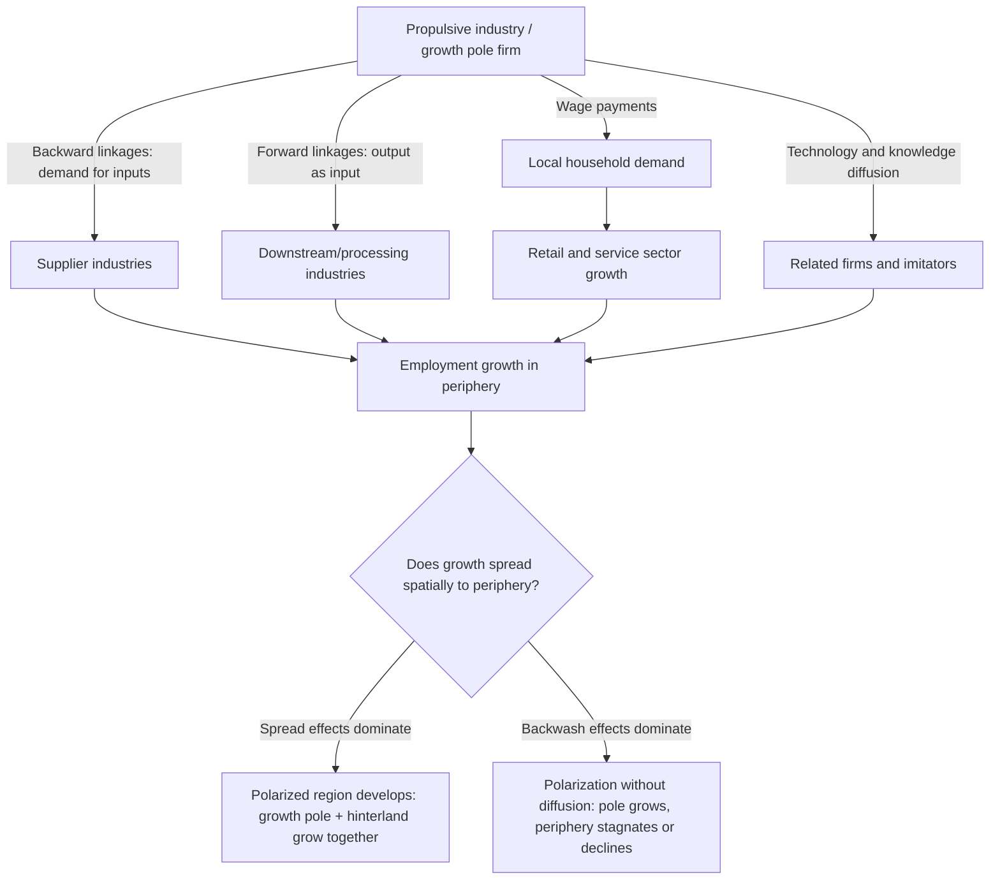

## Growth Pole and Polarized Development Theory

### Overview

Growth pole theory (théorie des pôles de croissance) originated with French economist François Perroux (1955) and was later adapted into an explicitly spatial framework by Jacques Boudeville and others. Perroux's original concept was defined in abstract economic space—industries or firms, not necessarily geographic places—but the theory was quickly spatialized to explain why economic development concentrates in specific geographic locations ("growth poles") and radiates outward (or fails to) to surrounding "polarized" regions. It became one of the most influential—and most contested—frameworks in postwar regional development policy.

### Perroux's Original Concept: Growth Poles in Economic Space

**Key Points**

- Perroux argued that growth does not appear everywhere simultaneously; it manifests in "growth poles" (pôles de croissance)—propulsive industries or firms with strong linkage effects that drive growth in related sectors.
- A **propulsive industry** (industrie motrice) is large, innovative, and has substantial backward and forward linkages, meaning its growth induces growth in supplying industries (backward linkages) and industries that use its output (forward linkages).
- Perroux's "growth pole" was originally a concept in *abstract* economic (sectoral/relational) space, not physical geography—the polarization referred to inter-industry linkages, not necessarily spatial clustering. It was Boudeville (1966) who explicitly translated the concept into geographic space, defining growth poles as urban centers with propulsive industries whose growth spreads to a surrounding hinterland.

### Linkage Effects: The Mechanism of Polarization

**Key Points**

- **Backward linkages**: A propulsive industry's demand for intermediate inputs stimulates growth in supplier industries (Hirschman's linkage framework, closely related and often applied jointly with Perroux's theory).
- **Forward linkages**: Output from the propulsive industry becomes an input for downstream industries, stimulating their expansion.
- **Income/demand linkages**: Wages paid by the propulsive industry generate local consumer demand, supporting service-sector and retail growth (a Keynesian multiplier-type effect layered onto the input-output linkages).
- **Technology/innovation linkages**: Propulsive industries often diffuse technological knowledge and managerial practices to related firms, an early anticipation of later knowledge-spillover concepts in endogenous growth theory.

$$\text{Total Regional Growth Impact} = \text{Direct effect} + \text{Backward linkage effect} + \text{Forward linkage effect} + \text{Multiplier effect}$$

### Diagram: Growth Pole Linkage Structure

### Spatial Translation: Boudeville and the Geographic Growth Pole

**Key Points**

- Boudeville (1966) defined a geographic growth pole as "a set of expanding industries located in an urban area and inducing further development of economic activity throughout its zone of influence."
- This spatialized version became the theoretical basis for **growth pole policy**: deliberately locating or subsidizing propulsive industries in designated urban centers within lagging regions, intending to trigger self-sustaining regional development that spreads to the surrounding hinterland.
- The approach assumes a hierarchical urban system where growth "trickles down" from the pole to lower-order settlements in its sphere of influence—conceptually related to central place theory's settlement hierarchy.

### Spread Effects vs. Backwash Effects (Myrdal and Hirschman)

**Key Points**

- Gunnar Myrdal (1957) and Albert Hirschman (1958) independently developed closely related concepts explaining why growth poles do not always benefit surrounding regions, using different terminology for essentially the same phenomenon.
- **Myrdal's "spread effects" (positive) vs. "backwash effects" (negative)**:
  - *Spread effects*: growth pole demand for peripheral raw materials/labor, technology diffusion, and infrastructure investment that benefits the periphery.
  - *Backwash effects*: the growth pole draws capital, skilled labor, and investment *away* from the periphery (cumulative causation, closely paralleling the divergence mechanisms in endogenous growth theory), and out-competes peripheral producers via superior infrastructure and agglomeration economies.
- **Hirschman's "trickling-down" (positive) vs. "polarization" (negative)** effects are functionally equivalent to Myrdal's spread/backwash pair, differing mainly in terminology and emphasis; Hirschman was somewhat more optimistic that trickling-down effects would eventually dominate given sufficient time and appropriate policy.
- Whether spread/trickling-down or backwash/polarization effects dominate depends on: transport infrastructure quality, the propulsive industry's factor intensity and local sourcing patterns, the initial development gap between pole and periphery, and government intervention to counteract backwash (e.g., infrastructure investment, targeted incentives for periphery-located suppliers).

### Formal Representation of Cumulative Causation

Myrdal's circular and cumulative causation, applied to a growth pole and its periphery, can be represented as coupled growth-rate equations:

$$g_{\text{pole}} = f(\text{agglomeration economies}, \text{propulsive industry linkages}) - \delta \cdot (\text{backwash to periphery})$$

$$g_{\text{periphery}} = \beta \cdot (\text{spread effects from pole}) - \gamma \cdot (\text{outflow of capital and skilled labor to pole})$$

If backwash/outflow terms dominate ($\delta, \gamma$ large relative to $\beta$), the periphery can experience *absolute* decline even while the pole grows—a starkly different prediction from neoclassical convergence models.

### Growth Pole Policy: International Applications

**Example**

- **France**: The métropoles d'équilibre policy (1960s) designated regional counter-magnets (Lyon, Marseille, Lille, Toulouse, etc.) to offset Paris's dominance, investing in infrastructure and relocating some public-sector functions to balance national urban primacy.
- **Italy**: The Cassa per il Mezzogiorno program used growth pole logic to promote industrialization (notably steel and petrochemicals) in southern Italy (Taranto, Gela) to close the north-south development gap; results were widely judged disappointing, with many poles becoming isolated "cathedrals in the desert" (industrial enclaves with limited local linkage development).
- **Venezuela**: Ciudad Guayana was developed from the 1960s as a planned growth pole around iron/steel and aluminum industries, leveraging Orinoco River hydropower and mineral resources; it achieved substantial population and industrial growth but is frequently cited as a mixed case regarding whether diversified regional spillovers materialized as intended.
- **Developing-country applications broadly**: Growth pole policy was widely adopted in 1960s–1970s development planning (Latin America, parts of Africa and Asia) as a way to concentrate scarce investment resources rather than spreading them thinly across many locations, following the logic that concentrated "big push" investment would be more effective than dispersed small-scale projects.

### Critiques of Growth Pole Theory

**Key Points**

- **"Cathedrals in the desert" problem**: Many real-world growth pole projects, especially capital-intensive heavy industry poles, failed to generate the anticipated local backward/forward linkages because inputs were sourced from outside the region and outputs were shipped elsewhere, leaving the pole as an economic enclave with minimal spillover to the surrounding periphery.
- **Overly mechanistic linkage assumptions**: Critics argued the theory assumed linkage effects would automatically materialize once a propulsive industry was sited in a location, without adequately accounting for the periphery's absorptive capacity (existing skills, infrastructure, entrepreneurial base) needed to actually capture those linkages.
- **Ambiguity in Perroux's original concept**: Because Perroux's growth pole was defined in abstract economic (sectoral) space rather than geographic space, critics have argued that much of the policy literature applying "growth pole theory" spatially represents a significant reinterpretation—arguably a distinct theory—rather than a direct application of Perroux's own framework. [Inference] This is a matter of some interpretive debate among historians of economic thought regarding fidelity to Perroux's original intent versus the policy tradition that developed from Boudeville's spatialization.
- **Empirical disappointment**: By the 1970s–1980s, evaluations of growth pole programs in France, Italy, and elsewhere generally found weaker-than-expected diffusion effects, contributing to a broader shift in regional policy away from top-down growth pole strategies toward endogenous/bottom-up regional development approaches (e.g., industrial districts, flexible specialization, and later cluster-based policy drawing on Porter and New Economic Geography).
- **Relationship to later theory**: Growth pole theory is now often viewed as a conceptual precursor to agglomeration economics and New Economic Geography (Krugman), sharing the core insight that growth concentrates rather than diffusing evenly, but lacking the later frameworks' more rigorous general-equilibrium microfoundations for why concentration occurs and persists.

### Illustration: Spread vs. Backwash Effects Over Distance

<svg xmlns="http://www.w3.org/2000/svg" viewBox="0 0 720 380">
<text x="360" y="26" text-anchor="middle" font-size="17" font-weight="bold" fill="#1a1a1a">Net Effect on Periphery by Distance from Growth Pole (svg_diagram)</text>
<line x1="70" y1="320" x2="670" y2="320" stroke="#333" stroke-width="2" />
<line x1="370" y1="320" x2="370" y2="60" stroke="#333" stroke-width="2" />
<text x="370" y="345" text-anchor="middle" font-size="12" fill="#333">Distance from pole</text>
<text x="30" y="190" text-anchor="middle" font-size="12" fill="#333" transform="rotate(-90 30 190)">Net development impact</text>
<circle cx="370" cy="200" r="7" fill="#1a1a1a" />
<text x="370" y="230" text-anchor="middle" font-size="12" font-weight="bold" fill="#1a1a1a">Growth pole</text>
<path d="M370,200 C 450,150 520,140 650,130" stroke="#16a34a" stroke-width="3" fill="none" />
<text x="560" y="115" font-size="12" fill="#16a34a" font-weight="bold">Spread effects (near periphery: linkages, demand)</text>
<path d="M370,200 C 300,230 250,260 90,280" stroke="#dc2626" stroke-width="3" fill="none" />
<text x="150" y="300" font-size="12" fill="#dc2626" font-weight="bold">Backwash effects (far periphery: resource/labor drain)</text>
<line x1="70" y1="200" x2="670" y2="200" stroke="#999" stroke-width="1" stroke-dasharray="4,3" />
<text x="640" y="215" font-size="10" fill="#666">baseline (no pole effect)</text>
</svg>

### Legacy and Relevance in Contemporary Regional Policy

**Key Points**

- Direct growth pole policy fell out of favor by the 1980s in most advanced economies, but its core conceptual concern—how to spread the benefits of concentrated economic activity to lagging regions—persists in contemporary place-based policy debates (e.g., EU Cohesion Policy, U.S. regional innovation clusters, China's special economic zones).
- Modern cluster policy (Porter's competitive clusters) and innovation-hub strategies share growth pole theory's emphasis on concentrated propulsive activity but ground the analysis more rigorously in competitive advantage, agglomeration microfoundations, and knowledge-spillover mechanisms rather than input-output linkage accounting alone.
- The spread/backwash (or trickling-down/polarization) distinction remains a standard analytical lens for evaluating whether any concentrated regional investment—infrastructure megaprojects, special economic zones, anchor institution strategies—will benefit or harm the surrounding periphery.

### Related Topics

- Endogenous growth theory in a regional context
- Regional convergence and divergence
- Myrdal's circular and cumulative causation
- Hirschman's linkage theory and unbalanced growth strategy
- Central place theory and urban hierarchy
- New Economic Geography and the Krugman core-periphery model
- Cluster theory and Porter's competitive advantage of regions
- Special economic zones and place-based industrial policy