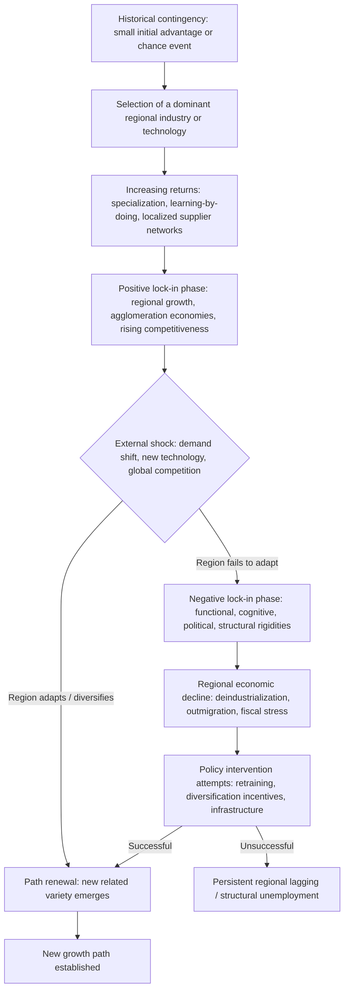

## Path Dependence and Regional Lock-In

### Overview

Path dependence theory explains how historical events, early technological choices, and initial institutional arrangements can constrain a region's subsequent development trajectory, even when those choices become inefficient over time. Applied to regional economics, path dependence explains why regions with similar initial endowments can diverge dramatically based on small historical accidents ("historical contingency"), and why declining industrial regions often struggle to transition to new economic activities despite the apparent economic irrationality of persisting with a failing specialization—a phenomenon termed "lock-in."

### Theoretical Origins: From Technology to Regional Economics

**Key Points**

- Path dependence was first formalized in economics through studies of technology adoption, most famously Paul David's (1985) analysis of the QWERTY keyboard layout and Brian Arthur's (1989) work on increasing returns and lock-in in competing technologies.
- The core insight: when a process exhibits **increasing returns to adoption** (network effects, learning effects, coordination effects, adaptive expectations), early small advantages can become self-reinforcing and lock in an outcome that is not necessarily optimal, and that would be prohibitively costly to reverse later ("QWERTY effects").
- Ron Martin and Peter Sunley (2006) and others extended this logic explicitly to regional economic geography, arguing that regional economies—not just individual technologies—can become locked into particular industrial specializations, institutional configurations, and spatial structures through analogous self-reinforcing mechanisms.

### Formal Mechanism: Increasing Returns and Lock-In

Arthur's framework models the probability that a region/technology reaches a "locked-in" absorbing state as a function of early adoption sequences. A simplified stochastic process:

$$P(\text{Region A path dominates}) = f\left(\text{early adoption advantage}, \text{increasing returns coefficient } r\right)$$

where higher $r$ (stronger increasing returns) makes the eventual outcome more sensitive to early, possibly random, events and less reversible once a threshold is crossed. This contrasts sharply with constant/diminishing-returns models (standard neoclassical economics), where the system converges to a unique equilibrium regardless of the historical adoption path—**path independence**.

### The Four Sources of Regional Lock-In (Martin & Sunley Framework)

**Key Points**

1. **Functional lock-in**: Firms become dependent on a narrow set of specialized local suppliers, customers, and labor skills, making it costly to switch to different economic activities even as the original industry declines.
2. **Cognitive lock-in**: Shared mental models, business norms, and "ways of doing things" among local firms and workers become entrenched, reducing openness to alternative strategies or new industries (related to concepts of "regional culture" in economic geography).
3. **Political lock-in**: Local institutions, governance structures, and vested interests (unions, trade associations, incumbent firms with political influence) actively resist policies or investments that would undermine the existing industrial base, even when that base is declining.
4. **Institutional/structural lock-in**: Formal and informal rules, regulations, and physical infrastructure (built environment, land use patterns, specialized transport infrastructure) become sunk-cost specific to the existing economic base, raising the switching cost to alternative activities.

### Diagram: The Path Dependence Life Cycle in a Region

### Classic Empirical Cases

**Example**

- **Ruhr Valley, Germany**: Coal and steel specialization drove 19th–20th century growth through strong increasing-returns agglomeration; as global steel competition and coal demand declined post-1960s, the region's dense network of coal/steel-specific infrastructure, labor skills, and political institutions (strong unions, coal/steel-aligned regional governance) created substantial resistance to diversification, requiring decades of structural policy intervention to transition toward services and renewable energy sectors.
- **Detroit, Michigan (U.S. auto industry)**: Early 20th-century agglomeration economies in automobile manufacturing (supplier networks, specialized labor, Fordist mass-production institutions) generated decades of growth, but the same specialization became a liability amid foreign competition, automation, and shifting consumer preferences from the 1970s onward—illustrating functional lock-in (auto-specific supply chains) and cognitive lock-in (management practices resistant to lean/flexible production models pioneered elsewhere).
- **Massachusetts Route 128 vs. Silicon Valley (AnnaLee Saxenian, 1994)**: A frequently cited contrast in regional path dependence literature—Route 128's vertically integrated, secretive corporate culture (cognitive/institutional lock-in) is argued to have made it less adaptable to the networked, open-information culture that allowed Silicon Valley's more horizontally organized ecosystem to repeatedly reinvent itself across computing technology waves. [Inference] This comparison remains influential but has also been critiqued and refined by subsequent research examining additional factors (venture capital availability, university linkages, defense spending patterns) that contributed to the divergence.
- **Appalachian coal regions**: Long-term dependence on coal mining created deep functional and political lock-in (mining-specific infrastructure, company towns, coal-aligned local political structures), contributing to persistent difficulty diversifying the regional economy even as coal employment declined for decades.

### Distinguishing Path Dependence from Simple Specialization

**Key Points**

- Not all regional industrial specialization constitutes "lock-in" in the pejorative sense—specialization can be a durable source of comparative advantage (consistent with MAR-type localization economies) without being maladaptive.
- The distinguishing feature of harmful lock-in is **reduced adaptive capacity**: an inability to reallocate resources, retrain the workforce, or attract new industries when the original specialization's competitiveness erodes, as opposed to a specialization that continues to be genuinely competitive.
- Martin (2010) later refined the framework to emphasize that regional economic evolution is better understood as **path-dependent but not path-determined**—historical trajectories constrain but do not fully determine future outcomes, and regions retain some capacity for "path renewal," "path branching" (diversifying into technologically related industries, consistent with the related variety literature), or even "path creation" (establishing genuinely novel economic activities).

### Related Variety and Path Branching

**Key Points**

- The related variety literature (Frenken, Van Oort & Verburg, 2007; Boschma & Frenken) argues regions are more likely to successfully diversify into new industries that are technologically or skill-related to their existing specialization ("related diversification") than into entirely unrelated activities, because related industries can draw on existing labor skills, supplier networks, and institutional capabilities.
- This provides a partial escape route from negative lock-in: rather than requiring a complete break from historical specialization, successful regional renewal often proceeds through incremental "branching" into adjacent industries and technologies—explaining, for example, how some former manufacturing regions have transitioned into advanced manufacturing, logistics, or specialized engineering services rather than into unrelated sectors like finance or tourism.

$$\text{Regional Entry Probability into Industry } j \propto \text{Relatedness}(j, \text{existing regional industry mix})$$

### Policy Implications

**Key Points**

- **Diagnosis before intervention**: Effective regional policy for a lagging former-industrial region requires distinguishing whether the region suffers primarily from functional lock-in (supply-chain rigidity), cognitive lock-in (resistance to new business models), political lock-in (institutional capture by incumbent interests), or structural lock-in (sunk infrastructure)—since each calls for different policy instruments.
- **Related diversification strategies**: Smart specialization policy (adopted in EU regional innovation policy) explicitly draws on related-variety logic, directing regional innovation investment toward technologically adjacent activities rather than either pure path continuation or unrelated "big bet" diversification.
- **Institutional renewal**: Because political and cognitive lock-in are partly about entrenched local institutions and mindsets, policy responses often extend beyond capital subsidies to include governance reform, new intermediary organizations, and efforts to attract external knowledge networks that can disrupt insular local cognitive frames.
- [Inference] The empirical track record of policies specifically designed to overcome regional lock-in (as opposed to general regional development spending) is mixed, and success appears to depend heavily on the presence of at least some related-variety assets and institutional capacity for reform already present in the region—a full "path creation" from an unrelated base is comparatively rare and difficult to engineer through policy alone.

### Illustration: Lock-In vs. Path Renewal Trajectories

<svg xmlns="http://www.w3.org/2000/svg" viewBox="0 0 720 380">
<text x="360" y="26" text-anchor="middle" font-size="17" font-weight="bold" fill="#1a1a1a">Regional Trajectories After an External Shock (svg_diagram)</text>
<line x1="70" y1="330" x2="670" y2="330" stroke="#333" stroke-width="2" />
<line x1="70" y1="330" x2="70" y2="60" stroke="#333" stroke-width="2" />
<text x="370" y="355" text-anchor="middle" font-size="12" fill="#333">Time</text>
<text x="30" y="195" text-anchor="middle" font-size="12" fill="#333" transform="rotate(-90 30 195)">Regional economic performance</text>
<path d="M100,280 C 200,180 280,140 350,130" stroke="#666" stroke-width="3" fill="none" />
<line x1="350" y1="130" x2="350" y2="330" stroke="#999" stroke-width="1" stroke-dasharray="4,3" />
<text x="350" y="345" text-anchor="middle" font-size="11" fill="#666">External shock</text>
<path d="M350,130 C 450,150 550,190 650,240" stroke="#dc2626" stroke-width="3" fill="none" />
<text x="600" y="225" font-size="12" fill="#dc2626" font-weight="bold">Negative lock-in: decline</text>
<path d="M350,130 C 450,110 550,90 650,75" stroke="#16a34a" stroke-width="3" fill="none" />
<text x="600" y="65" font-size="12" fill="#16a34a" font-weight="bold">Path renewal: related diversification</text>
<path d="M350,130 C 450,200 550,230 650,225" stroke="#2563eb" stroke-width="2" fill="none" stroke-dasharray="5,3" />
<text x="590" y="245" font-size="11" fill="#2563eb">Stagnation: no adaptation, no decline</text>
</svg>

### Related Topics

- Endogenous growth theory in a regional context
- Growth pole and polarized development theory
- Related variety and regional diversification
- Smart specialization strategy (EU regional innovation policy)
- Deindustrialization and structural adjustment in legacy regions
- Regional resilience and adaptive capacity
- Agglomeration economies: localization vs. urbanization economies
- Institutional economics and regional governance