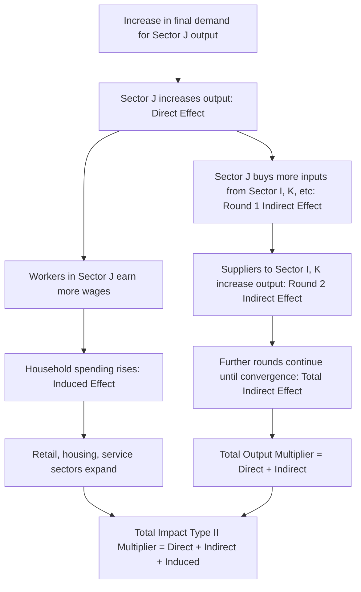

## Input-Output Analysis

### Overview

Input-output (I-O) analysis is a quantitative framework, originated by Wassily Leontief (1936, Nobel Prize 1973), that models the interdependencies between industries or sectors within an economy—how much output each sector must produce to meet final demand, given that sectors consume each other's outputs as intermediate inputs. In regional economics, I-O analysis is the workhorse methodology for measuring economic impact, tracing linkage effects (directly connecting to growth pole theory), estimating multipliers, and understanding a region's economic structure and interdependencies with the rest of the world (or nation).

### The Basic Input-Output Framework

**Key Points**

- An economy is divided into $n$ sectors/industries. Each sector's total output is either consumed as an intermediate input by other sectors or sold to final demand (households, government, investment, exports).
- The **transactions table** records the dollar flow from each producing sector (rows) to each purchasing sector (columns), plus a final demand column and a value-added/primary inputs row.
- The fundamental accounting identity for each sector $i$:

$$X_i = \sum_{j=1}^{n} Z_{ij} + Y_i$$

where $X_i$ is total output of sector $i$, $Z_{ij}$ is the intermediate flow from sector $i$ to sector $j$, and $Y_i$ is final demand for sector $i$'s output.

### Technical Coefficients and the Leontief Inverse

**Key Points**

- **Technical (direct) coefficients** $a_{ij}$ measure how many dollars (or units) of sector $i$'s output are required as input to produce one dollar of sector $j$'s output:

$$a_{ij} = \frac{Z_{ij}}{X_j}$$

- Substituting into the accounting identity and expressing in matrix form:

$$X = AX + Y \quad \Rightarrow \quad X = (I - A)^{-1} Y$$

where $A$ is the $n \times n$ matrix of technical coefficients, $I$ is the identity matrix, and $(I-A)^{-1}$ is the **Leontief inverse**—the central analytical tool of I-O analysis.

- Each element $(I-A)^{-1}_{ij}$ (often denoted $r_{ij}$) gives the total output required from sector $i$ (both directly and indirectly, through all rounds of intermediate transactions) to satisfy one additional dollar of final demand for sector $j$'s output. This captures the full round-by-round ripple effect of a demand change through the entire interindustry structure, not just the first-round direct effect.

### Derivation Intuition: The Ripple Effect

An increase in final demand $\Delta Y_j$ for sector $j$ requires sector $j$ to produce more, which requires more inputs from its suppliers (round 1), whose increased production requires more inputs from *their* suppliers (round 2), and so on:

$$\Delta X = \Delta Y + A\Delta Y + A^2 \Delta Y + A^3 \Delta Y + \cdots = (I + A + A^2 + A^3 + \cdots)\Delta Y = (I-A)^{-1}\Delta Y$$

This geometric series representation makes explicit that the Leontief inverse sums an infinite sequence of direct-plus-indirect rounds of interindustry purchases, converging as long as the matrix $A$ satisfies standard economic regularity conditions (each sector's total input requirement per unit of output is less than one).

### Diagram: Input-Output Impact Propagation

### Types of Multipliers

**Key Points**

- **Output multiplier**: Total output change (direct + indirect) across all sectors resulting from a one-unit change in final demand for a given sector's output; the column sum of the Leontief inverse for that sector.
- **Type I multiplier**: Captures direct effects (initial change) plus indirect effects (interindustry purchases) but excludes induced (household spending) effects.
- **Type II multiplier**: Extends Type I by endogenizing the household sector—treating household consumption as another row/column in the transactions table so that wage income triggers additional consumption spending, which ripples through the economy again ("induced effects"). Type II multipliers are always larger than Type I for the same sector.
- **Income, employment, and value-added multipliers**: Analogous constructs expressing the total income, jobs, or value-added generated per unit of output change, computed by multiplying the output multiplier vector by sector-specific income/employment/value-added coefficients (e.g., jobs per dollar of output).

$$\text{Employment Multiplier}_j = \sum_i e_i \cdot (I-A)^{-1}_{ij}$$

where $e_i$ is direct employment per unit of output in sector $i$.

### Regionalizing National I-O Tables

**Key Points**

- Full regional I-O surveys are expensive and rare; most regional applications use **non-survey techniques** to adapt national I-O tables to a specific region, exploiting the fact that a region typically imports a portion of its intermediate inputs from outside the region (unlike a national economy, which is treated as closed).
- **Location quotient (LQ) methods**: Adjust national technical coefficients downward for a region based on the relative concentration of an industry locally compared to the nation, under the logic that a region with a smaller-than-national share of an input-supplying industry likely imports more of that input.

$$LQ_i = \frac{e_i^{region}/E^{region}}{e_i^{nation}/E^{nation}}$$

If $LQ_i \ge 1$, the regional coefficient is typically left equal to the national coefficient (region is assumed self-sufficient in that input); if $LQ_i < 1$, the coefficient is scaled down (commonly via the Simple Location Quotient, SLQ, or more refined variants like the Cross-Industry Location Quotient, CILQ, and Flegg's Location Quotient, FLQ, which adjusts for regional size).

- **Supply-side and RAS/biproportional adjustment methods**: RAS is an iterative biproportional scaling technique used to update an older I-O table (or convert a national table into a regional one) to match newly available row and column totals while preserving as much of the original table's interindustry structure as possible.
- **Commercial regional I-O models**: Widely used proprietary/public regional impact modeling systems include IMPLAN (U.S.), REMI (which combines I-O with econometric and computable general equilibrium features), and RIMS II (BEA regional multipliers)—each uses variants of these non-survey estimation techniques combined with region-specific economic census data.

### Economic Impact Analysis: Practical Application

**Example**

A regional economic development agency wants to estimate the total economic impact of a new $50 million automotive parts plant expected to directly employ 400 workers.

**Step-by-step I-O impact analysis:**

1. **Classify the direct spending** into the relevant industry sector (e.g., NAICS motor vehicle parts manufacturing) within the regional I-O model.
2. **Apply the sector's output multiplier** from the regional Leontief inverse to estimate total (direct + indirect) output effects: e.g., an output multiplier of 1.8 implies $90 million in total regional output impact ($50M × 1.8) from direct spending alone, before induced effects.
3. **Apply the Type II multiplier** to incorporate induced household-spending effects from wages paid to the 400 new workers and to workers at supplier firms.
4. **Apply the employment multiplier** to estimate total jobs supported regionally, e.g., an employment multiplier of 2.5 implies the direct 400 jobs support approximately 1,000 total jobs regionally (400 × 2.5) once supplier and induced-spending jobs are included.
5. **Apply the tax/revenue coefficients** (if available) to estimate net fiscal impact on local government revenue, often compared against public incentives offered to attract the plant, to compute an implied benefit-cost ratio for the incentive package.

### Strengths and Standard Applications

**Key Points**

- **Linear, transparent structure**: I-O models are computationally simple, transparent, and require relatively modest data compared to full computable general equilibrium (CGE) models, making them the standard tool for practitioner-level regional economic impact studies (stadium construction, natural disaster damage, plant closures/openings, tourism impact, university/hospital economic footprint studies).
- **Direct connection to linkage-based growth theories**: I-O tables provide the empirical measurement basis for backward and forward linkage concepts central to growth pole theory and Hirschman's unbalanced growth strategy.
- **Sectoral disaggregation**: Allows analysis of which specific industries benefit most from a given demand shock, informing targeted industrial or workforce development policy.

### Limitations and Critiques

**Key Points**

- **Fixed (linear) technical coefficients**: I-O models assume constant returns to scale and fixed input proportions (no substitution between inputs in response to relative price changes), which can overstate multiplier effects, especially over longer time horizons or for larger shocks where price and substitution effects become material.
- **No supply constraints**: Standard demand-driven I-O models assume unlimited slack capacity in all sectors to meet increased demand, which can substantially overstate impacts in regions or sectors operating near full capacity/full employment (a well-recognized limitation addressed by supply-constrained I-O variants and CGE models).
- **Static framework**: Standard I-O analysis captures a snapshot of interindustry relationships at one point in time and does not model dynamic adjustment paths, price feedback effects, or behavioral responses—CGE models were developed partly to address these limitations at the cost of greater data requirements and complexity.
- **Double-counting and definitional risks in practice**: A frequently cited practitioner pitfall is applying multipliers inappropriately (e.g., summing multiple overlapping project impacts, or confusing gross output impacts with net new regional value-added), which can substantially overstate a project's true net regional economic benefit. [Inference] The degree of overstatement in any given real-world impact study depends heavily on study-specific assumptions and data quality, and cannot be generalized as a fixed correction factor.
- **Regionalization accuracy**: Non-survey regionalization techniques (LQ-based methods) are known to introduce approximation error relative to actual regional trade flows, particularly for regions with atypical trade patterns; the accuracy of any location-quotient-adjusted regional table should be treated as an approximation rather than a precise measurement. [Unverified] The magnitude of this approximation error varies by region size, industry composition, and which specific LQ variant is used, and is not a fixed, universally quotable percentage.

### Illustration: Leontief Inverse Structure

<svg xmlns="http://www.w3.org/2000/svg" viewBox="0 0 680 340">
<text x="340" y="26" text-anchor="middle" font-size="16" font-weight="bold" fill="#1a1a1a">Input-Output Table Structure (svg_diagram)</text>
<rect x="60" y="60" width="280" height="180" fill="none" stroke="#333" stroke-width="2" />
<text x="200" y="45" text-anchor="middle" font-size="13" font-weight="bold" fill="#333">Intermediate Transactions Matrix Z</text>
<line x1="60" y1="150" x2="340" y2="150" stroke="#999" stroke-width="1" />
<line x1="200" y1="60" x2="200" y2="240" stroke="#999" stroke-width="1" />
<text x="130" y="105" text-anchor="middle" font-size="11" fill="#333">Sector 1 → 1</text>
<text x="270" y="105" text-anchor="middle" font-size="11" fill="#333">Sector 1 → 2</text>
<text x="130" y="195" text-anchor="middle" font-size="11" fill="#333">Sector 2 → 1</text>
<text x="270" y="195" text-anchor="middle" font-size="11" fill="#333">Sector 2 → 2</text>
<rect x="380" y="60" width="140" height="180" fill="#eef2ff" stroke="#333" stroke-width="2" />
<text x="450" y="45" text-anchor="middle" font-size="13" font-weight="bold" fill="#333">Final Demand Y</text>
<text x="450" y="150" text-anchor="middle" font-size="11" fill="#333">Households, Govt,</text>
<text x="450" y="165" text-anchor="middle" font-size="11" fill="#333">Investment, Exports</text>
<rect x="60" y="260" width="280" height="60" fill="#fef2f2" stroke="#333" stroke-width="2" />
<text x="200" y="285" text-anchor="middle" font-size="12" font-weight="bold" fill="#333">Value Added (wages, profit, taxes)</text>
<text x="200" y="305" text-anchor="middle" font-size="11" fill="#666">= Primary inputs row</text>

<text x="560" y="150" font-size="13" fill="`#2563eb`" font-weight="bold">X = (I − A)⁻¹Y</text>

<text x="560" y="175" font-size="11" fill="#666">Total output vector</text>

</svg>

### Conclusion

Input-output analysis remains the most widely used quantitative tool in applied regional economics for tracing how demand shocks propagate through an interconnected sectoral economy, quantifying multiplier effects, and grounding growth-linkage concepts (Perroux, Hirschman) in measurable data. Its core strength—linear transparency and modest data requirements—is also its central limitation, motivating the development of more flexible but data-intensive alternatives like computable general equilibrium (CGE) models and hybrid econometric-I-O systems (e.g., REMI) for applications requiring price responsiveness, capacity constraints, or dynamic adjustment paths.

### Related Topics

- Growth pole and polarized development theory (linkage effects)
- Hirschman's unbalanced growth and linkage theory
- Computable general equilibrium (CGE) regional models
- Economic base theory and export-base multipliers
- Location quotient analysis and regional specialization measurement
- Social accounting matrices (SAMs)
- Regional economic impact assessment methodology
- Shift-share analysis