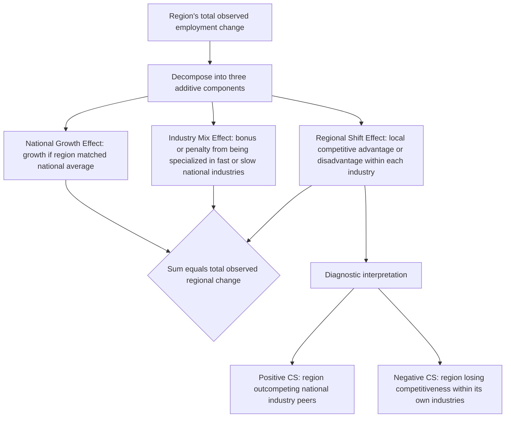

## Shift-Share Analysis

### Overview

Shift-share analysis is a regional economic accounting technique that decomposes a region's employment (or output) growth over a period into three additive components: growth attributable to national economic trends, growth attributable to the region's industrial mix, and growth attributable to region-specific competitive factors. Developed and popularized by Dunn (1960) and Perloff, Dunn, Lampard & Muth (1960), it remains one of the most widely used descriptive tools in applied regional economics for diagnosing *why* a region grew faster or slower than the nation, prior to (or alongside) more structural econometric or I-O-based analysis.

### The Basic Decomposition

**Key Points**

- Shift-share analysis answers the question: "How much of my region's employment growth is due to (1) overall national growth, (2) having more or less of the fast/slow-growing industries nationally, versus (3) something specific to my region (a genuine competitive advantage or disadvantage)?"
- The technique requires only readily available industry-by-region employment data for two time periods—no estimation of behavioral parameters or econometric modeling is required, which explains its enduring popularity for quick diagnostic regional analysis.

**The three components:**

$$\Delta E_{i,r} = \underbrace{E_{i,r,0} \cdot g_n}_{\text{National Growth Effect}} + \underbrace{E_{i,r,0} \cdot (g_{i,n} - g_n)}_{\text{Industry Mix Effect}} + \underbrace{E_{i,r,0} \cdot (g_{i,r} - g_{i,n})}_{\text{Regional Shift (Competitive) Effect}}$$

Where:

- $E_{i,r,0}$ = initial employment in industry $i$, region $r$
- $g_n$ = national total employment growth rate over the period
- $g_{i,n}$ = national growth rate of industry $i$
- $g_{i,r}$ = regional growth rate of industry $i$

Summing across all industries $i$ gives the region's total National Growth Effect (NS), Industry Mix Effect (IM, also called the "proportionality shift"), and Regional/Competitive Shift Effect (CS, also called the "differential shift"):

$$\Delta E_r = NS_r + IM_r + CS_r$$

### Interpreting Each Component

**Key Points**

- **National Share (NS) effect**: The employment growth the region *would* have experienced in every industry if each grew exactly at the national average rate. This isolates the influence of the broader business cycle and macroeconomic trend, which is common to all regions and not attributable to any regional characteristic.
- **Industry Mix (IM) effect**: Measures whether the region is specialized in industries that are, nationally, growing faster or slower than the overall economy. A positive IM effect means the region happens to be concentrated in nationally fast-growing sectors (a favorable initial industrial structure); a negative IM effect means the region is concentrated in nationally declining or slow-growing sectors (an unfavorable structure), independent of anything the region itself did.
- **Regional/Competitive Shift (CS) effect**: The residual growth in each industry that exceeds (or falls short of) what the national growth rate for that specific industry would predict. This is interpreted as the region's own comparative or competitive advantage (or disadvantage) within that industry—e.g., due to local infrastructure, labor quality, agglomeration economies, local business climate, or resource endowments—that is not explained by national trends or the region's industry mix.

### Diagram: Shift-Share Decomposition Logic

### Worked Numerical Example

**Example**

Suppose a region had 10,000 manufacturing jobs at the start of a decade. Nationally, total employment grew 15% ($g_n = 0.15$), manufacturing employment nationally grew only 5% ($g_{i,n} = 0.05$), but the region's own manufacturing employment grew 12% ($g_{i,r} = 0.12$).

- **National Growth Effect** = $10{,}000 \times 0.15 = 1{,}500$ jobs (jobs the region would gain simply from being part of a growing national economy)
- **Industry Mix Effect** = $10{,}000 \times (0.05 - 0.15) = -1{,}000$ jobs (a penalty because manufacturing nationally underperformed the overall economy—an unfavorable specialization)
- **Regional Shift Effect** = $10{,}000 \times (0.12 - 0.05) = 700$ jobs (a bonus reflecting that the region's manufacturing sector substantially outperformed the national manufacturing sector—a genuine local competitive advantage)
- **Total predicted change** = $1{,}500 - 1{,}000 + 700 = 1{,}200$ jobs, which should equal (up to rounding) the actual observed change in regional manufacturing employment ($10{,}000 \times 0.12 = 1{,}200$), confirming the decomposition is exact and additive by construction.

**Interpretation**: Despite being in a nationally underperforming industry (negative industry-mix effect), this region's manufacturing sector demonstrated a real local competitive edge (positive regional-shift effect) strong enough to more than offset the unfavorable industry mix.

### Extensions and Variants

**Key Points**

- **Dynamic (or "adjusted") shift-share**: Standard shift-share compares only two endpoints, which can obscure within-period volatility; dynamic variants compute the decomposition over multiple sub-periods and aggregate the results to better capture trends that reverse or accelerate within the study window.
- **Esteban-Marquillas variant**: Decomposes the "regional shift" term further into a pure "competitive effect" and an "allocation effect," addressing a known technical weakness in the classic formulation where the competitive effect can be correlated with the industry-mix effect if regional specialization itself is a source of the region's competitive edge (i.e., the classic decomposition can partially conflate whether the region is competitive *because* it specializes in an industry it's naturally good at).
- **Shift-share with constant-share weighting alternatives**: Different base-period weighting choices (using initial-year weights, terminal-year weights, or average weights) can produce different numerical decompositions for the same data, a well-documented sensitivity issue in the shift-share literature comparable to index-number problems in other economic measurement contexts. [Inference] Analysts should report which weighting convention was used, since results are not invariant to this choice, though the qualitative interpretation (direction of each effect) is often, but not always, robust to it.
- **Regression-based (econometric) shift-share models**: Modern applied econometrics has also adapted "shift-share" as an instrumental variable strategy (Bartik instruments), using the interaction of national industry growth rates and initial local industry shares as an instrument for local labor demand shocks in causal regional labor market studies—a substantially different (though conceptually related) use of the term from the classic descriptive decomposition. [Inference] This econometric usage has itself become a significant and actively debated methodological literature (regarding the validity of the instrument's exogeneity assumptions), distinct from the traditional accounting-based shift-share technique described above.

### Applications in Regional Economic Analysis

**Key Points**

- **Regional competitiveness diagnosis**: Economic development agencies use shift-share results to distinguish structural problems (unfavorable industry mix, requiring diversification strategy) from competitiveness problems (negative regional shift within existing industries, requiring business climate, workforce, or infrastructure improvements).
- **Benchmarking and comparative regional studies**: Used to compare multiple regions' growth performance against a common national or state baseline, identifying which regions are "punching above their weight" (positive competitive shift) versus riding favorable industry composition alone.
- **Historical/retrospective sector analysis**: Frequently applied to study long-run deindustrialization, e.g., decomposing whether a manufacturing region's job losses were primarily due to a nationwide manufacturing decline (mix effect) or region-specific competitive erosion (shift effect)—directly complementing path dependence and lock-in analysis of declining industrial regions.

### Limitations and Critiques

**Key Points**

- **Purely descriptive, not causal**: Shift-share is an accounting identity, not a behavioral or causal model—it decomposes historical data mechanically but does not explain the underlying economic mechanisms driving the regional shift component; a positive or negative competitive shift is a symptom to be further investigated, not itself an explanation.
- **Sensitivity to industry classification granularity**: Highly aggregated industry categories can understate the true industry-mix effect (masking the fact that a region may be specialized in the fastest- or slowest-growing sub-segments within a broadly defined industry), while highly disaggregated data can introduce noise and small-sample volatility.
- **Base-period and end-point sensitivity**: As with any two-point-in-time comparison, results can be heavily influenced by the choice of start and end years, particularly if either falls during an atypical business-cycle point (recession trough or boom peak)—a limitation partially addressed by dynamic shift-share extensions.
- **No accounting for interregional linkages or spillovers**: Unlike input-output analysis, standard shift-share treats each region and industry independently, ignoring interindustry or interregional linkage effects that connect a region's competitive performance in one sector to conditions in another.

### Illustration: Decomposition of Regional Employment Change

<svg xmlns="http://www.w3.org/2000/svg" viewBox="0 0 680 360">
<text x="340" y="26" text-anchor="middle" font-size="16" font-weight="bold" fill="#1a1a1a">Shift-Share Decomposition Example (svg_diagram)</text>
<line x1="80" y1="300" x2="620" y2="300" stroke="#333" stroke-width="2" />
<line x1="80" y1="300" x2="80" y2="60" stroke="#333" stroke-width="2" />
<text x="30" y="180" text-anchor="middle" font-size="12" fill="#333" transform="rotate(-90 30 180)">Jobs</text>
<rect x="140" y="150" width="70" height="150" fill="#2563eb" />
<text x="175" y="320" text-anchor="middle" font-size="12" fill="#333">National</text>
<text x="175" y="335" text-anchor="middle" font-size="12" fill="#333">Growth</text>
<text x="175" y="140" text-anchor="middle" font-size="12" fill="#2563eb" font-weight="bold">+1,500</text>
<rect x="280" y="300" width="70" height="100" fill="#dc2626" transform="translate(0,-100)" />
<text x="315" y="320" text-anchor="middle" font-size="12" fill="#333">Industry</text>
<text x="315" y="335" text-anchor="middle" font-size="12" fill="#333">Mix</text>
<text x="315" y="195" text-anchor="middle" font-size="12" fill="#dc2626" font-weight="bold">−1,000</text>
<rect x="420" y="230" width="70" height="70" fill="#16a34a" />
<text x="455" y="320" text-anchor="middle" font-size="12" fill="#333">Regional</text>
<text x="455" y="335" text-anchor="middle" font-size="12" fill="#333">Shift</text>
<text x="455" y="220" text-anchor="middle" font-size="12" fill="#16a34a" font-weight="bold">+700</text>
<rect x="530" y="192" width="70" height="108" fill="#7c3aed" />
<text x="565" y="320" text-anchor="middle" font-size="12" fill="#333">Total</text>
<text x="565" y="335" text-anchor="middle" font-size="12" fill="#333">Change</text>
<text x="565" y="182" text-anchor="middle" font-size="12" fill="#7c3aed" font-weight="bold">+1,200</text>
</svg>

### Conclusion

Shift-share analysis provides a simple, data-light, and exact additive decomposition of regional growth into national, structural, and competitive components, making it a standard first-pass diagnostic tool before deploying more complex structural models like input-output analysis or computable general equilibrium models. Its core value lies in quickly separating "the region is stuck with the wrong industries" (mix effect) from "the region's industries are underperforming their national counterparts" (competitive shift effect)—a distinction with direct and differing implications for economic development policy design.

### Related Topics

- Input-output analysis
- Economic base theory and export-base multipliers
- Location quotient analysis and regional specialization measurement
- Bartik instruments and shift-share as an econometric identification strategy
- Regional convergence and divergence
- Path dependence and regional lock-in
- Regional competitiveness and industrial diversification policy
- Business cycle sensitivity of regional economies