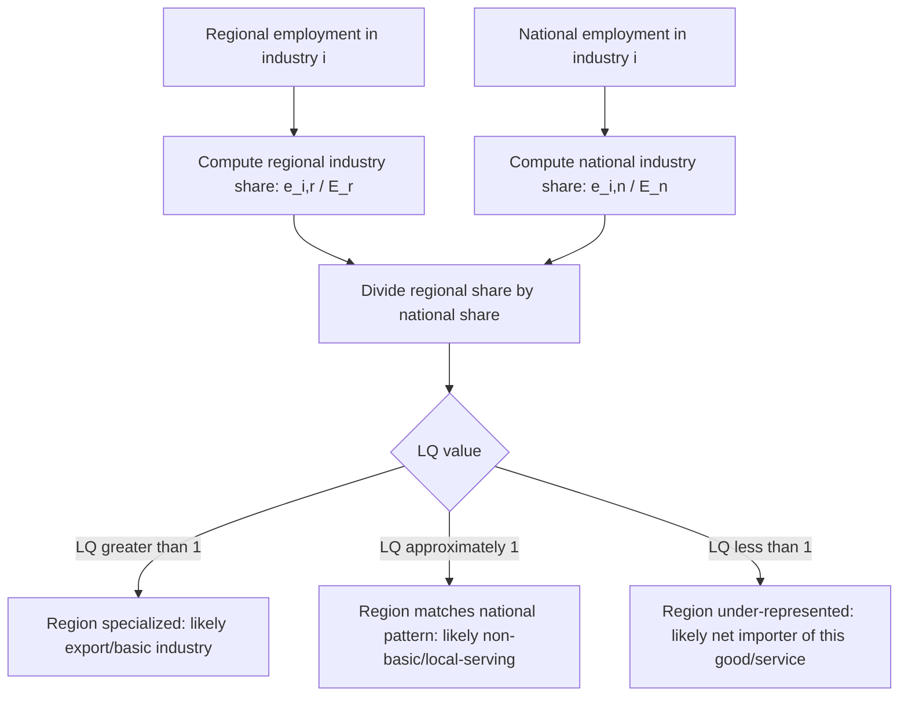

## Location Quotients

### Overview

The location quotient (LQ) is a simple ratio-based measure that compares the concentration of an industry (or occupation, or demographic characteristic) in a specific region relative to its concentration in a larger reference economy (typically the nation). It is one of the most widely used foundational tools in regional economics, serving as an input to economic base analysis, regional I-O table construction, cluster identification, and regional specialization studies, precisely because it requires only readily available employment data and no complex modeling assumptions.

### The Basic Formula

**Key Points**

- The standard employment-based location quotient for industry $i$ in region $r$:

$$LQ_i = \frac{e_{i,r}/E_r}{e_{i,n}/E_n}$$

where $e_{i,r}$ is regional employment in industry $i$, $E_r$ is total regional employment, $e_{i,n}$ is national employment in industry $i$, and $E_n$ is total national employment.

- Equivalently, the LQ can be expressed as the ratio of the region's share of national industry $i$ employment to the region's share of total national employment:

$$LQ_i = \frac{e_{i,r}/e_{i,n}}{E_r/E_n}$$

### Interpreting the Location Quotient

**Key Points**

- **$LQ_i = 1$**: The region has exactly the same relative concentration of industry $i$ as the nation—the region's share of national employment in that industry equals its share of total national employment.
- **$LQ_i > 1$**: The region is *more* specialized in industry $i$ than the nation as a whole; a commonly used (though somewhat arbitrary) rule of thumb treats $LQ_i > 1.25$ as indicating meaningful regional specialization, and industries with high LQs are often interpreted as candidates for the region's "export base" or economic base industries.
- **$LQ_i < 1$**: The region is *less* specialized in industry $i$ than the nation; the region likely imports some of that good/service from elsewhere to meet local demand, or local demand for that industry's output is simply lower.
- [Inference] The specific numerical threshold used to designate an industry as "specialized" or part of the economic base (e.g., 1.0, 1.25, 1.5) varies by study and application and is not a universally fixed standard; analysts should state their chosen threshold explicitly.

### Diagram: Location Quotient Calculation Logic

### Worked Numerical Example

**Example**

Suppose a metropolitan region has 8,000 jobs in furniture manufacturing out of 400,000 total regional jobs, while the nation has 900,000 furniture manufacturing jobs out of 150,000,000 total national jobs.

- Regional share: $8{,}000 / 400{,}000 = 0.020$ (2.0%)
- National share: $900{,}000 / 150{,}000{,}000 = 0.006$ (0.6%)
- $LQ = 0.020 / 0.006 \approx 3.33$

**Interpretation**: The region is roughly 3.3 times more concentrated in furniture manufacturing than the nation as a whole—strong evidence that furniture manufacturing functions as an export-base ("basic") industry for this region, producing far more than local demand alone would require, with the surplus presumably sold to other regions or exported.

### Primary Applications

#### 1. Economic Base Analysis

**Key Points**

- LQ is the standard tool for classifying regional industries as "basic" (export-oriented, driving external income into the region) versus "non-basic" (local-serving, dependent on income already circulating within the region), a distinction central to economic base theory and export-base growth models.
- Basic employment is typically estimated using the LQ by assuming that any employment beyond what would be needed to serve local demand at the national per-capita consumption rate represents "excess" (exported) employment:

$$\text{Basic Employment}_i = e_{i,r} \times \left(\frac{LQ_i - 1}{LQ_i}\right), \quad \text{for } LQ_i > 1$$

For industries with $LQ_i \le 1$, all employment is typically classified as non-basic (the region doesn't even produce enough for local consumption, implying it imports the rest).

#### 2. Regionalizing National Input-Output Tables

**Key Points**

- As covered in input-output analysis, LQs are the most common non-survey method for adjusting national technical coefficients to approximate regional interindustry purchasing patterns, under the assumption that a region's ability to supply its own intermediate inputs is proportional to its relative specialization in the supplying industry.
- Variants used specifically for this purpose include the Simple Location Quotient (SLQ), Cross-Industry Location Quotient (CILQ, which compares two specific industries' relative concentrations rather than one industry against the total economy), and the Flegg Location Quotient (FLQ), which incorporates a regional-size adjustment parameter to correct for a known tendency of simple LQ-based methods to overstate regional self-sufficiency in smaller regions.

#### 3. Cluster Identification and Industry Specialization Mapping

**Key Points**

- Economic development practitioners use LQ maps/tables across many industries simultaneously to identify a region's distinctive specialization profile, informing industry cluster strategy, targeted business attraction efforts, and workforce development priorities.
- High-LQ industries are frequently cross-referenced with employment growth trends and wage levels to prioritize which existing specializations merit further public investment or promotion (distinguishing a "declining but still concentrated" industry from a "growing and concentrated" one).

### Variants of the Location Quotient

**Key Points**

- **Employment LQ**: The standard and most common form, based on employment counts (as shown above).
- **Wage/Income LQ**: Uses wage or income data instead of employment counts, useful when average earnings differ substantially by industry and a more value-weighted measure of specialization is preferred.
- **Establishment/firm-count LQ**: Uses the number of business establishments rather than employment, sometimes preferred for very small-establishment-count industries or entrepreneurship-focused analysis.
- **Population/demographic LQ**: Applies the same ratio logic to demographic characteristics (e.g., age cohorts, educational attainment) to compare a region's demographic composition to a reference area, used in market analysis and social/demographic regional studies.
- **Cross-Industry Location Quotient (CILQ)**: Compares the relative concentration of a *supplying* industry to a *purchasing* industry directly, used specifically in regional I-O coefficient adjustment rather than general specialization measurement:

$$CILQ_{ij} = \frac{LQ_i}{LQ_j}$$

### Limitations and Critiques

**Key Points**

- **Assumes uniform national consumption patterns**: The basic LQ assumes that per-capita consumption of every good/service is identical across all regions and equal to the national average, which is a strong and often unrealistic assumption—regional differences in demographics, climate, income, or tastes can cause a region to have a "true" export surplus or deficit different from what the LQ alone suggests.
- **Ignores cross-hauling**: The LQ methodology cannot detect "cross-hauling"—a phenomenon where a region simultaneously imports and exports the same good/service (e.g., due to product differentiation, seasonal timing, or transportation cost structures)—because it only measures net relative concentration, not actual trade flows in both directions.
- **Sensitivity to industry classification level**: As with shift-share analysis, LQs computed at highly aggregated industry classification levels (e.g., 2-digit NAICS) can mask specialization that would be apparent at a more granular level (e.g., 4-digit or 6-digit NAICS), and vice versa—overly granular classifications can introduce small-sample statistical noise.
- **Static, single-period measure**: A basic LQ calculation reflects only current-period relative concentration and does not, by itself, indicate whether that specialization is a stable structural feature or the temporary result of a short-term shock; tracking LQ trends over multiple periods is generally more informative than a single-period snapshot.
- **Reference economy choice matters**: Results can differ meaningfully depending on whether the LQ is computed relative to the national economy, a state/provincial economy, or a peer-region benchmark, since each represents a different assumption about the "normal" or expected industry mix; analysts should be explicit about the chosen reference geography. [Inference] There is no universally correct reference geography—the appropriate choice depends on the specific research or policy question being addressed.

### Illustration: Location Quotient Comparison Across Industries

<svg xmlns="http://www.w3.org/2000/svg" viewBox="0 0 680 360">
<text x="340" y="26" text-anchor="middle" font-size="16" font-weight="bold" fill="#1a1a1a">Location Quotients by Industry: Example Region (svg_diagram)</text>
<line x1="80" y1="300" x2="620" y2="300" stroke="#333" stroke-width="2" />
<line x1="80" y1="300" x2="80" y2="60" stroke="#333" stroke-width="2" />
<text x="30" y="180" text-anchor="middle" font-size="12" fill="#333" transform="rotate(-90 30 180)">Location Quotient</text>
<line x1="80" y1="220" x2="620" y2="220" stroke="#dc2626" stroke-width="1.5" stroke-dasharray="6,4" />
<text x="600" y="212" text-anchor="end" font-size="11" fill="#dc2626">LQ = 1.0 (national parity)</text>
<rect x="120" y="80" width="60" height="140" fill="#2563eb" />
<text x="150" y="320" text-anchor="middle" font-size="11" fill="#333">Furniture Mfg</text>
<text x="150" y="70" text-anchor="middle" font-size="12" fill="#2563eb" font-weight="bold">3.3</text>
<rect x="230" y="150" width="60" height="70" fill="#16a34a" />
<text x="260" y="320" text-anchor="middle" font-size="11" fill="#333">Healthcare</text>
<text x="260" y="140" text-anchor="middle" font-size="12" fill="#16a34a" font-weight="bold">1.6</text>
<rect x="340" y="205" width="60" height="15" fill="#666" />
<text x="370" y="320" text-anchor="middle" font-size="11" fill="#333">Retail Trade</text>
<text x="370" y="197" text-anchor="middle" font-size="12" fill="#666" font-weight="bold">1.0</text>
<rect x="450" y="220" width="60" height="60" fill="#dc2626" />
<text x="480" y="320" text-anchor="middle" font-size="11" fill="#333">Finance</text>
<text x="480" y="292" text-anchor="middle" font-size="12" fill="#dc2626" font-weight="bold">0.5</text>
</svg>

### Conclusion

The location quotient's enduring appeal lies in its simplicity: with only two-region employment data by industry, an analyst can quickly flag which sectors likely constitute a region's export base, feed that information into economic base multiplier estimates, adjust national I-O tables for regional use, and identify candidate industry clusters for economic development strategy. Its simplicity is also its central limitation—the uniform-consumption and no-cross-hauling assumptions mean LQ results should generally be treated as a useful first-pass screening tool rather than a precise measurement of actual regional trade flows.

### Related Topics

- Economic base theory and export-base multipliers
- Input-output analysis
- Shift-share analysis
- Cluster theory and Porter's competitive advantage of regions
- Regional specialization and industrial diversification
- Growth pole and polarized development theory
- Regional I-O table construction (non-survey methods)