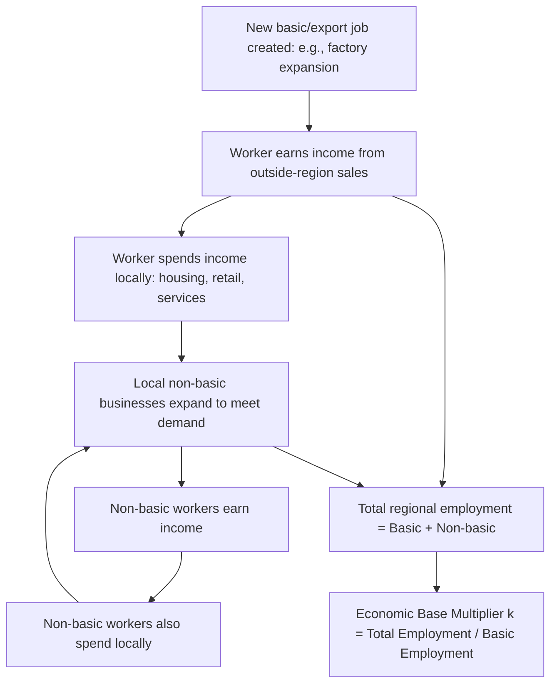

## Economic Base Multipliers

### Overview

Economic base theory posits that a region's total economic activity is driven fundamentally by its "basic" (export) sector—industries that sell goods and services outside the region, bringing new income in—while "non-basic" (local-serving) activity exists only to support the basic sector and the population it sustains. Economic base multipliers formalize this relationship, allowing analysts to estimate how much total regional employment or income change results from a given change in basic (export) employment or income. It is among the oldest and most intuitively accessible frameworks in regional economics, predating and conceptually paralleling the Keynesian income multiplier and the input-output multiplier.

### Basic vs. Non-Basic Activity

**Key Points**

- **Basic (export) activity**: Production sold to customers outside the region—manufacturing for national/global markets, tourism serving out-of-region visitors, corporate headquarters services sold nationally, agricultural exports. This activity brings new money into the regional economy from outside.
- **Non-basic (local-serving) activity**: Production sold to customers within the region—local retail, personal services, local government, construction of local housing. This activity circulates money already present in the region but does not independently generate new regional income.
- The central theoretical claim of economic base theory: regional growth is driven by growth in the basic sector, which then supports proportional growth in the non-basic sector through local respending (a regional analog to the Keynesian consumption multiplier).

### The Basic Employment Multiplier

**Key Points**

- The economic base multiplier expresses total regional employment as a function of basic employment:

$$E_{total} = E_{basic} + E_{nonbasic}$$

Assuming a stable ratio between non-basic and basic employment (the core simplifying assumption of the model), the **base multiplier** $k$ is defined as:

$$k = \frac{E_{total}}{E_{basic}} = \frac{E_{basic} + E_{nonbasic}}{E_{basic}} = 1 + \frac{E_{nonbasic}}{E_{basic}}$$

- The multiplier predicts total employment change from a change in basic employment:

$$\Delta E_{total} = k \times \Delta E_{basic}$$

- A base multiplier of $k = 2.5$, for example, implies that each new basic (export) job supports a total of 2.5 jobs regionally (the original basic job plus 1.5 additional non-basic jobs generated through local respending and service demand).

### Diagram: Economic Base Multiplier Mechanism

### Estimating Basic vs. Non-Basic Employment

**Key Points**

Three principal methods are used to classify and estimate the basic/non-basic split, each with different data requirements and accuracy trade-offs:

1. **Location Quotient method**: The most common approach—uses location quotients to estimate the "excess" employment in each industry relative to what local consumption alone would require, attributing that excess to basic (export) activity, as detailed in the location quotients topic:

$$\text{Basic Employment}_i = e_{i,r} \times \left(\frac{LQ_i - 1}{LQ_i}\right), \quad \text{for } LQ_i > 1$$

2. **Minimum requirements method**: Compares the region's industry employment shares against the *minimum* share observed for that industry across a set of comparable regions (assuming the minimum represents the share needed purely for local self-sufficiency, with anything above that minimum in the study region representing basic/export employment).
3. **Direct survey/assumption method**: Surveys firms directly about the geographic destination of their sales (in-region vs. out-of-region), or, more crudely, classifies entire industries as either 100% basic (e.g., all manufacturing, mining, agriculture) or 100% non-basic (e.g., all retail, local government) based on general industry characteristics—a simpler but cruder method than LQ-based estimation.

### Worked Numerical Example

**Example**

A small regional economy has 50,000 total jobs. Using the location quotient method, an analyst estimates 20,000 of these jobs are basic (export-oriented) and 30,000 are non-basic (local-serving).

- Base multiplier: $k = 50{,}000 / 20{,}000 = 2.5$
- A proposed new manufacturing plant is expected to directly create 800 basic jobs.
- **Predicted total regional employment impact**: $\Delta E_{total} = 2.5 \times 800 = 2{,}000$ jobs (800 direct basic jobs plus an estimated 1,200 additional non-basic jobs supporting the new basic-sector workers and their local spending).

This closely parallels the employment multiplier calculation in input-output analysis, though economic base theory arrives at the estimate through a much simpler aggregate ratio rather than a full interindustry matrix.

### Relationship to the Keynesian Income Multiplier

**Key Points**

- Economic base theory's structure directly parallels the simple Keynesian multiplier from macroeconomics, where autonomous spending (analogous to basic/export income) supports induced spending (analogous to non-basic/local-serving income) through a marginal propensity to consume locally:

$$k_{base} \; \Leftrightarrow \; k_{Keynesian} = \frac{1}{1 - MPC_{local}}$$

- This parallel explains why economic base theory is sometimes described as the regional-economics equivalent of the aggregate expenditure multiplier, with the "propensity to spend locally" (as opposed to leaking to imports/savings/taxes) playing the same role as the marginal propensity to consume in the national income multiplier.

### Relationship to Input-Output and Shift-Share Analysis

**Key Points**

- Economic base multipliers are a highly simplified special case of the more detailed input-output multiplier framework: I-O analysis disaggregates the "non-basic" sector into its full interindustry structure (with sector-specific technical coefficients), while economic base theory collapses all non-basic activity into a single aggregate ratio.
- The trade-off is data and computational simplicity (economic base analysis requires only basic/non-basic employment classification) versus analytical precision and sectoral detail (I-O analysis requires a full transactions table but can identify exactly which supporting industries benefit and by how much).
- Location quotients, the primary tool for identifying basic employment, are the same underlying technique used to identify a region's likely export-oriented industries in cluster analysis and to regionalize national I-O coefficient tables—making LQ a shared foundational tool across all three methodologies.

### Applications

**Key Points**

- **Rapid economic impact screening**: Because it requires minimal data, economic base analysis is often used for quick, low-cost preliminary economic impact estimates before commissioning a more detailed I-O-based study.
- **Regional growth forecasting**: Projecting future regional employment or population growth based on anticipated changes in basic-sector employment (e.g., forecasted export industry trends, a planned military base closure, a major employer's expansion or contraction announcement).
- **Historical regional economic analysis**: Used in economic history and regional development studies to characterize how a region's economic base has shifted over time (e.g., from agriculture to manufacturing to services), and to assess a region's vulnerability to external shocks concentrated in its basic-sector industries.
- **Community and small-region impact studies**: Particularly common for smaller regions (single counties, small metro areas) where full survey-based I-O tables are not available or economically justified to construct.

### Limitations and Critiques

**Key Points**

- **Oversimplified aggregate ratio**: Collapsing the entire non-basic economy into a single fixed ratio ignores the substantial sectoral variation in local multiplier effects that I-O analysis captures explicitly—not all basic-sector expansions generate equivalent non-basic employment, since this depends on wage levels, local sourcing patterns, and the specific industries involved.
- **Assumes a stable base multiplier over time and across shock sizes**: The ratio $k$ is treated as a fixed structural parameter, but it can change as a regional economy matures, diversifies, or experiences structural shifts—applying a historically estimated multiplier to project future impacts implicitly assumes structural stability that may not hold, especially for large shocks or long time horizons. [Inference] The degree to which any specific region's base multiplier remains stable over a given forecast horizon is an empirical question specific to that region and cannot be assumed a priori.
- **Basic/non-basic classification ambiguity**: The classification of specific industries or firms as basic versus non-basic is not always clear-cut in practice (e.g., a regional hospital may serve mostly local patients but also attract out-of-region medical tourism revenue), and different estimation methods (LQ vs. minimum requirements vs. survey) can produce materially different basic-employment estimates for the same region.
- **No price or capacity constraints**: Like standard I-O analysis, the economic base model assumes the non-basic sector can expand without limit to meet demand generated by basic-sector growth, ignoring potential capacity constraints, land availability, or labor market tightness that could dampen the actual realized multiplier effect in practice.
- **Ignores leakages beyond basic/non-basic accounting**: A portion of local spending leaks out of the region through imports, savings, and taxes; the simple base multiplier does not explicitly separate these leakage channels the way a more detailed Keynesian regional income model or I-O model with import coefficients would.

### Illustration: Basic Employment Multiplier Effect

<svg xmlns="http://www.w3.org/2000/svg" viewBox="0 0 680 340">
<text x="340" y="26" text-anchor="middle" font-size="16" font-weight="bold" fill="#1a1a1a">Economic Base Multiplier: 800 New Basic Jobs (svg_diagram)</text>
<line x1="80" y1="290" x2="600" y2="290" stroke="#333" stroke-width="2" />
<line x1="80" y1="290" x2="80" y2="60" stroke="#333" stroke-width="2" />
<text x="30" y="180" text-anchor="middle" font-size="12" fill="#333" transform="rotate(-90 30 180)">Jobs</text>
<rect x="150" y="180" width="90" height="110" fill="#2563eb" />
<text x="195" y="310" text-anchor="middle" font-size="12" fill="#333">Basic (Direct)</text>
<text x="195" y="170" text-anchor="middle" font-size="13" fill="#2563eb" font-weight="bold">800</text>
<rect x="290" y="125" width="90" height="165" fill="#16a34a" />
<text x="335" y="310" text-anchor="middle" font-size="12" fill="#333">Non-Basic (Induced)</text>
<text x="335" y="115" text-anchor="middle" font-size="13" fill="#16a34a" font-weight="bold">1,200</text>
<rect x="450" y="90" width="90" height="200" fill="#7c3aed" />
<text x="495" y="310" text-anchor="middle" font-size="12" fill="#333">Total Impact</text>
<text x="495" y="80" text-anchor="middle" font-size="13" fill="#7c3aed" font-weight="bold">2,000</text>

<text x="340" y="45" text-anchor="middle" font-size="12" fill="#666" font-style="italic">Multiplier k = 2.5</text>

</svg>

### Conclusion

Economic base theory and its associated multipliers represent the simplest and most accessible entry point into regional economic impact analysis, resting on the intuitive claim that export-oriented "basic" activity is the fundamental driver of regional growth, with local-serving "non-basic" activity expanding proportionally in support. While largely superseded in rigor by input-output and computable general equilibrium models for detailed policy analysis, base multipliers remain valuable for rapid diagnostic screening, historical regional analysis, and settings where the data requirements of more sophisticated models cannot be met.

### Related Topics

- Location quotients
- Input-output analysis
- Shift-share analysis
- Keynesian income-expenditure multiplier theory
- Regional growth forecasting methods
- Growth pole and polarized development theory
- Regional economic impact assessment methodology
- Export-base theory of urban and regional growth (North, Tiebout)