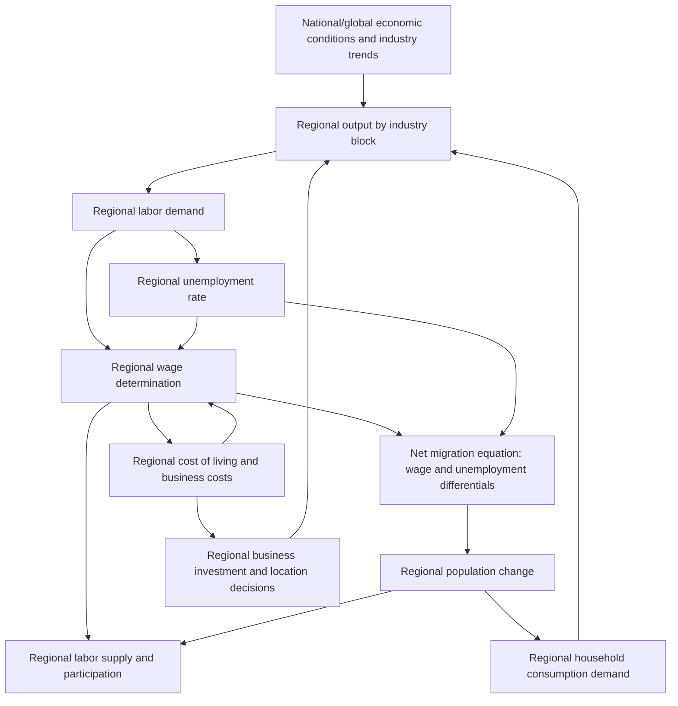

## Regional Econometric Models

### Overview

Regional econometric models apply statistically estimated behavioral equations—rather than fixed accounting identities—to represent how a regional economy responds to policy changes, external shocks, and structural relationships over time. Unlike input-output analysis (fixed technical coefficients) or economic base multipliers (fixed ratios), regional econometric models estimate parameters from historical data, incorporate price responsiveness and behavioral adjustment, and can generate dynamic, multi-period forecasts. They occupy a middle ground in the modeling toolkit between simple accounting-based techniques and full computable general equilibrium (CGE) models.

### Core Rationale: Why Move Beyond Fixed-Coefficient Models

**Key Points**

- Input-output and economic base models assume fixed technical relationships (constant multipliers, constant technical coefficients) that do not respond to relative price changes, wage growth, or changing behavior over time—reasonable for short-run, small-shock impact estimates but potentially misleading for larger shocks or longer time horizons.
- Regional econometric models instead estimate behavioral relationships—e.g., how regional labor supply responds to regional wage changes, how regional population migration responds to relative regional economic conditions, how regional investment responds to cost of capital and expected returns—using statistical estimation (typically time-series or panel data methods) rather than assuming fixed technical ratios.
- This allows regional econometric models to capture **dynamic adjustment paths** (how an economy transitions to a new equilibrium over multiple years, not just an instantaneous multiplier effect) and behavioral feedback loops that pure accounting models cannot represent.

### Structural Components of a Typical Regional Econometric Model

**Key Points**

Most regional econometric models are built around interlinked behavioral equation blocks estimated from historical regional and national time-series/panel data:

1. **Output/production block**: Regional output or value-added by industry, often linked to national industry output growth (capturing that regional economies are embedded in and influenced by national/global sectoral trends) plus region-specific competitiveness terms.
2. **Labor market block**: Regional labor demand (derived from output equations and estimated labor productivity), regional labor supply (a function of regional wages, migration incentives, and demographic/participation trends), and wage determination equations that typically allow regional wages to adjust toward long-run equilibrium relative to national wage levels, cost of living, and labor market tightness.
3. **Population and migration block**: Models regional population change as a function of natural increase (births minus deaths) and net migration, where net migration typically responds econometrically to relative regional economic opportunity (wage differentials, unemployment rate differentials, amenity variables) relative to other regions—directly operationalizing the migration-driven convergence/divergence mechanisms discussed in regional growth theory.
4. **Cost and price block**: Regional cost of living, business costs, and relative price levels, which feed back into wage determination, migration decisions, and business location/investment decisions.
5. **Demand and final expenditure block**: Regional household consumption, investment, and government spending equations, often calibrated using regional variants of a Keynesian consumption function.

### Diagram: Regional Econometric Model Structure

### Estimation Approach: A Simplified Illustrative Equation Set

A stylized regional labor market and migration system, in the spirit of typical regional econometric models:

**Regional employment (derived demand from output):**

$$\ln E_{r,t} = \alpha_0 + \alpha_1 \ln Y_{r,t} - \alpha_2 \ln w_{r,t} + \epsilon_{1,t}$$

**Regional wage adjustment (error-correction toward long-run relative wage):**

$$\Delta \ln w_{r,t} = \beta_0 + \beta_1 (\ln w_{r,t-1} - \ln w^*_{r,t-1}) + \beta_2 \cdot u_{r,t} + \epsilon_{2,t}$$

where $w^*_r$ is a long-run equilibrium relative wage and $u_{r,t}$ is the regional unemployment rate (a Phillips-curve-type wage response).

**Net migration equation:**

$$NM_{r,t} = \gamma_0 + \gamma_1 (w_{r,t} - \bar{w}_{n,t}) - \gamma_2 (u_{r,t} - \bar{u}_{n,t}) + \gamma_3 \cdot \text{Amenities}_r + \epsilon_{3,t}$$

This type of specification allows the model to generate dynamic multi-year forecasts of how a regional shock (e.g., a plant closure, a new trade policy, a natural disaster) propagates through wages, employment, migration, and population over time—capturing feedback effects that a static I-O multiplier calculation cannot.

### Prominent Examples of Regional Econometric Modeling Systems

**Key Points**

- **REMI (Regional Economic Models, Inc.)**: One of the most widely used commercial regional econometric modeling platforms in the United States, combining an input-output core (interindustry linkages) with econometrically estimated equations for labor supply, migration, wage determination, and economic geography effects (agglomeration/competitiveness). REMI is frequently described as a "structural" or "dynamic" model because it produces year-by-year forecasts showing the full adjustment path of a regional economy following a policy or economic shock, rather than a single-period multiplier estimate.
- **State/regional macroeconometric models (various)**: Many U.S. state government agencies, universities, and consulting firms maintain smaller-scale regional econometric models tailored to specific state or metro economies, typically estimated via vector autoregression (VAR), error-correction models, or structural simultaneous equation systems using historical state/regional time-series data (e.g., Bureau of Economic Analysis regional data, Bureau of Labor Statistics regional employment data).
- **Panel data approaches**: Academic regional economics research frequently uses panel econometric methods (fixed-effects, dynamic panel GMM estimators) across many regions simultaneously to estimate general behavioral relationships (e.g., regional wage-migration elasticities, agglomeration elasticities) that can then inform or calibrate structural regional models. [Inference] The choice between commercial platforms like REMI and custom-built panel/VAR models depends heavily on the specific research or policy application, available budget, and required level of methodological transparency/customization.

### Key Methodological Techniques in Regional Econometrics

**Key Points**

- **Vector Autoregression (VAR) and regional VAR**: Models multiple regional time series (employment, wages, output) as functions of their own lags and each other's lags, without imposing strong theoretical structure a priori, useful for forecasting and impulse-response analysis of how a regional economy responds dynamically to shocks.
- **Error-correction models (ECM)**: Widely used to model regional variables (wages, prices, migration) that exhibit a long-run equilibrium relationship but short-run deviations, formalizing the idea that regional wages/migration adjust gradually toward (rather than jump instantly to) their long-run relative position.
- **Panel data fixed/random effects models**: Exploit variation across many regions and over time simultaneously to estimate behavioral parameters (e.g., migration elasticities, agglomeration economies) with greater statistical power than single-region time series alone, while controlling for unobserved region-specific characteristics.
- **Spatial econometric extensions**: Incorporate spatial weight matrices to formally account for the fact that neighboring regions' economic conditions are not independent (spatial autocorrelation)—directly relevant given the interregional migration and knowledge-spillover mechanisms discussed in regional convergence/divergence and endogenous growth theory.

### Applications

**Example**

A state government wants to estimate the multi-year impact of a new state minimum wage increase on regional employment, migration, and tax revenue.

A regional econometric model approach would:

1. Estimate how the wage floor change affects the wage distribution in low-wage industries within the region.
2. Trace the effect through the labor demand equation (how much does employment respond to the higher labor cost, given the estimated regional labor demand elasticity).
3. Model any resulting change in the region's relative wage competitiveness and its effect on business location/investment decisions.
4. Project the resulting migration response (does higher regional wage attract in-migration, offsetting some employment effects through labor supply growth) over a multi-year adjustment path.
5. Aggregate into a year-by-year forecast of net regional employment, population, and state tax revenue effects—capturing dynamic behavioral responses that a static I-O or base-multiplier calculation would miss entirely.

This is functionally distinct from a static I-O impact study (as in the automotive plant example under input-output analysis), since it explicitly models *how the region's economic actors respond and adjust* rather than assuming fixed technical/multiplier relationships.

### Strengths Relative to Other Regional Modeling Approaches

**Key Points**

- **Dynamic, multi-period forecasting**: Unlike static I-O or economic base multipliers, econometric models can trace the full time path of adjustment following a shock, which is valuable for policy analysis where the timing of impacts matters (e.g., short-run job losses versus longer-run structural adjustment).
- **Behavioral responsiveness**: Wages, migration, and investment respond to changing economic conditions rather than remaining fixed, generally producing more realistic (and often smaller, due to offsetting behavioral responses) impact estimates than static multiplier models for large or long-duration shocks.
- **Empirically grounded parameters**: Behavioral elasticities are estimated from actual historical regional data rather than assumed or calibrated, in principle grounding the model's predictions in observed regional economic behavior (though this also means model quality depends heavily on the quality, length, and representativeness of the historical data used for estimation).

### Limitations and Critiques

**Key Points**

- **Data intensity and estimation uncertainty**: Regional econometric models require substantial historical time-series or panel data to estimate behavioral parameters reliably; smaller regions with limited historical data availability may face wide confidence intervals around key elasticity estimates, undermining forecast precision.
- **Parameter (Lucas) critique concerns**: Behavioral parameters estimated from historical data reflect the economic environment (policy regime, technology, institutions) prevailing during the estimation period; if a proposed policy change or shock is sufficiently novel or large, historically estimated elasticities may not remain stable under the new regime—a version of the broader "Lucas critique" concern from macroeconometrics applied to regional models. [Inference] The practical severity of this concern depends on how similar the policy scenario being evaluated is to historical episodes in the estimation sample.
- **Model opacity in commercial platforms**: Proprietary systems like REMI involve complex, integrated equation systems that can be difficult for outside analysts to fully audit or replicate, raising transparency concerns in some policy debates, particularly when a model's specific parameter assumptions materially affect a high-stakes policy conclusion (e.g., large public subsidy justification studies).
- **Structural break risk**: Because these models are estimated on historical relationships, they can perform poorly during genuinely structural regime changes (e.g., a fundamental technology shift, a major trade policy realignment, a pandemic-scale disruption) that alter the underlying behavioral relationships the model was calibrated to represent.

### Illustration: Static Multiplier vs. Dynamic Econometric Adjustment Path

<svg xmlns="http://www.w3.org/2000/svg" viewBox="0 0 700 360">
<text x="350" y="26" text-anchor="middle" font-size="16" font-weight="bold" fill="#1a1a1a">Static Multiplier vs. Dynamic Econometric Response (svg_diagram)</text>
<line x1="80" y1="300" x2="650" y2="300" stroke="#333" stroke-width="2" />
<line x1="80" y1="300" x2="80" y2="60" stroke="#333" stroke-width="2" />
<text x="365" y="325" text-anchor="middle" font-size="12" fill="#333">Years after shock</text>
<text x="35" y="185" text-anchor="middle" font-size="12" fill="#333" transform="rotate(-90 35 185)">Employment impact</text>
<line x1="130" y1="150" x2="600" y2="150" stroke="#666" stroke-width="2" stroke-dasharray="6,4" />
<text x="580" y="140" font-size="11" fill="#666">Static I-O / base multiplier (instant, constant)</text>
<path d="M130,300 C 200,180 280,140 360,150 S 500,175 600,165" stroke="#2563eb" stroke-width="3" fill="none" />
<text x="450" y="200" font-size="11" fill="#2563eb" font-weight="bold">Dynamic econometric adjustment path</text>
<text x="450" y="215" font-size="10" fill="#2563eb">(overshoot, migration lag, wage adjustment)</text>
</svg>

### Conclusion

Regional econometric models represent a more analytically sophisticated—though more data-demanding and less transparent—alternative to fixed-coefficient input-output and economic base approaches, capturing dynamic behavioral responses in wages, migration, and investment that unfold over multiple years following a regional shock. They occupy a middle position between simple accounting-based tools and full computable general equilibrium models, and are the preferred approach for policy analyses where the *timing and behavioral realism* of a regional economy's adjustment path matters as much as the eventual total impact magnitude.

### Related Topics

- Input-output analysis
- Economic base multipliers
- Computable general equilibrium (CGE) regional models
- Regional convergence and divergence (migration-driven mechanisms)
- Spatial econometrics and spatial weight matrices
- Vector autoregression and error-correction modeling
- Regional labor market analysis and wage determination
- Endogenous growth theory in a regional context