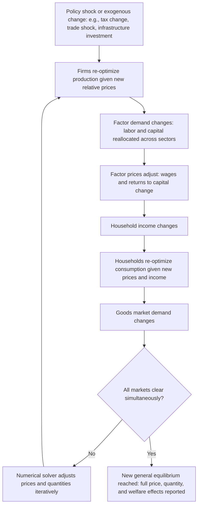

## Computable General Equilibrium Models

### Overview

Computable general equilibrium (CGE) models are numerical simulation models grounded in microeconomic general equilibrium theory, representing an entire economy (or region) as a system of interacting markets in which households, firms, and government simultaneously optimize subject to budget and technology constraints, with prices adjusting to clear all markets simultaneously. In regional economics, CGE models represent the most theoretically rigorous and comprehensive—but also the most data-intensive and complex—tool in the applied modeling toolkit, explicitly incorporating price responsiveness, factor substitution, and market-clearing behavior that input-output, economic base, and even most regional econometric models simplify away or omit.

### Theoretical Foundations

**Key Points**

- CGE models are numerical implementations of Walrasian general equilibrium theory, in which all markets (goods, labor, capital) clear simultaneously through price adjustment, and all economic agents (households maximizing utility subject to budget constraints, firms maximizing profit subject to production technology) behave optimally given those prices.
- This distinguishes CGE fundamentally from input-output analysis, which holds prices and technical input ratios fixed regardless of relative price changes; CGE models instead allow firms to substitute between inputs (e.g., labor for capital) in response to changing relative factor prices, and allow households to substitute between goods in response to changing relative prices—capturing behavioral responses that fixed-coefficient models cannot.
- The theoretical roots trace to Leon Walras's general equilibrium theory and Arrow-Debreu existence proofs, operationalized into empirically calibrated, solvable numerical models beginning with the work of Leif Johansen (1960) and later popularized in applied policy analysis by researchers including Shoven and Whalley in the 1980s.

### Core Structural Components

**Key Points**

A typical regional CGE model consists of the following interlinked blocks:

1. **Production block**: Firms in each sector combine factors of production (labor, capital, land) and intermediate inputs (following an input-output-like structure) using production functions—commonly nested Constant Elasticity of Substitution (CES) functions—that allow substitution between factors in response to relative price changes, unlike the fixed-proportion Leontief production assumption of standard I-O analysis.
2. **Household/consumer block**: Represents household utility maximization, typically using a demand system (e.g., Linear Expenditure System, LES, or CES utility) that allows consumption patterns to respond to relative price changes and income effects, rather than the fixed final-demand vector of an I-O model.
3. **Government block**: Models tax collection, government spending, and transfers, allowing analysis of tax policy changes and their full general-equilibrium effects on prices, factor returns, and welfare.
4. **Factor markets block**: Models labor and capital markets, including regional factor mobility assumptions—critical for regional CGE models, since assumptions about whether labor and capital can freely move between the modeled region and the rest of the economy substantially affect model results.
5. **Trade/rest-of-region(world) block**: Represents the region's trade with the rest of the nation/world, typically using an Armington specification that treats domestically produced and imported varieties of the same good as imperfect substitutes (allowing for two-way trade in the same product category, addressing the "cross-hauling" phenomenon that location-quotient-based methods cannot capture).
6. **Market-clearing/closure block**: A system of equations ensuring supply equals demand in every market simultaneously, solved numerically (since analytical closed-form solutions are generally infeasible for realistically sized models).

### Diagram: CGE Model Circular Flow and Solution Logic

### Model Calibration: The Social Accounting Matrix (SAM)

**Key Points**

- CGE models are typically calibrated (rather than purely econometrically estimated) using a **Social Accounting Matrix (SAM)**—an extension of the input-output transactions table that additionally tracks flows between institutions (households, firms, government) and factor markets, providing a complete, internally consistent snapshot of the regional economy in a base year.
- **Calibration** sets most production and utility function parameters so that the model, when solved, exactly reproduces the observed SAM base-year data as its baseline equilibrium; a smaller number of key behavioral parameters (elasticities of substitution) are typically drawn from the empirical econometric literature rather than estimated fresh within the model itself.
- This hybrid calibration approach (rather than full econometric estimation of every parameter) is both a practical necessity, given data limitations, and a recognized methodological limitation—model results can be sensitive to the specific elasticity values chosen from the literature, particularly for elasticities where the empirical literature itself shows a wide range of estimates. [Inference] The degree of results-sensitivity to elasticity assumptions varies by model application and specific parameter, and is typically assessed through the sensitivity analysis practices described below.

### Regional CGE-Specific Considerations

**Key Points**

- **Interregional factor mobility assumptions**: A defining methodological choice in regional (as opposed to national) CGE models concerns how freely labor and capital can move between the modeled region and the rest of the country/world—full mobility, no mobility (fixed regional factor supply), or partial mobility with an estimated elasticity—and this assumption substantially affects model predictions about how policy shocks are absorbed (through factor price changes if immobile, versus through factor reallocation if mobile).
- **Sub-national fiscal federalism**: Regional CGE models used for state/provincial policy analysis must explicitly represent the region's specific fiscal relationship with higher levels of government (federal transfers, shared tax bases), which is more institutionally complex than a national CGE model's government sector.
- **Regional trade closure**: As with regional I-O tables, regional CGE models require decisions about how to represent the region's trade with the rest of the nation/world, often using similar non-survey estimation techniques (location quotient-based methods, RAS balancing) to construct the regional SAM from national data and regional economic census information.

### Applications in Regional Economics

**Example**

A state government is evaluating a proposed carbon tax and wants to understand its full regional economic and distributional effects, beyond a simple I-O impact estimate.

A regional CGE approach would:

1. Model how the carbon tax raises the relative price of energy-intensive goods, inducing firms to substitute toward less energy-intensive production processes (a behavioral response an I-O model, with its fixed technical coefficients, cannot represent).
2. Trace how energy-intensive industries contract while other industries may expand (due to changing relative competitiveness), reallocating labor and capital across sectors—not just adding up direct-plus-indirect impacts within a fixed structure.
3. Model how energy-intensive industries' cost increases pass through to consumer prices, and how households substitute their consumption bundles in response (again, a genuinely behavioral, price-responsive adjustment).
4. Incorporate how carbon tax revenue is recycled (e.g., returned via rebates, used to cut other taxes), which materially affects the net welfare and distributional outcome—an analysis fundamentally requiring the government/fiscal block's general-equilibrium interactions with household and firm behavior.
5. Report not just employment and output effects but full welfare measures (equivalent variation, compensating variation) capturing household well-being changes from both price effects and income effects simultaneously.

This type of analysis—requiring simultaneous price adjustment, factor substitution, and cross-market feedback—is precisely what distinguishes CGE from I-O, economic base, and even most regional econometric models.

### Strengths Relative to Other Regional Modeling Approaches

**Key Points**

- **Full price endogeneity and factor substitution**: Unlike I-O (fixed prices/coefficients) and even most regional econometric models (partial behavioral responses in specific equations), CGE models endogenize essentially all prices and allow comprehensive substitution responses throughout the economy, providing theoretically the most complete general-equilibrium picture of a policy shock's effects.
- **Internally consistent welfare analysis**: CGE models can compute rigorous, theoretically grounded welfare measures (compensating and equivalent variation) reflecting genuine household utility changes, which accounting-based models (I-O, economic base) cannot produce since they lack an explicit utility-theoretic household optimization framework.
- **Suited to large or structural policy shocks**: Because CGE models allow behavioral adjustment and substitution, they are generally considered more reliable than fixed-coefficient models for evaluating large policy changes (major tax reform, significant trade liberalization, large-scale carbon pricing) where price and substitution effects are likely to be economically material rather than negligible.

### Limitations and Critiques

**Key Points**

- **Calibration versus estimation debate**: Because most CGE parameters are calibrated to reproduce a single base-year SAM rather than econometrically estimated from historical variation, critics argue CGE results can be highly sensitive to the (often externally sourced, sometimes disputed) elasticity of substitution values chosen, and that calibration provides weaker empirical validation than genuine econometric estimation.
- **Data intensity**: Constructing a regional SAM (the calibration dataset) requires substantially more detailed data than an I-O table alone (factor income flows, institutional transfers, government accounts), and non-survey regional SAM construction techniques carry the same approximation concerns discussed under regional I-O tables and location quotients.
- **Black-box complexity and reduced transparency**: Large CGE models can involve hundreds or thousands of equations solved simultaneously by specialized software (e.g., GAMS, GEMPACK), making it difficult for non-specialist stakeholders (and sometimes even other economists) to fully audit or intuitively understand why a particular result emerged—a transparency concern often raised in politically contentious policy debates (e.g., trade policy, carbon pricing) where CGE results are used as key evidence.
- **Sensitivity analysis is essential but not always performed rigorously**: Because of parameter uncertainty, best practice calls for systematic sensitivity analysis (varying key elasticities across plausible ranges) to report a range of outcomes rather than a single point estimate; however, [Inference] the extent to which published regional CGE studies consistently apply rigorous, comprehensive sensitivity analysis varies by study and has been a subject of methodological critique in the applied economics literature.
- **Closure rule dependence**: Model results can be highly sensitive to the choice of "closure" assumptions (e.g., whether the labor market clears via wage adjustment with fixed employment, or via employment adjustment with a fixed/sticky wage; whether the government budget is balanced through tax adjustment or debt), and different plausible closure choices can generate materially different results for the same underlying shock—an important source of results-variation that non-specialist readers of CGE studies may not always appreciate.

### Illustration: Modeling Hierarchy — Accounting to General Equilibrium

<svg xmlns="http://www.w3.org/2000/svg" viewBox="0 0 700 380">
<text x="350" y="26" text-anchor="middle" font-size="16" font-weight="bold" fill="#1a1a1a">Regional Modeling Hierarchy: Complexity vs. Behavioral Realism (svg_diagram)</text>
<line x1="80" y1="330" x2="620" y2="330" stroke="#333" stroke-width="2" />
<text x="350" y="355" text-anchor="middle" font-size="12" fill="#333">Increasing complexity, data requirements, and price responsiveness →</text>
<rect x="90" y="250" width="110" height="70" fill="#93c5fd" stroke="#333" />
<text x="145" y="290" text-anchor="middle" font-size="12" fill="#1a1a1a">Economic Base</text>
<text x="145" y="305" text-anchor="middle" font-size="11" fill="#1a1a1a">Fixed ratio</text>
<rect x="230" y="220" width="110" height="100" fill="#60a5fa" stroke="#333" />
<text x="285" y="265" text-anchor="middle" font-size="12" fill="#1a1a1a">Input-Output</text>
<text x="285" y="280" text-anchor="middle" font-size="11" fill="#1a1a1a">Fixed coefficients,</text>
<text x="285" y="295" text-anchor="middle" font-size="11" fill="#1a1a1a">no price response</text>
<rect x="370" y="170" width="120" height="150" fill="#3b82f6" stroke="#333" />
<text x="430" y="230" text-anchor="middle" font-size="12" fill="white">Regional</text>
<text x="430" y="245" text-anchor="middle" font-size="12" fill="white">Econometric</text>
<text x="430" y="260" text-anchor="middle" font-size="11" fill="white">Behavioral eqns,</text>
<text x="430" y="275" text-anchor="middle" font-size="11" fill="white">dynamic paths</text>
<rect x="520" y="90" width="130" height="230" fill="#1e40af" stroke="#333" />
<text x="585" y="180" text-anchor="middle" font-size="12" fill="white">CGE</text>
<text x="585" y="195" text-anchor="middle" font-size="11" fill="white">Full price</text>
<text x="585" y="210" text-anchor="middle" font-size="11" fill="white">endogeneity,</text>
<text x="585" y="225" text-anchor="middle" font-size="11" fill="white">factor substitution,</text>
<text x="585" y="240" text-anchor="middle" font-size="11" fill="white">welfare analysis</text>
</svg>

### Conclusion

CGE models represent the theoretically most complete tool for regional economic policy analysis, grounded in explicit microeconomic optimization and market-clearing conditions that allow full price endogeneity, factor substitution, and rigorous welfare measurement—capabilities absent from input-output, economic base, and (to a lesser extent) regional econometric models. This theoretical completeness comes at the cost of substantially greater data requirements (a full regional Social Accounting Matrix), calibration rather than pure estimation of key parameters, and reduced transparency for non-specialist audiences, making CGE models best suited to evaluating large, structural policy changes where price and substitution effects are likely to matter, while simpler models often remain adequate—and more practical—for smaller-scale or routine economic impact assessments.

### Related Topics

- Input-output analysis
- Regional econometric models
- Social accounting matrices (SAMs)
- Economic base multipliers
- Regional trade and the Armington assumption
- Welfare analysis: compensating and equivalent variation
- Fiscal federalism and sub-national government finance
- Carbon pricing and regional economic impact analysis