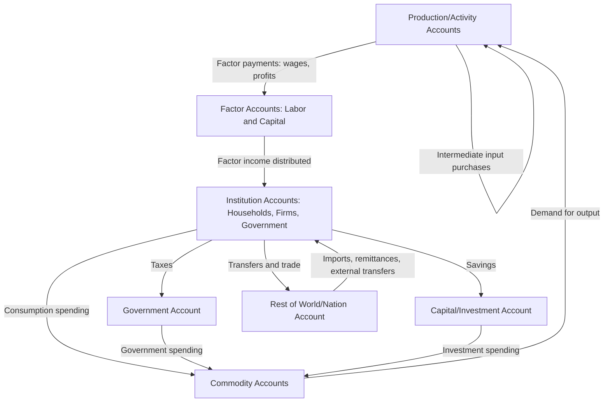

## Social Accounting Matrices

### Overview

A Social Accounting Matrix (SAM) is a comprehensive, square accounting framework that presents a complete snapshot of an economy's (or region's) transactions in a single tabular form, capturing not only interindustry flows (as in a standard input-output table) but also the full circular flow of income between production activities, factors of production, institutions (households, firms, government), and the rest of the world/nation. It serves as the essential data foundation for computable general equilibrium (CGE) models and provides a more complete accounting picture of a regional economy than an input-output table alone.

### Core Structure and Accounting Principle

**Key Points**

- A SAM is organized as a square matrix in which every account appears as both a row and a column; the same list of accounts labels both dimensions. By convention, each row shows *receipts* (income) for that account, while each column shows *expenditures* (outlays) for that account.
- The fundamental accounting identity of a SAM is that **for every account, total receipts (row sum) must equal total expenditures (column sum)**—a double-entry bookkeeping discipline that ensures the entire economy's transactions are fully and consistently recorded with no leakages or unexplained residuals.

$$\sum_j T_{ij} = \sum_j T_{ji} \quad \text{for every account } i$$

where $T_{ij}$ represents the payment from account $j$ (column) to account $i$ (row).

- This built-in consistency check is one of a SAM's most valuable practical features: if row and column totals do not match after compiling a SAM from disparate data sources (national accounts, household surveys, government budget data, trade statistics), it immediately signals a data inconsistency requiring reconciliation (commonly addressed via RAS-type biproportional balancing).

### Standard Account Categories in a SAM

**Key Points**

A typical SAM organizes accounts into several standard blocks:

1. **Production/Activity accounts**: Represent production processes; columns show what each activity purchases (intermediate inputs and factor payments) to produce output; rows show sales of that output to various accounts.
2. **Commodity accounts**: Separate from activity accounts in most modern SAM structures, representing markets for specific goods and services (allowing a distinction between, e.g., domestic production and imports of the same commodity, and between commodities that may be produced by multiple activities).
3. **Factor accounts**: Represent payments to labor (wages, by skill/occupation category) and capital (profits, rents, interest), recording how factor income is generated by production activities and subsequently distributed to institutions.
4. **Institution accounts**: Typically disaggregated into households (often further split by income group, region, or demographic category), enterprises/firms, and government—recording income received (factor income, transfers) and expenditure (consumption, savings, taxes, transfers paid).
5. **Capital/Savings-Investment account**: Records aggregate savings from all institutions and its allocation to investment, closing the macroeconomic circular flow.
6. **Rest of the world/nation account**: Records the region's (or country's) trade and financial transactions with external economies—critical for regional SAMs, which must explicitly represent trade with the rest of the nation as well as international trade.

### Diagram: SAM Circular Flow of Income

### SAM vs. Input-Output Table: Key Distinctions

**Key Points**

- An input-output table captures only the interindustry transactions block (the top-left submatrix of a full SAM) plus a simplified final demand column and a value-added row; it does not explicitly disaggregate how that value-added (factor income) flows to and is redistributed among different types of households, firms, and government.
- A SAM extends the I-O framework by making the full income-distribution circuit explicit: factor income by type (labor vs. capital, and often by labor skill category) flows to specific institution accounts (which types of households receive that income), and those institutions' subsequent consumption and savings decisions are then linked back to production, closing the loop.
- This distinction matters substantially for **distributional analysis**: a SAM can show how a given policy shock or economic change affects income differently across household income groups or regions, because it disaggregates the household account—an analysis a standard I-O table's single aggregated final-demand column cannot support.
- Every SAM contains an implicit input-output table as a sub-block, but not every I-O table can be expanded into a full SAM without substantial additional data on factor income distribution and institutional transfers.

### Constructing a Regional SAM

**Key Points**

- **Base data sources**: Regional SAM construction typically starts from a national SAM or national input-output table, then regionalizes it using techniques similar to those used for regional I-O tables—location quotient-based methods, RAS biproportional balancing, and supplementary regional data (regional economic census, regional household income surveys, state/provincial government budget data).
- **Balancing procedures**: Because data for different SAM blocks typically comes from disparate sources (national accounts for production data, household surveys for consumption and income distribution data, government fiscal accounts for tax/transfer data), initial estimates rarely satisfy the required row-sum-equals-column-sum consistency exactly; a balancing algorithm—most commonly a form of RAS (also called biproportional scaling) or cross-entropy estimation—is applied to adjust the matrix to full internal consistency while deviating as little as possible from the original, individually-sourced estimates.
- **Regional institutional disaggregation choices**: A key design decision in regional SAM construction is how finely to disaggregate the household account (e.g., by income quintile, by rural/urban location, by demographic group)—finer disaggregation enables richer distributional policy analysis but requires correspondingly more detailed regional household survey data.

### Primary Application: The Data Foundation for CGE Models

**Key Points**

- The SAM's most significant application in regional economics is as the calibration dataset for computable general equilibrium (CGE) models: the base-year SAM provides the complete, internally consistent benchmark data that CGE model parameters are calibrated to reproduce exactly in the model's baseline (pre-shock) equilibrium.
- Because CGE models require information not just on interindustry flows but on how factor income is distributed to different household types and how those households consume and save, the SAM's institutional disaggregation directly determines what distributional questions the resulting CGE model can address (e.g., a CGE model built from a SAM with five household income groups can show how a policy affects each income group differently, whereas one built from an I-O table with a single aggregated household account cannot).

### SAM Multiplier Analysis

**Key Points**

- Beyond serving as CGE calibration data, a SAM can itself be used directly for a fixed-coefficient multiplier analysis analogous to (but more comprehensive than) the standard Leontief I-O multiplier, often called **SAM multiplier analysis** or the **Pyatt-Round multiplier decomposition** (after Pyatt and Round, 1979).
- The SAM multiplier framework partitions accounts into "endogenous" accounts (typically production, factors, and households—those whose behavior the model explains) and "exogenous" accounts (typically government, investment, and rest-of-world—treated as autonomous injections), then derives a SAM-based Leontief-type inverse:

$$X = (I - A_n)^{-1} X_{exo}$$

where $A_n$ is the matrix of average expenditure propensities among endogenous accounts, and $X_{exo}$ represents injections from exogenous accounts.

- A distinctive feature of SAM multiplier analysis is its decomposability into **transfer, open-loop, and closed-loop effects**—distinguishing direct transfers within a single account block, effects that pass through other blocks once, and effects that circulate repeatedly through the full endogenous system—providing richer structural insight into *how* a shock's total multiplier effect is generated than a standard I-O multiplier's single aggregate figure.
- [Inference] SAM multiplier analysis retains the same fixed-coefficient (linear, no price response) limitations as standard I-O multiplier analysis, since it does not incorporate the price-endogenous, substitution-responsive behavior of a full CGE model; it is best understood as an extended fixed-price multiplier tool for distributional analysis, not a substitute for CGE modeling when substantial substitution or price effects are expected.

### Worked Illustration: Distributional Multiplier Comparison

**Example**

Suppose a regional SAM disaggregates households into "high-income" and "low-income" groups. A new manufacturing plant primarily employs lower-skilled labor.

- A standard I-O analysis would report a single aggregate regional income multiplier for the new plant's spending.
- A SAM-based multiplier analysis, by contrast, can show that because the new jobs pay wages disproportionately to lower-skilled labor, a larger share of the induced income multiplier effect accrues to low-income households (who also tend to have a higher marginal propensity to consume locally), potentially generating a larger local induced-spending effect than an equivalent shock concentrated in high-skilled/high-income employment—a distributional and magnitude insight the standard I-O framework's single aggregated household account cannot reveal.

### Limitations and Critiques

**Key Points**

- **Substantial data requirements**: Constructing a full, properly disaggregated regional SAM requires data well beyond a standard I-O table—detailed household income and expenditure surveys, factor income distribution data, and government fiscal accounts—making SAM construction significantly more resource-intensive than I-O table construction, particularly for sub-national regions where such detailed data may not be routinely collected.
- **Balancing introduces approximation**: The RAS or cross-entropy balancing procedures used to reconcile inconsistent source data, while methodologically standard, necessarily involve adjusting original survey/administrative estimates to achieve accounting consistency, introducing an additional layer of approximation beyond the underlying data's own measurement error.
- **Static, single-period snapshot**: Like a standard I-O table, a SAM represents a single base-year snapshot of the economy's structure and does not by itself capture dynamic behavioral change over time—dynamic analysis requires embedding the SAM within a CGE model with additional dynamic equations, or updating/re-benchmarking the SAM periodically.
- **Fixed-coefficient multiplier limitations apply equally**: When used directly for SAM multiplier analysis (rather than as CGE calibration data), the same fixed-proportion, no-price-response limitations documented for input-output multiplier analysis apply, since SAM multipliers inherit the linear expenditure-propensity assumption from the underlying accounting framework.

### Illustration: SAM Matrix Layout

<svg xmlns="http://www.w3.org/2000/svg" viewBox="0 0 700 400">
<text x="350" y="24" text-anchor="middle" font-size="16" font-weight="bold" fill="#1a1a1a">Social Accounting Matrix Layout (svg_diagram)</text>
<rect x="150" y="50" width="500" height="30" fill="#e5e7eb" stroke="#333" />
<text x="400" y="70" text-anchor="middle" font-size="12" font-weight="bold" fill="#333">Column Accounts (Expenditures) →</text>
<rect x="120" y="80" width="30" height="280" fill="#e5e7eb" stroke="#333" />
<text x="135" y="220" text-anchor="middle" font-size="12" font-weight="bold" fill="#333" transform="rotate(-90 135 220)">Row Accounts (Receipts) ↓</text>
<rect x="150" y="80" width="120" height="60" fill="#dbeafe" stroke="#333" />
<text x="210" y="115" text-anchor="middle" font-size="11" fill="#1a1a1a">Activities</text>
<rect x="270" y="140" width="120" height="60" fill="#fef3c7" stroke="#333" />
<text x="330" y="175" text-anchor="middle" font-size="11" fill="#1a1a1a">Factors</text>
<rect x="390" y="200" width="130" height="60" fill="#dcfce7" stroke="#333" />
<text x="455" y="235" text-anchor="middle" font-size="11" fill="#1a1a1a">Institutions</text>
<text x="455" y="250" text-anchor="middle" font-size="10" fill="#333">(Households, Govt)</text>
<rect x="150" y="200" width="130" height="60" fill="#fee2e2" stroke="#333" />
<text x="215" y="235" text-anchor="middle" font-size="11" fill="#1a1a1a">Commodities</text>
<rect x="520" y="260" width="130" height="60" fill="#ede9fe" stroke="#333" />
<text x="585" y="295" text-anchor="middle" font-size="11" fill="#1a1a1a">Rest of World</text>

<text x="400" y="345" text-anchor="middle" font-size="12" fill="#666" font-style="italic">Diagonal blocks: same-account transactions; off-diagonal: inter-account flows</text>

<text x="400" y="365" text-anchor="middle" font-size="12" fill="#666" font-style="italic">Row totals must equal column totals for every account</text>

</svg>

### Conclusion

The Social Accounting Matrix extends the input-output table's interindustry accounting into a complete, internally consistent picture of an economy's circular flow of income—linking production, factor payments, institutional income distribution, and trade in a single double-entry framework. Its primary value in regional economics lies in serving as the indispensable calibration dataset for computable general equilibrium models and in enabling distributional multiplier analysis that standard input-output tables, with their single aggregated household account, cannot support—at the cost of substantially greater data collection and balancing effort than I-O table construction alone.

### Related Topics

- Input-output analysis
- Computable general equilibrium (CGE) regional models
- Location quotients (regional data construction)
- Economic base multipliers
- Regional income distribution and inequality analysis
- RAS balancing and biproportional matrix estimation
- Fiscal federalism and sub-national government finance