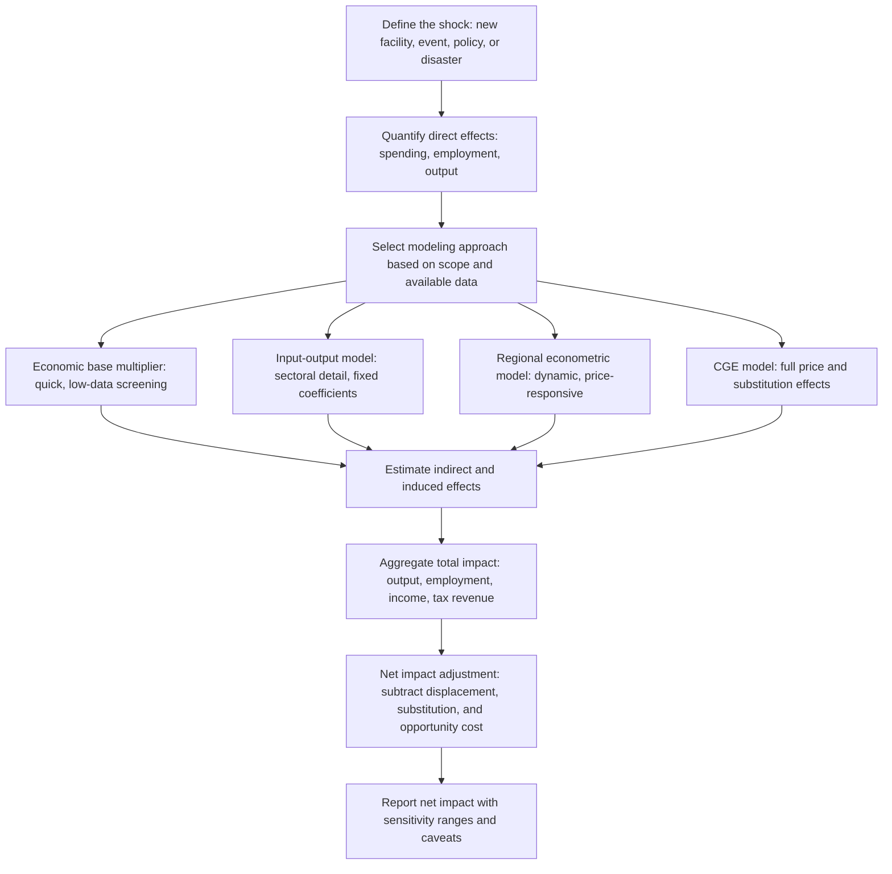

## Regional Economic Impact Analysis

### Overview

Regional economic impact analysis is the applied practice of estimating how a specific event, project, policy, or shock—a new factory, a natural disaster, a stadium construction, a university's operations, a tax incentive package—affects a region's output, employment, income, and tax revenue. Rather than being a distinct theoretical framework of its own, it is the practitioner-facing discipline that applies the quantitative tools already covered (input-output analysis, economic base multipliers, regional econometric models, and computable general equilibrium models) to concrete, real-world policy and business decisions, along with a set of methodological conventions and common pitfalls specific to producing credible impact estimates.

### The Standard Impact Taxonomy: Direct, Indirect, and Induced Effects

**Key Points**

- **Direct effects**: The initial, first-round change in output, employment, or income directly attributable to the project or event itself (e.g., the jobs and spending of a new manufacturing plant).
- **Indirect effects**: The change in output, employment, or income among the project's local supply chain—businesses that supply inputs to the directly affected entity, and their own suppliers in turn (captured formally by the interindustry linkages in an input-output Leontief inverse, or approximated by an economic base multiplier).
- **Induced effects**: The change in local household spending resulting from wages earned in both the direct and indirect effects, and the further rounds of local business activity that spending supports (captured by Type II I-O multipliers or, in SAM-based analysis, by the household income-consumption loop).
- **Total effect** = Direct + Indirect + Induced, typically expressed via a multiplier: $\text{Total Effect} = \text{Direct Effect} \times \text{Multiplier}$.

### Diagram: Standard Impact Analysis Workflow

### Choosing the Right Tool for the Analysis

**Key Points**

- **Economic base multiplier analysis**: Appropriate for quick, low-cost, low-data-availability screening studies, particularly for small regions or preliminary assessments before committing to a more detailed study.
- **Input-output modeling (commonly via IMPLAN, RIMS II, or similar platforms)**: The standard, most widely used approach for formal economic impact studies of new facilities, events, and public investments, offering good sectoral detail with moderate data requirements and computational simplicity.
- **Regional econometric models (e.g., REMI)**: Preferred when the analysis requires a multi-year dynamic adjustment path, or when the shock is large enough that wage, migration, and price responses are likely to matter materially (e.g., large-scale economic development incentive packages, major regulatory changes).
- **CGE models**: Reserved for large, structural policy shocks where price and substitution effects across many markets are central to the analysis (e.g., major tax reform, broad trade policy changes, economy-wide environmental regulation), and where the necessary regional SAM data and modeling expertise are available.
- [Inference] The choice of tool in practice is often driven as much by budget, timeline, and client/agency familiarity with a given platform as by the theoretically ideal method for the specific question, which is a recognized practical tension in applied impact-analysis practice.

### Net Impact vs. Gross Impact: The Central Methodological Challenge

**Key Points**

This is widely regarded as the most consequential (and most frequently mishandled) methodological issue in applied regional economic impact analysis:

- **Gross impact**: The total output/employment/income effect calculated by directly applying a multiplier to the project's spending, without adjusting for what would have happened in the region's economy anyway, absent the project.
- **Net impact**: The gross impact adjusted downward for several distinct leakage/offset mechanisms:
  - **Displacement**: Spending or employment that would have occurred regardless (e.g., a new retail store that primarily draws customers away from existing local retailers rather than generating genuinely new regional spending).
  - **Substitution**: Resources (labor, capital) used by the project that are diverted from other productive uses within the region rather than drawn from otherwise-idle resources.
  - **Leakage**: The portion of project spending that flows to non-local suppliers, workers who commute from outside the region, or is saved/spent outside the region rather than recirculating locally.
  - **Deadweight loss / counterfactual**: The share of the outcome that would have happened even without the specific policy intervention (particularly relevant to evaluating public subsidy/incentive programs—did the incentive actually cause the firm's location decision, or would the firm have located there regardless?).
- **Opportunity cost of public resources**: For publicly subsidized projects, a rigorous net impact analysis should also account for the foregone alternative uses of the public funds committed to the incentive package (what else could that tax revenue have funded, and what would *its* regional economic impact have been?).

$$\text{Net Regional Impact} = \text{Gross Impact} - \text{Displacement} - \text{Substitution} - \text{Leakage} - \text{Deadweight/Counterfactual}$$

### Common Practitioner Pitfalls

**Key Points**

- **Double-counting overlapping projects**: Summing the separately estimated total impacts of multiple related or geographically overlapping projects can substantially overstate the true combined regional impact if their supply chains or labor markets overlap—each project's multiplier already accounts for its own indirect/induced effects, and naively adding several full multiplier-adjusted estimates together can double-count shared supplier or induced-spending effects.
- **Confusing output impact with net new regional value-added**: Gross output multiplier estimates can overstate a project's genuine contribution to regional prosperity if a large share of that output represents pass-through value from imported inputs rather than genuinely new regional value-added (wages, profits, and local value created).
- **Ignoring capacity constraints**: Applying a fixed multiplier assumes the regional economy has slack capacity (unemployed labor, available land, unused infrastructure capacity) to absorb the additional demand without price increases; in a region operating near full employment, actual realized impacts (in real terms) will typically be smaller than the fixed-multiplier prediction suggests, since some of the nominal impact will instead manifest as wage/price inflation rather than genuine real output growth.
- **Overstating job "creation" versus job "support"**: Multiplier-derived job estimates (direct + indirect + induced) represent jobs *supported*, not necessarily net new jobs created in an absolute sense, particularly when displacement and substitution effects are material; responsible reporting distinguishes these carefully rather than presenting gross multiplier-derived job counts as unambiguous net new employment.
- **Selective study design/advocacy bias**: [Inference] Economic impact studies commissioned by an interested party (a developer seeking public subsidy approval, an industry association) have sometimes been documented in the applied economics and public finance literature as tending toward more favorable assumptions (e.g., higher assumed multipliers, insufficient netting-out of displacement) than independently commissioned studies; the extent and prevalence of this pattern varies across specific studies and cannot be generalized as universally present in all commissioned impact analyses.

### Worked Example: Full Impact Analysis with Net Adjustment

**Example**

A city is considering a $20 million public subsidy to attract a large distribution center expected to directly employ 600 workers.

1. **Direct effect**: 600 jobs, an estimated $28 million in direct annual wages.
2. **Gross total effect (via regional I-O model)**: Applying an output multiplier of 1.6 and an employment multiplier of 2.1 yields an estimated $44.8 million in total regional output effect and approximately 1,260 total jobs supported (direct + indirect + induced).
3. **Net adjustments**:
   - Displacement: If a portion of the distribution center's local retail/logistics customer base was already served by existing local firms, that share of "new" activity is netted out.
   - Leakage: If a substantial share of workers are expected to commute from outside the defined regional boundary, their wage-based induced spending should be excluded or reduced in the local induced-effect calculation.
   - Counterfactual: If evidence suggests the firm would likely have located in the region even without the $20 million subsidy (e.g., due to existing transportation infrastructure advantages), the case for attributing the *entire* net impact to the subsidy specifically—as opposed to attributing it to the region's underlying locational advantages—is correspondingly weaker.
4. **Net impact and benefit-cost framing**: The adjusted net impact is then typically compared against the $20 million public cost to compute an implied cost per job or cost per dollar of net regional output, and often benchmarked against the projected net new tax revenue generated to assess whether the subsidy is likely to "pay for itself" over a specified time horizon.

### Regional Boundary Definition

**Key Points**

- A frequently underappreciated methodological choice is how the "region" itself is defined for impact analysis purposes—a narrowly drawn regional boundary (e.g., a single city) will show more leakage (spending/employment flowing to a broader metro area, treated as "outside" the narrowly defined region) than a broadly drawn boundary (e.g., a multi-county metro area), even for the exact same underlying project.
- This makes the choice of regional boundary a consequential and sometimes strategically significant decision in impact study design—broader boundaries generally show larger, more favorable impact estimates for the same project because less spending "leaks" outside the defined study area, which is an important consideration when comparing impact estimates across different studies or interpreting a single study's results.

### Illustration: Impact Analysis Decision Flow by Study Type

<svg xmlns="http://www.w3.org/2000/svg" viewBox="0 0 700 340">
<text x="350" y="24" text-anchor="middle" font-size="16" font-weight="bold" fill="#1a1a1a">Regional Economic Impact Study: Method Selection (svg_diagram)</text>
<rect x="270" y="50" width="160" height="50" fill="#dbeafe" stroke="#333" rx="6" />
<text x="350" y="80" text-anchor="middle" font-size="12" fill="#1a1a1a">What is the study's scope and budget?</text>
<line x1="300" y1="100" x2="150" y2="150" stroke="#333" />
<rect x="60" y="150" width="180" height="55" fill="#93c5fd" stroke="#333" rx="6" />
<text x="150" y="172" text-anchor="middle" font-size="11" fill="#1a1a1a">Small/quick screening</text>
<text x="150" y="188" text-anchor="middle" font-size="11" fill="#1a1a1a">→ Economic Base Multiplier</text>
<line x1="340" y1="100" x2="300" y2="150" stroke="#333" />
<rect x="220" y="150" width="180" height="55" fill="#60a5fa" stroke="#333" rx="6" />
<text x="310" y="172" text-anchor="middle" font-size="11" fill="#1a1a1a">Standard sectoral detail</text>
<text x="310" y="188" text-anchor="middle" font-size="11" fill="#1a1a1a">→ Input-Output (IMPLAN)</text>
<line x1="380" y1="100" x2="470" y2="150" stroke="#333" />
<rect x="400" y="150" width="180" height="55" fill="#3b82f6" stroke="#333" rx="6" />
<text x="490" y="172" text-anchor="middle" font-size="11" fill="white">Multi-year, price-sensitive</text>
<text x="490" y="188" text-anchor="middle" font-size="11" fill="white">→ Regional Econometric (REMI)</text>
<line x1="420" y1="100" x2="600" y2="150" stroke="#333" />
<rect x="530" y="150" width="150" height="55" fill="#1e40af" stroke="#333" rx="6" />
<text x="605" y="172" text-anchor="middle" font-size="11" fill="white">Large structural shock,</text>
<text x="605" y="188" text-anchor="middle" font-size="11" fill="white">full price effects → CGE</text>
<rect x="150" y="240" width="400" height="70" fill="#fef2f2" stroke="#dc2626" rx="6" />
<text x="350" y="262" text-anchor="middle" font-size="12" font-weight="bold" fill="#dc2626">Regardless of method: always net out</text>
<text x="350" y="280" text-anchor="middle" font-size="11" fill="#333">displacement, leakage, substitution, and counterfactual</text>
<text x="350" y="296" text-anchor="middle" font-size="11" fill="#333">effects before reporting a credible NET impact figure</text>
</svg>

### Standards, Transparency, and Best Practice

**Key Points**

- Credible regional economic impact studies generally disclose: the specific model and data source used, the regional boundary definition, the multipliers applied and their source, explicit treatment (or acknowledgment of non-treatment) of displacement/leakage/counterfactual adjustments, and sensitivity analysis around key assumptions.
- Independent academic and government reviews of economic impact studies (particularly for large public subsidy proposals, stadium/arena financing, and major tax incentive packages) frequently focus scrutiny specifically on whether gross versus net impacts were properly distinguished and whether counterfactual "but-for" analysis was rigorously conducted—reflecting the centrality of this issue in the applied literature's assessment of study credibility.
- [Inference] Professional practice varies in how consistently net-impact netting-out procedures are applied across different types of studies, jurisdictions, and commissioning entities, and this variation is a recurring theme in academic critiques of applied economic impact analysis practice.

### Conclusion

Regional economic impact analysis is fundamentally an applied synthesis of the quantitative tools covered elsewhere in this methods toolkit—economic base multipliers, input-output analysis, regional econometric models, and CGE modeling—selected and combined according to the scale, complexity, and price-sensitivity of the specific question at hand. Its greatest methodological challenge is not technical model selection but the careful, honest accounting of net versus gross impacts: properly netting out displacement, leakage, substitution, and counterfactual effects is what separates a credible, policy-useful impact estimate from an inflated advocacy figure, regardless of which underlying quantitative model is employed.

### Related Topics

- Input-output analysis
- Economic base multipliers
- Regional econometric models
- Computable general equilibrium (CGE) regional models
- Location quotients
- Cost-benefit analysis of public infrastructure and incentive programs
- Tax increment financing and place-based subsidy evaluation
- Regional boundary definition and functional economic areas