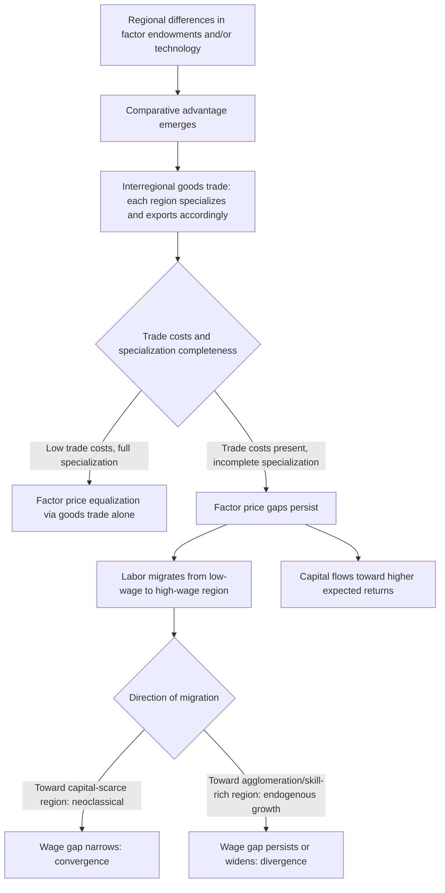

## Interregional Trade Theory

### Overview

Interregional trade theory explains why regions within a country (or across countries) trade goods, services, and factors of production with one another, and how that trade affects regional specialization, output, prices, and welfare. It draws heavily on classical and neoclassical international trade theory—comparative advantage, factor endowments, and increasing-returns/new-trade theory—while adapting these frameworks to the distinctive features of interregional (as opposed to international) trade: shared currency, shared institutions and regulations, generally freer factor mobility, and typically lower (though non-zero) trade barriers between regions than between sovereign nations.

### Why Interregional Trade Theory Differs from International Trade Theory

**Key Points**

- **No exchange rate adjustment**: Regions within a country share a common currency, so trade imbalances between regions cannot be resolved through currency depreciation/appreciation as they can (in principle) between countries with independent currencies—adjustment must occur through other channels (wages, prices, migration, capital flows).
- **Greater factor mobility**: Labor and capital typically move more freely between regions within a country than between countries (fewer legal, cultural, and administrative barriers), which is a central assumption difference from most international trade models, where factors are often assumed relatively immobile between nations while goods trade freely (the Heckscher-Ohlin assumption).
- **Shared institutions and policy**: Regions typically share a common legal system, currency, central bank monetary policy, and often significant fiscal transfer mechanisms (federal/national government spending, automatic stabilizers), reducing certain sources of interregional friction relative to international trade.
- **Lower but non-zero trade costs**: While regions generally face lower explicit trade barriers (no tariffs, common regulatory standards) than countries, transport costs, distance-related frictions, and "border effects" (documented empirically even at sub-national administrative boundaries) still meaningfully affect interregional trade patterns.

### Comparative Advantage: The Foundational Logic

**Key Points**

- The Ricardian principle of comparative advantage—that regions benefit from trade by specializing in producing goods for which they have a *relatively* lower opportunity cost, even if one region is absolutely more efficient at producing everything—is the foundational logic underlying why interregional specialization and trade increase aggregate output and welfare compared to regional self-sufficiency (autarky).
- Formally, if Region A can produce good 1 at opportunity cost $\left(\frac{\text{labor for good 1}}{\text{labor for good 2}}\right)_A$ and Region B faces a different opportunity cost ratio, each region gains from specializing according to its comparative (relative) advantage and trading, even if one region has an absolute productivity advantage in both goods.

$$\text{Gains from trade exist whenever } \left(\frac{a_{L1}}{a_{L2}}\right)_A \ne \left(\frac{a_{L1}}{a_{L2}}\right)_B$$

where $a_{Li}$ is the labor required per unit of good $i$ in each region.

### The Heckscher-Ohlin Framework Applied Regionally

**Key Points**

- The Heckscher-Ohlin (H-O) model explains trade patterns based on differences in regional **factor endowments** (relative abundance of labor, capital, land, skilled labor) rather than differences in technology (as in the Ricardian model): a region relatively abundant in a factor will specialize in and export goods that use that factor intensively.
- **Factor Price Equalization theorem**: Under H-O assumptions (identical technology, free goods trade, no factor mobility, no trade costs), interregional trade in goods tends to equalize factor prices (wages, returns to capital) across regions even without factor migration—trade in goods acts as an indirect substitute for factor mobility.
- **Stolper-Samuelson theorem**: Changes in relative goods prices (e.g., from changing trade patterns or policy) change relative factor returns—an increase in the relative price of a labor-intensive good raises the real return to labor and lowers the real return to capital, regardless of which industry a factor is employed in.
- [Inference] The empirical applicability of strict factor price equalization within real interregional economies is limited by the model's restrictive assumptions (identical technology across regions, no transport costs, complete specialization); observed interregional wage differentials persist in practice, suggesting these assumptions are not fully met, though the theorem remains a valuable benchmark for understanding the *direction* of trade-induced factor price pressure.

### Trade Combined with Factor Mobility: The Distinctive Regional Case

**Key Points**

- Unlike the classical international trade setting (where H-O assumes factors are immobile between countries), interregional economics must explicitly model the interaction between goods trade *and* factor mobility (labor migration, capital flows) operating simultaneously—since both channels are typically active between regions within a country.
- When both goods trade and factor mobility are present, the two mechanisms can act as either **substitutes** or **complements** for achieving factor price convergence: goods trade alone (per H-O) can equalize factor prices without migration, but if goods trade is incomplete or frictional (positive transport costs, incomplete specialization), factor mobility becomes a more direct convergence mechanism—migration of labor from low-wage to high-wage regions directly reduces wage gaps by shifting labor supply.
- This dual-channel dynamic is central to reconciling interregional trade theory with regional convergence and endogenous growth mechanisms: if skilled-labor migration flows *toward* already-productive regions (driven by agglomeration and human capital externalities), factor mobility can work in a divergence-reinforcing direction rather than the convergence-promoting direction assumed in simple factor-mobility models.

### Diagram: Interregional Trade and Factor Mobility Interaction

### New Trade Theory and Increasing Returns

**Key Points**

- Classical comparative-advantage-based trade theory explains *interindustry* trade (regions trading different types of goods based on comparative advantage), but empirically, much observed interregional (and international) trade is *intraindustry* trade—regions simultaneously importing and exporting similar/differentiated varieties of the same broad product category (analogous to the "cross-hauling" phenomenon noted in location quotient analysis).
- Paul Krugman's New Trade Theory explains intraindustry trade through **increasing returns to scale** and **product differentiation** (monopolistic competition): firms in each region specialize in producing distinct product varieties to capture scale economies, and regions trade these differentiated varieties with each other, generating mutual gains from a wider variety of available goods even between regions with similar factor endowments and technology.
- This increasing-returns logic directly connects interregional trade theory to New Economic Geography (Krugman's core-periphery model, covered under growth pole and endogenous growth theory), where the same increasing-returns mechanism that generates intraindustry trade also drives spatial agglomeration when combined with transport costs and demand linkages.

### Regional Trade Cost Measurement: Gravity Models

**Key Points**

- The **gravity model of trade**, empirically one of the most successful and widely used frameworks in both international and interregional trade economics, predicts that trade flows between two regions are proportional to the product of their economic sizes and inversely related to the distance (or broader trade cost/friction measure) between them:

$$T_{ij} = G \cdot \frac{Y_i^{\alpha} Y_j^{\beta}}{D_{ij}^{\theta}}$$

where $T_{ij}$ is trade flow between regions $i$ and $j$, $Y_i, Y_j$ are regional economic sizes (GDP or output), $D_{ij}$ is distance (or a broader trade-cost measure), and $\theta$ is the trade-cost elasticity.

- Applied to interregional trade specifically, gravity models have been used to document "border effects" even at sub-national administrative boundaries (state/provincial lines) and to estimate the effective trade-cost impact of interregional infrastructure investment (highways, rail) on trade flows.
- [Inference] The precise magnitude of sub-national border effects and distance elasticities varies considerably across countries, industries, and time periods studied in the gravity-model literature, so specific numerical estimates should be sourced from the particular study or dataset relevant to the application rather than treated as universal constants.

### Applications and Policy Relevance

**Key Points**

- **Regional specialization and industrial policy**: Understanding a region's comparative advantage (via factor endowments, existing industrial base, and location quotient-identified export specializations) informs whether regional economic development strategy should reinforce existing specialization or actively promote diversification into new sectors.
- **Interregional infrastructure investment**: Gravity-model-based trade cost analysis provides an empirical basis for evaluating how transportation infrastructure investments (highways, rail corridors, ports) are likely to affect interregional trade volumes and, by extension, regional specialization patterns and growth.
- **Trade and regional inequality**: The interaction between goods trade and factor mobility discussed above has direct implications for whether increased interregional trade integration (e.g., reduced internal trade barriers, improved transportation) is likely to promote regional convergence (per classical H-O logic) or exacerbate divergence (if increasing-returns/agglomeration effects dominate, per New Trade Theory and New Economic Geography)—a question with substantial ongoing relevance to national economic integration and regional policy debates.

### Illustration: Comparative Advantage and Interregional Specialization

<svg xmlns="http://www.w3.org/2000/svg" viewBox="0 0 700 360">
<text x="350" y="24" text-anchor="middle" font-size="16" font-weight="bold" fill="#1a1a1a">Comparative Advantage: Production Possibility Frontiers (svg_diagram)</text>

<text x="180" y="55" text-anchor="middle" font-size="13" font-weight="bold" fill="#333">Region A (labor-abundant)</text>

<line x1="80" y1="290" x2="300" y2="290" stroke="#333" stroke-width="2" />

<line x1="80" y1="290" x2="80" y2="80" stroke="#333" stroke-width="2" />

<text x="190" y="310" text-anchor="middle" font-size="11" fill="#333">Manufactured Goods</text>

<text x="45" y="185" text-anchor="middle" font-size="11" fill="#333" transform="rotate(-90 45 185)">Agriculture</text>

<path d="M90,90 L280,270" stroke="`#2563eb`" stroke-width="3" fill="none" />

<text x="150" y="150" font-size="10" fill="`#2563eb`">Steeper PPF: comparative</text>

<text x="150" y="163" font-size="10" fill="`#2563eb`">advantage in agriculture</text>

<text x="530" y="55" text-anchor="middle" font-size="13" font-weight="bold" fill="#333">Region B (capital-abundant)</text>

<line x1="420" y1="290" x2="640" y2="290" stroke="#333" stroke-width="2" />

<line x1="420" y1="290" x2="420" y2="80" stroke="#333" stroke-width="2" />

<text x="530" y="310" text-anchor="middle" font-size="11" fill="#333">Manufactured Goods</text>

<text x="385" y="185" text-anchor="middle" font-size="11" fill="#333" transform="rotate(-90 385 185)">Agriculture</text>

<path d="M430,270 L630,100" stroke="`#dc2626`" stroke-width="3" fill="none" />

<text x="480" y="140" font-size="10" fill="`#dc2626`">Flatter PPF: comparative</text>

<text x="480" y="153" font-size="10" fill="`#dc2626`">advantage in manufacturing</text>

<text x="350" y="345" text-anchor="middle" font-size="12" fill="#666" font-style="italic">Each region specializes per comparative advantage and trades — joint output exceeds autarky</text>

</svg>

### Conclusion

Interregional trade theory adapts the core logic of comparative advantage, factor endowments, and increasing-returns trade theory to a setting of shared currency, shared institutions, and typically greater factor mobility than exists between sovereign nations, requiring explicit joint treatment of goods trade and factor migration as interacting (and sometimes offsetting) adjustment mechanisms. This joint treatment is what most sharply distinguishes interregional from international trade theory, and it directly underlies the theoretical tension—already encountered in regional convergence/divergence and endogenous growth theory—between trade/migration as a convergence-promoting force (classical/neoclassical logic) versus a divergence-reinforcing force (increasing-returns and agglomeration logic).

### Related Topics

- Regional convergence and divergence
- Endogenous growth theory in a regional context
- New Economic Geography and the Krugman core-periphery model
- Factor mobility: interregional labor migration
- Factor mobility: interregional capital flows
- Gravity models of trade
- Comparative advantage and regional specialization
- Location quotients