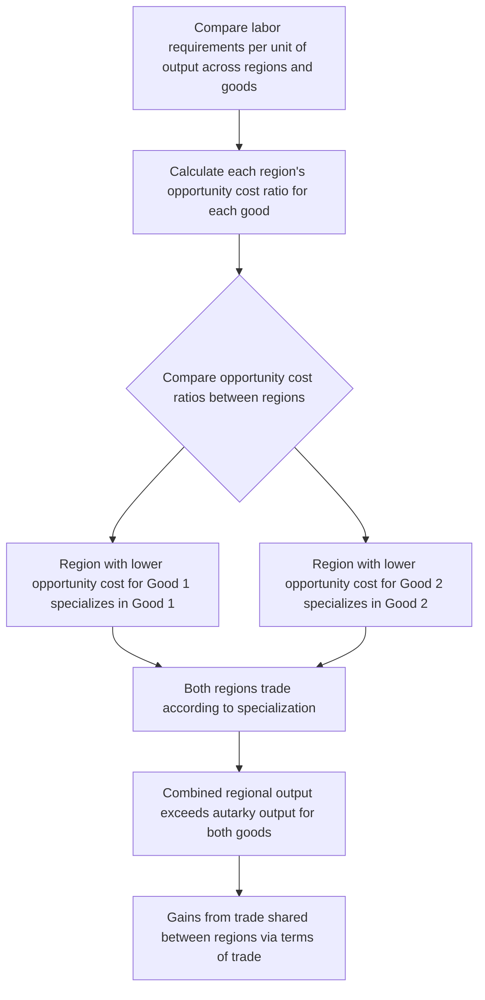

## Comparative Advantage Across Regions

### Overview

Comparative advantage is the principle that a region gains from specializing in and trading the goods or services for which it has the lowest *relative* (opportunity) cost of production, even if another region can produce everything more efficiently in absolute terms. Originally formulated by David Ricardo (1817) to explain international trade, the principle applies with equal (and arguably greater) force to interregional trade within a country, where lower trade barriers and shared institutions make the theoretical gains from specialization easier to realize in practice.

### The Core Distinction: Absolute vs. Comparative Advantage

**Key Points**

- **Absolute advantage**: A region can produce a good using fewer resources (less labor, less capital) than another region—simply "being better" at producing it.
- **Comparative advantage**: A region has a *lower opportunity cost* of producing a good relative to its own alternative production possibilities, compared to another region's opportunity cost for that same good—this is a relative, not absolute, concept.
- The central insight of Ricardian trade theory is that mutually beneficial trade and specialization can occur even when one region has an absolute advantage in producing *every* good, as long as relative opportunity costs differ between regions.

### Formal Ricardian Model

**Key Points**

Consider two regions (A and B) and two goods (1 and 2), with labor as the only factor of production and $a_{Li}^r$ denoting the labor required to produce one unit of good $i$ in region $r$.

**Opportunity cost of good 1 in terms of good 2, in region A:**

$$OC_1^A = \frac{a_{L1}^A}{a_{L2}^A}$$

**Region A has a comparative advantage in good 1 if:**

$$\frac{a_{L1}^A}{a_{L2}^A} < \frac{a_{L1}^B}{a_{L2}^B}$$

- Under this condition, total combined output of both goods across both regions is maximized when Region A specializes in good 1 and Region B specializes in good 2 (or in whichever good it has *relatively* lower opportunity cost for), and the two regions trade—even if Region A happens to be absolutely more efficient (requires less labor) at producing *both* goods.

### Worked Numerical Example

**Example**

Suppose Region A can produce either 100 units of wheat or 50 units of furniture per unit of labor, while Region B can produce either 60 units of wheat or 20 units of furniture per unit of labor.

- Region A is absolutely more efficient at producing *both* goods (100 > 60 for wheat, 50 > 20 for furniture).
- **Region A's opportunity cost of 1 unit of furniture** = 100/50 = 2 units of wheat foregone.
- **Region B's opportunity cost of 1 unit of furniture** = 60/20 = 3 units of wheat foregone.
- Since Region A's opportunity cost of furniture (2 units of wheat) is *lower* than Region B's (3 units of wheat), Region A has a comparative advantage in furniture, and by implication Region B has a comparative advantage in wheat (Region B's opportunity cost of wheat, 20/60 = 0.33 units of furniture, is lower than Region A's, 50/100 = 0.5 units of furniture).
- **Conclusion**: Even though Region A is absolutely better at producing both goods, both regions gain by Region A specializing in furniture and Region B specializing in wheat, then trading—total combined output of both goods rises above what either region's autarky (self-sufficient) production would allow.

### Diagram: Comparative Advantage Determination Process

### Sources of Comparative Advantage in a Regional Context

**Key Points**

- **Natural resource endowments**: Climate, soil quality, mineral deposits, and geographic features generate comparative advantages that are often relatively stable over long periods (e.g., agricultural regions with favorable growing conditions, mining regions with mineral deposits)—closely related to the "first nature geography" concept in economic geography.
- **Factor endowment differences (Heckscher-Ohlin logic)**: Relative abundance of labor, capital, or specific skill types generates comparative advantage in producing goods that use the abundant factor intensively, as detailed in interregional trade theory.
- **Accumulated human capital and technology**: Unlike natural resource-based comparative advantage, human-capital- and technology-based comparative advantage can be actively built over time through education, R&D investment, and knowledge accumulation—directly connecting comparative advantage theory to endogenous growth theory's emphasis on human capital as a growth driver.
- **Agglomeration economies**: A region's comparative advantage in a particular industry can itself be partly endogenous to historical specialization—once a region develops a critical mass of specialized suppliers, skilled labor, and knowledge spillovers in an industry (per the localization economies discussed in growth pole theory and MAR externalities), that agglomeration becomes a self-reinforcing source of comparative advantage, blurring the line between comparative advantage as a fixed endowment-based concept and as a path-dependent, historically contingent outcome.
- **Infrastructure and institutional quality**: Transportation access, regulatory environment, and public institution quality can create or reinforce comparative advantage independent of factor endowments alone.

### Dynamic and Endogenous Comparative Advantage

**Key Points**

- Classical Ricardian and Heckscher-Ohlin comparative advantage models generally treat the underlying sources of advantage (technology, factor endowments) as exogenously given and static, but a substantial body of regional economics literature—overlapping heavily with endogenous growth theory and path dependence theory—emphasizes that comparative advantage can be actively created, reinforced, or lost over time through investment, policy, and historical accident.
- This "dynamic comparative advantage" perspective underlies industrial policy arguments for actively cultivating comparative advantage in targeted sectors (e.g., through education and R&D investment, or through infant-industry-style protection/support during an early development phase) rather than treating a region's current comparative advantage pattern as fixed and immutable.
- [Inference] The empirical and normative debate over whether—and how effectively—regional or industrial policy can successfully create new comparative advantage (as opposed to merely subsidizing activities the region would not otherwise sustain competitively) remains actively contested in the economics literature, with mixed evidence across different historical episodes and policy designs.

### Comparative Advantage and Regional Specialization Patterns

**Key Points**

- Comparative advantage theory provides the underlying economic rationale for the specialization patterns that location quotients empirically measure: an industry with a high regional LQ is, in principle, consistent with (though not definitive proof of) that region possessing a comparative advantage in that industry.
- The theory also underlies the logic of economic base theory's basic/non-basic distinction—a region's "basic" export industries are, in a comparative-advantage framework, precisely those industries in which the region's relative production costs are lowest compared to other regions, making export-oriented sales profitable.
- Comparative advantage-driven specialization connects directly to the interregional trade patterns analyzed via gravity models and to the interindustry (as opposed to intraindustry) trade flows that comparative-advantage-based theory specifically predicts and explains.

### Terms of Trade and the Distribution of Gains

**Key Points**

- While both regions gain from trading according to comparative advantage (relative to autarky), the *distribution* of those gains between regions depends on the **terms of trade**—the relative price at which the traded goods actually exchange, which is typically bounded between the two regions' respective autarky opportunity cost ratios.
- A region's terms of trade can shift over time due to changing relative demand, changing production technology, or changing factor endowments in either region, meaning the *relative* size of gains from trade accruing to each region is not fixed even when comparative advantage itself is stable.
- [Inference] In practice, bargaining power, market structure (e.g., degree of competition versus market power in the traded goods' markets), and transportation cost allocation can also influence how gains from interregional trade are actually distributed between regions, beyond the pure comparative-cost-ratio bounds implied by the basic theoretical model.

### Limitations of the Simple Comparative Advantage Framework

**Key Points**

- **Single-factor (labor-only) simplification**: The basic Ricardian model assumes labor is the only factor of production and is perfectly mobile within (but not between) regions; extending to multiple factors (as in the Heckscher-Ohlin model) is necessary to capture capital-labor substitution and more realistic production structures.
- **Static technology assumption**: The classical model treats each region's production technology as fixed, whereas real-world comparative advantage evolves as technology diffuses, is developed locally, or becomes obsolete—an important limitation addressed by the dynamic/endogenous comparative advantage perspective discussed above.
- **No account of increasing returns or product differentiation**: The classical framework explains interindustry specialization (regions trading *different* goods based on cost advantage) but does not explain the substantial intraindustry trade (regions trading differentiated varieties of *similar* goods) observed empirically—addressed instead by New Trade Theory's increasing-returns and product-differentiation mechanisms, as discussed under interregional trade theory.
- **Ignores transport and trade costs in the basic model**: The simplest comparative advantage framework assumes costless trade between regions; introducing realistic transport costs can reduce or, in extreme cases, eliminate the incentive to specialize and trade for goods where trade costs exceed the comparative-cost-based gains from specialization.

### Illustration: Gains from Specialization and Trade

<svg xmlns="http://www.w3.org/2000/svg" viewBox="0 0 700 340">
<text x="350" y="24" text-anchor="middle" font-size="16" font-weight="bold" fill="#1a1a1a">Combined Output: Autarky vs. Specialization and Trade (svg_diagram)</text>
<line x1="80" y1="290" x2="620" y2="290" stroke="#333" stroke-width="2" />
<line x1="80" y1="290" x2="80" y2="60" stroke="#333" stroke-width="2" />
<text x="30" y="175" text-anchor="middle" font-size="12" fill="#333" transform="rotate(-90 30 175)">Total combined units produced</text>

<text x="200" y="45" text-anchor="middle" font-size="13" font-weight="bold" fill="#333">Wheat</text>

<rect x="150" y="180" width="90" height="110" fill="`#93c5fd`" stroke="#333" />

<text x="195" y="310" text-anchor="middle" font-size="11" fill="#333">Autarky</text>

<text x="195" y="170" text-anchor="middle" font-size="12" fill="`#2563eb`" font-weight="bold">160</text>

<rect x="270" y="130" width="90" height="160" fill="`#2563eb`" stroke="#333" />

<text x="315" y="310" text-anchor="middle" font-size="11" fill="#333">Specialized+Trade</text>

<text x="315" y="120" text-anchor="middle" font-size="12" fill="`#2563eb`" font-weight="bold">220</text>

<text x="500" y="45" text-anchor="middle" font-size="13" font-weight="bold" fill="#333">Furniture</text>

<rect x="420" y="220" width="90" height="70" fill="`#fca5a5`" stroke="#333" />

<text x="465" y="310" text-anchor="middle" font-size="11" fill="#333">Autarky</text>

<text x="465" y="210" text-anchor="middle" font-size="12" fill="`#dc2626`" font-weight="bold">70</text>

<rect x="540" y="185" width="90" height="105" fill="`#dc2626`" stroke="#333" />

<text x="585" y="310" text-anchor="middle" font-size="11" fill="#333">Specialized+Trade</text>

<text x="585" y="175" text-anchor="middle" font-size="12" fill="`#dc2626`" font-weight="bold">100</text>

</svg>

### Conclusion

Comparative advantage remains the foundational economic justification for interregional specialization and trade, demonstrating that gains from trade arise from *relative* cost differences rather than requiring any region to hold an absolute efficiency edge. Applied to regional economics, the framework grounds practical tools like location quotients and economic base theory in underlying trade-theoretic logic, while its extensions—dynamic/endogenous comparative advantage, agglomeration-based advantage, and increasing-returns-driven intraindustry trade—connect the classical Ricardian insight to the more spatially and historically contingent mechanisms explored in endogenous growth theory, path dependence, and New Economic Geography.

### Related Topics

- Interregional trade theory
- Endogenous growth theory in a regional context
- Path dependence and regional lock-in
- Location quotients
- Economic base multipliers
- New Economic Geography and the Krugman core-periphery model
- Factor mobility: interregional labor migration
- Gravity models of trade