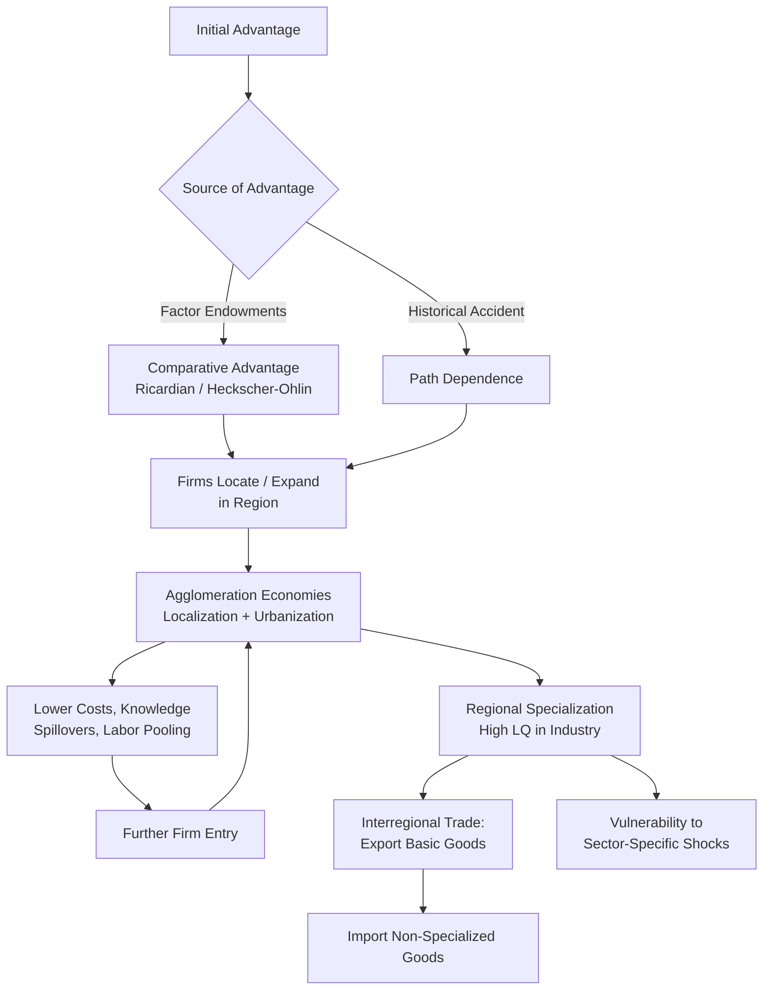

## Regional Specialization Patterns

### Definition and Conceptual Foundation

Regional specialization refers to the tendency of geographic areas (regions, states, provinces, or metropolitan areas) to concentrate production in a limited set of industries or economic activities, rather than replicating a diversified national economic structure. A specialized region produces a narrower range of goods and services than the national average and typically exports a disproportionate share of that output to other regions.

Specialization is the spatial analogue of the division of labor. Just as individuals specialize in tasks where they hold a comparative advantage, regions specialize in industries where their combination of resources, technology, and location gives them a relative cost or productivity edge. The pattern of specialization that emerges across a national space is a core object of study in interregional trade theory, since it determines the direction and composition of interregional trade flows.

### Theoretical Basis: Why Regions Specialize

**Comparative Advantage (Ricardian Framework)**

The classical explanation extends David Ricardo's international trade model to regions. A region specializes in the good for which its *relative* (not absolute) productivity advantage is greatest. Even a region that is less productive than another in every sector benefits from specializing in its comparatively least-disadvantaged sector.

Formally, if region $A$ and region $B$ produce goods $X$ and $Y$, region $A$ has a comparative advantage in $X$ if:

$$\frac{a_{LX}^A}{a_{LY}^A} < \frac{a_{LX}^B}{a_{LY}^B}$$

where $a_{Li}^R$ is the labor input coefficient (labor required per unit of output) for good $i$ in region $R$. Lower relative labor input in $X$ implies region $A$ should specialize in $X$.

**Factor Endowments (Heckscher-Ohlin Framework)**

Regions differ in relative factor abundance (labor, capital, land, human capital). The Heckscher-Ohlin theorem predicts that a region specializes in and exports the good that uses its abundant factor intensively. A capital-abundant region (e.g., a financial or manufacturing hub) specializes in capital-intensive goods; a labor-abundant region specializes in labor-intensive goods.

This is often more explanatorily powerful at the *interregional* scale than at the international scale because within a single country, factors like capital and information move relatively freely across regions, while labor mobility, land quality, and infrastructure are far less mobile, making endowment differences persistent.

**Agglomeration Economies (New Economic Geography)**

Paul Krugman's New Economic Geography (NEG) models show that specialization can emerge and self-reinforce even absent underlying comparative advantage, driven by increasing returns to scale, transport costs, and pecuniary externalities.

- **Localization economies**: cost savings from firms in the *same* industry clustering together (shared labor pools, specialized suppliers, knowledge spillovers — the "Marshallian trinity").
- **Urbanization economies**: cost savings from the diversity and scale of economic activity in a *place*, regardless of industry.
- **Circular causation**: firms locate where demand is large; demand is large where firms (and their workers) are located. This creates a core-periphery pattern where specialization is path-dependent and can "lock in" even without a permanent comparative-advantage rationale.

**Historical Accident and Path Dependence**

Empirically, initial specialization is often the product of a historical accident (proximity to a raw material, a founding entrepreneur, a wartime industrial contract) that is subsequently locked in by increasing returns, sunk infrastructure investment, and accumulated tacit knowledge. This is the "QWERTY" logic applied to regional economies — Detroit and automobiles, Silicon Valley and semiconductors/software, and the Swiss watchmaking cantons are commonly cited illustrations of this path dependence. [Inference: while broadly accepted in economic geography literature, the precise causal weight of accident versus underlying fundamentals in any single case remains debated among economic historians.]

### Measuring Regional Specialization

**Location Quotient (LQ)**

The most widely used index. It measures the relative concentration of an industry in a region compared to its share nationally:

$$LQ_i^r = \frac{e_i^r / e^r}{e_i^n / e^n}$$

where:

- $e_i^r$ = employment (or output) in industry $i$ in region $r$
- $e^r$ = total employment in region $r$
- $e_i^n$ = national employment in industry $i$
- $e^n$ = total national employment

Interpretation:

- $LQ_i^r > 1$: industry $i$ is over-represented in region $r$ relative to the nation (a candidate export base / specialization).
- $LQ_i^r = 1$: the region's share matches the national average.
- $LQ_i^r < 1$: the industry is under-represented locally.

A common convention treats $LQ > 1.25$ as indicating meaningful specialization, though thresholds vary by application.

**Krugman Specialization Index**

Measures how different a region's industrial structure is from the national (or another region's) structure:

$$KSI^r = \sum_i \left| s_i^r - s_i^n \right|$$

where $s_i^r$ and $s_i^n$ are industry $i$'s share of regional and national employment, respectively. The index ranges from 0 (identical structure to the nation) to 2 (completely dissimilar structure); it is often normalized to a 0–1 range.

**Herfindahl-Hirschman Index (HHI) for Regional Diversification**

$$HHI^r = \sum_i (s_i^r)^2$$

A higher HHI indicates greater concentration (specialization) in fewer industries; a lower HHI indicates a more diversified regional economy.

**Gini Coefficient of Localization**

Constructed by ranking industries by their regional share relative to national share and plotting a Lorenz-curve-like concentration curve; the area between the curve and the diagonal captures the degree of spatial concentration of an industry across all regions (a complementary measure to LQ, oriented around a single industry across many regions rather than one region across many industries).

### Economic Base Theory and the Export Base

Regional specialization is closely tied to **economic base theory**, which divides a regional economy into:

- **Basic (export) activities**: industries that sell primarily outside the region, bringing in external income. These are typically the industries identified by high LQs.
- **Non-basic (local-serving) activities**: industries (retail, local services, government) that circulate income within the region, scaling with local population and basic-sector income.

The **economic base multiplier** formalizes how basic-sector employment or income drives total regional employment:

$$\text{Total Employment} = \text{Base Employment} \times \left(\frac{1}{1 - \text{(non-basic share)}}\right)$$

or equivalently, using the base ratio $BR = \text{Total Employment} / \text{Basic Employment}$:

$$\Delta \text{Total Employment} = BR \times \Delta \text{Basic Employment}$$

A region highly specialized in a single basic industry has high sensitivity (a high multiplier and high volatility) to demand shocks in that industry — a central concern in discussions of regional resilience.

### Diagram: Drivers and Feedback Loops of Regional Specialization

### Worked Example: Location Quotient Calculation

Suppose Region $r$ has 500,000 total workers, of which 40,000 work in semiconductor manufacturing. Nationally, there are 150,000,000 workers, of which 3,000,000 work in semiconductor manufacturing.

$$LQ = \frac{40{,}000 / 500{,}000}{3{,}000{,}000 / 150{,}000{,}000} = \frac{0.08}{0.02} = 4.0$$

An $LQ$ of 4.0 indicates the region's semiconductor employment share is four times the national average — strong evidence that semiconductors constitute a basic, export-oriented specialization for this region, consistent with observed patterns in regions such as Arizona or Taiwan's Hsinchu Science Park. [Inference: the specific magnitude of 4.0 is illustrative for this worked problem, not a claim about any actual region's current LQ.]

### Patterns Observed Empirically

- **Manufacturing belts**: historically, heavy industry clustered in regions with coal/iron proximity and water transport access (e.g., the US Manufacturing Belt/Rust Belt, the Ruhr Valley in Germany).
- **Agricultural specialization**: driven by climate, soil, and land economics (e.g., wheat in the US Great Plains, wine regions tied to terroir).
- **Service and knowledge-economy clustering**: finance in global cities (New York, London, Hong Kong), software/tech in innovation hubs (Silicon Valley, Bangalore), driven heavily by agglomeration and human-capital spillovers rather than traditional factor endowments.
- **Resource-based specialization**: extraction-dependent regions (oil in Alberta or Texas Permian Basin, mining regions) exhibit particularly high economic-base multipliers and boom-bust volatility.
- **Divergence vs. convergence debate**: NEG models and empirical regional growth literature disagree on whether specialization patterns are self-reinforcing (leading to persistent regional inequality) or subject to eventual convergence as congestion costs, rising local factor prices, and technology diffusion erode initial advantages. [Unverified: the long-run convergence vs. divergence question remains an active empirical debate without a single settled consensus across all country contexts.]

### Specialization, Trade, and Factor Mobility Interactions

Within the "Interregional Trade and Factor Mobility" framework, specialization interacts with mobility in two key directions:

1. **Trade as a substitute for factor mobility**: if capital and labor cannot move freely, interregional trade in goods allows regions to indirectly "export" their abundant factor embodied in goods (factor-price equalization tendency via trade, per Heckscher-Ohlin-Samuelson logic).
2. **Factor mobility as a reinforcer of specialization**: when labor and capital *can* move, they tend to flow toward regions already specializing and growing (following wage and return differentials), which can amplify rather than dampen specialization patterns — a departure from the factor-price-equalization prediction, and central to NEG's core-periphery outcomes.

### Policy Considerations

- **Diversification policy**: governments may intervene to reduce over-specialization risk (e.g., regional development agencies subsidizing new sectors) given the volatility implied by high economic-base multipliers.
- **Cluster policy**: alternatively, policy may deliberately reinforce existing specializations (innovation districts, sector-specific tax incentives) to capture agglomeration benefits, accepting increased shock exposure as a trade-off.
- **Trade-off**: there is a documented tension between the static efficiency gains of specialization (comparative-advantage-driven output maximization) and the dynamic/resilience costs of reduced economic diversification. [Inference: the optimal balance is context-dependent and is not resolved by a single universally applicable formula in the literature.]

**Related Topics**

- Location Quotient and shift-share analysis in depth
- Economic base theory and regional multipliers
- New Economic Geography and core-periphery models (Krugman, 1991)
- Agglomeration economies: Marshallian externalities vs. Jacobs externalities
- Interregional factor-price equalization theorem
- Regional resilience and shock exposure
- Cluster theory (Porter's diamond model) at the regional scale
- Convergence vs. divergence in regional per-capita income (Barro-Sala-i-Martin models)