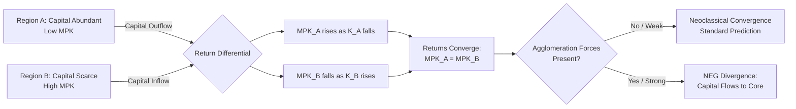

## Capital Mobility Across Regions

### Definition and Conceptual Foundation

Capital mobility across regions refers to the degree to which financial capital and physical/productive capital can relocate from one region to another within a national (or supranational) economy in response to differences in expected returns. It is a central assumption-differentiator between international trade theory and interregional trade theory: international models typically assume capital is imperfectly mobile across national borders (due to currency risk, capital controls, information asymmetries), while interregional models typically assume capital is highly, sometimes perfectly, mobile across regions within the same country, since it shares a currency, legal system, and regulatory framework.

This distinction is foundational to why interregional economics is often treated as a separate field from international economics: high capital (and often labor) mobility changes the predictions of standard trade models regarding factor prices, specialization persistence, and regional convergence.

### Types of Capital and Their Relative Mobility

- **Financial capital** (bank deposits, loans, portfolio investment, bonds, equities): the most mobile form, moving nearly instantaneously in response to interest rate or return differentials, especially within a single national financial system with unified regulation and currency.
- **Physical/productive capital** (plant, equipment, machinery, structures): far less mobile once installed — it is largely fixed in place ("putty-clay" capital) and only becomes mobile at the margin, through new investment decisions rather than relocation of existing stock. [Inference: relocation of *installed* physical capital is generally uneconomical due to sunk costs, so mobility in this category is best understood as mobility of *new* investment flows rather than physical movement of existing capital goods.]
- **Human capital** (embodied in migrating workers): sometimes treated as a hybrid category; discussed more fully under labor mobility, but relevant here because capital and skilled labor often move together (e.g., corporate relocations that bring both financial investment and managerial/technical staff).

### Theoretical Framework

**Neoclassical Model of Capital Flows**

In the standard neoclassical interregional model, capital flows from regions with a lower marginal product of capital (MPK) to regions with a higher MPK, equalizing returns across the national economy in equilibrium. If region $A$ has capital stock $K_A$ and region $B$ has $K_B$, with production functions $Y_A = F(K_A, L_A)$ and $Y_B = F(K_B, L_B)$, capital flows from $A$ to $B$ if:

$$MPK_A = \frac{\partial Y_A}{\partial K_A} < \frac{\partial Y_B}{\partial K_B} = MPK_B$$

Flows continue until:

$$MPK_A = MPK_B \quad \text{(net of any regional risk premium or transaction cost)}$$

This is the interregional analogue of the international capital-flow model, but with fewer frictions (no exchange-rate risk, no capital controls, shared legal/property-rights regime), so convergence in returns is predicted to occur faster and more completely than across national borders.

**Heckscher-Ohlin and Factor-Price Equalization Interaction**

Under Heckscher-Ohlin trade theory, free trade in goods alone can substitute for factor mobility, driving indirect factor-price equalization even without capital physically moving (per the Factor Price Equalization theorem). However, when capital mobility is *also* present (as is standard within regions of one country), this reinforces and accelerates the equalization of capital returns directly, rather than relying solely on the indirect channel through goods trade. This is one reason interregional factor-price convergence in real-world data is often observed to be stronger for capital returns than for wages (labor being comparatively less mobile than capital due to migration costs).

**Neoclassical Growth and Convergence (Solow-Swin Framework Applied Regionally)**

In neoclassical regional growth models, capital mobility is the primary mechanism predicted to drive $\beta$-convergence — poorer (capital-scarce) regions grow faster than richer (capital-abundant) regions because diminishing returns to capital imply a higher MPK, and hence higher returns, in capital-scarce regions, attracting inflows:

$$g_i = a - b \ln(y_{i,0})$$

where $g_i$ is region $i$'s growth rate, $y_{i,0}$ is initial income per capita, and $b > 0$ captures the convergence speed, partly driven by capital-mobility-induced reallocation. [Inference: empirical convergence speeds (often estimated around 2% per year in classic studies) vary substantially by country, time period, and estimation method, and are not a fixed structural constant.]

**New Economic Geography Counterpoint**

NEG models (Krugman and successors) complicate the simple convergence story: capital mobility combined with increasing returns to scale and agglomeration economies can cause capital to flow *toward* already capital-rich, high-demand "core" regions rather than toward capital-scarce peripheral regions, producing divergence rather than convergence. This occurs when the benefits of locating near existing capital, suppliers, and demand (pecuniary externalities, thick labor markets) outweigh the diminishing-returns incentive to move toward scarce-capital regions. This is a genuinely contested empirical question: the "neoclassical convergence" and "NEG divergence" predictions are both theoretically coherent, and which dominates depends on parameter values (transport costs, scale economies, factor mobility levels) that must be assessed empirically for a given case. [Unverified: no single universally accepted resolution exists in the literature as to which force dominates in general; results are context- and period-specific.]

### Diagram: Capital Mobility Equilibration Mechanism

### Determinants of Interregional Capital Mobility

- **Financial market integration**: unified banking systems, national stock exchanges, and shared currency remove exchange-rate risk and most legal barriers present in international capital flows.
- **Information and agency costs**: capital tends to flow more readily to regions where investors have better information (proximity, existing networks), which can create home-region bias even within a single country.
- **Regional risk premiums**: differences in perceived political stability, contract enforcement quality (rare within a single national legal system but relevant in federal systems with devolved regulation), or infrastructure reliability can generate persistent regional risk premiums that prevent full return equalization.
- **Tax and regulatory differentials**: regional/state/provincial tax incentives, right-to-work laws, environmental regulation stringency, and subsidy regimes can materially affect after-tax returns and thus direct capital flows independent of underlying productivity.
- **Infrastructure and agglomeration**: transportation networks, digital connectivity, and existing industrial clusters affect the effective productivity of capital in a location, feeding into the MPK calculation itself.
- **Public capital and crowding-in/out effects**: regional public infrastructure investment can raise the marginal product of private capital in that region (crowding in) or, if debt-financed and raising regional borrowing costs, potentially crowd out private capital mobility into the region. [Inference: the net direction of this effect is empirically variable and depends on financing method and existing infrastructure saturation.]

### Empirical Measurement Approaches

- **Feldstein-Horioka-style tests (adapted regionally)**: originally used to test international capital mobility by examining the correlation between regional savings and regional investment rates — under perfect capital mobility, local investment should not depend on local savings, since capital can be sourced from anywhere. Interregional studies generally find a *weaker* savings-investment correlation than international studies, consistent with higher capital mobility within countries. [Inference: results vary by country and estimation period; the "weaker but not zero" pattern is a general empirical tendency, not a universal constant.]
- **Interest rate / return differential convergence tests**: tracking regional lending rates, mortgage rates, or corporate bond spreads over time to test whether they converge, and how quickly, following the neoclassical prediction.
- **Foreign/interregional direct investment (co-investment) flow data**: tracking the origin and destination of corporate investment, plant openings, and relocations, often via national statistical agencies or corporate registries.
- **Bank lending flow data**: analyzing where deposits are gathered versus where loans are extended, revealing net interregional financial intermediation flows.

### Worked Example: Simple Two-Region Capital Reallocation

Suppose national capital stock is fixed at $K = 1{,}000$ units, split initially as $K_A = 700$, $K_B = 300$. Assume identical Cobb-Douglas production technology $Y = K^{0.3}L^{0.7}$ with $L_A = L_B = 500$ (fixed, immobile labor).

$$MPK_A = 0.3 \left(\frac{L_A}{K_A}\right)^{0.7} = 0.3 \left(\frac{500}{700}\right)^{0.7} \approx 0.3 \times 0.775 \approx 0.233$$

$$MPK_B = 0.3 \left(\frac{L_B}{K_B}\right)^{0.7} = 0.3 \left(\frac{500}{300}\right)^{0.7} \approx 0.3 \times 1.443 \approx 0.433$$

Since $MPK_B > MPK_A$, capital flows from $A$ to $B$ under perfect mobility until returns equalize (accounting for the fixed total $K_A + K_B = 1{,}000$). Solving $MPK_A = MPK_B$:

$$0.3\left(\frac{500}{K_A}\right)^{0.7} = 0.3\left(\frac{500}{1000-K_A}\right)^{0.7}$$

This requires $K_A = 1000 - K_A$, so $K_A = K_B = 500$ at equilibrium — capital reallocates until both regions hold equal capital stock, given identical technology and labor endowments. In practice, transaction costs, risk premiums, and agglomeration forces prevent this frictionless equilibrium from being reached exactly or instantaneously.

### Capital Mobility Interacting with Labor Mobility and Trade

- **Substitutability**: in a Heckscher-Ohlin world, trade in goods can substitute for capital mobility to achieve factor-price equalization. Within regions of a single country, both channels typically operate simultaneously, reinforcing convergence pressure.
- **Complementarity with labor mobility**: capital and labor often move in the *same* direction (toward growing regions) rather than in offsetting directions, particularly when agglomeration economies dominate — this is a key departure from simple factor-proportions predictions and is central to core-periphery outcomes in NEG.
- **Regional multiplier effects**: capital inflows raise a region's economic base (per economic base theory), which can trigger further labor in-migration, further raising local demand and potentially attracting yet more capital — a cumulative causation dynamic (Gunnar Myrdal's concept), distinct from the self-correcting neoclassical convergence story.

### Policy Considerations

- **Regional investment incentives**: tax abatements, opportunity zones, and infrastructure subsidies are commonly used tools to attract capital to lagging regions, effectively trying to counteract natural capital flows toward already-advantaged core regions if agglomeration forces dominate.
- **Financial market development policy**: improving regional banking and credit access in underserved regions can reduce artificial frictions to capital mobility (distinct from correcting return differentials themselves).
- **Trade-offs**: policies that successfully attract capital to lagging regions can support convergence goals, but if capital is drawn away from naturally productive uses purely by subsidy rather than fundamentals, this may reduce aggregate national efficiency — a classic equity-efficiency trade-off in regional policy design. [Inference: the magnitude of this trade-off is context-specific and subject to ongoing empirical and policy debate.]

**Related Topics**

- Feldstein-Horioka puzzle (international vs. interregional applications)
- Neoclassical regional growth and $\beta$/$\sigma$-convergence
- Cumulative causation (Myrdal) and circular and cumulative growth models
- Labor mobility across regions and migration decision models
- Factor-price equalization theorem
- Public infrastructure investment and crowding-in effects
- Core-periphery models in New Economic Geography
- Regional risk premiums and financial market integration