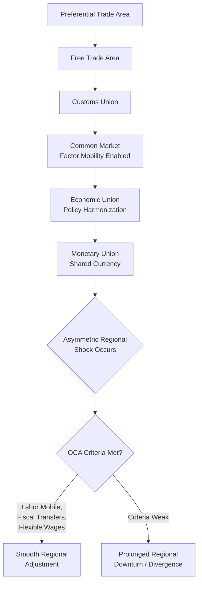

## Economic Integration and Regional Effects

### Definition and Conceptual Foundation

Economic integration refers to the process by which previously separated regional or national economies reduce or eliminate barriers to the movement of goods, services, capital, and labor, moving toward a more unified economic space. In the interregional context, this covers both integration *within* a country (interstate/interprovincial economic unification, common markets between regions) and integration *between* countries (customs unions, common markets, economic and monetary unions), with a specific analytical interest in how such integration reshapes the spatial distribution of economic activity across regions.

Economic integration is typically described along a spectrum of increasing depth, following Béla Balassa's classic stages-of-integration framework:

1. **Preferential Trade Area**: reduced tariffs among members, but each retains full autonomy on external tariffs.
2. **Free Trade Area (FTA)**: tariffs eliminated among members; each member retains independent external tariffs (e.g., NAFTA/USMCA).
3. **Customs Union**: FTA plus a common external tariff toward non-members (e.g., early EEC, Mercosur).
4. **Common Market**: customs union plus free movement of factors of production (labor, capital) among members (e.g., EU Single Market).
5. **Economic Union**: common market plus harmonization of economic policies (fiscal, regulatory) among members.
6. **Monetary Union**: economic union plus a shared currency and unified monetary policy (e.g., Eurozone).

Interregional economics is particularly interested in stages 4 through 6, since these stages activate the factor-mobility channels (capital and labor movement) that most directly reshape regional specialization patterns, discussed in the prior items of this chapter.

### Theoretical Channels of Regional Effect

**Trade Creation vs. Trade Diversion (Viner, 1950)**

Jacob Viner's foundational customs-union theory distinguishes two effects of integration on regional/national welfare and production patterns:

- **Trade creation**: integration shifts production from a higher-cost domestic (or regional) producer to a lower-cost partner producer, raising aggregate efficiency and welfare.
- **Trade diversion**: integration shifts purchasing from a lower-cost external (non-member) producer to a higher-cost member producer purely because of the removal of internal tariffs, reducing aggregate efficiency even though it increases intra-bloc trade volume.

The net regional welfare effect of an integration agreement depends on which effect dominates, which in turn depends on the pre-existing tariff structure, the similarity of member economies, and the elasticity of substitution between member and non-member goods.

**Market Access and New Economic Geography Effects**

Integration reduces trade costs between regions/countries. In NEG models, this changes the relative attractiveness of "core" versus "peripheral" locations in a non-monotonic way, captured conceptually by the "bell-shaped curve" of spatial concentration relative to trade costs:

- At **very high trade costs**, production must be dispersed near local demand (autarky-like conditions favor dispersion).
- At **intermediate trade costs**, firms benefit from concentrating in the largest-demand ("core") region and exporting to the periphery, since agglomeration economies outweigh remaining trade costs — this stage favors **spatial concentration** and rising regional inequality (the "home market effect").
- At **very low trade costs** (deep integration), firms may find it worthwhile to disperse production toward lower-cost peripheral locations, since transporting goods back to core markets becomes cheap — potentially reversing toward **dispersion** again.

$$\text{Regional Concentration} = f(\text{trade costs}), \quad f'' \text{ can change sign (bell-shaped relationship)}$$

[Inference: the bell-shaped relationship is a theoretical prediction robust across several NEG model variants, but the empirical location of any real integration process along this curve — i.e., whether deepening integration is currently increasing or decreasing regional concentration — must be assessed case by case and is genuinely contested in some empirical settings.]

**Factor Mobility Channel**

Common-market-stage integration (free movement of labor and capital) directly activates the mechanisms discussed under capital and labor mobility: capital flows toward locations with higher expected returns, and labor flows toward locations with higher expected wages/utility, net of migration costs. Integration is predicted to accelerate factor-price convergence relative to a trade-only (goods-only) integration regime, per the interaction between the Factor-Price Equalization theorem and direct factor mobility.

**Regulatory and Institutional Harmonization Effects**

Deeper integration stages require harmonizing product standards, labor regulations, competition policy, and (in monetary unions) fiscal rules. This reduces regulatory arbitrage opportunities between regions but can also eliminate a policy tool that lagging regions previously used to attract investment (e.g., loss of independent monetary policy or exchange-rate adjustment as an adjustment mechanism, central to Optimum Currency Area theory).

### Optimum Currency Area (OCA) Theory and Regional Adjustment

Robert Mundell's Optimum Currency Area framework is directly relevant to understanding regional effects of the deepest form of integration (monetary union). Key OCA criteria assess whether a group of regions can safely share a single currency without an unacceptable loss of regional adjustment capacity:

- **Labor mobility**: high interregional labor mobility can substitute for exchange-rate adjustment as a shock-absorption mechanism (a region hit by a negative shock can adjust via out-migration rather than currency depreciation).
- **Capital mobility and fiscal transfers**: automatic fiscal transfer mechanisms (as in federal systems) can cushion asymmetric regional shocks in the absence of independent monetary policy.
- **Wage and price flexibility**: if wages/prices adjust flexibly downward in a depressed region, this substitutes for the "internal devaluation" that would otherwise require nominal exchange-rate depreciation.
- **Diversification of production**: regions with diversified economies are less exposed to asymmetric, sector-specific shocks, reducing the need for independent monetary response.
- **Symmetry of shocks**: if regions in the union tend to experience similar (symmetric) business-cycle shocks, a single monetary policy suits all members reasonably well; asymmetric shocks are the core problem OCA theory addresses.

A region joining a monetary or economic union that scores poorly on these criteria (limited labor mobility, no fiscal transfer mechanism, inflexible wages, undiversified production) is theoretically at elevated risk of prolonged regional recession following an asymmetric shock, since it loses the exchange-rate and independent-monetary-policy tools of adjustment. This dynamic was widely discussed in analyses of the Eurozone sovereign debt crisis (2010s), where peripheral member states lacking these buffers experienced prolonged downturns relative to the core. [Inference: while the Eurozone crisis is commonly cited as an illustration of OCA-predicted asymmetric-shock vulnerability, the relative contribution of OCA-related factors versus fiscal policy choices, banking-sector issues, and other causes remains debated among economists.]

### Diagram: Integration Depth and Regional Adjustment Mechanisms

### Empirical Patterns of Regional Effects from Integration

- **Winner and loser regions**: integration rarely affects all regions within a bloc uniformly. Regions with pre-existing comparative advantages aligned to the newly accessible market tend to gain disproportionately (trade creation beneficiaries and agglomeration "cores"), while regions specialized in sectors newly exposed to lower-cost competition from partner regions may experience adjustment costs, deindustrialization, or population outflow.
- **Border region effects**: regions immediately adjacent to newly opened borders often experience the earliest and most concentrated effects (both positive, via new market access, and negative, via new competitive exposure) since transport-cost reductions matter most where distance was previously the binding constraint.
- **Convergence versus divergence evidence**: empirical studies of the European Union's regional convergence (via Cohesion and Structural Funds alongside Single Market integration) show convergence at the *national* level between member states in many periods, but persistent or even widening disparities at the *sub-national* (regional/NUTS-2) level in some cases, consistent with NEG's prediction that integration can concentrate activity in core metropolitan regions even as national aggregates converge. [Unverified: the balance of convergence versus divergence findings varies substantially across time periods, EU enlargement waves, and the specific regional dataset/methodology used; this is not a single settled empirical fact.]
- **Sectoral relocation**: integration frequently triggers the relocation of specific industries toward regions with comparative or agglomeration advantages within the newly unified market — for example, discussions of manufacturing relocation toward lower-wage member regions following EU enlargement, or the reallocation of supply chains following NAFTA/USMCA implementation.

### Adjustment Costs and Regional Policy Response

Because integration produces regionally uneven effects even when aggregate (national or bloc-wide) welfare rises, most integration agreements are accompanied by explicit regional policy instruments intended to manage transition costs:

- **Structural and cohesion funds** (EU model): direct fiscal transfers targeted at lagging regions to fund infrastructure, human capital, and business development, intended to help disadvantaged regions meet OCA-style adjustment criteria over time.
- **Trade adjustment assistance programs** (e.g., US Trade Adjustment Assistance): worker retraining and relocation support for regions/sectors negatively affected by increased import competition following trade liberalization.
- **Special economic zones and regional investment incentives**: used to attract capital to regions at risk of being bypassed by integration-driven agglomeration in core areas.

### Policy and Analytical Considerations

- **Sequencing of integration stages**: theory and evidence suggest that activating factor mobility (common market stage) before adequate fiscal and labor-market-flexibility mechanisms are in place can expose lagging regions to the "worst of both worlds" — exposure to competitive and agglomeration pressures without adjustment support. [Inference: appropriate sequencing is context-dependent and a matter of ongoing policy design debate, not a fixed rule.]
- **Measuring net regional effects**: assessing whether a given integration process helps or harms a specific region requires disentangling trade-creation/diversion effects, agglomeration/dispersion effects, and factor-mobility effects, which often operate in different directions simultaneously and over different time horizons.
- **Political economy of adjustment**: regions bearing concentrated adjustment costs from integration (e.g., import-competing industrial regions) frequently become focal points of political opposition to further integration, even when national aggregate welfare gains are documented — a recurring theme in trade-policy political economy.

**Related Topics**

- Balassa's stages of economic integration
- Trade creation and trade diversion (Viner)
- Optimum Currency Area theory (Mundell)
- New Economic Geography and the home market effect
- EU Cohesion Policy and Structural Funds
- Regional convergence/divergence (NUTS-2 evidence)
- Trade Adjustment Assistance and labor market transition policy
- Capital mobility across regions (preceding chapter item)
- Labor mobility and migration in response to integration shocks