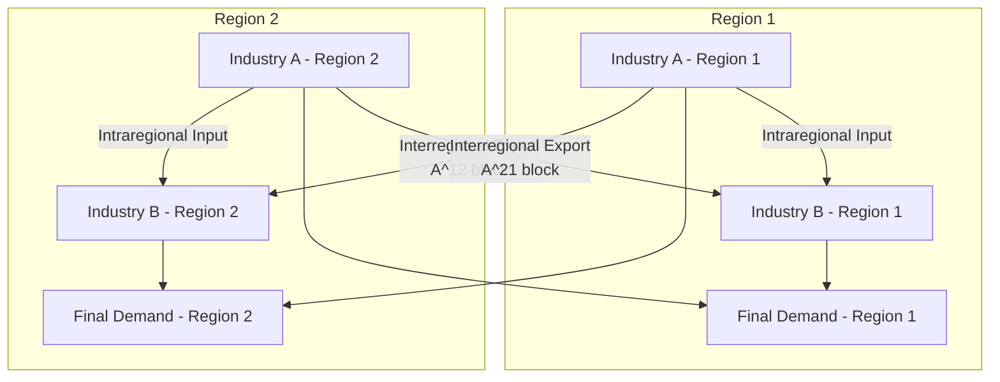

## Interregional Input-Output Linkages

### Definition and Conceptual Foundation

Interregional input-output (IRIO) linkages describe the network of intermediate-good and service transactions that connect industries *across* different regions, not merely within a single region's economy. While standard (single-region) input-output analysis captures how industries within one region purchase inputs from and sell outputs to each other, interregional input-output analysis explicitly tracks flows of intermediate goods and services *between* regions — region $A$'s steel industry supplying region $B$'s automobile industry, for instance.

This framework extends Wassily Leontief's input-output model to a multi-region setting and is the primary quantitative tool economists use to trace how a demand or supply shock in one region propagates through production networks to affect output, employment, and income in other regions.

### The Single-Region Input-Output Model (Foundation)

Before extending to multiple regions, the core single-region Leontief model must be established. Total output of industry $i$, $x_i$, equals the sum of intermediate demand from all industries plus final demand:

$$x_i = \sum_j z_{ij} + f_i$$

where $z_{ij}$ is the input purchased by industry $j$ from industry $i$, and $f_i$ is final demand for industry $i$'s output. Defining technical coefficients $a_{ij} = z_{ij}/x_j$ (input of $i$ required per unit of output of $j$), this becomes, in matrix form:

$$\mathbf{x} = \mathbf{A}\mathbf{x} + \mathbf{f}$$

Solving for total output given a vector of final demand:

$$\mathbf{x} = (\mathbf{I} - \mathbf{A})^{-1}\mathbf{f}$$

The matrix $(\mathbf{I} - \mathbf{A})^{-1}$ is the **Leontief inverse**, and each element captures the total (direct plus indirect) output required from industry $i$ to satisfy one unit of final demand for industry $j$'s output.

### Extending to Interregional Input-Output (IRIO) Models

The IRIO model (developed primarily by Walter Isard) partitions both the technical coefficient matrix and final demand by region, tracking not just *which industry* supplies *which industry*, but *which region-industry pair* supplies *which region-industry pair*.

For a two-region system ($r = 1, 2$) with $n$ industries, the balance equation for industry $i$ in region $r$ becomes:

$$x_i^r = \sum_{s} \sum_j z_{ij}^{rs} + \sum_s f_i^{rs}$$

where $z_{ij}^{rs}$ is the intermediate input of industry $i$'s output from region $r$ purchased by industry $j$ in region $s$, and $f_i^{rs}$ is final demand in region $s$ for region $r$'s industry $i$ output.

In block-matrix form, for two regions:

$$\begin{bmatrix} \mathbf{x}^1 \\ \mathbf{x}^2 \end{bmatrix} = \begin{bmatrix} \mathbf{A}^{11} & \mathbf{A}^{12} \\ \mathbf{A}^{21} & \mathbf{A}^{22} \end{bmatrix} \begin{bmatrix} \mathbf{x}^1 \\ \mathbf{x}^2 \end{bmatrix} + \begin{bmatrix} \mathbf{f}^1 \\ \mathbf{f}^2 \end{bmatrix}$$

where $\mathbf{A}^{rs}$ is the matrix of technical coefficients describing inputs from region $r$'s industries used by region $s$'s industries (off-diagonal blocks $\mathbf{A}^{12}$ and $\mathbf{A}^{21}$ capture *interregional* trade linkages; diagonal blocks $\mathbf{A}^{11}$ and $\mathbf{A}^{22}$ capture *intraregional* linkages).

Solving analogously:

$$\begin{bmatrix} \mathbf{x}^1 \\ \mathbf{x}^2 \end{bmatrix} = \left(\mathbf{I} - \begin{bmatrix} \mathbf{A}^{11} & \mathbf{A}^{12} \\ \mathbf{A}^{21} & \mathbf{A}^{22} \end{bmatrix}\right)^{-1} \begin{bmatrix} \mathbf{f}^1 \\ \mathbf{f}^2 \end{bmatrix}$$

This multi-region Leontief inverse now captures direct, indirect, *and* interregional spillover effects of a final demand change anywhere in the system on output everywhere in the system.

### The Chenery-Moses Alternative (Trade-Coefficient Approach)

A widely used simplification, developed independently by Hollis Chenery and Leontief-collaborator Walter Isard alongside Leon Moses, avoids the need for a full interregional technical-coefficient matrix (which requires enormous, often unavailable, region-pair-specific transaction data) by separating **production technology** from **trade patterns**.

The Chenery-Moses model assumes:

1. Each region has its own single-region technical coefficient matrix $\mathbf{A}^r$ (how industries within region $r$ use inputs, regardless of source region) — a standard, more readily estimable dataset.
2. A separate **regional trade coefficient matrix** $\mathbf{C}^{rs}$ specifies the *share* of region $s$'s total demand for good $i$ that is supplied by region $r$ (often estimated via gravity models, location quotients, or observed trade-flow data).

This decomposition is more empirically tractable because national input-output tables (single-region technology) are commonly published, while true bilateral interregional trade-flow data at the industry level is far more scarce and expensive to collect. [Inference: the trade-off is that the Chenery-Moses approach imposes the simplifying assumption that trade shares are uniform across all using-industries in a region, which may not hold precisely in reality — a known limitation acknowledged in the regional science literature.]

### Diagram: Interregional Input-Output Flow Structure (Two-Region System)

### Key Analytical Outputs from IRIO Models

**Interregional Multipliers**

Elements of the multi-region Leontief inverse serve as multipliers showing how a one-unit final demand increase in region $s$'s industry $j$ affects total output of industry $i$ in region $r$. These decompose into:

- **Intraregional multiplier effects**: the diagonal-block contribution (output effects staying within the originating region).
- **Interregional spillover (feedback) effects**: the off-diagonal-block contribution (output effects "leaking" to or returning from other regions), including **feedback effects**, where a shock originating in region $A$ stimulates region $B$'s output, which in turn generates additional demand for region $A$'s exports back to $B$ — a second-round effect specific to multi-region models that single-region models cannot capture.

**Forward and Backward Linkage Indices**

Extending the single-region Rasmussen-Hirschman linkage indices to the interregional case:

- **Backward linkage**: measures how much a region-industry's output growth pulls demand for inputs from *other* regions (column sums of the relevant Leontief inverse blocks).
- **Forward linkage**: measures how much a region-industry's output serves as an input to production in *other* regions (row sums of the relevant blocks).

High interregional backward/forward linkages identify "key region-industries" whose growth or disruption has outsized effects propagating across the interregional system — of particular interest in regional development policy for identifying which sectors to target for growth-pole strategies.

### Worked Example: Simple Two-Region Shock Propagation

Consider a simplified two-region, one-industry-per-region system where region 1 supplies 30% of the intermediate inputs used by region 2's industry, and region 2 supplies 20% of the inputs used by region 1's industry, with intraregional coefficients of 0.4 in each region:

$$\mathbf{A} = \begin{bmatrix} 0.4 & 0.2 \\ 0.3 & 0.4 \end{bmatrix}$$

$$\mathbf{I} - \mathbf{A} = \begin{bmatrix} 0.6 & -0.2 \\ -0.3 & 0.6 \end{bmatrix}$$

The determinant is $(0.6)(0.6) - (-0.2)(-0.3) = 0.36 - 0.06 = 0.30$. The Leontief inverse is:

$$(\mathbf{I}-\mathbf{A})^{-1} = \frac{1}{0.30}\begin{bmatrix} 0.6 & 0.2 \\ 0.3 & 0.6 \end{bmatrix} = \begin{bmatrix} 2.00 & 0.667 \\ 1.00 & 2.00 \end{bmatrix}$$

If final demand rises by 100 units in region 1 only ($\mathbf{f} = [100, 0]^T$), total output effects are:

$$\mathbf{x} = \begin{bmatrix} 2.00 & 0.667 \\ 1.00 & 2.00 \end{bmatrix} \begin{bmatrix} 100 \\ 0 \end{bmatrix} = \begin{bmatrix} 200 \\ 100 \end{bmatrix}$$

Region 1's own output rises by 200 (a multiplier of 2.0 from the initial 100-unit demand shock), and region 2's output rises by 100 purely as a spillover effect — despite receiving no direct final demand increase itself, demonstrating the interregional feedback/spillover mechanism at the core of IRIO analysis.

### Applications

- **Regional impact analysis**: assessing how a new factory, infrastructure project, or public spending program in one region generates output and employment effects not just locally but in supplying/receiving regions elsewhere in the country.
- **Disaster and disruption analysis**: modeling how a natural disaster, pandemic-related shutdown, or infrastructure failure in one region propagates supply-chain disruptions to dependent regions (a major contemporary application area given interest in regional supply-chain resilience).
- **Regional policy targeting**: identifying "key sector" region-industry combinations with high interregional linkage strength as targets for growth-pole or cluster-based development policy.
- **Carbon and resource footprint accounting**: extending IRIO tables to track embodied emissions or resource use transferred between regions through trade in intermediate goods (interregional environmentally-extended input-output analysis), an active area of applied regional science research. [Inference: this environmental extension is a well-established methodological direction in the field, though specific footprint estimates depend heavily on the underlying IRIO table's data vintage and industry classification detail.]

### Data and Estimation Challenges

- **Data scarcity**: true bilateral interregional trade-flow data at a fine industry level is rarely collected directly by statistical agencies (unlike international trade, which is recorded at customs). Most IRIO tables rely on indirect estimation techniques.
- **Common estimation methods**:
  - **Location Quotient-based methods** (e.g., simple LQ, cross-industry LQ, semi-logarithmic LQ): use regional employment/output data to infer the likely share of regional demand met by local production versus imports from other regions, a relatively low-data-requirement approach.
  - **Gravity models**: estimate interregional trade flows using distance, regional economic mass (GDP or output), and other resistance factors, analogous to international trade gravity models.
  - **Survey-based methods**: direct surveys of firms regarding their supplier and customer locations — the most accurate but also the most costly and time-consuming approach, typically only feasible for well-funded national statistical programs.
  - **RAS/bi-proportional adjustment techniques**: used to update or reconcile existing IRIO tables to match newer, but less detailed, marginal totals (regional output and demand aggregates) without full re-survey.
- **Behavior may vary**: any given country's national statistical office may use different methodologies, base years, or industry classification schemes for its IRIO tables (or may not maintain an official IRIO table at all, relying instead on academic or private-sector estimates), so specific data availability and quality should be verified for the country/region system under study. [Unverified: data availability and construction methodology differ substantially by country, and no single standard applies universally.]

### Policy Considerations

- **Infrastructure investment appraisal**: IRIO models allow policymakers to capture the full interregional benefit of infrastructure projects (e.g., a highway or port upgrade) that reduce interregional trade costs, rather than only the effects within the region hosting the project.
- **Targeted regional development**: identifying which lagging regions have strong potential interregional linkages to prosperous "core" regions can inform strategies to integrate lagging regions into national supply chains rather than pursuing self-contained regional development.
- **Resilience planning**: understanding interregional linkage structure helps identify systemic vulnerability points — regions or sectors whose disruption would propagate widely through the national economy — relevant to both economic and disaster-preparedness planning.

**Related Topics**

- Leontief input-output model (single-region foundations)
- Chenery-Moses trade-coefficient model
- Rasmussen-Hirschman forward/backward linkage indices
- Regional economic base theory and export multipliers
- Gravity models of interregional and international trade
- Environmentally-extended input-output analysis
- Regional impact and disaster propagation analysis
- Growth pole theory and key-sector identification