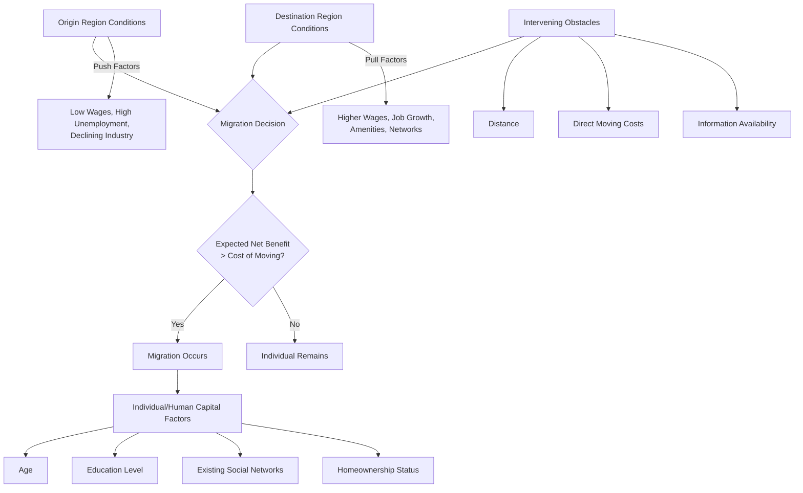

## Determinants of Internal Migration

### Definition and Conceptual Foundation

Internal migration refers to the movement of individuals or households across regional, state, provincial, or metropolitan boundaries *within* a single country, as distinct from international migration across national borders. Determinants of internal migration are the economic, social, and demographic factors that explain why individuals choose to relocate from one region (origin) to another (destination), how many people move, and which subpopulations are most likely to migrate.

Understanding these determinants is central to regional economics because migration is one of the two primary factor-mobility channels (alongside capital mobility) that reallocates productive resources across space, directly affecting regional labor supply, wages, housing markets, and long-run regional growth trajectories.

### The Human Capital Investment Model of Migration (Sjaastad Framework)

The dominant theoretical foundation, developed by Larry Sjaastad (1962), treats migration as an investment in human capital: individuals migrate if the discounted present value of expected net benefits at the destination exceeds the costs of moving, including foregone benefits at the origin.

Formally, an individual migrates from region $A$ to region $B$ if:

$$\sum_{t=0}^{T} \frac{W_B(t) - W_A(t)}{(1+r)^t} > C_{move} + \sum_{t=0}^{T} \frac{\psi_B(t) - \psi_A(t)}{(1+r)^t}$$

where $W_B(t)$ and $W_A(t)$ are expected earnings streams at destination and origin, $r$ is the discount rate, $C_{move}$ represents direct moving costs (transportation, transaction costs of selling/buying housing), and $\psi$ captures psychic and non-pecuniary costs/benefits (loss of social networks, climate preferences, amenities).

This framework generates several key empirical predictions:

- **Younger individuals migrate more**: a longer remaining time horizon $T$ over which to recoup the fixed cost of moving raises the expected present value of migrating, all else equal — one of the most robust empirical regularities in migration research.
- **Higher-skilled/educated individuals migrate more**: education both raises the absolute wage gap achievable through migration and correlates with better information about distant opportunities and lower psychic costs of adjustment to a new location.
- **Migration decreases with distance**: greater distance raises both direct moving costs and psychic costs (loss of proximity to family/networks), and reduces the quality of information about distant labor markets.

### The Gravity Model of Migration

Borrowed from physics and widely used in both international and interregional migration modeling, the gravity model posits that migration flow between origin $i$ and destination $j$ is proportional to the "mass" (population or economic size) of both locations and inversely proportional to the distance (or more generally, migration cost/friction) between them:

$$M_{ij} = k \frac{P_i^{\alpha} P_j^{\beta}}{D_{ij}^{\gamma}}$$

where $M_{ij}$ is migration flow from $i$ to $j$, $P_i$ and $P_j$ are population (or labor force) sizes, $D_{ij}$ is distance (or a broader cost measure), and $k$, $\alpha$, $\beta$, $\gamma$ are estimated parameters, with $\gamma$ typically found to be positive (migration falls with distance) in empirical estimates. [Inference: specific parameter estimates vary substantially by country, time period, and dataset, so no single universal value should be assumed for $\gamma$ or the other coefficients.]

### The Todaro Model (Expected Income Framework)

Michael Todaro's model, originally developed to explain rural-to-urban migration in developing countries despite persistent urban unemployment, reframes the migration decision around *expected* rather than actual income. An individual migrates if:

$$E[W_{urban}] = p \cdot W_{urban} > W_{rural}$$

where $p$ is the probability of obtaining formal urban employment (often proxied by the urban employment rate) and $W_{urban}$ is the wage conditional on securing that job. This model explains the empirical paradox of continued rural-urban migration even in the presence of high urban unemployment: migrants are responding to the *expected value* of urban opportunity (wage times probability of employment), not merely the urban unemployment rate itself. [Inference: while developed primarily for developing-country rural-urban contexts, the expected-income logic is also applied, with modification, to internal migration in developed economies facing regional labor market slack.]

### Push and Pull Factor Taxonomy

A widely used organizing framework (associated with Everett Lee's 1966 migration theory) categorizes determinants as:

**Push factors (origin-region conditions that encourage out-migration):**

- High unemployment or declining industries (structural economic decline)
- Low wages relative to national average
- Limited educational or career advancement opportunities
- Adverse climate, environmental degradation, or natural disasters
- High cost of living relative to local income
- Social or political instability (less relevant to purely economic internal migration, more relevant in fragile-state contexts)

**Pull factors (destination-region conditions that attract in-migration):**

- Higher wages and employment opportunities, especially in expanding or high-growth sectors
- Amenities (climate, cultural offerings, natural environment, quality of life)
- Lower cost of living relative to wages (real, not just nominal, wage differentials)
- Presence of existing social networks (family, diaspora, co-ethnic communities) — the "chain migration" effect
- Educational institutions and human capital accumulation opportunities
- Housing availability and affordability

Lee's framework also identifies **intervening obstacles** (distance, cost, information barriers, family/property ties) and **personal factors** (age, education, life-cycle stage, risk tolerance) that mediate whether push/pull differentials translate into actual migration.

### Diagram: Determinants and Decision Pathway of Internal Migration

### Individual and Household-Level Determinants

- **Age**: migration propensity typically peaks in early adulthood (roughly ages 20-30 in most empirical studies) and declines steadily thereafter, consistent with the human capital investment model's time-horizon logic.
- **Education**: more educated individuals exhibit substantially higher migration rates, partly due to higher absolute returns to relocation and partly due to occupations requiring specialized skills being more geographically concentrated (thin local labor markets for specialized roles necessitate wider job searches).
- **Homeownership**: renters are generally more mobile than homeowners, since homeownership imposes higher transaction costs on relocation (real estate transaction costs, mortgage considerations, potential for being "locked in" by house-price conditions relative to a mortgage balance — sometimes discussed as the "housing lock" phenomenon, particularly salient when local house prices have fallen).
- **Family structure and life-cycle stage**: single individuals and childless couples are typically more mobile than families with school-age children (disruption costs to children's schooling, dual-career household coordination problems — the "tied mover/tied stayer" problem in dual-earner household migration).
- **Prior migration experience**: individuals who have migrated before are statistically more likely to migrate again ("repeat migration"), consistent with lower psychic costs of moving once prior experience has been gained.
- **Risk aversion and uncertainty**: higher risk aversion reduces migration propensity given the inherent uncertainty in destination-region outcomes, all else equal.

### Regional/Structural Determinants

- **Interregional wage differentials**: the most fundamental economic driver in neoclassical models — persistent nominal or real wage gaps between regions create ongoing incentive for labor reallocation until returns equalize (subject to the same convergence-versus-divergence debate as capital mobility).
- **Regional unemployment rate differentials**: high relative unemployment in the origin region is one of the most consistently significant push factors identified in empirical migration studies.
- **Cost of living and housing costs**: high housing costs in high-wage regions can substantially offset nominal wage advantages, meaning *real* wage or utility differentials (adjusted for local price levels, particularly housing) are more relevant determinants than nominal wage gaps alone.
- **Amenities**: climate, recreational opportunities, cultural offerings, and quality of local public goods (schools, safety, healthcare access) are increasingly emphasized in the "amenity migration" literature, particularly relevant for explaining migration flows not fully accounted for by wage/employment differentials alone (e.g., "Sun Belt" migration in the United States).
- **Network effects and chain migration**: the presence of prior migrants from the same origin region at a destination substantially lowers the effective cost of migration for subsequent movers (information provision, job referrals, social support), producing self-reinforcing migration corridors between specific origin-destination region pairs.
- **Housing market conditions at both ends**: availability and affordability of housing at the destination can act as a binding constraint on migration even when wage/employment pull factors are favorable — a topic of substantial current policy interest given housing supply constraints in many high-productivity metropolitan regions. [Inference: the magnitude of this housing-supply constraint effect on aggregate migration rates is an active area of ongoing empirical research and estimates vary by study design and geography.]

### Empirical Measurement Approaches

- **Gross migration flow analysis**: using census, tax-record, or administrative population-registry data to construct origin-destination migration flow matrices.
- **Gravity model estimation**: regressing observed migration flows on population size, distance, and other covariates (often log-linearized for OLS or estimated via Poisson pseudo-maximum-likelihood methods given the count-data nature of migration flows).
- **Discrete choice / random utility models**: modeling the migration decision as a choice among a set of destination alternatives, where each individual selects the destination offering the highest expected utility, estimated via conditional or multinomial logit frameworks.
- **Net migration rate**: $(\text{In-migrants} - \text{Out-migrants}) / \text{Population} \times 1000$, a summary statistic commonly used to characterize a region's overall migration attractiveness over a period.

### Policy Considerations

- **Labor market adjustment role**: internal migration is often viewed as a key adjustment mechanism for regional asymmetric shocks (analogous to its role in Optimum Currency Area theory) — regions with higher internal labor mobility can absorb localized downturns more smoothly via out-migration reducing local labor supply pressure.
- **Housing policy interactions**: land-use and housing-supply regulations that restrict housing construction in high-productivity regions can suppress migration-driven labor reallocation, a topic that has drawn significant attention in recent regional economics research connecting housing supply constraints to aggregate productivity and spatial misallocation. [Inference: this is an active and evolving area of applied research; specific magnitude estimates of the productivity cost of migration-suppressing housing constraints vary across studies and should be treated as subject to revision.]
- **Regional development policy trade-offs**: policies aimed at retaining population in declining regions (place-based subsidies, infrastructure investment) versus policies that facilitate migration toward opportunity (portable benefits, relocation assistance, housing voucher portability) represent a recurring policy tension between "helping people" versus "helping places."

**Related Topics**

- Sjaastad's human capital investment model of migration
- Gravity models of migration and trade
- Todaro model and expected-income migration in developing economies
- Push-pull factor theory (Lee, 1966)
- Tied movers and tied stayers in household migration decisions
- Amenity-driven migration and quality-of-life indices
- Housing supply constraints and spatial labor misallocation
- Optimum Currency Area theory and labor mobility as adjustment mechanism