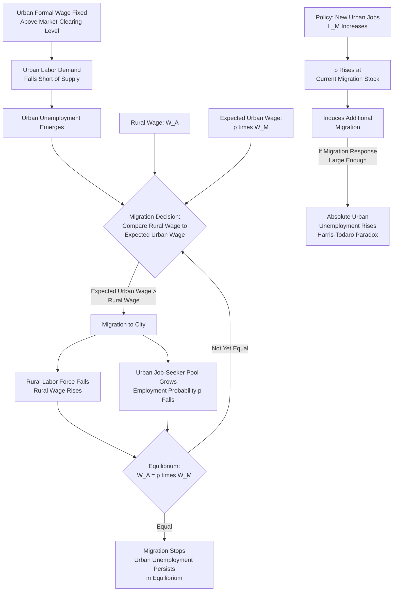

## Harris-Todaro Model of Migration

### Definition and Conceptual Foundation

The Harris-Todaro model, developed by John Harris and Michael Todaro (1970), is a foundational theoretical framework in development and migration economics that explains the persistence of rural-to-urban migration in developing economies *despite* the coexistence of substantial urban unemployment. It resolves an apparent paradox in earlier migration models: if urban unemployment is high, why do rural workers continue to migrate to cities rather than remaining in (typically fully employed, if lower-paid) rural agricultural work?

The model's central insight is that migration decisions are driven by *expected* urban income — the actual urban wage weighted by the probability of obtaining formal urban employment — rather than by the actual urban wage or the urban unemployment rate in isolation. This reframing was a significant departure from earlier migration models (including simpler versions of the Sjaastad and Lewis frameworks) that assumed migrants respond only to wage-level or job-availability signals without incorporating employment-probability uncertainty explicitly into a formal general-equilibrium structure.

### Core Assumptions of the Model

1. **Two-sector economy**: the economy consists of a rural (agricultural, traditional) sector and an urban (industrial, modern) sector.
2. **Rural sector wage flexibility**: the rural wage $W_A$ adjusts to clear the rural labor market (full employment in agriculture, though often at a low, sometimes near-subsistence, wage).
3. **Urban sector wage rigidity**: the urban wage $W_M$ is institutionally fixed above the market-clearing level — due to minimum wage legislation, union bargaining power, efficiency-wage considerations, or public-sector wage-setting — and does not fall to absorb all job-seekers.
4. **Urban unemployment as equilibrium, not disequilibrium**: because the urban wage cannot adjust downward, urban labor demand falls short of urban labor supply at the going wage, generating persistent open unemployment (or underemployment in the informal sector) in equilibrium, rather than as a temporary imbalance that self-corrects.
5. **Risk-neutral migrants respond to expected income**: potential migrants compare the *rural wage* to the *expected urban wage* (urban wage multiplied by the probability of securing formal urban employment), not to the actual urban wage.

### The Core Migration Equilibrium Condition

Migration continues until expected incomes are equalized between the rural and urban sectors:

$$W_A = p \cdot W_M$$

where:

- $W_A$ = the rural (agricultural) wage
- $W_M$ = the fixed urban (manufacturing/modern-sector) wage
- $p$ = the probability of obtaining formal urban employment, commonly modeled as:

$$p = \frac{L_M}{L_U}$$

where $L_M$ is the number of urban formal-sector jobs (urban employment) and $L_U$ is the total urban labor force (including the unemployed who have migrated and are searching for formal jobs). This specification treats the probability of employment as equal to the current urban employment *rate*, implying job allocation is effectively random among all urban job-seekers (a simplifying assumption of the basic model).

Substituting, the equilibrium condition becomes:

$$W_A = \frac{L_M}{L_U} \cdot W_M$$

At equilibrium, no further rural-urban migration occurs because the rural wage exactly equals the expected urban wage — migration has driven the rural labor force down (raising $W_A$ via diminishing returns/labor scarcity in agriculture) and the urban job-seeking population up (lowering $p$) until the two sides balance, *even though* $W_M > W_A$ and urban unemployment ($L_U - L_M$) persists indefinitely in equilibrium.

### The Harris-Todaro Paradox: Urban Job Creation Can Increase Unemployment

One of the model's most cited and counterintuitive results is that policies intended to reduce urban unemployment by creating more urban formal-sector jobs can, under certain conditions, *increase* the equilibrium level of urban unemployment.

The logic: if $L_M$ rises (more urban jobs are created), this raises $p = L_M/L_U$ at the initial migration stock, which raises expected urban income above the rural wage, inducing *additional* rural-to-urban migration. If enough new migrants arrive seeking the now-more-attractive expected urban income, the increase in $L_U$ (urban job-seekers) can outpace the increase in $L_M$ (urban jobs), leaving the *absolute number* of unemployed urban workers ($L_U - L_M$) higher than before the job-creation policy — even though the underlying policy intention was to reduce urban unemployment. [Inference: whether this paradoxical outcome actually occurs in a specific numerical case depends on the relative magnitudes of the migration-response elasticity and the job-creation magnitude; it is a conditional theoretical possibility demonstrated formally in the model, not a claim that all urban job-creation programs necessarily backfire.]

This result has been highly influential in development-policy discussions, cautioning against urban-biased development strategies (industrial subsidies, urban infrastructure investment, minimum-wage policies favoring urban formal-sector workers) that do not simultaneously address rural-sector conditions, since such strategies can inadvertently exacerbate urban unemployment and informal-sector congestion via induced migration.

### Diagram: Harris-Todaro Equilibrium Mechanism

### Worked Example: Equilibrium Calculation

Suppose the rural wage $W_A = 100$ (in some currency unit) and the fixed urban wage $W_M = 300$. At equilibrium, expected urban income must equal the rural wage:

$$100 = p \times 300 \implies p = \frac{100}{300} = 0.333$$

This means the equilibrium urban employment *rate* must be approximately 33.3%, implying a 66.7% urban unemployment/underemployment rate among those who have migrated to the city and are seeking formal-sector work — despite the urban wage being three times the rural wage. This illustrates the model's key point: a very high urban-rural wage gap can coexist in equilibrium with a very high urban unemployment rate, because migration continues (compressing $p$ downward via a growing job-seeker pool) until the *expected* income gap, not the *actual* wage gap, closes.

If a policy creates enough new formal urban jobs to raise $L_M$ by 20%, but this simultaneously raises expected urban income enough to induce a 30% increase in migration into the urban job-seeker pool $L_U$, the new equilibrium urban employment probability $p'$ would fall relative to what it would have been without induced migration, and the absolute number of unemployed workers, $L_U - L_M$, would rise — a numerical instance of the paradox described above.

### Extensions and Refinements to the Basic Model

- **Informal sector incorporation**: later extensions (e.g., Fields, 1975) add a third, urban informal sector that absorbs migrants unable to secure formal employment, rather than assuming pure open unemployment while waiting. This modifies the migration decision to weigh rural income against a probability-weighted combination of formal urban wage, informal urban income, and formal-sector job-search probability.
- **Wage subsidy and job-search cost extensions**: subsequent literature has examined how the paradox result is sensitive to assumptions about job-search costs, minimum-wage rigidity mechanisms, and whether migrants can search for urban jobs while still working in agriculture (circular/seasonal migration), which can substantially alter the predicted migration and unemployment response to policy interventions. [Inference: the qualitative direction and magnitude of these refinements' effects on the core paradox result depend on the specific extension and parameterization used; results are not uniform across the extended-model literature.]
- **General equilibrium trade-theoretic version**: the model has been integrated into broader dual-economy general equilibrium trade models (sometimes called the "Harris-Todaro trade model") examining how trade policy, tariffs, and capital mobility interact with the rural-urban migration/unemployment mechanism — relevant to broader development trade-policy debates about the effects of protectionism on urban unemployment in developing economies.

### Empirical Relevance and Applications

- **Developing-economy rural-urban migration**: the model has been widely applied to explain observed patterns of continued rural-to-urban migration in Sub-Saharan Africa, South Asia, and Latin America despite persistently high urban unemployment and large informal sectors in major cities.
- **Minimum wage and urban labor policy analysis**: used as a theoretical basis for cautioning against urban minimum-wage increases or urban-biased industrial policy without complementary rural development, given the risk of induced migration effects.
- **Applicability to internal migration in developed economies**: while originally designed for developing-country dual-economy structures, the underlying expected-income logic (weighing wage differentials by employment-probability differentials) is sometimes applied, in modified form, to explain migration flows toward high-wage but also relatively high-unemployment metropolitan regions in developed economies, though the institutional wage-rigidity assumption central to the original model (minimum wage, union wage-setting) is less universally applicable outside the specific developing-economy dual-economy context for which it was designed. [Unverified: the degree to which the strict Harris-Todaro mechanism, as opposed to more general expected-income migration logic, transfers to developed-economy interregional migration is a matter of ongoing debate and depends on the specific institutional wage-setting context of the country studied.]

### Policy Implications

- **Complementary rural and urban policy**: the model implies that urban job-creation policies should be paired with rural income-support or rural development policies to avoid triggering induced migration that offsets or reverses intended unemployment reductions.
- **Caution against urban-biased wage-setting**: institutionally high urban minimum wages, while intended to protect urban formal-sector workers, may perpetuate or worsen the urban unemployment/informality problem by maintaining a large expected-income gap that continues to attract migrants beyond the formal sector's absorptive capacity.
- **Direct rural-income interventions as an alternative**: raising the rural wage $W_A$ directly (via agricultural productivity investment, rural infrastructure, or land reform) reduces the expected-income gap from the rural side, potentially achieving migration/unemployment balance without the paradox risk associated with urban-side job-creation policy. [Inference: this policy conclusion follows logically from the model's structure, but its real-world effectiveness depends on additional factors (agricultural market conditions, land tenure systems) outside the scope of the basic model itself.]

**Related Topics**

- Sjaastad human capital investment model of migration
- Lewis dual-sector model of economic development
- Informal sector economics (Fields extension)
- Efficiency wage theory and urban wage rigidity
- Push-pull migration factor theory
- Determinants of internal migration (preceding chapter item)
- Urban bias in development policy
- General equilibrium trade-theoretic migration models