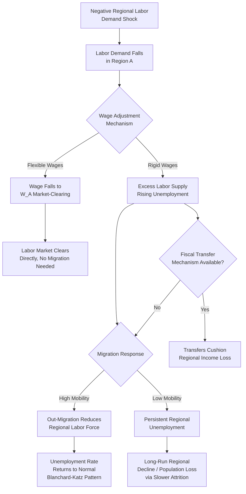

## Migration and Regional Labor Market Adjustment

### Definition and Conceptual Foundation

Migration and regional labor market adjustment refers to the process by which interregional migration flows respond to, and help correct (or fail to correct), regional imbalances in labor demand and supply — such as asymmetric shocks, persistent wage differentials, or divergent unemployment rates across regions. This topic sits at the intersection of migration economics and regional macroeconomics: it asks not merely *why* people migrate (addressed under determinants of internal migration) but *how effectively* migration functions as an equilibrating mechanism for regional labor markets relative to alternative adjustment channels (wage flexibility, capital mobility, fiscal transfers).

This question is of central importance to regional and macroeconomic policy because the effectiveness of migration as an adjustment mechanism determines how costly and persistent regional recessions are likely to be, and is a core criterion in Optimum Currency Area theory for assessing whether a group of regions can safely share a common currency and monetary policy.

### The Neoclassical Adjustment Model

In the standard neoclassical regional labor market model, a negative demand shock to region $A$ (e.g., decline of a dominant local industry) is expected to trigger the following adjustment sequence:

1. **Immediate impact**: labor demand falls in region $A$, creating excess labor supply at the prevailing wage, which shows up initially as rising regional unemployment.
2. **Wage adjustment (if flexible)**: the regional wage $W_A$ falls in response to excess supply, which should, in principle, restore labor market clearing directly without requiring migration, if wages are sufficiently flexible downward.
3. **Migration adjustment (if wages are sticky)**: if wages are downwardly rigid (due to institutional wage-setting, minimum wages, or nominal wage rigidity), the shock instead manifests as persistent regional unemployment, which triggers out-migration as workers relocate toward regions with better employment prospects, per the migration determinants discussed previously (wage/employment differentials weighed against moving costs).
4. **Equilibrium restoration**: out-migration reduces the regional labor force, which — combined with any capital or output response — is expected to gradually restore the regional unemployment rate toward its pre-shock (or national average) level, even without wage adjustment, since fewer workers are competing for the reduced number of local jobs.

This is often formalized in a **regional Phillips-curve-augmented adjustment model**, where regional unemployment $U_A$ evolves according to:

$$\dot{U}_A = -\lambda_1 (W_A - W_A^*) - \lambda_2 \cdot M_A(U_A, U_N)$$

where $W_A^*$ is the market-clearing wage, $M_A$ is net out-migration (a positive function of the region's unemployment relative to the national rate $U_N$), and $\lambda_1, \lambda_2 > 0$ capture the relative speed of wage- and migration-based adjustment.

### Blanchard-Katz Framework: Empirical Evidence on Adjustment Speed and Mechanism

The most influential empirical study of this question is Olivier Blanchard and Lawrence Katz's 1992 analysis of U.S. state-level labor markets following adverse shocks. Their key findings, which have shaped the subsequent literature substantially:

- **Employment, not participation or unemployment, absorbs most of the long-run adjustment**: following a negative regional shock, employment falls persistently, but the regional unemployment rate and labor force participation rate return to close to their pre-shock (or national-average-relative) levels within roughly five to seven years.
- **Migration is the primary equilibrating mechanism, not wage adjustment**: the return of the unemployment rate to normal occurs primarily through **out-migration** reducing the regional labor force, rather than through wages falling to reabsorb the existing labor force into employment. Regional wages were found to respond only modestly and slowly to the shock relative to the migration response.
- **This implies U.S. states behave, in this respect, similarly to regions within an Optimum Currency Area relying on labor mobility as the primary adjustment channel**, since wage flexibility appeared to play a comparatively minor role. [Inference: while the Blanchard-Katz finding of migration-dominant adjustment for the U.S. is well-established in the literature, subsequent studies applying similar methodology to other countries have found more mixed results regarding the relative importance of migration versus wage adjustment, so the "migration dominates" conclusion should not be assumed to generalize uniformly across all countries and time periods without direct empirical verification.]

### Diagram: Adjustment Pathways Following a Regional Labor Demand Shock

### Frictions and Limits to Migration as an Adjustment Mechanism

While migration serves as a theoretically clean equilibrating channel, several frictions limit its speed and completeness in practice:

- **Housing market frictions**: homeownership and housing-price conditions can create "housing lock," where declining home values in a depressed region trap homeowners who would otherwise migrate (negative equity preventing a sale sufficient to fund relocation), slowing the migration-adjustment channel precisely when it may be most needed.
- **Information and search frictions**: workers may lack complete information about opportunities in distant regions, slowing the migration response relative to the frictionless neoclassical prediction.
- **Family and social ties**: dual-earner households face coordination problems (the "tied mover/tied stayer" issue), and social network ties to the origin region raise the psychic cost of departure, both of which slow migration response.
- **Skill mismatch**: workers displaced from a declining industry may lack skills demanded in growing regions/sectors, requiring costly retraining before migration yields the expected wage gain, or leading some to migrate into lower-skill jobs than previously held (a form of "downward occupational mobility" following displacement).
- **Selective migration and regional "brain drain"**: migration in response to a regional shock is typically selective — younger, more educated, and more skilled workers migrate at higher rates (consistent with human capital investment migration theory), leaving behind an older, less skilled residual population in the declining region. This selective outflow can *worsen* the declining region's long-run growth prospects even as it partially resolves the *unemployment rate* statistic, since the region's human capital base and future tax capacity erode. [Inference: the long-run growth consequence of this selective-outmigration "brain drain" effect is well-documented directionally in the literature, though its precise magnitude varies by region and study.]
- **Amenity-driven "stickiness"**: some individuals may remain in declining regions due to non-pecuniary attachment (family, place-based identity, local amenities) even when the pure economic calculus favors migration, meaning observed migration responses will understate the "economically optimal" adjustment implied by wage/employment differentials alone.

### Regional Labor Market Adjustment and the OCA Connection

As established in the discussion of economic integration, the effectiveness of migration as a labor-market adjustment channel is one of Robert Mundell's core Optimum Currency Area criteria. Where migration functions well as an adjustment mechanism (rapid, low-friction relocation of workers away from depressed regions and toward expanding ones), a currency union or fixed-exchange-rate arrangement among those regions is less costly, because the loss of independent monetary policy / exchange-rate adjustment as a tool is substituted for by labor reallocation. Where migration is slow or highly selective (leaving behind a residual population with reduced human capital), regions may instead require:

- **Automatic fiscal transfer mechanisms** (unemployment insurance, federal/national fiscal equalization systems) to cushion regional income losses during the slow adjustment period.
- **Active labor market policies** (retraining programs, relocation assistance, job-matching services) to reduce migration frictions and accelerate the adjustment process directly.
- **Wage and price flexibility improvements** (reducing minimum-wage rigidity or union bargaining power constraints in badly affected regions) as a partial substitute adjustment channel when migration is slow.

### Empirical Measurement Approaches

- **Regional employment/unemployment impulse-response analysis**: following Blanchard-Katz's original methodology, estimating vector autoregression (VAR) models of how regional employment, unemployment, and labor force participation respond dynamically to identified regional demand shocks over multi-year horizons.
- **Net migration response elasticity**: estimating how sensitive net interregional migration flows are to regional unemployment rate or wage differentials, typically via panel regression models controlling for other push/pull determinants.
- **Skill-selectivity analysis of migration flows**: comparing the education/skill composition of out-migrants versus the origin-region's overall population to quantify the degree of selective (brain-drain) migration following a regional shock.
- **Housing-lock estimation**: studies examining the correlation between negative home equity (or house-price declines) and reduced interregional mobility rates, used to quantify the housing-market friction's drag on migration-based adjustment. [Inference: specific magnitude estimates from this literature vary by country, housing finance system, and study period, and should not be treated as universally fixed parameters.]

### Policy Considerations

- **Place-based versus people-based policy debate**: if migration functions as an effective adjustment mechanism, "people-based" policies (portable benefits, relocation assistance, retraining support that follows the worker) may be more efficient than "place-based" policies (subsidies tied to reviving the specific declining region). Conversely, where migration is slow, highly selective, or imposes significant social costs (family disruption, hollowing-out of declining communities), place-based revitalization policy may be justified on both efficiency and equity grounds. [Inference: this remains a genuinely contested policy question in the regional economics literature, without a single universally agreed resolution — the appropriate balance depends on region-specific migration frictions, the severity of brain-drain effects, and normative weightings of place-attachment versus individual economic outcomes.]
- **Reducing migration frictions directly**: policies that reduce housing-lock (e.g., mortgage portability programs), improve labor-market information (job-matching platforms), and support retraining can accelerate the migration-adjustment channel without directly subsidizing the declining region's industries.
- **Complementary fiscal transfer design**: because migration-based adjustment operates with a lag (Blanchard-Katz found multi-year adjustment horizons), automatic stabilizers (unemployment insurance, fiscal equalization transfers) remain important to cushion the transition period even in economies where migration ultimately proves an effective long-run adjustment mechanism.

**Related Topics**

- Blanchard-Katz regional labor market adjustment model
- Optimum Currency Area theory (Mundell) and labor mobility criteria
- Determinants of internal migration
- Housing lock and negative equity effects on mobility
- Selective migration and regional brain drain
- Place-based versus people-based regional policy
- Economic integration and regional effects
- Active labor market policy and retraining programs