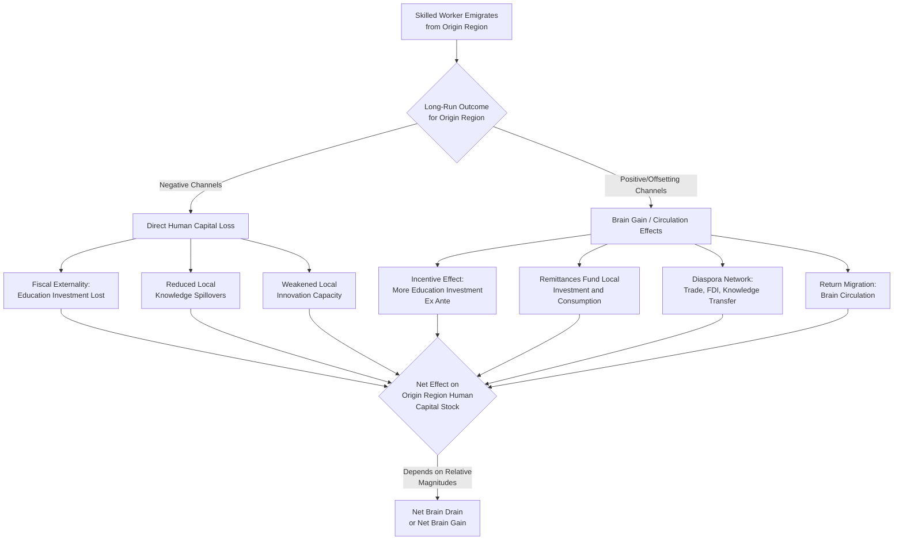

## Brain Drain and Brain Gain

### Definition and Conceptual Foundation

Brain drain refers to the emigration or out-migration of highly skilled, educated, or talented individuals from a region or country of origin to a destination offering better economic opportunities, typically resulting in a net loss of human capital for the sending location. Brain gain is the complementary concept: the net accumulation of human capital in a destination region through in-migration of skilled workers, or — in a more nuanced later literature — the *positive* human capital effects that can accrue back to the origin region despite skilled out-migration, through channels such as return migration, remittances, and diaspora knowledge networks.

While often discussed in the international migration literature (e.g., skilled emigration from developing to developed countries), the concept applies directly to interregional migration within a single country: declining regions frequently experience selective out-migration of their most educated and skilled residents toward growing metropolitan areas, a phenomenon central to understanding persistent regional economic divergence.

### Theoretical Mechanisms: Why Skilled Migration Is Selective

The selectivity of migration toward higher-skilled individuals follows directly from the human capital investment model of migration (Sjaastad framework) discussed under determinants of internal migration:

- **Higher absolute returns to relocation**: skilled workers typically face larger absolute wage gaps between origin and destination, since specialized skills are often more highly rewarded in large, diversified, or technologically advanced regional labor markets (consistent with agglomeration-driven skill premia).
- **Thinner local markets for specialized skills**: highly specialized occupations often lack sufficient local demand in smaller or declining regional economies, forcing skilled workers to search more widely — and migrate more readily — to find matching opportunities.
- **Lower relative moving costs**: education correlates with better access to information about distant labor markets, greater financial capacity to bear moving costs, and lower psychic costs of adapting to unfamiliar (often longer-distance, higher-cost) destinations.
- **Longer expected payback horizon**: skilled workers, often migrating at younger ages after completing education, have a longer remaining career horizon over which to recoup the fixed costs of migration, consistent with the age-selectivity finding common across migration studies.

### The Traditional (Negative) Brain Drain View

The classical brain drain literature, associated with economists such as Jagdish Bhagwati in the international context, emphasizes several channels through which skilled out-migration harms the sending region:

- **Fiscal externality**: the sending region (or its taxpayers) typically bears the cost of educating and training the skilled individual (public schooling, subsidized higher education, public health investments during childhood), but the resulting productive returns — and associated tax revenue — accrue to the destination region instead, representing a fiscal transfer from the (often poorer) sending region to the (often richer) destination.
- **Reduced local human capital externalities**: human capital is widely modeled as generating positive externalities on local productivity (knowledge spillovers, mentorship, entrepreneurship stimulation). The departure of skilled individuals reduces these local spillover benefits, potentially lowering the productivity of those who remain.
- **Reduced local innovation and entrepreneurship capacity**: skilled individuals disproportionately drive local innovation, business formation, and civic leadership; their departure can weaken a region's capacity for self-directed economic renewal.
- **Regional divergence amplification**: because brain drain removes precisely the human capital that a declining region would need to attract new investment or pivot to new industries, the selective outflow can reinforce, rather than resolve, regional economic divergence — a self-reinforcing (cumulative causation) dynamic distinct from the simple convergence prediction of standard neoclassical migration models.

### The Revisionist (Brain Gain / Brain Circulation) View

Since the late 1990s and 2000s, a substantial body of literature (associated with economists such as Oded Stark, and empirical work by AnnaLee Saxenian on diaspora networks) has challenged the purely negative brain-drain narrative, identifying several offsetting or even net-positive mechanisms:

- **Incentive effect on human capital investment ("beneficial brain drain")**: the *prospect* of migration and access to higher skilled-labor returns elsewhere can incentivize greater investment in education within the origin region overall (more people pursue education anticipating the possibility of migrating), and if not all who invest in education actually migrate, the region can end up with a *higher* stock of educated residents than it would have had absent the migration prospect at all. Formally, this requires the probability of successful migration to be less than one and the marginal return to education to rise with migration prospects — a theoretically demonstrated possibility rather than a universal guarantee. [Inference: whether this beneficial effect dominates the direct human-capital-loss effect in any specific empirical case is a contested and context-dependent question in the literature, not a settled general result.]
- **Remittances**: migrants frequently send financial remittances back to family and communities in the origin region, which can fund further local human capital investment (education, health), local business investment, and consumption, partially offsetting the direct loss of the migrant's own productive labor.
- **Diaspora networks and knowledge transfer**: skilled emigrants often maintain professional and social ties to their region of origin, facilitating knowledge transfer, trade connections, foreign direct investment referrals, and business partnership formation — a phenomenon well-documented in studies of technology-sector diaspora networks (e.g., Indian and Taiwanese engineers in Silicon Valley maintaining ties to home-country technology sectors).
- **Return migration ("brain circulation")**: some skilled migrants eventually return to their origin region after accumulating additional skills, capital, and international networks abroad, bringing enhanced human capital, entrepreneurial experience, and international business connections back with them — the "brain circulation" concept, contrasted with a one-way "drain."
- **Reduced pressure on origin-region labor markets and social services**: for regions with underemployment or slack local labor markets, skilled out-migration can reduce competition for scarce local job openings, potentially benefiting those who remain, though this is a more minor and less emphasized channel in the literature relative to the effects above.

### Diagram: Brain Drain vs. Brain Gain/Circulation Pathways

### Interregional Applications (Within-Country Focus)

While much of the canonical literature is framed around international skilled migration, the mechanisms apply directly to interregional migration within a single country:

- **Rural and small-town to metropolitan migration**: educated youth from rural areas and smaller towns disproportionately migrate to large metropolitan areas for higher education and subsequent employment, frequently not returning — a pattern documented extensively in studies of regional economic divergence in the United States, and widely discussed in policy contexts across many countries with strong rural-to-urban educated-youth outflows. [Inference: the specific magnitude and regional pattern of this effect vary substantially by country and region and should be verified against country-specific data rather than assumed uniform.]
- **Interstate/interprovincial "brain hubs"**: certain metropolitan regions with strong universities, research institutions, and high-skill industry clusters function as persistent net "brain gain" destinations within a country, drawing skilled workers from across many other regions (a spatial concentration effect reinforced by agglomeration economies in knowledge-intensive sectors).
- **Return migration to origin regions**: some interregional studies find evidence of skilled workers eventually returning to smaller or origin regions later in their careers (e.g., for family reasons, lower cost of living, or lifestyle preferences after establishing wealth/reputation elsewhere), representing a domestic brain-circulation phenomenon analogous to the international case.

### Empirical Measurement Approaches

- **Net migration rate by education level**: comparing in- and out-migration flows disaggregated by educational attainment to quantify the degree of skill-selectivity in a region's migration pattern.
- **Human capital stock trend analysis**: tracking the share of a region's population with tertiary education (or other skill proxies) over time relative to national trends, to assess whether selective migration is producing a widening or narrowing regional human capital gap.
- **Remittance flow data**: using balance-of-payments data (international case) or survey/administrative transfer data (interregional case, less commonly systematically tracked) to estimate the magnitude of financial flows back to origin regions.
- **Return migration rate estimation**: longitudinal or panel data tracking individual migration histories to estimate what share of out-migrants eventually return to their origin region, and after how long.
- **Diaspora network / patent citation studies**: some studies use patent citation patterns, co-authorship networks, or firm investment linkages to trace knowledge-transfer flows attributable to diaspora or migrant networks between origin and destination regions.

### Policy Considerations

- **Retention versus circulation strategies**: policymakers in origin regions face a strategic choice between attempting to directly retain skilled workers (local job creation, quality-of-life investment, targeted retention incentives) versus accepting outflow but actively cultivating diaspora engagement (alumni networks, diaspora investment funds, "come back" recruitment programs) to capture brain-circulation benefits instead.
- **Higher education and regional development linkage**: because universities and research institutions are major drivers of both human capital creation and its subsequent outflow (students often migrate after graduation), regional policy sometimes focuses on strengthening local job markets in fields aligned with local university strengths, aiming to retain graduates locally rather than exporting the human capital investment made in them.
- **Remittance-channeling policy**: origin-region policies (financial infrastructure improvements, matching-fund programs for diaspora investment) can be designed to maximize the local developmental impact of remittance and diaspora-investment inflows.
- **Equity considerations**: brain drain/gain dynamics raise distributional questions about which regions bear the fiscal costs of education investment versus which regions capture the productive benefits — a recurring theme in debates over interregional fiscal equalization and higher-education funding formulas. [Inference: the appropriate policy response to this distributional tension is a normative and political question without a single economically "correct" answer, distinct from the positive economic analysis of the brain-drain/gain mechanisms themselves.]

**Related Topics**

- Determinants of internal migration
- Sjaastad human capital investment model of migration
- Cumulative causation and regional divergence (Myrdal)
- Remittance economics and diaspora investment
- Agglomeration economies and skill-premia in knowledge hubs
- Regional labor market adjustment and selective out-migration
- Higher education policy and regional workforce retention
- Fiscal equalization across regions